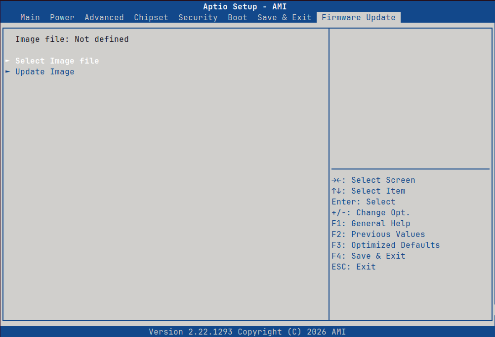

AMD BIOS supports Selection of the system TPM module.\
To select the TPM module:

* Under the Advanced tab, select "AMD CBS"

<figure><figcaption></figcaption></figure>

* Select "SOC Miscellaneous Control"

<figure><figcaption></figcaption></figure>

* Select "Trusted Platform Module"

<figure><figcaption></figcaption></figure>

* Select the required TPM module

<figure><figcaption></figcaption></figure>

