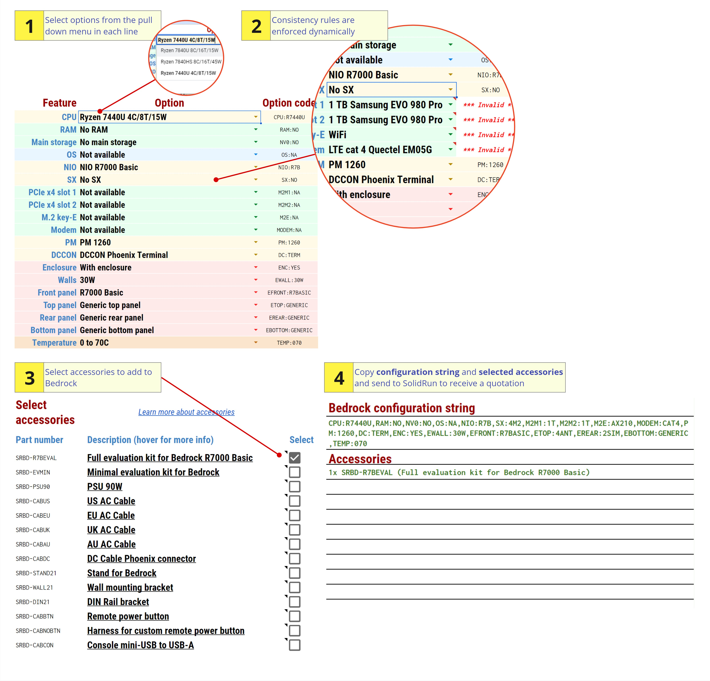

# Bedrock RAI300 Configuration Selector


Please fill the [Bedrock inquiry form](https://www.solid-run.com/fanless-computers/bedrock-rAI300/#evaluate-bedrock) first to register with SolidRun and begin email exchange


Make a copy of [Bedrock RAI300 configuration selector for 1st order](https://docs.google.com/spreadsheets/d/1aIu4vJs11RFeuT_kXIlJSa4ECEowyPYcxxn85ikdhTg/copy) The configuration selector is a Google Sheets spreadsheet


**Bedrock does not include accessories (PSU, stand, cables etc.)** Make sure to select needed accessories proper evaluation. It is recommended to order an evaluation kit which includes the typically needed accessories.



1st order must be for a ready-to-use Bedrock including RAM, storage, operating system and power supply. Follow-up orders can be for bare-bone Bedrock allowing the customer to install his own RAM, storage and operating system and use different power source. For these options please use [Bedrock RAI300 configuration for follow-up orders](https://docs.google.com/spreadsheets/d/1A6hhSYooPEDFqvqvynaEWDrdjk-dtWt3dVx4KVQEkkk/copy)



Do not use the spreadsheet in **excel**. It will not work properly. Use Google Sheets.


1. To configure Bedrock, use the drop-downs on **Options** column.
2. Consistency rules are enforced dynamically, ensuring always valid configuration
3. Choose accessories from "Select accessories" list
4. The configuration string and list of selected accessories appear on bottom right. Copy the configuration string and list of selected accessories and paste it in an email to **bedrock.sales@solid-run.com**

## If you can't access Google Sheets


Please fill the [Bedrock inquiry form](https://www.solid-run.com/fanless-computers/bedrock-rAI300/#evaluate-bedrock) first to register with SolidRun and begin email exchange


* Download Bedrock RAI300 Options diagram



* Mark the checkboxes of the desired options like in the sample below
* Save as PDF
* Pick accessories - [Bedrock RAI300 Accessories](../../../../r8000-r7000/sbc-platform/bedrock-accessories.md)
* Send both PDF and list of accessories to **bedrock.sales@solid-run.com**
