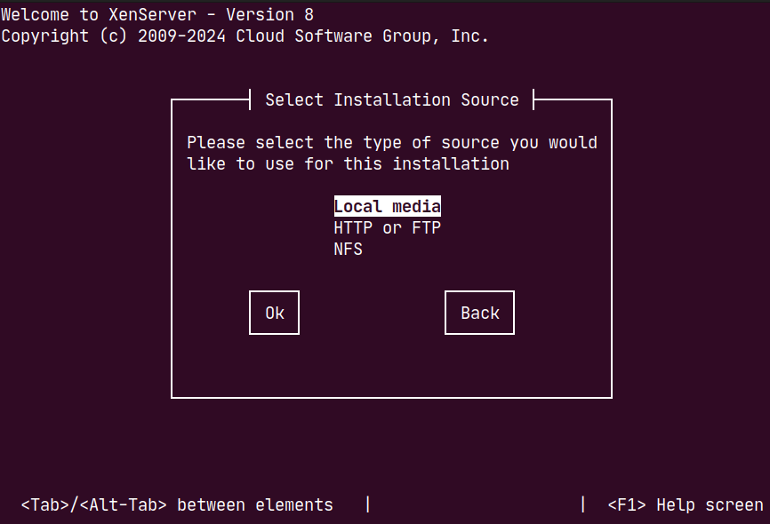
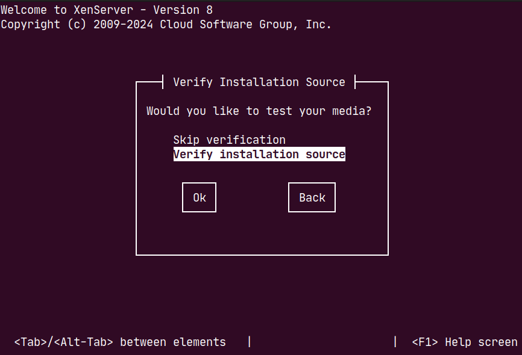
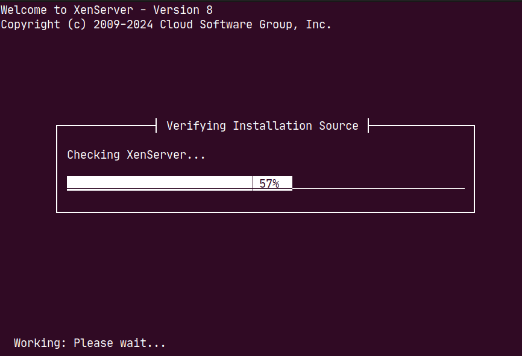

# Installing XenServer 8 using console

Bedrock V3000 lacks an integrated display adapter. Consequently, to install Xen server 8, users must connect Bedrock to a host PC using a console, facilitated by serial over USB.

This document describes Xen server 8 installation process on Bedrock V3000.

<a id="table-of-contents"></a>

## **Table of Contents**

- [Test Setup](#section-366fd82e-0eba-439b-a8d5-28b21d09ed2b)
- [Installation Process](#section-7c3d5f25-5db0-4f32-baa7-15a08905914c)
  - [Creating a Bootable USB Drive](#section-a5ec18ee-18c2-452f-8801-d52c3eec3f1b)
  - [Connecting to Serial Console](#section-c711eeaf-5502-45e6-bc69-4fb8811f4005)
  - [BIOS Boot select](#section-39a0b497-0af8-4b55-87d4-74bd732e19f1)
  - [Configuring Grub](#section-18324121-a7f2-4a75-827b-7b0c18b13ec8)
  - [Live USB Settings](#section-6db4f6ca-2ff3-4041-81ec-ab8782593524)
  - [Enable ttyS4 Service](#section-591418c6-83ce-4b46-bdf0-5ad438eaffe5)

<a id="test-setup"></a>

## Test setup

This installation process has been validated by SolidRun with the following configurations:

- Xen versions:
  - XenServer 8
- Terminal software:
  - Putty
- USB flash disk: Kingston Data Traveler

<a id="installation-process"></a>

# Installation process

<a id="creating-bootable-usb-drive"></a>

## Creating bootable USB drive

Please follow instructions at [/amd/v3000/sbc-platform/bedrock-v3000-technical-documentation/software-bedrock-v3000/creating-bootable-usb-drive-for-bedrock-v3000.md](/amd/v3000/sbc-platform/bedrock-v3000-technical-documentation/software-bedrock-v3000/creating-bootable-usb-drive-for-bedrock-v3000.md)

<a id="connecting-serial-console"></a>

## Connecting serial console

Please follow instructions at [Using serial console with Bedrock V3000](../../software-bedrock-v3000/using-serial-console-with-bedrock.md)

<a id="bios-boot-select"></a>

## BIOS Boot select

You need to choose your USB bootable device to start the installation.

- Insert the USB media to the device
- Turn on Bedrock
- Repetitively press the DEL / ESC key to enter the BIOS setup
- In BIOS go to -> Save & Exit -> <your bootable USB device> -> yes
- Device will reset and a grub menu screen will appear
  - If you dont see a grub menu, reboot and press the “arrow down” key repetitively right after you pressed enter to boot from BIOS

<a id="configure-grub"></a>

## Configure grub

At the grub menu (displaying "install", “no-serial“, …),Press ‘e’ over the ”install” option to set the boot parameters.

- You'll encounter a window resembling:
```
setparams 'install'                                                         
	multiboot2 /boot/xen.gz dom0_max_vcpus=1-16 dom0_mem=max:8192M com1=115200,8n1 console=com1,vga                                                    │
	module2 /boot/vmlinuz console=hvc0 console=tty0
	module2 /install.img
```
- Change the entry that starts with ‘module2 /boot/vmlinuz’ to look as follows:
- ```
module2 /boot/vmlinuz console=hvc0 console=tty0 console=ttyS4,115200n8
```
- Wait for the live USB to boot to the installer


**might take some time for the installer to run, so just give it some time**



<a id="live-usb-settings"></a>

## Live USB settings

- After live USB boots, the installer will start


- Select your Desired keymap


- Press OK to cuntinue with installation
- Accept EUA


- Choose if you want to install or upgrade Xen in this case well select “Perform clean installation”


- Select installation drive


- Select VM storage location


- Enable thin provisioning if required



- Select installation media source, in this case were using a USB drive so we select Local media






- Verify installation source


- Select password


- Choose which network interface will be used to connect to the management server


- Configure networking settings


- Select time zone


- Select system time settings


- Confirm installation


- Wait until installation is complete


- Select supplemental packages if required


- When prompted, remove the installation media and press enter
- Device will be rebooted

<a id="enable-ttys4-service"></a>

## Enable ttyS4 service

Enable the ttyS4 console to be able to interact with the system.

- Boot into BIOS
- Boot from the disk you installed Xen on
- If you don't get a grub menu automatically, press the “arrow down” key repetitively right after you pressed enter to boot from BIOS
  - If you dont get the grub menu after pressing shift, connect a keyboard to the device and hold shift on the connected keyboard when booting
- In the grub menu choose:
  - \*XenServer (Serial)
  - Press ’e’

```
setparams 'XenServer (Serial)'
        search --label --set root root-umnjnb
        multiboot2 /boot/xen.gz com1=115200,8n1 console=com1,vga dom0_mem=1808M,max:1808M watchdog ucode=scan dom0_max_vcpus=1-4 crashkernel=256M,below=4G
        module2 /boot/vmlinuz-4.19-xen root=LABEL=root-umnjnb ro nolvm hpet =disable console=tty0 console=hvc0
		module2 /boot/initrd-4.19-xen.img
```

- In the line that says: `module2 /boot/vmlinuz-4.19-xen`
- Add the console parameters to grub after the `console=hvc0` parameter
  - from this:
  - ```
module2 /boot/vmlinuz-4.19-xen root=LABEL=root-umnjnb ro nolvm hpet =disable console=tty0 console=hvc0
```
  - to this:
  - ```
module2 /boot/vmlinuz-4.19-xen root=LABEL=root-umnjnb ro nolvm hpet =disable console=tty0 console=hvc0 console=ttyS4,115200n8 systemd.wants=serial-getty@ttyS4
```
- Type to enable the ttyS4 service persistently for future boots: `systemctl enable serial-getty@ttyS4`
- Edit grub config file: `nano /etc/grub-efi.cfg`
  - Add the console parameter to the file from this:
```
menuentry 'XenServer (Serial)' {
        search --label --set root root-umnjnb
        multiboot2 /boot/xen.gz com1=115200,8n1 console=com1,vga dom0_mem=1808M$
        module2 /boot/vmlinuz-4.19-xen root=LABEL=root-umnjnb ro nolvm hpet=dis$
        module2 /boot/initrd-4.19-xen.img
```
  - To this:
```
menuentry 'XenServer (Serial)' {
        search --label --set root root-umnjnb
        multiboot2 /boot/xen.gz com1=115200,8n1 console=com1,vga dom0_mem=1808M$
        module2 /boot/vmlinuz-4.19-xen root=LABEL=root-umnjnb ro nolvm hpet=dis$ console=ttyS4,115200n8
        module2 /boot/initrd-4.19-xen.img
```
- Reboot, the console should start automatically when you choose the `XenServer (Serial)` option.