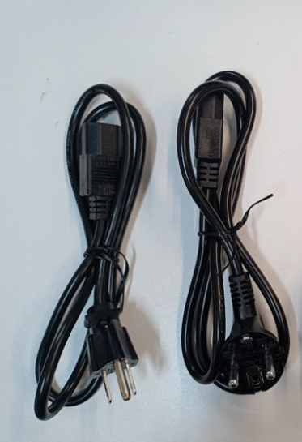

# Bedrock Accessories

## Bedrock Accessories

## Evaluation kits

### Full evaluation kit for Bedrock V3000 Basic


The recommended kit for evaluating Bedrock V3000 Basic.


The kit includes:

* [PSU 90W](../other-articles/snippets/common-bedrock-accessories.md#psu-90w)
* [US AC Cable & EU AC Cable](../other-articles/snippets/common-bedrock-accessories.md#us-eu-uk-au-ac-cable)
* [Stand for Bedrock](bedrock-mechanical-documentation/bedrock-mounting-options.md#stand)
* [Wall mounting bracket](bedrock-mechanical-documentation/bedrock-mounting-options.md#wall-mounting)
* [DIN Rail bracket](bedrock-mechanical-documentation/bedrock-mounting-options.md#din-rail-mounting)
* [Console mini-USB to USB-A](../other-articles/snippets/common-bedrock-accessories.md#console-mini-usb-to-usb-a)
* [SFP+ Module Copper](/homepage/bedrock-pc/bedrock-accessories.md#sfp-module-copper)

|                                                                                                                                                                                                                  |                                                      |                                                      |
| ---------------------------------------------------------------------------------------------------------------------------------------------------------------------------------------------------------------- | ---------------------------------------------------- | ---------------------------------------------------- |
|  |  |  |
|                                                                                                                                                              |  |          |


**Ordering code**: SRBD-V3BEVAL


### Minimal evaluation kit for Bedrock

Minimal evaluation kit is a low cost kit for trying out Bedrock.

The kit includes:

* [PSU 90W](../other-articles/snippets/common-bedrock-accessories.md#psu-90w)
* [Stand for Bedrock](bedrock-mechanical-documentation/bedrock-mounting-options.md#stand)


**Ordering code**: SRBD-EVMIN


### M.2 display adapter

Turns the headless Bedrock V3000 into a development board with a display. Simplifies initial setup and OS installation.


Requires Bedrock with SX-4M2 (option SX:4M2).\
Requires working with an open-chassis Bedrock. Suitable for bring-up only. Not suitable for field deployment.


The kit includes:

* M.2 display adapter (SM768)
* HDMI cable


**Ordering code**: SRBD-M2DISP


## Power

### PSU 90W

90W power supply.\
Requires AC cable C13 ("Kettle lead")


**Ordering code**: SRBD-PSU90


### US | EU | UK | AU AC Cable

1.8m AC cord for PSU (C13 "Kettle lead") with regional plug.

| **Ordering code** | **AC Plug**                  |
| ----------------- | ---------------------------- |
| SRBD-CABUS        | North America                |
| SRBD-CABEU        | Europlug                     |
| SRBD-CABUK        | UK plug                      |
| SRBD-CABAU        | Australia / New Zealand plug |

### DC Cable Phoenix connector

Pigtail DC cable for Bedrock.\
To be used with a 3rd party PSU.


**Ordering code**: SRBD-CABDC


## Mounting

### Stand for Bedrock

See [Bedrock Mounting Options - Stand](bedrock-mechanical-documentation/bedrock-mounting-options.md#stand)


**Ordering code**: SRBD-STAND21


### Wall mounting bracket

See [Bedrock Mounting Options - Wall Mounting](bedrock-mechanical-documentation/bedrock-mounting-options.md#wall-mounting)


**Ordering code**: SRBD-WALL21


### DIN Rail bracket

See [Bedrock Mounting Options - DIN Rail Mounting](bedrock-mechanical-documentation/bedrock-mounting-options.md#din-rail-mounting)


**Ordering code**: SRBD-DIN21


## Cable accessories

### Remote on/off

#### Remote power button

A power button on a wire for turning Bedrock on/off when Bedrock is installed in an inaccessible location.


**Ordering code**: SRBD-CABBTN


#### Harness for custom remote power button

A wire harness for soldering custom power button (optionally with LED) for turning Bedrock on/off when Bedrock is installed in an inaccessible location.


**Ordering code**: SRBD-CABNOBTN


### Console mini-USB to USB-A

Console is mini-USB connector with standard USB interface.\
The mini-USB to USB-A allows connecting to a host PC.


**Ordering code**: SRBD-CABCON


## Networking

### SFP+ Module DAC

SFP Module - direct attached cable


**Ordering code**: SRBD-SFPDAC


### SFP+ Module Copper

SFP+ module with RJ45


**Ordering code**: SRBD-SFP10GBT


### SFP+ Module Fiber

SFP Module for Fibre Optics cable


**Ordering code**: SRBD-SFPOPT


