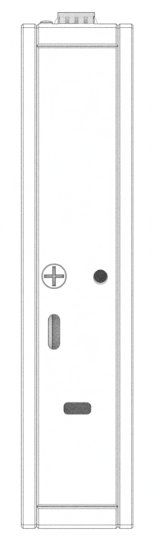

# Bedrock 3D model

## How to use Bedrock 3D model

- Download [Bedrock V3000 3D model](https://drive.google.com/file/d/1-Z3mk5Rkw_cFG_db_DfQ5YZ9jnVawdb4/view?usp=sharing) (Zipped STEP file)  
or [Bedrock R8000 4X25 3D model](https://drive.google.com/file/d/1KoEyWd1MuvvfmXSZu9UBX3dypOmPV8Yn/view?usp=drive_link) (Zipped STEP file)
- or [Bedrock R7000 Basic 3D Model](https://drive.google.com/file/d/1DJmKlTTG3yMpxpDfwzwTwnLOnJr0ObH2/view?usp=drive_link) (Zipped STEP file)
- Enable one of the enclosure types
  - Enclosure **tile**
  - Enclosure **30W**
  - Enclosure **60W**
- Enable / disable **Antennas**

> [!INFO]
> The 3D model is for integration. It is accurate externally , with no internal features.

## Installation notes

See also: [Bedrock Mounting options](../bedrock-mechanical-documentation/bedrock-mounting-options.md)

### Orientation

Bedrock 30W and Bedrock 60W should be installed in vertical position with at least 2 cm clearance below and above for airflow.

> [!INFO]
> Other mounting orientation can be considered with active cooling.

Bedrock Tile should have at least one of the walls thermally coupled to a cold plate.

## Mounting notes

### Rear panel: 2x M3 threadings. Depth 3mm

Rear panel can be used with

- Bedrock wall mounting bracket
- Bedrock DIN rail bracket
- Custom mounting fixture

### Bottom panel: 2x M4 threadings, depth 6mm

Bottom panel should not be used for direct mounting, but can be used with Bedrock foot.

### Tile: 6x M4 threadings depth 3.5 mm on each wall

The threaded holes are intended for easy attachment to a cold plate for conduction cooling. Either of the walls can be attached at any orientation.

It is also possible to attach using another fixture e.g. a custom omega bracket.

It is advised to apply thermal interface material between wall and cold plate on the entire wall area.

