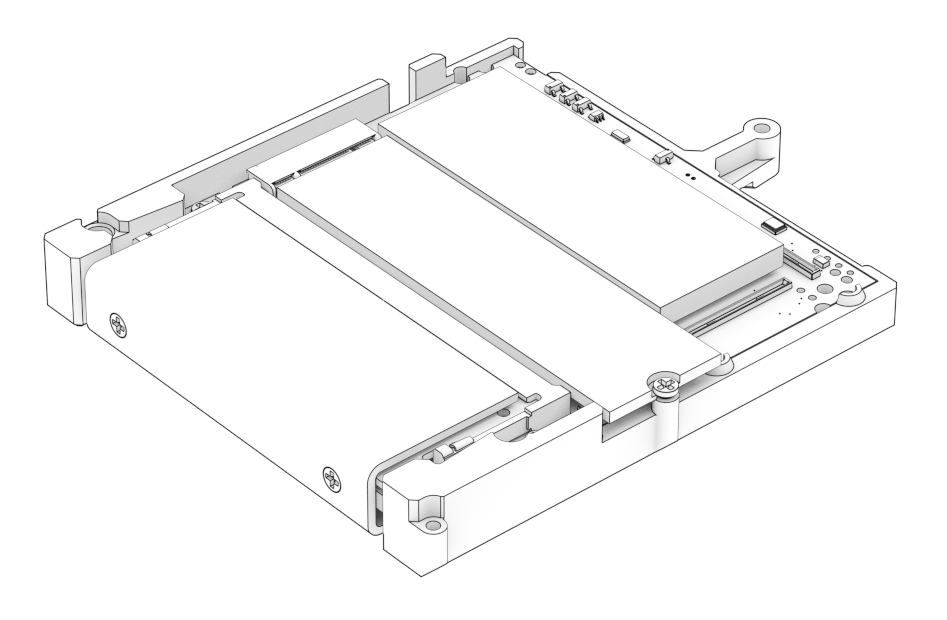
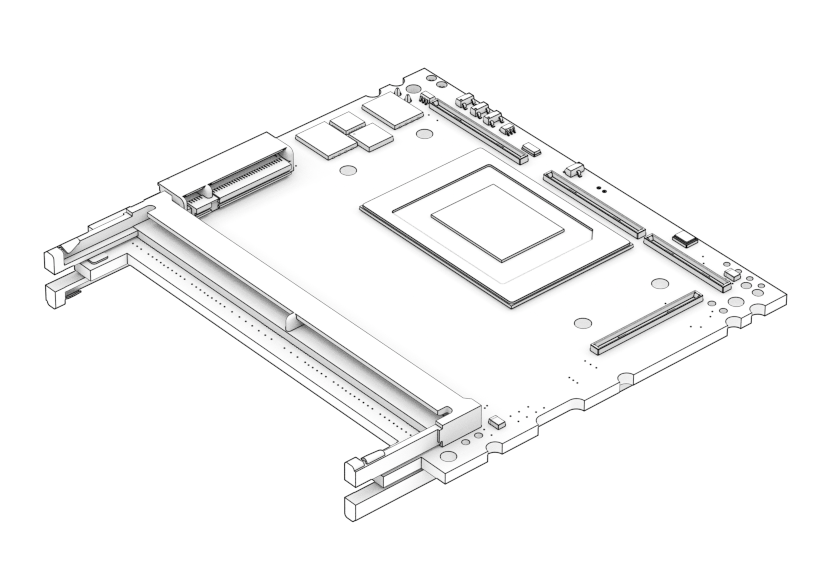

# Bedrock Deck, Cartridge & SOM 3D models

## Bedrock Deck, Cartridge & SOM 3D models

## Bedrock Deck

If you consider embedding Bedrock-boards inside a fully custom enclosure, you would be using **Bedrock Deck**.


SolidRun recommends using [Bedrock Tile](bedrock-mounting-options.md#bedrock-tile-mounting) which is much easier to integrate


### Notes:

* SX (storage & extension board) and PM (power module) boards are optional.
* DCCON (DC connector) can be relocated in the enclosure.

[Download Bedrock Deck 3D model](https://drive.google.com/file/d/1wTVyk8UY-37U2DxE0qPFWHBu5WLVCzT1/view?usp=drive_link)

## Bedrock Cartridge

If you consider designing a custom NIO (carrier board)for Bedrock SOM, starting from Bedrock Cartridge is the way to go.

Bedrock Cartridge provides the following:

* Highly effective 1st stage thermal coupling (TIM0) to the Ryzen die to a copper heatplate.\
  Coupling the heatplate to a heatsink/cold-plate is easy. Coupling the die is challenging.
* Provision for mounting NIO securely with accurate spacing.
* Easy mounting of SOM to enclosure / heatsink / cold-plate.
* Thermal coupling for SOM’s DC-to-DC converters
* Mounting of NVME SSD\
  Not present on SOM itself
* Securing and thermal coupling for SODIMMs
* RTC battery compartment
* Physical protection and rigidity to the SOM
* Rigid chassis for the Bedrock Deck with multiple threaded mounting holes

[Download Bedrock Cartridge 3D model](https://drive.google.com/file/d/1rjxXaTqUv_GOF7j7SQUg-WScW7H0wOlQ/view?usp=drive_link)

## Bedrock SOM

If you decide to design directly with Bedrock SOM, it is advised to use Bedrock Cartridge as reference.

[Download Bedrock Cartridge 3D model (Including Bedrock SOM)](https://drive.google.com/file/d/1rjxXaTqUv_GOF7j7SQUg-WScW7H0wOlQ/view?usp=drive_link)
