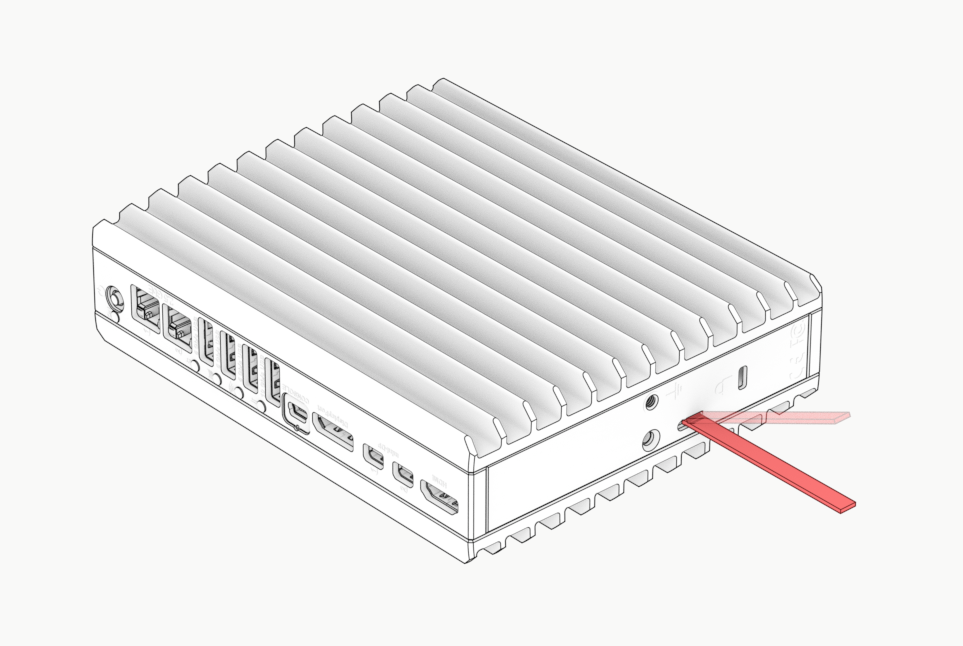
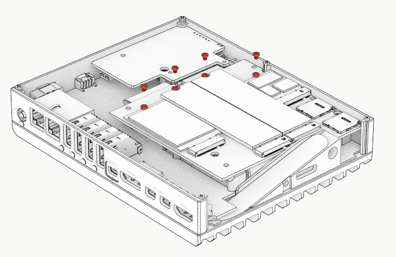
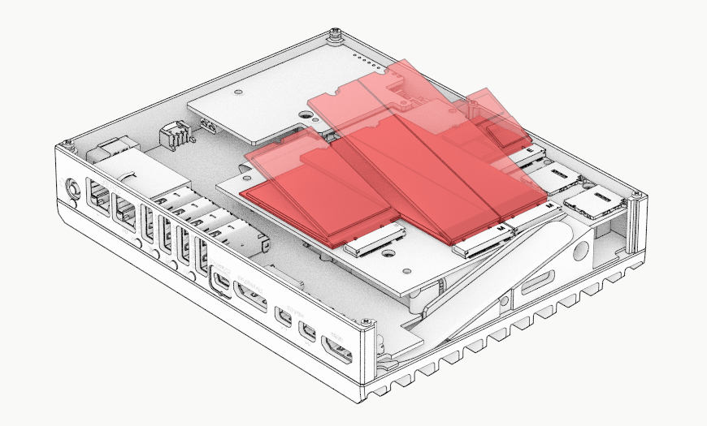
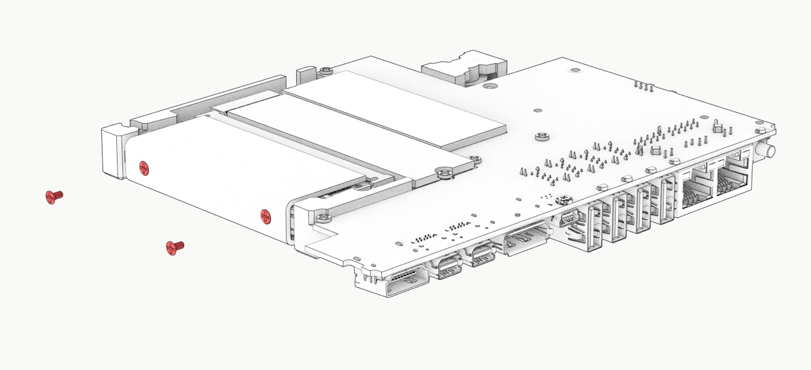

# Installing and upgrading RAM, storage and devices in Bedrock

## Required tools

Cross screwdriver (Phillips) #1

Cross screwdriver (Phillips) #0

Flat-head screwdriver

Thermal paste (MX-4 or similar) and spudger

## Open enclosure

### Bedrock with Stand

Use Philips screwdriver #1 to remove two stand screws and remove stand.

### Bedrock without stand

Remove the flat-head screw using Philips #1.

## Remove opposite wall

Use flat-head screwdriver in the marked slot to pry open the enclosure

Slide out the opposite wall.

## Installing devices on SX (2x NVME, WiFi, Modem)

Use Philips #0 to remove the M.2 fastening screw

Install the M.2 device.

> [!INFO]
> If uninstalling WiFi or modem, make sure to disconnect MHF4 cables before removing.  
> When installing WiFi / modem, remember to connect MHF4 connectors after installing.

> [!INFO]
> The M.2 screw is mounted onto a removable standoff. The standoff can be positioned for NVME M.2 2280/2260/2242 and for modem M.2 3042/3052.
> If not installing a device at a slot make sure to remove the standoff.

> [!INFO]
> Apply 1mm thermal pad on NVME devices.
> Apply 0.5mm thermal pad on WiFi and modem.

> [!INFO]
> For installing RAM and NVME on SoM please proceed as described below.

## Remove Frame

> [!WARNING]
> If Bedrock has SIM trays, remove them before proceeding.

Remove 5 posts using Philips #0

Pull out panels.

## Remove Deck

> [!WARNING]
> The 4 screws on the bottom of the skirt tighten the heatplate against the CPU.  
> Make sure **not to open them**!
> 

Remove 3 screws holding stacked electronic boards “deck” to main wall using Philips #0.

Pull out deck from main wall.

Note that there is thermal paste between heatplate and main wall, so some force is required.

## Installing RAM

First, release SX board as follows:

Remove 4 SX screws using Philips #0.

Lift SX board. Do not release the flex side.

Release two screws holding RAM cover using Philips #0.

Slide out RAM cover

Install RAM (SODIMM DDR5)

## Installing NVME on SoM

Use Philips #0 to remove M.2 screw of NVME.

Install NVME module.

> [!INFO]
> Apply 1mm thermal pad on NVME.

# Re-assembling Bedrock

Re-assemble in reverse order.

> [!INFO]
> For best thermal performance it is advised to re-apply thermal paste in the two thermal joints:
> 1. Between heat-plate and main wall
> 2. Between heatpipes of main-wall and opposite wall