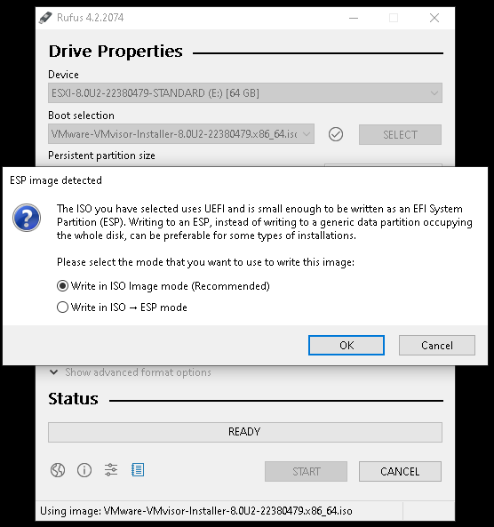
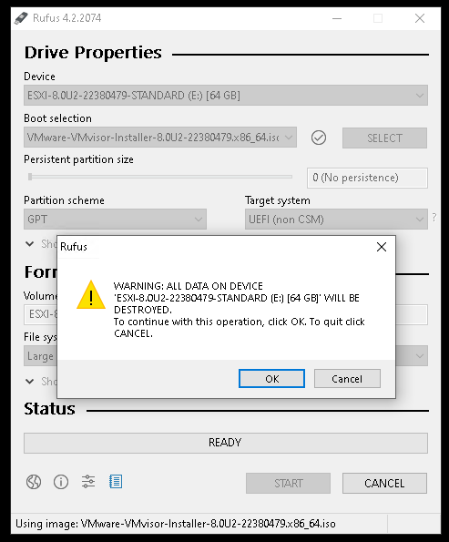

# Creating Bootable USB Drive for Bedrock R7000

* Download the required image

## Using dd (Linux)

* In terminal run:
  * lsblk to see all block devices, your USB drive will be /dev/sdX
  * sudo dd if=your\_image.iso of=/dev/sdX bs=1M status=progress; sync

***

## Using Rufus (Windows)

* [Download Rufus](https://github.com/pbatard/rufus/releases/download/v4.3/rufus-4.3.exe)
* Open rufus
* Press on the select Button
* Navigate to the .iso file
* Press start
* Press ok to confirm the write method (may be different for you) usually no need to change it:
* Confirm destructive action
* Wait until it finished and you are good to go
