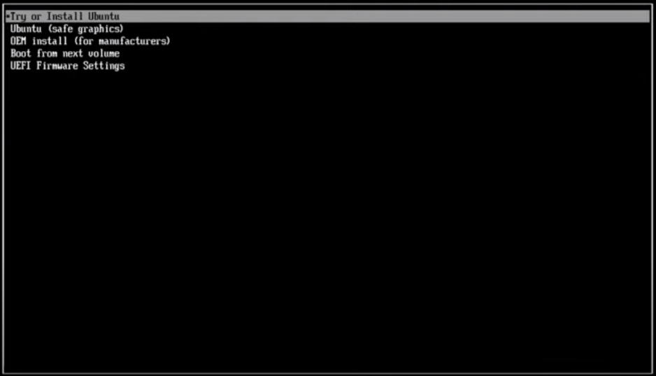
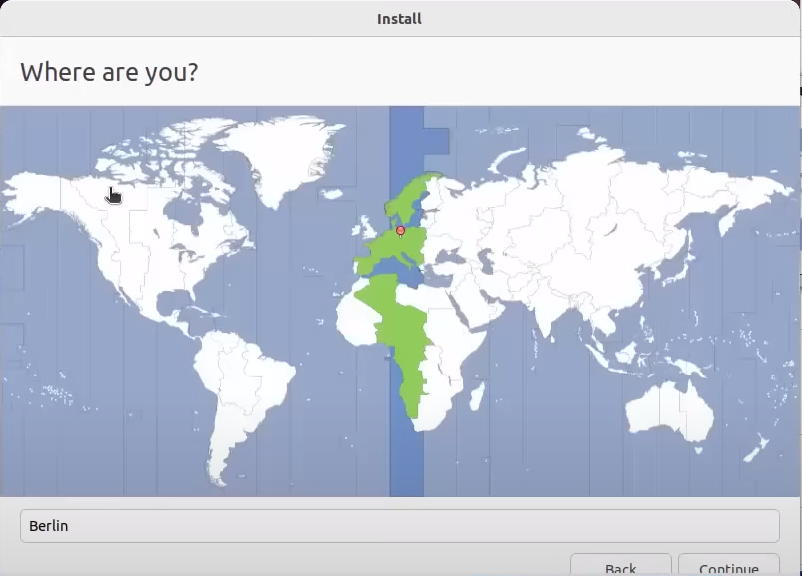

# Installing Ubuntu on Bedrock R8000 | R7000

Installation was tested on:

* Ubuntu 22.04
* Ubuntu 23.04
* Ubuntu 24.04

> \[!INFO] Ubuntu **20.04** does not have intel i226 \[igc] driver on kernel **5.4**

## [Create bootable usb drive](../howto-guides-bedrock-r8000-r7000/creating-bootable-usb-drive-for-bedrock-r7000.md)

## Boot

* Connect power to bedrock
* Press 'DEL' repetitively to enter BIOS setup
* Go to the save & exit tab and boot from your USB flash drive

> \[!INFO] If you have problems with installation, please disable secure boot in BIOS → boot> security → secure boot-> disable

## Installation

* A grub menu will open, choose “try or install ubuntu”
* After the system boots, an installer window will open, at this point if you want to try ubuntu, you can close this window and use ubuntu as a live environment, to install ubuntu, just proceed with the installer and select your language.
* Select keyboard layout
* Select updates and software, if you dont know what to choose, just press Continue
* Choose installation type, Ubuntu supports multiple installation types:
  * Erase disk and install Ubuntu (easiest option)
  * Install Ubutnu alongside windows (will be visible only if ubuntu detects that you have windows installed) choose only if you want to dualboot windows and Ubuntu.
  * Something else (custom partitioning)

* Press Install Now
* choose your region
* Choose computer name, username and password and press Continue
* wait for the isntallation to finish
* After the installation is finished press Restart now
* System will restart and you’re done
