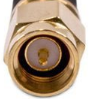

# Bedrock Connectors

- [DC IN connector](#dc-in-connector)
  - [Mating connector](#mating-connector)
- [Remote power button connector](#remote-power-button-connector)
  - [Remote power button pinout](#remote-power-button-pinout)
  - [Remote power LED parameters](#remote-power-led-parameters)
  - [More info](#more-info)
- [WiFi antenna connector](#wifi-antenna-connector)
- [LTE/5G antenna connector](#lte-5g-antenna-connector)

# DC IN connector

Manufacturer: Phoenix Contact  
Manufacturer PN: 1827868

[https://www.phoenixcontact.com/en-pc/products/printed-circuit-board-connector-mc-15-2-gf-381-1827868](https://www.phoenixcontact.com/en-pc/products/printed-circuit-board-connector-mc-15-2-gf-381-1827868)

### Mating connector

Manufacturer: Phoenix Contact  
Manufacturer PN: 1827703

[https://www.phoenixcontact.com/en-us/products/pcb-plug-mc-15-2-stf-381-1827703](https://www.phoenixcontact.com/en-us/products/pcb-plug-mc-15-2-stf-381-1827703)

> [!INFO]
> SolidRun offers [SRBD-CABDC](https://solidrun.atlassian.net/wiki/spaces/developer/pages/492470278/Bedrock+R7000+Accessories#dc-cable-phoenix-connector) Pigtail DC cable for Bedrock with the mating connector

# Remote power button connector

Manufacturer: [Molex](https://www.molex.com/en-us/home)  
Manufacturer PN: 353630460

### Remote power button pinout

### Remote power LED parameters

|     |     |
| --- | --- |
| Voltage - Forward (Vf) (Typ) | 3.2 V |
| Current (Typ) | 20 mA |

### More info

- [Datasheet](https://www.molex.com/en-us/products/part-detail/353630460)
- SolidRun remote power button cable:
  - SolidRun PN: SRBD-CABBTN
  - Description: 1m cable with panel mount power button (black) with integrated blue LED (IP67 rating)
  - Panel mount power button: [https://www.e-switch.com/product-catalog/rp8100-series-round-illuminated-pushbutton-switch](https://www.e-switch.com/product-catalog/rp8100-series-round-illuminated-pushbutton-switch)
- [Remote power button schematics](https://drive.google.com/file/d/1yIGvfnjJ2ggpG37PPsWe57a5aQo70dfN/view?usp=sharing)

# WiFi antenna connector

WiFi connector type in Bedrock: **Female RP-SMA** (center pin)

Use a **Male RP-SMA** WiFi antenna (center hole)

# LTE/5G antenna connector

LTE/5G connector type in Bedrock: **Female SMA** (center hole)

Use a **Male SMA** LTE/5G antenna (center pin)

