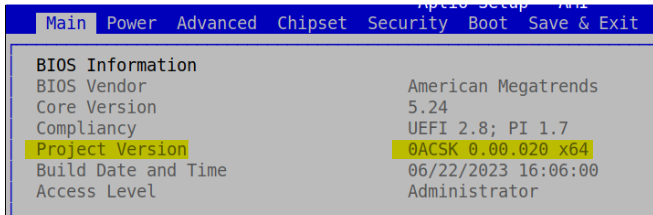

# Bedrock V3000 BIOS Settings

## Bedrock V3000 BIOS Settings

* [How to enter BIOS settings](bedrock-v3000-bios-settings.md#how-to-enter-bios-settings)
* [Make BIOS screen look better on console](bedrock-v3000-bios-settings.md#make-bios-screen-look-better-on-console)
* [How to check BIOS version](bedrock-v3000-bios-settings.md#how-to-check-bios-version)
* [Main screen](bedrock-v3000-bios-settings.md#main-screen)
* [Power screen](bedrock-v3000-bios-settings.md#power-screen)
* [Advanced screen](bedrock-v3000-bios-settings.md#advanced-screen)
* [Chipset screen](bedrock-v3000-bios-settings.md#chipset-screen)
* [Security screen](bedrock-v3000-bios-settings.md#security-screen)
* [Boot screen](bedrock-v3000-bios-settings.md#boot-screen)
* [Save & Exit screen](bedrock-v3000-bios-settings.md#save-exit-screen)

## How to enter BIOS settings

* Connect power to Bedrock V3000 then press (DEL / ESC) continuously until BIOS screen shows up.

## Make BIOS screen look better on console

* Advanced > Serial Port Console Redirection > Console Redirection Settings set terminal type: VT-UTF8
* save and reset

## How to check BIOS version

* Enter BIOS settings
* In **Main** tab look for **Project Version**
* The Project Version string has the format 0ASCSK 0.00.0**XX**\
  **XX** is the BIOS version

## Main screen

options

* BIOS Information
  * BIOS version can be seen on line: Project Version 0ASCSK 0.00.0XX where XX is the version.
* System Language
* System Date
* System Time

## Power screen

* CPU Power Settings:
  * Default CPU Power Settings (default setting)
  * CPU Power Limit Enabled (opens multiple settings):
    * CPU Power Limit (W): CPU power limit in watts, value entered manually
    * Core Performance Boost: Auto / Disabled
    * Global C-state Control: Auto / Disabled / Enabled
  * dvanced CPU Power Settings (opens multiple settings):
    * Core Performance Boost: Auto / Disabled
    * Global C-state Control: Auto / Disabled / Enabled
    * [Platform Management Framework (PMF):](bedrock-v3000-bios-settings.md#pmf) → AMD PBS → AMD CBS → SMU Common Options
    * [System-Management-Unit-(SMU)](bedrock-v3000-bios-settings.md#smu): → AMD CBS → SMU Common Options
    * [Power Saving Configurations:](bedrock-v3000-bios-settings.md#pmf) → AMD PBS → Power Saving Configurations
    * [Thermal Configurations:](bedrock-v3000-bios-settings.md#pmf) → AMD PBS → Thermal Configurations

## Advanced screen

Trusted Computing

* Enable/disable TPM
* Enable/disable PCR Banks
* Clear TPM pending operation
* Enable/disable Platform Hierarchy
* Enable/disable Storage Hierarchy
* Enable/disable Endorsement Hierarchy
* Device Select (TPM version)
* Enable/disable Disable Block Sid

AMD fTPM configuration:

* Choose TPM device
* Erase fTPM

ACPI Settings

* Enable/disable ACPI Auto Configuration
* Enable/disable Hibernation: enables to go into S4 sleep state
* ACPI Sleep State: decide what ot do on sleep suspend to RAM / suspend disabled
* Enable/disable Lock Legacy Resources

S5 RTC Wake Settings

* Wake system from S5: Disabled / Fixed Time / Dynamic Time

UEFI Variables Protection

* Enable/disable password protection of Runtime Variables

Serial Port Console Redirection

* Enable/disable Console Redirection
* Console Redirection Settings:
  * Terminal Type (BIOS visual personalization): VT100 / VT100Plus / VT-UTF8 / ANSI
  * Bits per second: 9600 / 19200 / 38400 / 57600 / 115200
  * Data Bits: 7 / 8
  * Parity: None / Even / Odd / Mark / Space
  * Stop Bits: 1 / 2
  * Flow Control: None / Hardware RTS/CTS
  * VT-UTF8 Combo Key Support: Disabled / Enabled
  * Recorder Mode: Disabled / Enabled
  * Resolution 100x31: Disabled / Enabled
  * Putty KeyPad: VT100 / LINUX / XTERMR6 / SCO / ESCN / VT400
* Console Redirection EMS: Disabled / Enabled (opens configuration options)
  * Terminal Type EMS: VT100 / VT100Plus / VT-UTF8 / ANSI
  * Bits per second EMS: 9600 / 19200 / 57600 / 115200
  * Flow Control EMS: None / 'Hardware RTS/CTS ' / Software Xon/Xoff

CPU Configuration

* PSS Support: Disabled / Enabled
* PPC Adjustment: PState 0 / PState 1 / PState 2
* NX Mode: Disabled / Enabled
* SVM Mode: Disabled / Enabled
* Node 0 Information (opens new window with memory information related to node 0)

IDE Configuration

* NONE

Debug Port Table Configuration

* Debug Port Table: Disabled / Enabled
* Debug Port Table 2: Disabled / Enabled

Option ROM Dispatch Policy


**WARNING**:\
Changing Device(s) Option ROM dispatch policy may affect system’s ability to post and/or boot!


* Restore if Failure: Disabled / Enabled (if enabled and system fails to boot it will restore this and CSM screens settings to default)
* Primary Video Ignore: Disabled / Enabled
* On Board Network Controller: Disabled / Enabled
* Slot #32 Mass Storage Controller: Disabled / Enabled
* Slot #33 Mass Storage Controller: Disabled / Enabled
* Slot #34 Network Controller: Disabled / Enabled
* Slot #49 Network Controller: Disabled / Enabled
* Slot #51 Network Controller: Disabled / Enabled

PCI Subsystem Settings


**WARNING**:\
Changing PCIE Device(s) settings may have unwanted side effects! System may HANG!


* Above 4G Decoding: Disabled / Enabled
* Re-Size BAR Support: Disabled / Enabled
* SR-IOV Support: Disabled / Enabled
* BME DMA Mitigation: Disabled / Enabled
* Hot-Plug Support: Disabled / Enabled

USB Configuration

* Legacy USB Support: Disabled / Enabled / Auto
* XHCI Hand-off: Disabled / Enabled
* USB Mass Storage Driver Support: Disabled / Enabled
* USB transfer time-out: 1 sec / 5 sec / 10 sec / 20 sec
* Device reset time-out: 10 sec / 20 sec / 30 sec / 40 sec
* Device power-up delay: Auto / Manual (opens another option)
  * Device power-up delay in seconds: \[your custom delay]
* List of USB mass storage devices with option to choose their type:\
  Auto / Floppy / Forced FDD / Hard Disk / CD-ROM

Network Stack Configuration

* Network Stack: Disabled / Enabled (opens list of options)
  * IPv4 PXE Support: Disabled / Enabled
  * IPv4 HTTP Support: Disabled / Enabled
  * IPv6 PXE Support: Disabled / Enabled
  * IPv6 HTTP Support: Disabled / Enabled
  * PXE boot wait time: \[your custom wait time]
  * Media detect count: \[your custom retry count]

NVMe Configuration

* Lists your NVME drives, and allows you to run tests also shows last test results and drive data:
  * Self Test Option: Short / Extended
  * Self Test Action: Controller Only Test / Controller and NameSpace Test
  * Run Device Self Test

Demo Board

Onboard PCIE LAN PXE ROM: Disabled / Enabled

PCIE Port:

PCIE Port Control: Disabled / Enabled (opens a menu for each PCIE device)

Device $ Fun $: Disabled / Enabled / Auto

ASPM Mode(Dev#$/Func#$): Disabled / L0s Entry / L1 Entry / L0s And L1 Entry / Auto

Hotplug Mode(Dev#$/Func#$): Disabled / Hotplug Basic / Hotplug Server / Hotplug Enhanced / Hotplug Inboard / Auto

PCR7 WA Support: Disabled / Enabled / Auto

Secure Devices ACPI Table

* SDEV ACPI: Disabled / Enabled

RAM Disk Configuration

* Disk Memory Type: Boot Service Data / Reserved
* Create raw: Create a new RAM disk with the given starting and ending address.
* Create from file: Create a new RAM disk from a file, opens a menu with all your storage devices to choose.
* Remove selected RAM disk(s)

Tls Auth Configuration

* add / remove client certificate

AMD PBS

* AMD Firmware Version: displays AMDs firmware information
* PCI Express Configurations:
  * PCIE Dxio Timing ControlEnable: Disabled / Enabled
  * PCIE x4 Slot-1: Disabled / Enabled
  * AMD XGBE Path Selection: On Board Ports / Add In Card / Disabled
  * XGBE Port0/1 controller: RJ45 / SFP
  * XGBE Port0/1 Mode Selection: 10G/1G Backplane / 2.5G Backplane / SFP+ connector / Backplane AN OFF
  * XGBE Port0/1 Speed Selection: 1G / 10G / '10G/1G' / 100Mbps / 10Mbps
  * PXE BOOT: PORT 0 / PORT 1
  * PCIE 2x8 slots: Disabled / Enabled
  * M.2/PCIE Slot: M.2 NVMe (x4) / M.2 NVMe (x2) / PCIe Slot-3 (x4)
  * PCIE GPP Slot Hotplug support: Disabled / Enabled
  * PCIE dGPU Slot Hotplug support: Disabled / Enabled
  * NVMe RAID mode: Disabled / Enabled
* Power Saving Configurations:
  * S3/Modern Standby Support: S3 Enable / Modern Standby Enable
  * Wake on PME: determines the action when system power is off and PCI enable wake up event occurs. Disabled / Enabled
  * Internal PCIE GPP 0 D3: Disabled / Enabled
    * SOC GPU D3: Disabled / Enabled
    * SOC HD Audio D3: Disabled / Enabled
    * SOC USB3.1 D3: Disabled / Enabled
    * SOC ACP D3: Disabled / Enabled
    * SOC Azalia D3: Disabled / Enabled
  * Internal PCIE GPP 2 D3: Disabled / Enabled
    * SOC USB2.0 D3: Disabled / Enabled
    * SOC USB3.1 for USB4 D3: Disabled / Enabled
    * SOC USB4 D3: Disabled / Enabled
  * Internal USB4 PCIE Tunneling D3: enable internal USB4 PCIe tunneling D3 abd add into PEP Device dependency list. Disabled / Enabled
    * SOC USB4 PCIE Endpoint D3: Disabled / Enabled
  * Unused GPP Clocks Off: Disabled / Enabled
  * Clock PM: CLK\_REQ0: Disabled / Enabled
  * Clock PM: CLK\_REQ1: Disabled / Enabled
  * Clock PM: CLK\_REQ2: Disabled / Enabled
  * Clock PM: CLK\_REQ3: Disabled / Enabled
  * Clock PM: CLK\_REQ4: Disabled / Enabled
  * Clock PM: CLK\_REQ5: Disabled / Enabled
  * Clock PM: CLK\_REQ6: Disabled / Enabled
  * Z-states support on non-Z10 capable PCIE: Disabled / Enabled
* Graphics Configurations:
  * EVAL Slot Power Enable: Disabled / Enabled
  * EVAL CARD T-Diode Routing Select: EC / APU SMBUS0
  * D3Cold Support: Disabled / Enabled
  * NVIDIA DGPU Power Enable: Disabled / Enabled
  * Discrete GPU \_DSM Function A: Disabled / Enabled
  * Discrete GPU \_DSM Function B: Disabled / Enabled
  * Non-Eval Discrete GPU Support: Disabled / Enabled
  * Discrete GPU HPD Circuitry: OR Circuitry / Pulse Circuitry
  * Discrete GPU's Audio: Disabled / Keep ROM Strap Setting
  * Discrete GPU's USB Port: Keep Default Setting / Disabled
  * Discrete GPU's SSID/SVID: Program by Vendor / Keep Default Setting
    * Discrete GPU's VGA SSID/SVID: \[manual]
    * Discrete GPU's AUDIO SSID/SVID: \[manual]
  * Discrete GPU BOMACO Support: Disabled / Enabled
    * BLINK LED: Disabled / Enabled
  * ATIF Function 23 Support: Disabled / Enabled
  * Primary Video Adaptor: Ext Graphics (PEG) / Int Graphics (IGD)
* Display Configurations:
  * DP0 Select: Default (DP) / DP display / HDMI display
  * DP1 Select: Default (DP) / DP display / HDMI display
    * Adjust DP Caps: Soc Default / Cap override
  * DP2: Default (DP with TypeC) / EDP display / HDMI display / DP with TypeC display / DP without TypeC display
    * Adjust DP Caps: Soc Default / Cap override
  * DP2 Over USBC2: DP with TypeC display / Default (DP with TypeC) / DP without TypeC display
  * DP3/HDMI1/USB6: USB / Default (DP without TypeC) / DP display / HDMI display
* USB/Thunderbolt Configurations:
  * PD USB4 Control Enable/Disable: Disabled / Enabled
  * USB4 Bus Reserved:
  * USB4 Non-Prefetch Memory Reserved: \[manual]
  * USB4 non-Prefetch MMIO align (0 \~ 65534 MB): \[manual]
  * USB4 Prefetch Memory Reserved: \[manual]
  * USB4 Prefetch MMIO align (0 \~ 65534 MB): \[manual]
  * USB Camera Enable: Disabled / Enabled
  * USB Finger Printer Enable: Disabled / Enabled
  * UCSI Support: Disabled / Enabled
  * USBC Port Harware Disable Support: Disabled / Enabled
  * Reconfig Rebalance Resources by OS: Disabled / Enabled
  * PD Thunderbolt3 Alt Mode: Disabled / Enabled
  * USB4 ACPI \_DEP Support: Disabled / Enabled
* Audio Configurations:
  * Wake On Voice: Disabled / Enabled
  * ACP Power Gating: Disabled / Enabled
  * ACP CLock Gating: Disabled / Enabled
  * SoundWire SSDT Support: Disabled / Enabled
  * TDM2\_DIN Pull High: Disabled / Enabled
* I2C Configurations:
  * MITT/WITT Selection: Both disable / WITT Only / MITT Only
* Thermal Configurations:
  * APU PROCHOT# setting:\
    Enable APU\_PROCHOT# in pure-DC case /\
    Disable APU\_PROCHOT# /\
    Enable APU\_PROCHOT# in pure-AC case /\
    Enable APU\_PROCHOT# in either pure-DC or pure-AC case (not AC+DC)
  * AMD DPTC interface: Disabled / Enabled
  * STT sensor reporting: Disabled / Enabled
* MP2 Configurations:
  * Power Sensors Routing Select: WALLE lite PDT / WALLE lite PM log
  * Turn off Xtal (S3/S5): Disabled / Enabled
  * Sensor Fusion User Mode Driver: Disabled / Enabled
  * Allocate 100KB For MP2: Disabled / Enabled
  * Wake On Human Presence detection WA: Disabled / Enabled
* Debug Configurations:
  * Serial Debug Message Under OS: Disabled / Enabled
  * Debug Print In ASL: Disabled / Enabled
  * iLA TraceMemoryEn: Disabled / Enabled
  * StallForUnlock: Disabled / Enabled
* AMD PMF Settings:
  * AMD PMF Device Support: Disabled / Enabled (opens a list of options)
  * APMF Function 1 Settings:
    * Time interval for PMF to send heartbeat signal to BIOS (seconds): \[manual]
  * APMF Function 3 Settings:
    * AMPF Function 3: Disabled / Enabled (opens a list of options)
      * AC\_Best\_Performance\_Limit: \[manual]
      * Fan\_ID\_AC\_Best\_Performance\_Limit: \[manual]
      * AC\_Better\_Performance\_Limit: \[manual]
      * Fan\_ID\_AC\_Better\_Performance\_Limit: \[manual]
      * AC\_Better\_Battery\_Limit: \[manual]
      * Fan\_ID\_AC\_Better\_Battery\_Limit: \[manual]
      * DC\_Best\_Performance\_Limit: \[manual]
      * Fan\_ID\_DC\_Best\_Performance\_Limit: \[manual]
      * DC\_Better\_Performance\_Limit: \[manual]
      * Fan\_ID\_DC\_Better\_Performance\_Limit: \[manual]
      * DC\_Better\_Battery\_Limit: \[manual]
      * Fan\_ID\_DC\_Better\_Battery\_Limit: \[manual]
      * DC\_Battery\_Saver\_Limit: \[manual]
      * Fan\_ID\_DC\_Battery\_Saver\_Limit: \[manual]
  * APMF Function 4 Settings: Disabled / Enabled
  * APMF Function 5 Settings: Disabled / Enabled (opens a list of options)
    * T\_Balanced\_to\_Perf : \[manual]
    * T\_Perf\_to\_Balanced: \[manual]
    * T\_Quiet\_to\_Balanced: \[manual]
    * T\_Balanced\_to\_Quiet: \[manual]
    * Pfloor\_Perf: \[manual]
    * Pfloor\_Balanced: \[manual]
    * Pfloor\_Quiet: \[manual]
    * P\_delta\_Balanced\_to\_Perf: \[manual]
    * P\_delta\_Perf\_to\_Balanced: \[manual]
    * P\_delta\_Quiet\_to\_Balanced: \[manual]
    * P\_delta\_Balanced\_to\_Quiet: \[manual]
    * STT\_SkinTempLimit\_APU\_Perf\_on\_Lap: \[manual]
    * STT\_SkinTempLimit\_HS2\_Perf\_on\_Lap: \[manual]
    * STT\_SkinTempLimit\_APU\_Perf: \[manual]
    * STT\_SkinTempLimit\_HS2\_Perf: \[manual]
    * STT\_SkinTempLimit\_APU\_Balanced: \[manual]
    * STT\_SkinTempLimit\_HS2\_Balanced: \[manual]
    * STT\_SkinTempLimit\_APU\_Quiet: \[manual]
    * STT\_SkinTempLimit\_HS2: \[manual]
    * STTMinLimit\_Perf\_on\_lap: \[manual]
    * STTMinLimit\_Perf: \[manual]
    * STTMinLimit\_Balanced: \[manual]
    * STTMinLimit\_Quiet: \[manual]
    * FPPT\_Perf\_on\_lap: \[manual]
    * SPPT\_Perf\_on\_lap: \[manual]
    * SPL\_Perf\_on\_lap: \[manual]
    * SPPT\_APUOnly\_Perf\_on\_Lap: \[manual]
    * FPPT\_Perf: \[manual]
    * SPPT\_Perf: \[manual]
    * SPL\_Perf: \[manual]
    * SPPT\_APUOnly\_Perf: \[manual]
    * FPPT\_Balanced: \[manual]
    * SPPT\_Balanced: \[manual]
    * SPL\_Balanced: \[manual]
    * SPPT\_APUOnly\_Balanced: \[manual]
    * FPPT\_Quiet: \[manual]
    * SPPT\_Quiet: \[manual]
    * SPL\_Quiet: \[manual]
    * SPPT\_APUOnly\_Quiet: \[manual]
    * Fan\_ID\_Perf: \[manual]
    * Fan\_ID\_Balanced: \[manual]
    * Fan\_ID\_Quiet: \[manual]
  * APMF Function 6 Settings: Disabled / Enabled (opens a list of options)
    * ConditionTemp\_In\_Bag\_Policy: \[manual]
    * ConditionTemp\_In\_Bag\_S4\_Policy: \[manual]
    * FPPT\_In\_Bag\_Policy: \[manual]
    * SPPT\_In\_Bag\_Policy: \[manual]
    * SPPT\_ApuOnly\_In\_Bag\_Policy: \[manual]
    * SPL\_In\_Bag\_Policy: \[manual]
    * STTMinLimit\_In\_Bag\_Policy: \[manual]
    * STT\_SkinTempLimit\_APU\_In\_Bag\_Policy: \[manual]
    * STT\_SkinTempLimit\_HS2\_In\_Bag\_Policy: \[manual]
    * Fan\_ID\_In\_Bag\_Policy: \[manual]
    * FPPT\_In\_Bag\_Exit\_Policy: \[manual]
    * SPPT\_In\_Bag\_Exit\_Policy: \[manual]
    * SPPT\_ApuOnly\_In\_Bag\_Exit\_Policy: \[manual]
    * SPL\_In\_Bag\_Exit\_Policy: \[manual]
    * STTMinLimit\_In\_Bag\_Exit\_Policy: \[manual]
    * STT\_SkinTempLimit\_APU\_In\_Bag\_Exit\_Policy: \[manual]
    * STT\_SkinTempLimit\_HS2\_In\_Bag\_Exit\_Policy: \[manual]
  * APMF Function 9 Settings: Disabled / Enabled (opens a list of options)
    * fPPT\_BestPerfAC: \[manual]
    * sPPT\_BestPerfAC: \[manual]
    * sPPT\_APUOnlyBestPerfAC: \[manual]
    * SPL\_BestPerfAC: \[manual]
    * STTMinLimit\_BestPerfAC: \[manual]
    * STT\_SkinTempLimit\_APU\_BestPerfAC: \[manual]
    * STT\_SkinTempLimit\_HS2\_BestPerfAC: \[manual]
    * Fan\_ID\_BestPerfAC: \[manual]
    * fPPT\_BetterPerfAC: \[manual]
    * sPPT\_BetterPerfAC: \[manual]
    * sPPT\_APUOnlyBetterPerfAC: \[manual]
    * SPL\_BetterPerfAC: \[manual]
    * STTMinLimit\_BetterPerfAC: \[manual]
    * STT\_SkinTempLimit\_APU\_BetterPerfAC: \[manual]
    * STT\_SkinTempLimit\_HS2\_BetterPerfAC: \[manual]
    * Fan\_ID\_BetterPerfAC: \[manual]
    * fPPT\_BetterBatteryAC: \[manual]
    * sPPT\_BetterBatteryAC: \[manual]
    * sPPT\_APUOnlyBetterBatteryAC: \[manual]
    * SPL\_BetterBatteryAC: \[manual]
    * STTMinLimit\_BetterBatteryAC: \[manual]
    * SPL\_BetterBatteryAC: \[manual]
    * STTMinLimit\_BetterBatteryAC: \[manual]
    * STT\_SkinTempLimit\_APU\_BetterBatteryAC: \[manual]
    * STT\_SkinTempLimit\_HS2\_BetterBatteryAC: \[manual]
    * Fan\_ID\_BetterBatteryAC: \[manual]
    * fPPT\_BestPerfDC: \[manual]
    * sPPT\_BestPerfDC: \[manual]
    * sPPT\_APUOnlyBestPerfDC: \[manual]
    * SPL\_BestPerfDC: \[manual]
    * STTMinLimit\_BestPerfDC: \[manual]
    * STT\_SkinTempLimit\_APU\_BestPerfDC: \[manual]
    * STT\_SkinTempLimit\_HS2\_BestPerfDC: \[manual]
    * Fan\_ID\_BestPerfDC: \[manual]
    * fPPT\_BetterPerfDC: \[manual]
    * sPPT\_BetterPerfDC: \[manual]
    * sPPT\_APUOnlyBetterPerfDC: \[manual]
    * SPL\_BetterPerfDC: \[manual]
    * STTMinLimit\_BetterPerfDC: \[manual]
    * STT\_SkinTempLimit\_APU\_BetterPerfDC: \[manual]
    * STT\_SkinTempLimit\_HS2\_BetterPerfDC: \[manual]
    * Fan\_ID\_BetterPerfDC: \[manual]
    * fPPT\_BetterBatteryDC: \[manual]
    * sPPT\_BetterBatteryDC: \[manual]
    * sPPT\_APUOnlyBetterBatteryDC: \[manual]
    * SPL\_BetterBatteryDC: \[manual]
    * STTMinLimit\_BetterBatteryDC: \[manual]
    * STT\_SkinTempLimit\_APU\_BetterBatteryDC: \[manual]
    * STT\_SkinTempLimit\_HS2\_BetterBatteryDC: \[manual]
    * Fan\_ID\_BetterBatteryDC: \[manual]
    * fPPT\_BatterySaverDC: \[manual]
    * sPPT\_BatterySaverDC: \[manual]
    * sPPT\_APUOnlyBetterBatteryDC: \[manual]
    * SPL\_BatterySaverDC: \[manual]
    * STTMinLimit\_BatterySaverDC: \[manual]
    * STT\_SkinTempLimit\_APU\_BatterySaverDC: \[manual]
    * STT\_SkinTempLimit\_HS2\_BatterySaverDC: \[manual]
  * APMF Function 11 Settings: Disabled / Enabled: \[manual] (opens a list of options)
    * T\_Perf\_to\_Turbo: \[manual]
    * T\_Balanced\_to\_Perf: \[manual]
    * T\_Quiet\_to\_Balanced: \[manual]
    * T\_Balanced\_to\_Quiet: \[manual]
    * T\_Perf\_to\_Balanced: \[manual]
    * T\_Turbo\_to\_Perf: \[manual]
    * Pfloor\_Turbo: \[manual]
    * FPPT\_Turbo: \[manual]
    * SPPT\_Turbo: \[manual]
    * SPPT\_APUOnly\_Turbo: \[manual]
    * SPL\_Turbo: \[manual]
    * STT\_MinLimit\_Turbo: \[manual]
    * STT\_SkinTempAPU\_Turbo: \[manual]
    * STT\_SkinTempHS2\_Turbo: \[manual]
    * Fan\_ID\_Turbo: \[manual]
    * Pfloor\_Performance: \[manual]
    * FPPT\_Performance: \[manual]
    * SPPT\_Performance: \[manual]
    * SPPT\_APUOnly\_Performance: \[manual]
    * SPL\_Performance: \[manual]
    * STT\_MinLimit\_Performance: \[manual]
    * STT\_SkinTempAPU\_Performance: \[manual]
    * STT\_SkinTempHS2\_Performance: \[manual]
    * Fan\_ID\_Performance: \[manual]
    * Pfloor\_Balanced: \[manual]
    * FPPT\_Balanced: \[manual]
    * SPPT\_Balanced: \[manual]
    * SPPT\_APUOnly\_Balanced: \[manual]
    * SPL\_Balanced: \[manual]
    * STT\_MinLimit\_Balanced: \[manual]
    * STT\_SkinTempAPU\_Balanced: \[manual]
    * STT\_SkinTempHS2\_Balanced: \[manual]
    * Fan\_ID\_Balanced: \[manual]
    * Pfloor\_Quiet: \[manual]
    * FPPT\_Quiet: \[manual]
    * SPPT\_Quiet: \[manual]
    * SPPT\_APUOnly\_Quiet: \[manual]
    * SPL\_Quiet: \[manual]
    * STT\_MinLimit\_Quiet: \[manual]
    * STT\_SkinTempAPU\_Quiet: \[manual]
    * STT\_SkinTempHS2\_Quiet: \[manual]
  * APMF Function 12 Settings: Disabled / Enabled (opens a list of options)
    * Flags: \[manual]
    * T\_Perf\_to\_Turbo: \[manual]
    * T\_Balanced\_to\_Perf: \[manual]
    * T\_Quiet\_to\_Balanced: \[manual]
    * T\_Balanced\_to\_Quiet: \[manual]
    * T\_Perf\_to\_Balanced: \[manual]
    * T\_Turbo\_to\_Perf: \[manual]
    * Pfloor\_Turbo: \[manual]
    * FPPT\_Turbo: \[manual]
    * SPPT\_Turbo: \[manual]
    * SPPT\_APUOnly\_Turbo: \[manual]
    * SPL\_Turbo: \[manual]
    * STT\_MinLimit\_Turbo: \[manual]
    * STT\_SkinTempAPU\_Turbo: \[manual]
    * STT\_SkinTempHS2\_Turbo: \[manual]
    * Fan\_ID\_Turbo: \[manual]
    * Pfloor\_Performance: \[manual]
    * FPPT\_Performance: \[manual]
    * SPPT\_Performance: \[manual]
    * SPPT\_APUOnly\_Performance: \[manual]
    * SPL\_Performance: \[manual]
    * STT\_MinLimit\_Performance: \[manual]
    * STT\_SkinTempAPU\_Performance: \[manual]
    * STT\_SkinTempHS2\_Performance: \[manual]
    * Fan\_ID\_Performance: \[manual]
    * Pfloor\_Balanced: \[manual]
    * FPPT\_Balanced: \[manual]
    * SPPT\_Balanced: \[manual]
    * SPPT\_APUOnly\_Balanced: \[manual]
    * SPL\_Balanced: \[manual]
    * STT\_MinLimit\_Balanced: \[manual]
    * STT\_SkinTempAPU\_Balanced: \[manual]
    * STT\_SkinTempHS2\_Balanced: \[manual]
    * Fan\_ID\_Balanced: \[manual]
    * Pfloor\_Quiet: \[manual]
    * FPPT\_Quiet: \[manual]
    * SPPT\_Quiet: \[manual]
    * SPPT\_APUOnly\_Quiet: \[manual]
    * SPL\_Quiet: \[manual]
    * STT\_MinLimit\_Quiet: \[manual]
    * STT\_SkinTempAPU\_Quiet: \[manual]
    * STT\_SkinTempHS2\_Quiet: \[manual]
  * APMF Function 13 Settings: Disabled / Enabled (opens a list opf options)
    * T\_Balanced\_to\_Perf: \[manual]
    * T\_Perf\_to\_Balanced: \[manual]
    * T\_Quiet\_to\_Balanced: \[manual]
    * T\_Balanced\_to\_Quiet: \[manual]
    * Pfloor\_Perf: \[manual]
    * Pfloor\_Balanced: \[manual]
    * Pfloor\_Quiet: \[manual]
    * P\_delta\_Balanced\_to\_Perf: \[manual]
    * P\_delta\_Perf\_to\_Balanced: \[manual]
    * P\_delta\_Quiet\_to\_Balanced: \[manual]
    * P\_delta\_Balanced\_to\_Quiet: \[manual]
    * STT\_SkinTempLimit\_APU\_Perf\_on\_Lap: \[manual]
    * STT\_SkinTempLimit\_HS2\_Perf\_on\_Lap: \[manual]
    * STT\_SkinTempLimit\_APU\_Perf: \[manual]
    * STT\_SkinTempLimit\_HS2\_Perf: \[manual]
    * STT\_SkinTempLimit\_APU\_Balanced: \[manual]
    * STT\_SkinTempLimit\_HS2\_Balanced: \[manual]
    * STT\_SkinTempLimit\_APU\_Quiet: \[manual]
    * STT\_SkinTempLimit\_HS2: \[manual]
    * STTMinLimit\_Perf\_on\_lap: \[manual]
    * STTMinLimit\_Perf: \[manual]
    * STTMinLimit\_Balanced: \[manual]
    * STTMinLimit\_Quiet: \[manual]
    * FPPT\_Perf\_on\_lap: \[manual]
    * SPPT\_Perf\_on\_lap: \[manual]
    * SPL\_Perf\_on\_lap: \[manual]
    * SPPT\_APUOnly\_Perf\_on\_Lap: \[manual]
    * FPPT\_Perf: \[manual]
    * SPPT\_Perf: \[manual]
    * SPL\_Perf: \[manual]
    * SPPT\_APUOnly\_Perf: \[manual]
    * FPPT\_Balanced: \[manual]
    * SPPT\_Balanced: \[manual]
    * SPL\_Balanced: \[manual]
    * SPPT\_APUOnly\_Balanced: \[manual]
    * FPPT\_Quiet: \[manual]
    * SPPT\_Quiet: \[manual]
    * SPL\_Quiet: \[manual]
    * SPPT\_APUOnly\_Quiet: \[manual]
    * Fan\_ID\_Perf: \[manual]
    * Fan\_ID\_Balanced: \[manual]
  * APMF Function 14 Settings: Disabled / Enabled
* RAS:
  * PCIE Root Port Corr Err Mask Reg: \[manual]
  * PCIE Root Port UnCorr Err Mask Reg: \[manual]
  * PCIE Port UnCorr Error Sev Reg: \[manual]
  * PCIE Device Corr Err Mask Reg: \[manual]
  * PCIE Device UnCorr Err Mask Reg: \[manual]
  * PCIE Device UnCorr Error Sev Reg: \[manual]
* Above 4GB MMIO Limit:\
  35bit (32GB)\
  36bit (64GB)\
  37bit (128GB)\
  38bit (256GB)\
  39bit (512GB)\
  40bit (1TB) default\
  41bit (2TB)\
  42bit (4TB)\
  43bit (8TB)\
  44bit (16TB)\
  45bit (32TB)\
  46bit (64TB)\
  47bit (128TB)\
  48bit (256TB)
* 5V\_S5 voltage: 5v\_ALW(default) / 5v\_ALW +60mv / 5v\_ALW +100mv
* AMD KVM Mouse Protocol: Auto(default) / Simple / Absolute
* Processor Aggregator Device: Disabled / Enabled
* APIC Software Enable: Disabled / Enabled
* Dynamic P3T limit: Enable for DC-only case (include fake DC) / Disabled / Enabled
* PD Firmware Update: Disabled / Enabled

AMD CBS

* CPU Common Options:
  * Prefetcher settings:
    * L1 Stream HW Prefetcher: Auto / Disabled / Enabled
    * 2 Stream HW Prefetcher: Auto / Disabled / Enabled
  * Core Watchdog:
  * Core Watchdog Timer Enable: Disabled / Enabled (opens more options)
    * Core Watchdog Timer Interval: Auto / 21.461s - 39us
    * Core Watchdog Timer Severity:\
      Auto\
      Fatal\
      Uncorrected\
      Deferred\
      Corrected\
      Transparent\
      No Error
  * CCD/Core/Thread Enablement:
    * Core control: Auto / ONE / TWO / THREE / FOUR / FIVE / SIX / SEVEN
  * RedirectForReturnDis: Auto / 0 / 1
  * Core Performance Boost: Auto / Disabled
  * Global C-state Control: Auto / Disabled / Enabled
  * Opcache Control: Auto / Disabled / Enabled
  * SEV ASID Count: Auto / 253 ASIDs / 509 ASIDs
  * SEV-ES ASID Space Limit Control: Auto / manual (opens another option)
    * SEV-ES ASID Space Limit: \[manual]
  * Streaming Stores Control: Auto / Disabled / Enabled
  * Local APIC Mode: Auto / xAPIC / x2APIC
  * ACPI \_CST C1 Declaration: Auto / Disabled / Enabled
  * MCA error thresh enable: True / False
  * MCA error thresh count: FF5 (default) \[manual]
  * SMU and PSP Debug Mode: Auto / Disabled / Enabled
  * PPIN Opt-in: Auto / Disabled / Enabled
  * Action on BIST Failure: Auto / Down-Core / Do nothing
  * IBS hardware workaround: Auto / Down-Core / Do nothing
* DF Common Options:
  * Scrubber:
    * DRAM scrub time(hours): Auto / Disabled / 1h / 4h / 8h / 16h / 24h / 48h
    * Poison scrubber control: Auto / Disabled / Enabled
    * Redirect scrubber control: Auto / Disabled / Enabled
    * Redirect scrubber limit: Auto / Infinite / 2 / 4 / 8
    * DRAM map inversion: Auto / Disabled / Enabled
  * Memory Addressing:
    * Memory interleaving size: Auto / 256 Bytes / 512 Bytes / 1 KB / 2 KB
  * CC6 memory region encryption: Auto / Disabled / Enabled
  * Memory Clear: Auto / Disabled / Enabled
  * Disable DF to external downstream IP SyncFloodPropagation: Auto / Sync flood enabled / Sync flood disabled
  * Disable DF sync flood propagation: Auto / Sync flood enabled / Sync flood disabled
  * Freeze DF module queues on error: Auto / Disabled / Enabled
  * DF Cstates: Auto / Disabled / Enabled
* UMC Common Options:
  * DDR Options:
    * DDR RAS:
      * Disable Memory Error Injection: Auto / False / True
      * Data Poisoning: Auto / Disabled / Enabled
      * DR ECC Configuration:
        * ECC: Auto / Disabled / Enabled
    * DDR Security:
      * TSME: Auto / Disabled / Enabled
      * Data Scramble: Auto / Disabled / Enabled
    * DDR Addressing Options:
      * Chipselect Interleaving: Auto / Disabled
      * Address Hash Bank: Auto / Disabled / Enabled
      * Address Hash CS: Auto / Disabled / Enabled
      * BankSwapMode: Auto / Disabled / Swap APU
    * DDR Training Options:
      * DFE Read Training: Auto / Disabled / Enabled
      * DRAM PDA Enumerate ID Programming Mode: Auto / Toggling PDA enumeration mode / Legacy PDA enumeration mode
    * DDR Memory MBIST:
      * MBIST Enable: Auto / Disabled / Enable (opens more options)
        * MBIST Test Mode: Auto / Both / Data Eye Mode / Interface Mode
        * MBIST Aggressors: Auto / Disabled / Enabled
        * MBIST Per Bit Slave Die Reporting: Auto / Disabled / Enabled
        * DDR Data Eye:
          * Pattern Select: PRBS / SSO / Both
          * Pattern Length: \[manual] (default 6)
          * Aggressor Channel: Disabled / 1 Aggressor Channel / 3 Aggressor Channels /\
            7 Aggressor Channel
* NBIO Common Options:
  * IOMMU: Auto / Disabled / Enabled
  * PCIE ARI Support: Auto / Disabled / Enabled
  * Enable AER Cap: Auto / Disabled / Enabled
  * ACS Enable: Auto / Disabled / Enabled
  * PSPP Policy: Auto / Disabled / Enabled
  * GFX Configuration:
    * iGPU Configuration: Auto / iGPU Disabled / UMA\_SPECIFIED / UMA\_AUTO / UMA\_GAME\_OPTIMIZED
    * UMA Version: Auto / Non-Legacy / Legacy
    * GPU Host Translation Cache: Auto / Disabled / Enabled
  * Audio Configuration:
    * NB Azalia: Auto / Disabled / Enabled
    * Audio IOs:\
      options:\
      Auto\
      HDA(3SDI) + PDM(2CH)\
      HDA(1SDI) + PDM(6CH)\
      DA(1SDI) + SDW0(1MDATA) + PDM(2CH)\
      SDW0(4MDATA) + PDM(6CH)\
      SDW0(4MDATA) + SDW1(1MDATA) + PDM(2CH)\
      3I2S PORTS + 1 REFCLK + 1 INTR\
      HDA(3SDI) + PDM(6CH) +I2S\
      HDA(3SDI) + PDM(8CH)\
      HDA(1SDI) + SDW0(1MDATA) + PDM(6CH) + I2S\
      SDW0(4MDATA)+ SDW1(1MDATA) + PDM(6CH) + I2S\
      SDW0(4MDATA) + SDW1(1MDATA)+ PDM(8CH)
* FCH Common Options:
  * I3C/I2C Configuration Options:
    * I3C/I2C 0 Enable: Auto / I2C Enabled / I3C Enabled / Both Disabled
    * I3C/I2C 1 Enable: Auto / I2C Enabled / I3C Enabled / Both Disabled
    * I3C/I2C 2 Enable: Auto / I2C Enabled / I3C Enabled / Both Disabled
    * I3C/I2C 3 Enable: Auto / I2C Enabled / I3C Enabled / Both Disabled
  * SATA Configuration Options:
    * SATA Controller: Auto / Disabled / Enabled
    * SATA Auto Shutdown: Auto / Disabled / Enabled
    * Sata RAS Support: Auto / Disabled / Enabled
    * Sata Disabled AHCI Prefetch Function: Auto / Disabled / Enabled
    * Aggresive SATA Device Sleep Port 0: Auto / Disabled / Enabled
    * Aggresive SATA Device Sleep Port 1: Auto / Disabled / Enabled
  * USB Configuration Options:
    * USB0 controller enable: Auto / Disabled / Enabled
    * USB1 controller enable: Auto / Disabled / Enabled
    * USB2 controller enable: Auto / Disabled / Enabled
    * USB0 2.0 port enable:
      * USB0 2.0 Port 0: Auto / Disabled / Enabled
      * USB0 2.0 Port 1: Auto / Disabled / Enabled
      * USB0 2.0 Port 2: Auto / Disabled / Enabled
      * USB0 2.0 Port 3: Auto / Disabled / Enabled
    * USB1 2.0 port enable:
      * USB1 2.0 Port 0: Auto / Disabled / Enabled
      * USB1 2.0 Port 1: Auto / Disabled / Enabled
      * USB1 2.0 Port 2: Auto / Disabled / Enabled
    * USB2 2.0 port enable: Auto / Disabled / Enabled
    * USB3 2.0 port enable: Auto / Disabled / Enabled
    * USB4 2.0 port enable: Auto / Disabled / Enabled
    * USB0 3.1 port enable:
      * USB0 3.1 Port 0: Auto / Disabled / Enabled
      * USB0 3.1 Port 1: Auto / Disabled / Enabled
    * USB1 3.1 port enable: Auto / Disabled / Enabled
      * USB1 3.1 Port 0: Auto / Disabled / Enabled
      * USB1 3.1 Port 1: Auto / Disabled / Enabled
    * USB3 3.1 port enable: Auto / Disabled / Enabled
    * USB4 3.1 port enable: Auto / Disabled / Enabled
  * Ac Power Loss Options:
    * Ac Loss Control: Always On(recommended) / Always Off / Reserved / Previous / Auto
  * UART Configuration Options:
    * UART 0 Enable: Auto / Disabled / Enabled
    * UART 1 Enable (no HW FC): Auto / Disabled / Enabled
    * UART 2 Enable: Auto / Disabled / Enabled
    * UART 3 Enable (no HW FC): Auto / Disabled / Enabled
    * UART 4 Enable: Auto / Disabled / Enabled
  * ESPI Configuration Options: Auto / Disabled / Enabled
  * XGBE Configuration Options:
  * XGBE0 enable: Auto / Disabled / Enabled
  * XGBE1 enable: Auto / Disabled / Enabled
  * USB4 Configuration Options:
    * USB4 pre-CM Enable: Auto / Disabled / Enabled
    * USB4 RT0:
      * RT0 Router Enable: Auto / Disabled / Enabled (opens another option)
      * RT0 PCIE Tunnel: Auto / Disabled / Enabled
    * USB4 RT1:
      * RT1 Router Enable: Auto / Disabled / Enabled (opens another option)
      * RT1 PCIE Tunnel: Auto / Disabled / Enabled
  * SPI Configuration Options:
    * HFP Enable: Auto / Disabled / Enabled
    * HID Enable: Auto / Disabled / Enabled
    * HID2 Enable: Auto / Disabled / Enabled
* SMU-Common-Options:
  * System Configuration (TDP): Auto / 10W / 15W / 25W / 35W / 45W / 54W
  * Sustained Power Limit: \[manual]
  * PPT Control: Auto / Manual (opens manual value input option)
  * STAPM Control: Auto / Manual (opens manual value input option)
  * Thermal Control: Auto / Manual (opens manual value input option)
  * TDC Control: Auto / Manual (opens manual value input option)
  * EDC Control: Auto / Manual (opens manual value input option)
  * PSI3 Control: Auto / Manual (opens manual value input option)
  * PROCHOT Control: Auto / Manual (opens manual value input option)
  * STT Control: Auto / Manual (opens manual value input option)
  * Fan Control: Auto / Manual (opens manual value input option)
  * VDDP Voltage Control: Auto / Manual (opens manual value input option)
  * VDDM Voltage Control: Auto / Manual (opens manual value input option)
  * SmartShift Control:
    * SmartShift Control: Auto / Manual(opens more options)
      * SmartShift Enable: Auto / Disabled / Enabled
      * APU Only sPPT Limit: \[manual]
      * Sustained PowerLimit: \[manual]
      * Fast PPT Limit: \[manual]
      * Slow PPT Limit: \[manual]
  * Zstates (Z9 and Z10): Auto / Disabled / Enabled
* SOC Miscellaneous Control:
  * PSP RPMC Switch: Auto / Disabled / Enabled
  * Firmware Anti-rollback (FAR):
    * Initial SPL value for FAR: \[manual]
    * FAR Switch: Disabled / Enabled
  * ROM Armor support: Auto / Disabled / Enabled
  * ABL Console Out Control: Auto / Disabled / Enabled
  * Secured-core Auto enablement: Auto / Disabled / Enabled
  * Pluton (HSP) Options:
    * Pluton (HSP) X86 Firmware Support: Auto / Disabled / Enabled
    * Pluton (HSP) UART: Auto / Disabled / Enabled
    * Pluton (HSP) FIPS: Auto / Disabled / Enabled
    * Pluton (HSP) ACPI Fence Enable: Auto / True / False
  * AIM-T Options:
    * AGESA MPM support:
      * KVM for Wired Manageability: Auto / Disabled / Enabled
      * Wireless Manageability: Auto / Disabled / Enabled (opens more options)
        * KVM for Wireless Manageability: Auto / Disabled / Enabled
        * TCR for Wireless Manageability: Auto / Disabled / Enabled
  * Intrusion Detection:
    * Intrusion Detection settings: \[manual] requires password to show settings
  * Mixed DIMM config extended NUMA domain: Auto / Disabled / Enabled
* Displays 4 Intel NICs if they are present and flashed:
  * when chosen displays brief NIC info, link status and MAC address.
* Driver Health: displays Intel NICs driver status: Healthy / Not Healty.

## Chipset screen

submenus

* South Bridge:
  * SB USB configuration, enable disable different USB port options.
* GFX Configuration:
  * NOT SUPPORTED
* North Bridge:
  * DDR Memory data.

## Security screen

submenus

* change Administrator Password.
* change User Password.
* HDD Security Configuration: Displays NVME / HDD security info
* secure boot options:
  * enable/disable secure boot.
  * secure boot mode.

## Boot screen

options

* In Boot Configuration you can:
  * choose the BIOS wait time before it continues booting.
  * choose NumLock state on boot process enabled/disabled.
  * choose quiet boot options.
* In Boot Option Priorities you can:
  * choose boot order
  * enable/disable fast boot
  * choose SATA properties
  * enable/disable NVME support
  * enable/disable VGA support
  * choose USB support properties
  * nable/disabl PS2 devices support
  * enable/disable Network stack support
  * enable/disable USB Mass Storage support

## Save & Exit screen

submenus

* **In Save options you can:**
  * save, discard changes made in the BIOS configuration.
  * reset the device and exit BIOS and continue the boot process.
* **In Default Options you can:**
  * save user configurations.
  * restore default configuration.
* **In Boot Override you can:**
  * choose boot device, disregarding the chosen boot order.
