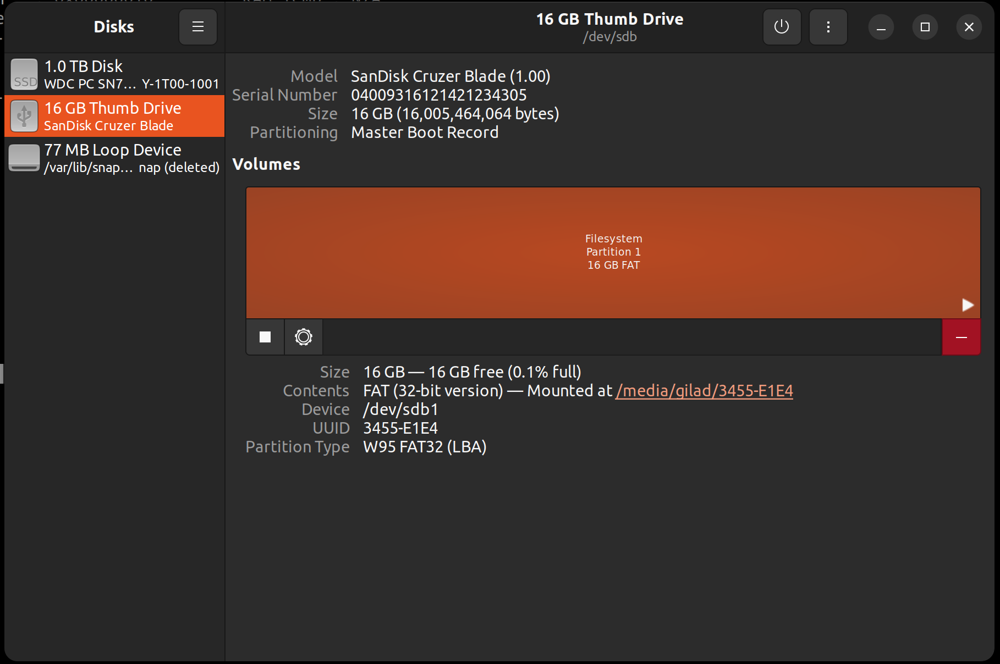

# How to create an EFI-shell bootable USB drive

## How to create an EFI-shell bootable USB drive

* [Download the UEFI Shell ISO](how-to-create-an-efi-shell-bootable-usb-drive.md#download-the-uefi-shell-iso)
* [Guide for UBUNTU](how-to-create-an-efi-shell-bootable-usb-drive.md#guide-for-ubuntu)
  * [Step 1: Format the USB Drive to FAT32](how-to-create-an-efi-shell-bootable-usb-drive.md#step-1-format-the-usb-drive-to-fat32)
  * [Step 2: Create a FAT32 Partition on the USB (After Disk Format)](how-to-create-an-efi-shell-bootable-usb-drive.md#step-2-create-a-fat32-partition-on-the-usb-after-disk-format)
  * [Step 3: Mount the UEFI Shell ISO and Copy the EFI Folder](how-to-create-an-efi-shell-bootable-usb-drive.md#step-3-mount-the-uefi-shell-iso-and-copy-the-efi-folder)
* [Guide for WINDOWS](how-to-create-an-efi-shell-bootable-usb-drive.md#guide-for-windows)
  * [Step 1: Format the USB Drive to FAT32](how-to-create-an-efi-shell-bootable-usb-drive.md#step-1-format-the-usb-drive-to-fat32)
  * [Step 2: Mount the ISO and Copy the Files](how-to-create-an-efi-shell-bootable-usb-drive.md#step-2-mount-the-iso-and-copy-the-files)

## Download the UEFI Shell ISO

1. Open your browser Go to: [https://github.com/pbatard/UEFI-Shell/releases](https://github.com/pbatard/UEFI-Shell/releases)
2. Scroll to the latest release and download `UEFI-Shell…RELEASE.iso`

## Guide for UBUNTU

#### Step 1: Format the USB Drive to FAT32

1. Press the **Super (Windows)** key and type `Disks` in the search.\
   Open **“Disks”** (aka **GNOME Disks**).
2. On the left panel, select your **USB drive**.

> \[!WARNING] Double-check it’s not your system drive!

3. Click the **three dots.**
4. Choose **“Format Disk…”**:

5. Click **Format** . (if its ask you are you sure you want to format the disk you can click format..)

#### **Step 2: Create a FAT32 Partition on the USB (After Disk Format)**

**What you should see now:**

One big block of “Free Space”

**Now create the partition:**

1. **Select the USB drive** (make sure it's still highlighted).
2. Click the `+` **(plus)** button below the free space area.

**In the "Create Partition" window:**

1. **Size**: Leave it as default (use the full free space) and click next
2. **Name**: Call it something like `EFI-USB`
3. **Type**: choose “For use with all systems and devices (FAT)“
4. click **Create**.

**after clicking create:**

1. Wait for the partition to finish creating.
2. Click the **Play** button (in Disks) to **mount** the new partition (if it didn’t mount automatically).
3. Your USB will now appear in the **Files app** as a mounted drive.

#### Step 3: Mount the UEFI Shell ISO and Copy the EFI Folder

Now that your USB is formatted and mounted, you’ll copy the necessary boot files from the ISO into the USB.

1. Locate the ISO file (shoud be in the downloads folder)
2. mount the iso by right click and choose "Open With Disk Image Mounter"
3. click the mounted ISO
4. copy the efi folder (right click and then copy)
5. navigate to your mounted USB drive (mine is the EFI-USB)
6. Paste the efi folder in the **root** of the USB

> \[!TIP] **Your USB drive is now ready** You can **safely unmount it** **(important)** from Ubuntu and **plug it into any computer** that supports UEFI.\
> After booting from the USB, the system will launch directly into the **UEFI Shell environment**.

> \[!INFO] You can put EFI programs such as AFUEFI in the root directory of the usb drive and use these commands in the EFI shell.

## Guide for WINDOWS

### Step 1: Format the USB Drive to FAT32

1. Plug in your USB drive.
2. Open **File Explorer**, right-click your USB, and select **Format**.
3. In the Format window, choose:

* **File system:** `FAT32`
* **Volume label:** `EFI-USB` (or any name)
* ✅ Check “Quick Format”
  * Click **Start** → then confirm the warning. 

### Step 2: Mount the ISO and Copy the Files

1. **Double-click** the downloaded ISO file (UEFI-Shell…RELEASE.iso)\
   It will **automatically mount** as a virtual DVD drive in File Explorer.
2. Open the mounted ISO from the **sidebar** in File Explorer if not open automatic (it looks like a CD/DVD drive).
3. Copy all contents.
4. Navigate to your **formatted USB drive**.
5. **Paste** the copied files into the **root** of the USB (not inside any other folder).

> \[!TIP] **Your USB drive is now ready** You can **safely unmount it** **(important)** from Ubuntu and **plug it into any computer** that supports UEFI.\
> After booting from the USB, the system will launch directly into the **UEFI Shell environment**.

> \[!INFO] You can put EFI programs such as AFUEFI in the root directory of the usb drive and use these commands in the EFI shell.
