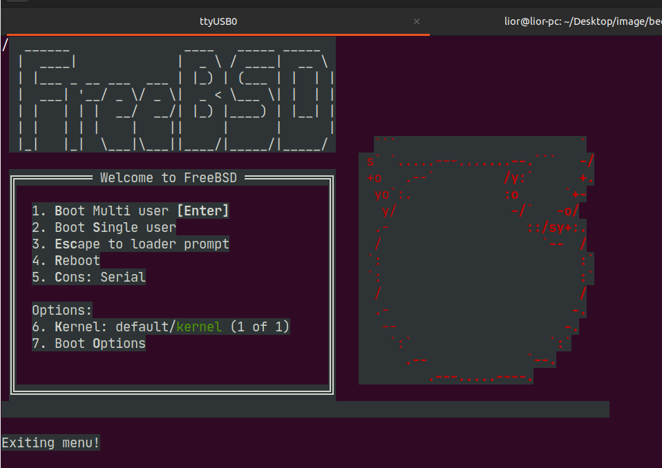
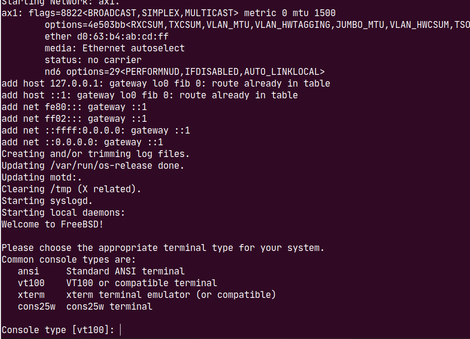
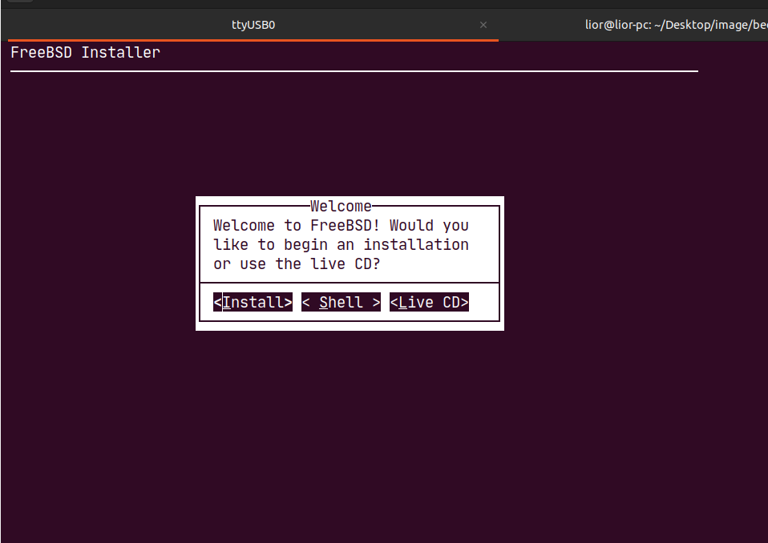
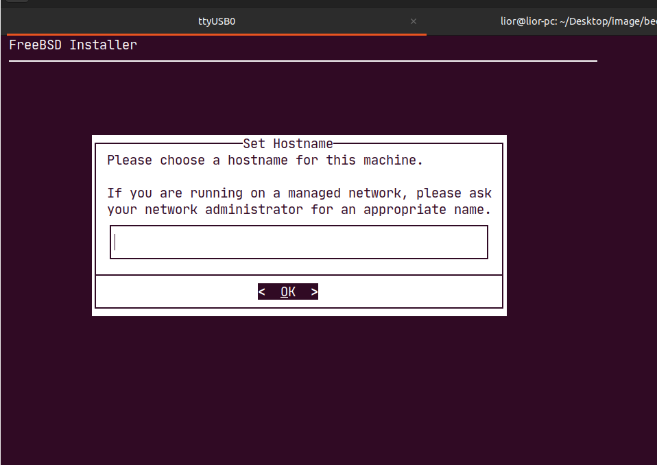
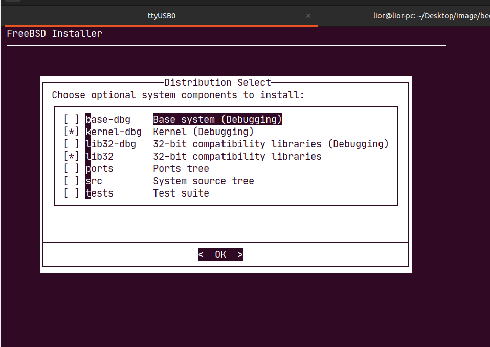
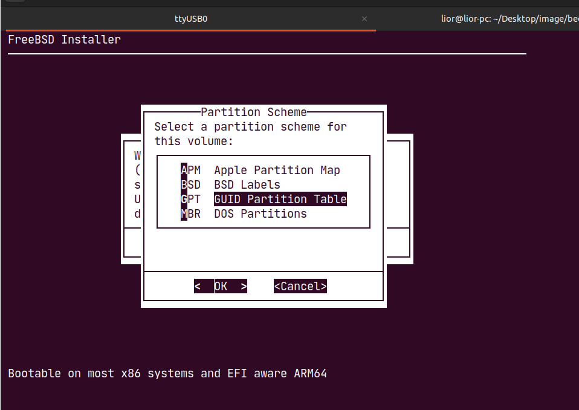
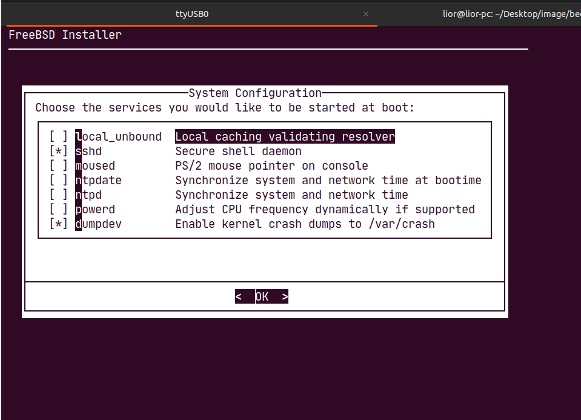

# Installing FreeBSD

## Installing FreeBSD

### Test setup

The installation was validated at SolidRun using the following setup:

* Freebsd 13.2-RELEASE
* Terminal software:
  * Putty
  * Alternatively, Tio can also be used.\
    **known TIO limitation**: in BIOS, the currently selected option is displayed in the same color as the background, which makes it not visible, yet it is still fully functional.
* USB flash disk: Kingston Data Traveler

## Installation process

### Download FreeBSD Image

* Go to: [FreeBDS AMD64 installer download](https://download.freebsd.org/releases/amd64/amd64/ISO-IMAGES/13.2/FreeBSD-13.2-RELEASE-amd64-disc1.iso)

### Creating bootable USB drive

Please follow instructions at [Creating bootable USB drive](https://solidrun.atlassian.net/l/cp/m9Reo11r)

### Connecting serial console

Please follow instructions at [Using serial console with Bedrock V3000](https://solidrun.atlassian.net/wiki/spaces/developer/pages/472481800)

### BIOS settings

* Insert the USB media to the device
* Turn on Bedrock
* Repetitively press the DEL / ESC key to enter the BIOS setup
* In BIOS go to -> Save & Exit -> -> yes
* Device will reset and a PFsense boot screen will appear

### Boot

When you see the main boot menu:



* Press "esc" or the arrow buttons to go to the boot option shell&#x20;
* Set the console redirection (copy to the terminal):&#x20;
* ```
  ```

set hw.uart.console="mm:0xfedc9000,rs:2" boot

````
- Kernel messages will start to spill out, wait until you see the following prompt:
- Select console type, press enter for default(VT100):



- Choose install:



- Choose keymap:


- Choose host name for your device:



- Choose system components, press enter for default:



- Select Auto (UFS) Guided UFS Disk Setup:


- Select installation disk:


- Select Entire disk:


- Confirm destructive action:


- Select partition scheme:



- Review disk setup and select Finish:


- Confirm destructive action:


- Wait for the installation to finish:


- Select password:


- Select network interface to configure:


- Follow the istructions to configure the interface.

- Configure resolver, enter for default:


- Select local time and time zone, select no:


- Configure your system:



- Configure system hardening:


- Add users if needed:  
Follow the istructions to add a new user


- Apply the configurations and exit the isntaller:


- Open shell to further configure the system:


- Select yes because we will need to make the following modifications to enable console: 
  - Create the `/boot/loader.conf.local` file, which will contain our changes and add: 
  - ```
hw.uart.console="mm:0xfedc9000,rs:2" 
````


Note: /boot/loader.conf recreates itself each boot or update, so this will override the changes.



**Thats it, you can reboot the system and use it.**

### Tips

**Hididng kernel output**

* Add to /boot/loader.conf.local:&#x20;
  * ```
    ```

boot\_mute="YES"

````

<a id="disabling-hyperthreading"></a>

#### **Disabling Hyperthreading**

- Add to /boot/loader.conf.local: 
  - ```
machdep.hyperthreading_allowed="0"
````

* To verify the change run:
  * ```
    ```

sysctl machdep.hyperthreading\_allowed

```
```
