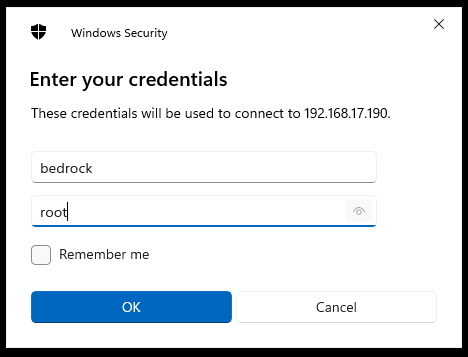
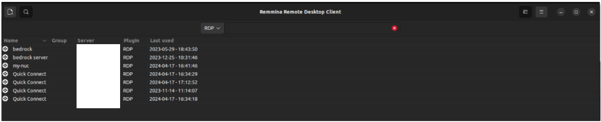

# Connecting to Windows 11 RDP (Remote desktop connection)

## Connecting to Windows 11 RDP (Remote desktop connection)

Bedrock V3000 lacks an integrated display adapter. Consequently, it cannot be used with a regular monitor setup, users must connect to the windows host using RDP.

This document describesthe RDP connection process on Bedrock V3000.

### **Table of Contents**

* [Connection process](connecting-to-windows-11-rdp-remote-desktop-connection.md#connectionprocess)
* [Identifying Bedrock IP on your LAN](connecting-to-windows-11-rdp-remote-desktop-connection.md#idip)
  * [Method 1](connecting-to-windows-11-rdp-remote-desktop-connection.md#ipmethod1)
  * [Method 2](connecting-to-windows-11-rdp-remote-desktop-connection.md#ipmethod2)
* [Connecting to RDP](connecting-to-windows-11-rdp-remote-desktop-connection.md#rdpconn)
* [Windows](connecting-to-windows-11-rdp-remote-desktop-connection.md#rdpwindows)
* [Linux](connecting-to-windows-11-rdp-remote-desktop-connection.md#rdplinux)

## Connection process

### Identifying Bedrock IP on your LAN

> \[!INFO] For easier identifrication you can check the label on the back side of the Bedrock to check the mac units addresses.

#### Method 1

* Connect in the Bedrock Unit to your router and wait for about 30 seconds for it to compeletely boot, get an IP and enable the RDP functionality.
* Open your routers web interface
* Find the active DHCP leases and see what is the IP of your unit\
  example: (your routers web interface will probably look different)\
  

#### Method 2

* Connect in the Bedrock Unit to your router and wait for about 30 seconds for it to compeletely boot, get an IP and enable the RDP functionality.
* On your pc run:

```
arp -a
```

* You will see something like this:

```
arp -a
? (192.168.XXX.XXX) at XX:XX:XX:00:00:00 [ether] on enxb04f13d1835f
OpenWrt.lan (192.168.XXX.XXX) at XX:XX:XX:XX:XX:XX [ether] on enxb04f13d1835f
DESKTOP-450BDI5.lan (192.168.XXX.XXX) at 94:c6:91:a9:67:0f [ether] on enxb04f13d1835f
? (192.168.XXX.XXX) at <incomplete> on enxb04f13d1835f
my.firewall (192.168.1.1) at XX:XX:XX:XX:XX:XX [ether] on wlp3s0
DESKTOP-S57BJI2.lan (192.168.17.182) at d0:63:b4:05:b3:63 [ether] on enxb04f13d1835f
```

* Identify the ip address of your Bedrock unit

### Connecting to RDP

> \[!NOTE] **Default credentials:** Username: bedrock\
> password: root

#### Windows

From another Windows device:

* search for remote desktop connection in your search bar.


* Open the app and type the IP you found in the previous step


* Enter your devices credentials and click OK



#### Linux

* instal Remmina

```
sudo apt-add-repository ppa:remmina-ppa-team/remmina-next
sudo apt update
sudo apt install remmina remmina-plugin-rdp remmina-plugin-secret
```

* Open remmina



* Click on a new connection in the upper left corner
* In the server and domain enter the IP address you found in the previous step
* Enter the username and password
* Click save and connect

> \[!INFO] Note:\
> You can also cnhange the connection connection name in the upper part. You can also share a folder with the windows machine you are connecting to.
