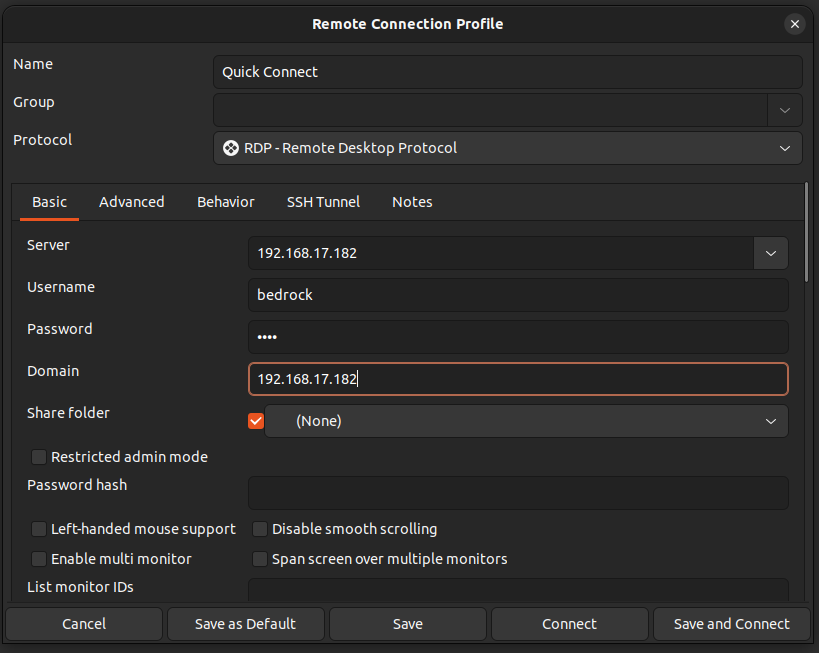

# Connecting to Windows 11 RDP (Remote desktop connection)

Bedrock V3000 lacks an integrated display adapter. Consequently, it cannot be used with a regular monitor setup, users must connect to the windows host using RDP.

This document describesthe RDP connection process on Bedrock V3000.

<a id="table-of-contents"></a>

## **Table of Contents**

- [Connection process](#connectionprocess)
- [Identifying Bedrock IP on your LAN](#idip)
  - [Method 1](#ipmethod1)
  - [Method 2](#ipmethod2)
- [Connecting to RDP](#rdpconn)
- [Windows](#rdpwindows)
- [Linux](#rdplinux)

<a id="connection-process"></a>

# Connection process

<a id="identifying-bedrock-ip-on-your-lan"></a>

## Identifying Bedrock IP on your LAN

> [!INFO]
> For easier identifrication you can check the label on the back side of the Bedrock to check the mac units addresses.

<a id="method-1"></a>

### Method 1

- Connect in the Bedrock Unit to your router and wait for about 30 seconds for it to compeletely boot, get an IP and enable the RDP functionality.
- Open your routers web interface
- Find the active DHCP leases and see what is the IP of your unit  
example: (your routers web interface will probably look different)  


<a id="method-2"></a>

### Method 2

- Connect in the Bedrock Unit to your router and wait for about 30 seconds for it to compeletely boot, get an IP and enable the RDP functionality.
- On your pc run:
```
arp -a
```
- You will see something like this:
```
arp -a
? (192.168.XXX.XXX) at XX:XX:XX:00:00:00 [ether] on enxb04f13d1835f
OpenWrt.lan (192.168.XXX.XXX) at XX:XX:XX:XX:XX:XX [ether] on enxb04f13d1835f
DESKTOP-450BDI5.lan (192.168.XXX.XXX) at 94:c6:91:a9:67:0f [ether] on enxb04f13d1835f
? (192.168.XXX.XXX) at <incomplete> on enxb04f13d1835f
my.firewall (192.168.1.1) at XX:XX:XX:XX:XX:XX [ether] on wlp3s0
DESKTOP-S57BJI2.lan (192.168.17.182) at d0:63:b4:05:b3:63 [ether] on enxb04f13d1835f
```
- Identify the ip address of your Bedrock unit

<a id="connecting-to-rdp"></a>

## Connecting to RDP

> [!NOTE]
> **Default credentials:**
> Username: bedrock  
> password: root

<a id="windows"></a>

### Windows

From another Windows device:

- search for remote desktop connection in your search bar.


- Open the app and type the IP you found in the previous step


- Enter your devices credentials and click OK


<a id="linux"></a>

### Linux

- instal Remmina

```
sudo apt-add-repository ppa:remmina-ppa-team/remmina-next
sudo apt update
sudo apt install remmina remmina-plugin-rdp remmina-plugin-secret
```

- Open remmina


- Click on a new connection in the upper left corner

- In the server and domain enter the IP address you found in the previous step
- Enter the username and password
- Click save and connect

> [!INFO]
> Note:  
> You can also cnhange the connection connection name in the upper part.
> You can also share a folder with the windows machine you are connecting to.