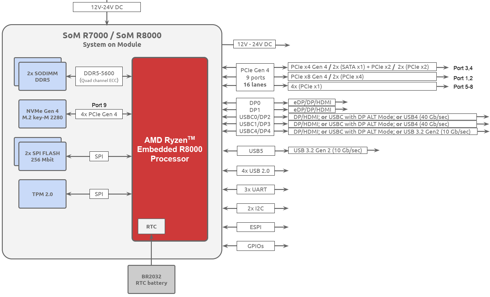
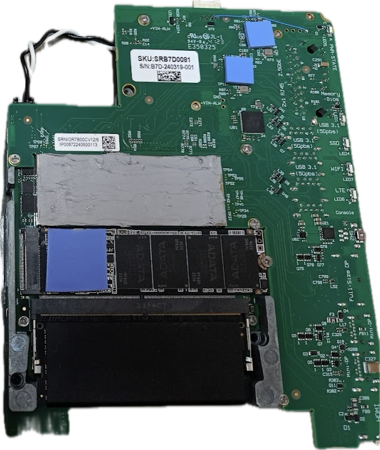

# Bedrock SOM V3000 / R7000 / R8000 - Hardware User Manual

## Bedrock SOM V3000 / R7000 / R8000 - Hardware User Manual

|                   |                                                                                                                                                                                                                                                                                                                                                                                                                                                                                                                                                                                                                                                                                                                                                                                                                                                                                                                                                                                                                                                                                                                                                                                                                                                                                                                                                                                                                                                                                                                                                                                                                                                                                                                                                                                                                                                                                                                                                                                                                                                                                                                                                                                                                                                                                                                                                                                                                   |              |           |
| ----------------- | ----------------------------------------------------------------------------------------------------------------------------------------------------------------------------------------------------------------------------------------------------------------------------------------------------------------------------------------------------------------------------------------------------------------------------------------------------------------------------------------------------------------------------------------------------------------------------------------------------------------------------------------------------------------------------------------------------------------------------------------------------------------------------------------------------------------------------------------------------------------------------------------------------------------------------------------------------------------------------------------------------------------------------------------------------------------------------------------------------------------------------------------------------------------------------------------------------------------------------------------------------------------------------------------------------------------------------------------------------------------------------------------------------------------------------------------------------------------------------------------------------------------------------------------------------------------------------------------------------------------------------------------------------------------------------------------------------------------------------------------------------------------------------------------------------------------------------------------------------------------------------------------------------------------------------------------------------------------------------------------------------------------------------------------------------------------------------------------------------------------------------------------------------------------------------------------------------------------------------------------------------------------------------------------------------------------------------------------------------------------------------------------------------------------- | ------------ | --------- |
| **Date**          | **Owner**                                                                                                                                                                                                                                                                                                                                                                                                                                                                                                                                                                                                                                                                                                                                                                                                                                                                                                                                                                                                                                                                                                                                                                                                                                                                                                                                                                                                                                                                                                                                                                                                                                                                                                                                                                                                                                                                                                                                                                                                                                                                                                                                                                                                                                                                                                                                                                                                         | **Revision** | **Notes** |
| 01 May 2024       | Firas Abd El Gani                                                                                                                                                                                                                                                                                                                                                                                                                                                                                                                                                                                                                                                                                                                                                                                                                                                                                                                                                                                                                                                                                                                                                                                                                                                                                                                                                                                                                                                                                                                                                                                                                                                                                                                                                                                                                                                                                                                                                                                                                                                                                                                                                                                                                                                                                                                                                                                                 | 1.0          |           |
| Table of Contents | 
- <a href="bedrock-som-v3000-r7000-r8000-hardware-user-manual.md#introduction">Introduction</a> - <a href="bedrock-som-v3000-r7000-r8000-hardware-user-manual.md#bedrock-som">Bedrock SOM</a> - <a href="bedrock-som-v3000-r7000-r8000-hardware-user-manual.md#nio-networking-i-o-extension-board">NIO - Networking &#x26; I/O Extension Board</a> - <a href="bedrock-som-v3000-r7000-r8000-hardware-user-manual.md#about-this-user-manual">About this User Manual</a> - <a href="bedrock-som-v3000-r7000-r8000-hardware-user-manual.md#bedrock-som-block-diagram">Bedrock SOM Block Diagram</a> - <a href="bedrock-som-v3000-r7000-r8000-hardware-user-manual.md#mechanical-files">Mechanical Files</a> - <a href="bedrock-som-v3000-r7000-r8000-hardware-user-manual.md#typical-block-diagram-of-a-complete-system">Typical Block Diagram of a complete system</a> - <a href="bedrock-som-v3000-r7000-r8000-hardware-user-manual.md#bedrock-cartridge">Bedrock Cartridge</a> - <a href="bedrock-som-v3000-r7000-r8000-hardware-user-manual.md#som-board-to-board-connectors-mfg-p-n">SOM Board-to-Board Connectors - MFG P/N</a> - <a href="bedrock-som-v3000-r7000-r8000-hardware-user-manual.md#board-to-board-connectors-pin-out">Board-to-board Connectors Pin-out</a> - <a href="bedrock-som-v3000-r7000-r8000-hardware-user-manual.md#orcad-symbols">OrCad Symbols</a> - <a href="bedrock-som-v3000-r7000-r8000-hardware-user-manual.md#differential-signals-impedance">Differential Signals Impedance</a> - <a href="bedrock-som-v3000-r7000-r8000-hardware-user-manual.md#thermal-coupling">Thermal coupling</a> - <a href="bedrock-som-v3000-r7000-r8000-hardware-user-manual.md#first-stage-thermal-coupling-in-cartridge">First stage thermal coupling in cartridge</a> - <a href="bedrock-som-v3000-r7000-r8000-hardware-user-manual.md#2nd-stage-thermal-coupling-heatplate-nvme-ram-cartridge">2nd stage thermal coupling (heatplate, NVME, RAM, cartridge)</a> - <a href="bedrock-som-v3000-r7000-r8000-hardware-user-manual.md#power-consumption">Power Consumption</a> - <a href="bedrock-som-v3000-r7000-r8000-hardware-user-manual.md#power-input">Power Input</a> - <a href="bedrock-som-v3000-r7000-r8000-hardware-user-manual.md#flashing-bios-and-mps-power-controller-soon">Flashing BIOS and MPS Power Controller (Soon)</a>
 |              |           |

## **Introduction**

This user manual is intended to assist board-designers who consider developing a custom NIO for SolidRun Bedrock SOM.

### Bedrock SOM

Bedrock SOM is a system-on-module based on AMD Ryzen Embedded / Mobile processors with FP7R2 footprint. It is a compact self-contained computer system with processing, RAM, storage, power regulation and cooling. It brings out only the native I/O of the processor through high density board-to-board connectors to allow highly-modular system design with a high-degree of system customization by extension boards.

Currently Bedrock SOM is offered with several Ryzen variants including

* [Ryzen Embedded V3000 series](https://www.amd.com/en/products/embedded/ryzen/ryzen-v3000-series.html)
* [Ryzen Embedded 8000 series (“Hawk Point”)](https://www.amd.com/en/products/embedded/ryzen/ryzen-8000-series.html)
* [Ryzen 7000 series (“Phoenix”)](https://www.amd.com/en/products/processors/laptop/ryzen/7000-series/amd-ryzen-7-7840u.html)

To learn about the unique properties of each processor please review the corresponding [Bedrock PC documentation](https://www.solid-run.com/industrial-computers/).

### NIO - Networking & I/O Extension Board

NIO stands for Networking & I/O. NIO extension board is connected directly to Bedrock SOM.

SolidRun offers several types of NIO boards. NIO design files are offered as reference for board-designers who considering developing custom NIO boards.

### About this User Manual

This manual will guide you through the key aspects of integrating Bedrock SOM into your custom NIO design. It covers essential design considerations, including power requirements, signal integrity, thermal management, and connectivity options, ensuring you can fully harness the power of the AMD Ryzen™ processor in your specific application.

Each section of this manual provides detailed information and technical specifications to help you understand the interfaces, pinouts, and schematic design principles necessary for successful integration. Additionally, we provide best practices and expert tips to mitigate common design challenges and optimize your development process.

## **Bedrock SOM Block Diagram**


Please note that Port 9 (Lanes: 17-20) are used for the SoM’s Internal NVME.


Feature Summary:

* Memory: DDR5 Dual 64BG Channels, Support Up to DDR5-5600.
* USB:\
  2x USB4 (40 Gbps) - Supports USB-C Alt-Mode.\
  2x USB 3.2 Gen2 (10 Gbps).\
  4x USB2.0
* Display:\
  • DisplayPort 0 (DP0) : eDP/DP/HDMI\
  • DisplayPort 1 (DP1) : eDP/DP/HDMI\
  • DisplayPort 2 (DP2, USBC0) : DP/HDMI; or USB-C with DP alt mode; or USB4\
  • DisplayPort 3 (DP3, USBC1) : DP/HDMI; or USB-C with DP alt mode; or USB4\
  • DisplayPort 4 (DP4, USBC4) : DP/HDMI; or USB-C with DP alt mode\
  Note: Maximum 4 displays can be outputted simultaneously.
* PCIe: 9 ports, 16 Lanes PCIe Gen 4.
* Power: DC 12V-24V.
* Dimentions (83 mm x 91 mm x 12.7 mm) - Including SODIMM Modules.
* UART: 4 Ports.
* SPI: Yes.
* eSPI: Yes.
* I2C: 2 Ports.
* BIOS: AMI Aptio V

## **Mechanical Files**

SoM Board Dimensions: 83 x 75.76 mm (Top View):

Mechanical Files Download Link:\
[Bedrock SOM - Mechanical Files.zip](https://drive.google.com/file/d/1x6WCio1rlT2fanu_FUwZUYKD36Y2fDIM/view?usp=sharing)

## **Typical Block Diagram of a complete system**

## **Bedrock Cartridge**

As part of developing a custom extension board for the Bedrock SOM, it’s recommended to use [Bedrock Cartridge](https://solidrun.atlassian.net/wiki/spaces/developer/pages/634454119/Bedrock+Cartridge+SoM+3D+model).

Bedrock Cartridge provides the following:

* Highly effective 1st stage thermal coupling (TIM0) to the Ryzen die to a copper heatplate.\
  Coupling the heatplate to a heatsink/cold-plate is easy. Coupling the die is challenging.
* Provision for mounting NIO securely with accurate spacing.
* Easy mounting of SOM to enclosure / heatsink / cold-plate.
* Thermal coupling for SOM’s DC-to-DC converters
* Mounting of NVME SSD\
  Not present on SOM itself
* Securing and thermal coupling for SODIMMs
* RTC battery compartment
* Physical protection and rigidity to the SOM
* Rigid chassis for the Bedrock Deck with multiple threaded mounting holes

## **SOM Board-to-Board Connectors - MFG P/N**

| 
Connector RefDes on  Bedrock SoM
 | MFG P/N                  | 
Connector RefDes on  NIO
 | MFG P/N                  |
| --------------------------------------------- | ------------------------ | ------------------------------------- | ------------------------ |
| J1                                            | DF40C-100D**P**-0.4V(51) | J5                                    | DF40C-100D**S**-0.4V(51) |
| J2                                            | DF40C-100D**P**-0.4V(51) | J6                                    | DF40C-100D**S**-0.4V(51) |
| J3                                            | DF40C-100D**P**-0.4V(51) | J4                                    | DF40C-100D**S**-0.4V(51) |
| J4                                            | DF40C-80D**P**-0.4V(51)  | J7                                    | DF40C-80D**S**-0.4V(51)  |

Bedrock SoM Connectors (Males):

NIO Connectors (Females):

Note: Top Side of SoM is placed on Top Side of NIO, where the two boards are flipped one towards the other.

## **Board-to-board Connectors Pin-out**

The following is an example of the B2B pinout in NIO.\
Please note that the pinout relates to the _female_ connectors on a carrier, **to which the Bedrock SoM male Connectors are inserted**, and here we gave an example for SolidRun NIO Connectors (J4, J5, J6, J7). It’s important to be careful which pin is number #1.

#### NIO R7000 Basic pinout

| 
  ##### J5
                                | 
  ##### Pin#
   | 
  ##### J6
                  | 
  ##### Pin#
  | 
  ##### J4
                  | 
  ##### Pin#
  | 
  ##### J7
                              | 
  ##### Pin#
  |
| ------------------------------------------------------ | --------------------------- | ---------------------------------------- | -------------------------- | ---------------------------------------- | -------------------------- | ---------------------------------------------------- | -------------------------- |
| 
  ##### VDDBT_RTC
                         | 
  ##### J5-93
  | 
  ##### DP3_AUXN/USBC1_SBTX
 | 
  ##### J6-62
 | 
  ##### DP2_HPD
             | 
  ##### J4-79
 | 
  ##### VIN_ALW
                         | 
  ##### J7-64
 |
| 
  ##### 48M_OSC
                           | 
  ##### J5-77
  | 
  ##### DP3_AUXP/USBC1_SBRX
 | 
  ##### J6-60
 | 
  ##### DP3_HPD
             | 
  ##### J4-85
 | 
  ##### VIN_ALW
                         | 
  ##### J7-72
 |
| 
  ##### ACP_WOV_DMIC_CLK
                  | 
  ##### J5-91
  | 
  ##### GFX_CLKN_R
          | 
  ##### J6-23
 | 
  ##### DP4_AUXN
            | 
  ##### J4-81
 | 
  ##### VIN_ALW
                         | 
  ##### J7-80
 |
| 
  ##### ACP_WOV_DMIC_DAT0
                 | 
  ##### J5-95
  | 
  ##### GFX_CLKP_R
          | 
  ##### J6-25
 | 
  ##### DP4_AUXP
            | 
  ##### J4-83
 | 
  ##### VIN_ALW
                         | 
  ##### J7-69
 |
| 
  ##### AC_PRES
                           | 
  ##### J5-26
  | 
  ##### GFX_SLOT_RX0N
       | 
  ##### J6-53
 | 
  ##### DP4_HPD
             | 
  ##### J4-87
 | 
  ##### VIN_ALW
                         | 
  ##### J7-77
 |
| 
  ##### AGPIO11_MDIO3_SDA
                 | 
  ##### J5-55
  | 
  ##### GFX_SLOT_RX0P
       | 
  ##### J6-55
 | 
  ##### USBC0_DN
            | 
  ##### J4-48
 | 
  ##### VIN_ALW
                         | 
  ##### J7-66
 |
| 
  ##### AGPIO17
                           | 
  ##### J5-86
  | 
  ##### GFX_SLOT_RX1N
       | 
  ##### J6-59
 | 
  ##### USBC0_DP
            | 
  ##### J4-46
 | 
  ##### VIN_ALW
                         | 
  ##### J7-74
 |
| 
  ##### AGPIO18
                           | 
  ##### J5-78
  | 
  ##### GFX_SLOT_RX1P
       | 
  ##### J6-61
 | 
  ##### USBC0_NOVA_RXAN
     | 
  ##### J4-40
 | 
  ##### VIN_ALW
                         | 
  ##### J7-63
 |
| 
  ##### AGPIO21
                           | 
  ##### J5-1
   | 
  ##### GFX_SLOT_RX2N
       | 
  ##### J6-65
 | 
  ##### USBC0_NOVA_RXAP
     | 
  ##### J4-42
 | 
  ##### VIN_ALW
                         | 
  ##### J7-71
 |
| 
  ##### AGPIO22
                           | 
  ##### J5-34
  | 
  ##### GFX_SLOT_RX2P
       | 
  ##### J6-67
 | 
  ##### USBC0_NOVA_RXBN
     | 
  ##### J4-52
 | 
  ##### VIN_ALW
                         | 
  ##### J7-79
 |
| 
  ##### AGPIO24
                           | 
  ##### J5-58
  | 
  ##### GFX_SLOT_RX3N
       | 
  ##### J6-71
 | 
  ##### USBC0_NOVA_RXBP
     | 
  ##### J4-54
 | 
  ##### VIN_ALW
                         | 
  ##### J7-68
 |
| 
  ##### AGPIO3
                            | 
  ##### J5-53
  | 
  ##### GFX_SLOT_RX3P
       | 
  ##### J6-73
 | 
  ##### USBC0_NOVA_TXAN
     | 
  ##### J4-47
 | 
  ##### VIN_ALW
                         | 
  ##### J7-76
 |
| 
  ##### AGPIO32
                           | 
  ##### J5-83
  | 
  ##### GFX_SLOT_RX4N
       | 
  ##### J6-77
 | 
  ##### USBC0_NOVA_TXAP
     | 
  ##### J4-45
 | 
  ##### VIN_ALW
                         | 
  ##### J7-65
 |
| 
  ##### AGPIO4
                            | 
  ##### J5-28
  | 
  ##### GFX_SLOT_RX4P
       | 
  ##### J6-79
 | 
  ##### USBC0_NOVA_TXBN
     | 
  ##### J4-51
 | 
  ##### VIN_ALW
                         | 
  ##### J7-73
 |
| 
  ##### AGPIO89
                           | 
  ##### J5-43
  | 
  ##### GFX_SLOT_RX5N
       | 
  ##### J6-83
 | 
  ##### USBC0_NOVA_TXBP
     | 
  ##### J4-53
 | 
  ##### VIN_ALW
                         | 
  ##### J7-70
 |
| 
  ##### AGPIO90
                           | 
  ##### J5-21
  | 
  ##### GFX_SLOT_RX5P
       | 
  ##### J6-85
 | 
  ##### USBC1_DN
            | 
  ##### J4-66
 | 
  ##### VIN_ALW
                         | 
  ##### J7-78
 |
| 
  ##### APU_ALERT#
                        | 
  ##### J5-72
  | 
  ##### GFX_SLOT_RX6N
       | 
  ##### J6-89
 | 
  ##### USBC1_DP
            | 
  ##### J4-64
 | 
  ##### VIN_ALW
                         | 
  ##### J7-67
 |
| 
  ##### APU_I2C0_SCL_1V8
                  | 
  ##### J5-11
  | 
  ##### GFX_SLOT_RX6P
       | 
  ##### J6-91
 | 
  ##### USBC1_RXAN
          | 
  ##### J4-60
 | 
  ##### VIN_ALW
                         | 
  ##### J7-75
 |
| 
  ##### APU_I2C0_SDA_1V8
                  | 
  ##### J5-9
   | 
  ##### GFX_SLOT_RX7N
       | 
  ##### J6-95
 | 
  ##### USBC1_RXAP
          | 
  ##### J4-58
 | 
  ##### ACP_WOV_DMIC_DAT1
               | 
  ##### J7-48
 |
| 
  ##### APU_I2C1_SCL_1V8
                  | 
  ##### J5-13
  | 
  ##### GFX_SLOT_RX7P
       | 
  ##### J6-97
 | 
  ##### USBC1_RXBN
          | 
  ##### J4-72
 | 
  ##### ACP_WOV_DMIC_DAT2
               | 
  ##### J7-42
 |
| 
  ##### APU_I2C1_SDA_1V8
                  | 
  ##### J5-27
  | 
  ##### GFX_SLOT_TX0N_C
     | 
  ##### J6-6
  | 
  ##### USBC1_RXBP
          | 
  ##### J4-70
 | 
  ##### ACP_WOV_DMIC_DAT3
               | 
  ##### J7-56
 |
| 
  ##### APU_PROCHOT#
                      | 
  ##### J5-81
  | 
  ##### GFX_SLOT_TX0P_C
     | 
  ##### J6-8
  | 
  ##### USBC1_TXAN
          | 
  ##### J4-57
 | 
  ##### AZ_BITLK/SW1_MCLK/TDM0_BCLK_HDR
 | 
  ##### J7-44
 |
| 
  ##### APU_RST#
                          | 
  ##### J5-74
  | 
  ##### GFX_SLOT_TX1N_C
     | 
  ##### J6-18
 | 
  ##### USBC1_TXAP
          | 
  ##### J4-59
 | 
  ##### CONF_4
                          | 
  ##### J7-36
 |
| 
  ##### APU_SCLK0_1V8
                     | 
  ##### J5-19
  | 
  ##### GFX_SLOT_TX1P_C
     | 
  ##### J6-20
 | 
  ##### USBC1_TXBN
          | 
  ##### J4-63
 | 
  ##### CONF_5
                          | 
  ##### J7-6
  |
| 
  ##### APU_SCLK1_1V8
                     | 
  ##### J5-37
  | 
  ##### GFX_SLOT_TX2N_C
     | 
  ##### J6-30
 | 
  ##### USBC1_TXBP
          | 
  ##### J4-65
 | 
  ##### DOUT_BT_HDR
                     | 
  ##### J7-52
 |
| 
  ##### APU_SDATA0_1V8
                    | 
  ##### J5-17
  | 
  ##### GFX_SLOT_TX2P_C
     | 
  ##### J6-32
 | 
  ##### USBC4_DN
            | 
  ##### J4-92
 | 
  ##### GPP_CLK5N_R
                     | 
  ##### J7-41
 |
| 
  ##### APU_SDATA1_1V8
                    | 
  ##### J5-39
  | 
  ##### GFX_SLOT_TX3N_C
     | 
  ##### J6-42
 | 
  ##### USBC4_DP
            | 
  ##### J4-90
 | 
  ##### GPP_CLK5P_R
                     | 
  ##### J7-39
 |
| 
  ##### APU_SFH_SCL
                       | 
  ##### J5-67
  | 
  ##### GFX_SLOT_TX3P_C
     | 
  ##### J6-44
 | 
  ##### USBC4_SS+_RXAN
      | 
  ##### J4-86
 | 
  ##### GPP_CLK6N_R
                     | 
  ##### J7-45
 |
| 
  ##### APU_SFH_SDA
                       | 
  ##### J5-38
  | 
  ##### GFX_SLOT_TX4N
       | 
  ##### J6-54
 | 
  ##### USBC4_SS+_RXAP
      | 
  ##### J4-84
 | 
  ##### GPP_CLK6P_R
                     | 
  ##### J7-47
 |
| 
  ##### APU_SIC
                           | 
  ##### J5-82
  | 
  ##### GFX_SLOT_TX4P
       | 
  ##### J6-56
 | 
  ##### USBC4_SS+_RXBN
      | 
  ##### J4-96
 | 
  ##### GPP_RX10N
                       | 
  ##### J7-10
 |
| 
  ##### APU_SID
                           | 
  ##### J5-90
  | 
  ##### GFX_SLOT_TX5N
       | 
  ##### J6-66
 | 
  ##### USBC4_SS+_RXBP
      | 
  ##### J4-98
 | 
  ##### GPP_RX10P
                       | 
  ##### J7-12
 |
| 
  ##### APU_THERMTRIP#
                    | 
  ##### J5-15
  | 
  ##### GFX_SLOT_TX5P
       | 
  ##### J6-68
 | 
  ##### USBC4_SS+_TXAN
      | 
  ##### J4-69
 | 
  ##### GPP_RX11N
                       | 
  ##### J7-33
 |
| 
  ##### AZ_RST#/SW0_MDATA1/TDM0_DIN_HDR
   | 
  ##### J5-84
  | 
  ##### GFX_SLOT_TX6N
       | 
  ##### J6-78
 | 
  ##### USBC4_SS+_TXAP
      | 
  ##### J4-71
 | 
  ##### GPP_RX11P
                       | 
  ##### J7-35
 |
| 
  ##### AZ_SDIN0/SW0_MDATA3_HDR
           | 
  ##### J5-64
  | 
  ##### GFX_SLOT_TX6P
       | 
  ##### J6-80
 | 
  ##### USBC4_SS+_TXBN
      | 
  ##### J4-75
 | 
  ##### GPP_RX12N
                       | 
  ##### J7-5
  |
| 
  ##### AZ_SDIN1/SW0_MCLK_TDM1_BCLK_HDR
   | 
  ##### J5-89
  | 
  ##### GFX_SLOT_TX7N
       | 
  ##### J6-90
 | 
  ##### USBC4_SS+_TXBP
      | 
  ##### J4-77
 | 
  ##### GPP_RX12P
                       | 
  ##### J7-3
  |
| 
  ##### AZ_SDIN2/SW0_MDATA0/TDM1_OUT_HDR
  | 
  ##### J5-66
  | 
  ##### GFX_SLOT_TX7P
       | 
  ##### J6-92
 | 
  ##### USBN3
               | 
  ##### J4-89
 | 
  ##### GPP_TX10N
                       | 
  ##### J7-11
 |
| 
  ##### AZ_SDOUT/SW0_MDATA2/TDM0_DOUT_HDR
 | 
  ##### J5-98
  | 
  ##### GPP_CLK1N_R
         | 
  ##### J6-29
 | 
  ##### USBN6
               | 
  ##### J4-95
 | 
  ##### GPP_TX10P
                       | 
  ##### J7-9
  |
| 
  ##### AZ_SYNC/SW1_MDATA0/TDM0_FRM_HDR
   | 
  ##### J5-100
 | 
  ##### GPP_CLK1P_R
         | 
  ##### J6-31
 | 
  ##### USBN7
               | 
  ##### J4-99
 | 
  ##### GPP_TX11N
                       | 
  ##### J7-17
 |
| 
  ##### CONF_1
                            | 
  ##### J5-92
  | 
  ##### GPP_CLK2N_R
         | 
  ##### J6-35
 | 
  ##### USBP3
               | 
  ##### J4-91
 | 
  ##### GPP_TX11P
                       | 
  ##### J7-15
 |
| 
  ##### CONF_2
                            | 
  ##### J5-61
  | 
  ##### GPP_CLK2P_R
         | 
  ##### J6-37
 | 
  ##### USBP6
               | 
  ##### J4-93
 | 
  ##### GPP_TX12N_C
                     | 
  ##### J7-21
 |
| 
  ##### CONF_3
                            | 
  ##### J5-97
  | 
  ##### GPP_CLK3N_R
         | 
  ##### J6-48
 | 
  ##### USBP7
               | 
  ##### J4-97
 | 
  ##### GPP_TX12P_C
                     | 
  ##### J7-23
 |
| 
  ##### CONF_6
                            | 
  ##### J5-85
  | 
  ##### GPP_CLK3P_R
         | 
  ##### J6-50
 | 
  ##### DP0_AUXN
            | 
  ##### J4-4
  | 
  ##### INT_CLK_REQ3#
                   | 
  ##### J7-38
 |
| 
  ##### DP_STERESOSYNC
                    | 
  ##### J5-80
  | 
  ##### GPP_RX13N
           | 
  ##### J6-17
 | 
  ##### DP0_AUXP
            | 
  ##### J4-6
  | 
  ##### LRCLK_BT_HDR
                    | 
  ##### J7-54
 |
| 
  ##### EGPIO67
                           | 
  ##### J5-3
   | 
  ##### GPP_RX13P
           | 
  ##### J6-19
 | 
  ##### DP0_BLON
            | 
  ##### J4-35
 | 
  ##### RTC_CLK2_R
                      | 
  ##### J7-40
 |
| 
  ##### EGPIO74
                           | 
  ##### J5-7
   | 
  ##### GPP_RX14N
           | 
  ##### J6-11
 | 
  ##### DP0_BLPWM
           | 
  ##### J4-39
 | 
  ##### SDIN_BT_HDR
                     | 
  ##### J7-50
 |
| 
  ##### EGPIO76
                           | 
  ##### J5-5
   | 
  ##### GPP_RX14P
           | 
  ##### J6-13
 | 
  ##### DP0_DIGON
           | 
  ##### J4-37
 | 
  ##### UART4_CTS#
                      | 
  ##### J7-4
  |
| 
  ##### EGPIO78
                           | 
  ##### J5-35
  | 
  ##### GPP_RX15N
           | 
  ##### J6-5
  | 
  ##### DP0_HPD
             | 
  ##### J4-33
 | 
  ##### UART4_INTR
                      | 
  ##### J7-2
  |
| 
  ##### EGPIO79
                           | 
  ##### J5-8
   | 
  ##### GPP_RX15P
           | 
  ##### J6-7
  | 
  ##### DP0_TX0N
            | 
  ##### J4-10
 | 
  ##### UART4_TXD
                       | 
  ##### J7-34
 |
| 
  ##### ESPI_CLK_EC
                       | 
  ##### J5-6
   | 
  ##### GPP_RX8N
            | 
  ##### J6-47
 | 
  ##### DP0_TX0P
            | 
  ##### J4-12
 | 
  ##### USB5_SS+_RXN
                    | 
  ##### J7-24
 |
| 
  ##### ESPI_DAT0_EC
                      | 
  ##### J5-22
  | 
  ##### GPP_RX8P
            | 
  ##### J6-49
 | 
  ##### DP0_TX1N
            | 
  ##### J4-18
 | 
  ##### USB5_SS+_RXP
                    | 
  ##### J7-22
 |
| 
  ##### ESPI_DAT1_EC
                      | 
  ##### J5-14
  | 
  ##### GPP_RX9N
            | 
  ##### J6-41
 | 
  ##### DP0_TX1P
            | 
  ##### J4-16
 | 
  ##### USB5_SS+_TXN
                    | 
  ##### J7-16
 |
| 
  ##### ESPI_DAT2_EC
                      | 
  ##### J5-18
  | 
  ##### GPP_RX9P
            | 
  ##### J6-43
 | 
  ##### DP0_TX2N
            | 
  ##### J4-24
 | 
  ##### USB5_SS+_TXP
                    | 
  ##### J7-18
 |
| 
  ##### ESPI_DAT3_EC
                      | 
  ##### J5-20
  | 
  ##### GPP_TX13N_C
         | 
  ##### J6-36
 | 
  ##### DP0_TX2P
            | 
  ##### J4-22
 | 
  ##### USBC5_RX2N
                      | 
  ##### J7-57
 |
| 
  ##### FANOUT0_1V8
                       | 
  ##### J5-47
  | 
  ##### GPP_TX13P_C
         | 
  ##### J6-38
 | 
  ##### DP0_TX3N
            | 
  ##### J4-28
 | 
  ##### USBC5_RX2P
                      | 
  ##### J7-59
 |
| 
  ##### FANTACH0_1V8
                      | 
  ##### J5-45
  | 
  ##### GPP_TX14N
           | 
  ##### J6-24
 | 
  ##### DP0_TX3P
            | 
  ##### J4-30
 | 
  ##### USBC5_TX2N
                      | 
  ##### J7-29
 |
| 
  ##### INTRUDER_ALERT
                    | 
  ##### J5-50
  | 
  ##### GPP_TX14P
           | 
  ##### J6-26
 | 
  ##### DP1_AUXN
            | 
  ##### J4-9
  | 
  ##### USBC5_TX2P
                      | 
  ##### J7-27
 |
| 
  ##### INT_CLK_REQ0#
                     | 
  ##### J5-46
  | 
  ##### GPP_TX15N
           | 
  ##### J6-12
 | 
  ##### DP1_AUXP
            | 
  ##### J4-11
 | 
  ##### USBN2
                           | 
  ##### J7-30
 |
| 
  ##### INT_CLK_REQ1#
                     | 
  ##### J5-44
  | 
  ##### GPP_TX15P
           | 
  ##### J6-14
 | 
  ##### DP1_BLON
            | 
  ##### J4-76
 | 
  ##### USBN5
                           | 
  ##### J7-53
 |
| 
  ##### INT_CLK_REQ2#
                     | 
  ##### J5-42
  | 
  ##### GPP_TX8N
            | 
  ##### J6-96
 | 
  ##### DP1_BLPWM
           | 
  ##### J4-80
 | 
  ##### USBN6
                           | 
  ##### J4-95
 |
| 
  ##### INT_SENSOR_0
                      | 
  ##### J5-36
  | 
  ##### GPP_TX8P
            | 
  ##### J6-98
 | 
  ##### DP1_DIGON
           | 
  ##### J4-78
 | 
  ##### USBP2
                           | 
  ##### J7-28
 |
| 
  ##### INT_SENSOR_1
                      | 
  ##### J5-65
  | 
  ##### GPP_TX9N
            | 
  ##### J6-84
 | 
  ##### DP1_HPD
             | 
  ##### J4-41
 | 
  ##### USBP5
                           | 
  ##### J7-51
 |
| 
  ##### KR10G_PHY1_INTR#_1V8
              | 
  ##### J5-32
  | 
  ##### GPP_TX9P
            | 
  ##### J6-86
 | 
  ##### DP1_TX0N
            | 
  ##### J4-5
  | 
  ##### 3.3V_ALW_SOM
                    | 
  ##### J7-58
 |
| 
  ##### M2_SSD0_LED#
                      | 
  ##### J5-2
   | 
  ##### SOM_ENABLE
          | 
  ##### J6-74
 | 
  ##### DP1_TX0P
            | 
  ##### J4-3
  | 
  ##### 3.3V_ALW_SOM
                    | 
  ##### J7-60
 |
| 
  ##### MDIO0_SCL
                         | 
  ##### J5-24
  |                                          |                            | 
  ##### DP1_TX1N
            | 
  ##### J4-17
 | 
  ##### 3.3V_ALW_SOM
                    | 
  ##### J7-62
 |
| 
  ##### MDIO0_SDA
                         | 
  ##### J5-10
  |                                          |                            | 
  ##### DP1_TX1P
            | 
  ##### J4-15
 |                                                      |                            |
| 
  ##### MDIO1_SCL
                         | 
  ##### J5-40
  |                                          |                            | 
  ##### DP1_TX2N
            | 
  ##### J4-23
 |                                                      |                            |
| 
  ##### MDIO1_SDA
                         | 
  ##### J5-59
  |                                          |                            | 
  ##### DP1_TX2P
            | 
  ##### J4-21
 |                                                      |                            |
| 
  ##### MDIO2_SCL
                         | 
  ##### J5-68
  |                                          |                            | 
  ##### DP1_TX3N
            | 
  ##### J4-29
 |                                                      |                            |
| 
  ##### MPM_EVENT#
                        | 
  ##### J5-33
  |                                          |                            | 
  ##### DP1_TX3P
            | 
  ##### J4-27
 |                                                      |                            |
| 
  ##### PCIE_RST#
                         | 
  ##### J5-79
  |                                          |                            | 
  ##### DP2_AUXN/USBC0_SBTX
 | 
  ##### J4-36
 |                                                      |                            |
| 
  ##### PCIE_RST1#
                        | 
  ##### J5-31
  |                                          |                            | 
  ##### DP2_AUXP/USBC0_SBRX
 | 
  ##### J4-34
 |                                                      |                            |
| 
  ##### PCIE_WAKE#
                        | 
  ##### J5-49
  |                                          |                            | 
  ##### DP2_HPD
             | 
  ##### J4-79
 |                                                      |                            |
| 
  ##### PWR_BTN#
                          | 
  ##### J5-51
  |                                          |                            | 
  ##### DP3_HPD
             | 
  ##### J4-85
 |                                                      |                            |
| 
  ##### SATA_ACT_1.8V#
                    | 
  ##### J5-25
  |                                          |                            | 
  ##### DP4_AUXN
            | 
  ##### J4-81
 |                                                      |                            |
| 
  ##### SENSOR_MISC1
                      | 
  ##### J5-57
  |                                          |                            | 
  ##### DP4_AUXP
            | 
  ##### J4-83
 |                                                      |                            |
| 
  ##### SENSOR_MISC2
                      | 
  ##### J5-71
  |                                          |                            | 
  ##### DP4_HPD
             | 
  ##### J4-87
 |                                                      |                            |
| 
  ##### SENSOR_MISC3
                      | 
  ##### J5-63
  |                                          |                            |                                          |                            |                                                      |                            |
| 
  ##### SENSOR_MISC4
                      | 
  ##### J5-69
  |                                          |                            |                                          |                            |                                                      |                            |
| 
  ##### SYS_RST#
                          | 
  ##### J5-48
  |                                          |                            |                                          |                            |                                                      |                            |
| 
  ##### SYS_S0_PWR_EN
                     | 
  ##### J5-12
  |                                          |                            |                                          |                            |                                                      |                            |
| 
  ##### SYS_S3_PWR_EN
                     | 
  ##### J5-41
  |                                          |                            |                                          |                            |                                                      |                            |
| 
  ##### TMON_I2C_SCL
                      | 
  ##### J5-54
  |                                          |                            |                                          |                            |                                                      |                            |
| 
  ##### TMON_I2C_SDA
                      | 
  ##### J5-56
  |                                          |                            |                                          |                            |                                                      |                            |
| 
  ##### TPAD_INT#
                         | 
  ##### J5-23
  |                                          |                            |                                          |                            |                                                      |                            |
| 
  ##### UART0_CTS#
                        | 
  ##### J5-99
  |                                          |                            |                                          |                            |                                                      |                            |
| 
  ##### UART0_INTR
                        | 
  ##### J5-94
  |                                          |                            |                                          |                            |                                                      |                            |
| 
  ##### UART0_RTS#
                        | 
  ##### J5-96
  |                                          |                            |                                          |                            |                                                      |                            |
| 
  ##### UART0_RXD
                         | 
  ##### J5-75
  |                                          |                            |                                          |                            |                                                      |                            |
| 
  ##### UART0_TXD
                         | 
  ##### J5-73
  |                                          |                            |                                          |                            |                                                      |                            |
| 
  ##### UART2_TXD
                         | 
  ##### J5-88
  |                                          |                            |                                          |                            |                                                      |                            |
| 
  ##### USBC_I2C_SCL
                      | 
  ##### J5-62
  |                                          |                            |                                          |                            |                                                      |                            |
| 
  ##### USBC_I2C_SDA
                      | 
  ##### J5-87
  |                                          |                            |                                          |                            |                                                      |                            |
| 
  ##### USBC_PD_INT
                       | 
  ##### J5-52
  |                                          |                            |                                          |                            |                                                      |                            |
| 
  ##### USB_OCP#
                          | 
  ##### J5-60
  |                                          |                            |                                          |                            |                                                      |                            |

## **OrCad Symbols**

In the following link you will find a PDF and OrCad Symbols for the NIO board-to-board connectors, to which the SoM (Male) Connectors are inserted:&#x20;

1. [**NIO BtB Connectors - PDF**](https://drive.google.com/file/d/1xB46dORFV3Gp8puEIqd73Do4I4A2uQde/view?usp=sharing)
2. [**NIO BtB Connectors - OrCad Symbols**](https://drive.google.com/file/d/1xFvehTro61wH1tTmV1JiQuoHRzARKDgt/view?usp=sharing)

## **Differential Signals Impedance**

[In this Excel](https://docs.google.com/spreadsheets/d/1FFL56p2GHO3JOiYYOMDi9Uce2WsCgf6ddNtgSrbaBDc/edit?usp=sharing), you will find a list for the impedance for each differential signal.&#x20;

Note: All differential pairs are 90-Ohm, the rest are GPIOs/Single-Ended signals which are 50-Ohm by default.

## **Thermal coupling**

### **First stage thermal coupling in cartridge**

The cartridge is assembled in the factory and should not be disassembled. It provides 1st stage cooling for the processor and power FETs.

### **2nd stage thermal coupling (heatplate, NVME, RAM, cartridge)**

* Thermal grease should be applied on heatplate. Heatplate should be attached to a cold plate.
* Thermal pad should be applied on NVME
* If device is intended to work at high ambient temperature it is advised to apply thermal gel between SODIMMs and RAM cover and thermal grease on top side of RAM cover
* The frame of the skirt is thermally coupled to the cold plate. Consider applying thermal paste on the frame of the skirt.

## **Power Consumption**

#### SmartShift Technology for Optimized Power Management

One of the key features of our System on Module, integrated with AMD Ryzen™ processors, is the SmartShift technology. This innovative feature allows for dynamic adjustment of power allocation between the CPU and other system components. By intelligently shifting power where it's needed most, SmartShift enhances overall performance and efficiency, making it an ideal solution for power-sensitive applications.

#### Controlling CPU Power Consumption

With SmartShift, you can precisely control the power consumption of the CPU, tailoring it to fit the specific needs of your application. This capability is especially beneficial in scenarios where power efficiency is crucial, such as in portable or battery-operated devices. You can set a limit to the CPU power consumption, for example, capping it at a specific wattage to balance performance with power usage.

#### Configuring CPU Power Limits in BIOS

To configure the CPU power limits, you can access the BIOS settings of our System on Module. We provide a detailed guide on how to navigate these settings and effectively set the desired power caps for your application.

For step-by-step instructions on accessing and modifying these settings, please visit our detailed BIOS configuration page here: [Bedrock V3000 BIOS Settings - Power Screen](../bedrock-pc/bedrock-v3000-technical-documentation/software-bedrock-v3000/bios-bedrock-v3000/bedrock-v3000-bios-settings.md#power-screen).

By leveraging the SmartShift technology and configuring your CPU power settings via BIOS, you can optimize your system’s performance and power consumption, leading to a more efficient and tailored usage according to your specific requirements. This section of the manual ensures that you have all the necessary tools and knowledge to take full advantage of the innovative features provided by our System on Module.

To demonstrate the efficacy and benefits of the SmartShift technology in our System on Module (SoM), extensive measurements have been conducted using a SoM based on the AMD Ryzen™ 7 7840HS processor paired with the Networking & I/O extension board (NIO). These tests were aimed at validating how effectively SmartShift manages power distribution under various operational conditions.

#### SmartShift Configuration Parameters:

The SmartShift feature is controlled through four key parameters in the BIOS Power tab, which allow for precise management of power distribution and consumption:

* **APU Only sPPT Limit**: Sets the peak power limit that the Accelerated Processing Unit (APU) can consume.
* **Sustained Power Limit**: Defines the sustained power threshold for long-term performance stability.
* **Fast PPT Limit**: Regulates the rapid power allowance for short bursts of intensive processing.
* **Slow PPT Limit**: Controls the lower power threshold, suitable for maintaining efficiency during less demanding tasks.

#### Measurement Results

The following table illustrates the power consumption results (in Watts) observed under various settings of these parameters. These measurements provide clear insights into how SmartShift adjusts power usage dynamically, ensuring optimal performance and efficiency across different workloads and operational states.

The tests outlined in the table above were conducted while the system was running CineBench R23, specifically utilizing the Multi-Core test mode. This benchmarking tool is widely recognized for its ability to stress multiple CPU cores simultaneously, making it an ideal platform for evaluating the performance of the SmartShift technology under high computational loads. By conducting the tests in this environment, we ensure that the measurements accurately reflect the capabilities of SmartShift to dynamically manage and optimize power consumption during intensive processing tasks.

| **Setting Description**  | **APU only sPPT Limit (mW)** | **Sustained PowerLimit (SPL) (mW)** | 
<strong>Fast PPT limit</strong> <strong>(mW)</strong>
 | 
<strong>Slow PPT Limit</strong> <strong>(mW)</strong>
                            | **Scope Measurment \[Cinebench Multi]: Total Power \[W]**                                  |
| ------------------------ | ---------------------------- | ----------------------------------- | --------------------------------------------------------------- | ------------------------------------------------------------------------------------------ | ------------------------------------------------------------------------------------------ |
| **Energy Saving**        | 5000                         | 5000                                | 5000                                                            | 5000                                                                                       | [14.7](https://drive.google.com/file/d/1g8dZm3DITwetPaUz2h37IoKcPkeZdlt7/view?usp=sharing) |
| 8000                     | 8000                         | 8000                                | 8000                                                            | [14.9](https://drive.google.com/file/d/1g8HxmO7Jc9lY5nxcKPzDloRKCjMnHGYj/view?usp=sharing) |                                                                                            |
| 10000                    | 10000                        | 10000                               | 10000                                                           | [16.5](https://drive.google.com/file/d/1g7CzrXT89efIK49PYBxK29MfULcTM9Py/view?usp=sharing) |                                                                                            |
| 20000                    | 20000                        | 20000                               | 20000                                                           | [25.1](https://drive.google.com/file/d/1g6HEnN4Z4QcZ3GFOz2mek2aZT8-6V9Ds/view?usp=sharing) |                                                                                            |
| **Balanced Performance** | 30000                        | 30000                               | 30000                                                           | 30000                                                                                      | [37.5](https://drive.google.com/file/d/1g5gtqXmj1jZqR6BMNM-RMDGfanoHeekq/view?usp=sharing) |
| 40000                    | 40000                        | 40000                               | 40000                                                           | [45.5](https://drive.google.com/file/d/1g5d1SqSAC5UzPbpAMv2HcBZ5Ur9wZxru/view?usp=sharing) |                                                                                            |
| 54000                    | 54000                        | 54000                               | 54000                                                           | [58.3](https://drive.google.com/file/d/1gAnDFr-SQLjGLXevaeYLy_iS1OBw-QZR/view?usp=sharing) |                                                                                            |
| **High Performance**     | 60000                        | 60000                               | 60000                                                           | 60000                                                                                      | [63](https://drive.google.com/file/d/1g0-IIqxHfi5ZDVda6_opOZwHtUV1KCen/view?usp=sharing)   |
| 65000                    | 65000                        | 65000                               | 65000                                                           | [68](https://drive.google.com/file/d/1g1UNk8gteEK6AX1bFgnJsydKkl5JwnBR/view?usp=sharing)   |                                                                                            |
| 70000                    | 70000                        | 70000                               | 70000                                                           | [74](https://drive.google.com/file/d/1g1hnGeCrrd8OrOQ3yFBgIxRjYaG7PS_H/view?usp=sharing)   |                                                                                            |
| 75000                    | 75000                        | 75000                               | 75000                                                           | [77](https://drive.google.com/file/d/1g1inOfJBKXlpAW1AKlq3RDSZqk9yHGBP/view?usp=sharing)   |                                                                                            |
| 80000                    | 80000                        | 80000                               | 80000                                                           | [78.3](https://drive.google.com/file/d/1g3dyy5c2ZNryTH-cI2v58KTu9AbWRPEt/view?usp=sharing) |                                                                                            |
| 90000                    | 90000                        | 90000                               | 90000                                                           | [78.6](https://drive.google.com/file/d/1g4Ml3iRr8IPlix3-W7jV-sMqgiIoeCX8/view?usp=sharing) |                                                                                            |


Note: the measurements were performed with 19V input voltage.


## **Power Input**

The recommended input range for the SoM is 12V-24V.


Note: there is no reverse polarity protection on the SoM, please be careful not to confuse between the “+” and “-” signs. (**Red is Positive “+”**, **Black is Negative “-”**)


SolidRun uses Molex [1053071202](https://www.molex.com/en-us/products/part-detail/1053071202) Connector to interface between the SoM power input and the Phoenix Connecter.

## **Flashing BIOS and MPS Power Controller**

(Soon)
