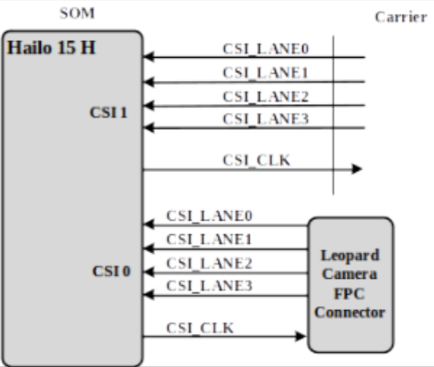

# HAILO 15 SOM Hardware User Manual

## Revisions and Notes

|     |     |     |     |
| --- | --- | --- | --- |
| **Date** | **Owner** | **Revision** | **Notes** |
| 01 Apr 2024 | Noam Weidenfeld | 1.0 | Initial release |
| 26 Nov 2024 | Yazan Shhady | 1.1 | Add Power Consumption Measurement |
| Table of Contents | - [Revisions and Notes](#revisions-and-notes) - [Introduction](#introduction) - [Highlighted Features](#highlighted-features) - [Supporting Products](#supporting-products) - [Description](#description)   - [Block Diagram](#block-diagram) - [Core System Components](#core-system-components)   - [Hailo 15 SoC Family](#hailo-15-soc-family)   - [Memories](#memories)   - [Ethernet PHY 10/100/1000 Mbps](#ethernet-phy-10-100-1000-mbps)   - [WI-FI (802.11a/b/g/n/AC) and BT 5.0 (Murata's Certified Module)](#wi-fi-80211a-b-g-n-ac-and-bt-50-muratas-certified-module)   - [MIPI CSI-2 SOM’s Camera Interface](#mipi-csi-2-soms-camera-interface) - [Hailo 15 External Interfaces](#hailo-15-external-interfaces)   - [General](#general)   - [Supported Interfaces](#supported-interfaces)     - [USB3.0/2.0 and PCIe](#usb30-20-and-pcie)       - [USB-3.0/2.0](#usb-30-20)     - [PCIe](#pcie)     - [MIPI CSI](#mipi-csi)     - [MIPI DSI](#mipi-dsi)     - [Audio](#audio)     - [UART](#uart)     - [QSPI](#qspi)     - [I2C](#i2c)     - [Connector’s Signal Description](#connectors-signal-description) - [Power & Reset](#power-reset)   - [Power Architecture](#power-architecture)   - [Power Consumption](#power-consumption)   - [Reset](#reset) - [Hailo 15 Integration Manual](#hailo-15-integration-manual)   - [Power Up Sequence](#power-up-sequence)   - [Booting Options](#booting-options)   - [I2C Interfaces](#i2c-interfaces)   - [GPIO Interfaces](#gpio-interfaces)   - [Hailo 15 SOM Debugging Capability](#hailo-15-som-debugging-capability) - [Hailo 15 Typical Power Consumption](#hailo-15-typical-power-consumption) - [Hailo 15 SOM Mechanical Description](#hailo-15-som-mechanical-description) - [Ordering Information](#ordering-information) - [Federal Communications Commission (FCC) Statement](#federal-communications-commission-fcc-statement) |     |     |

> [!INFO]
> **Disclaimer**
> No warranty of accuracy is given concerning the contents of the information contained in this publication. To the extent permitted by law no liability (including liability to any person by reason of negligence) will be accepted by SolidRun Ltd., its subsidiaries or employees for any direct or indirect loss or damage caused by omissions from or inaccuracies in this document. SolidRun Ltd. reserves the right to change details in this publication without prior notice. Product and company names herein may be the trademarks of their respective owners.

## Introduction

This User Manual relates to the SolidRun’s HAILO 15 SOM. The HAILO 15 integrates a powerful Neural Network supporting AI applications.

- Built in AI.
- High-Performance AI Analytics.
- Enhanced Image Processing.
- Flexible and Secure System.
- Comprehensive Software Suite

## Highlighted Features

- Low power and compact size (47x30mm).
- 4 x Cortex A53 @ 1.3GHz ; 12 kDMIPS.
- 2 x Cortex M4, 200MHz.
- Powerful Neural Network up to 20 TOPS.
- High quality multiple sensors ISP pipeline 2 x MIPI-CSI2 4 lanes.
- Dual Camera 12MP ISP with HDR H.265/4 Video.
- Best AI performance at a standard camera power consumption and cost.
- Up to 8Gbytes LPDDR4 (Default 4GB)
- Up to 256Gbytes eMMC (Default 64GB)
- Bootable 32Mbit QSPI.
- A single Gigabit Ethernet interface.
- Wi-Fi (802.11a/b/g/n/ac) + BT (5.0) Murata's certified module (Cypress chipset)
- On board MIPI-CSI interface supporting Leopard camera's modules.
- Industrial temperature grade

## Supporting Products

The following products are provided from SolidRun both as production level platforms and as reference examples on how to incorporate the SOM in different levels of integration:

- HummingBoard IIOT– A board computer that incorporates the SOM retains the same Android and different Linux distributions while adding extra hardware functionalities and access to the hardware.
- HAILO 15 EVK – Evaluation Kit.

## Description

#### Block Diagram

The following figure describes the HAILO 15 Blocks Diagram.

## Core System Components

#### Hailo 15 SoC Family

The Hailo-15 is a series of AI vision processors for smart cameras. The 15H SoC generates a premium image quality and advanced video analytics. AI capacity of up to 20 TOPS can be used for both AI-powered image enhancement and processing of multiple complex deep learning AI applications.

#### Memories

The Hailo 15 SOM supports varieties of memory interfaces for booting and data storage. The following figure describes the Hailo 15 memory interfaces.

**LPDDR4**

- Up to 8GB memory space.
- 32 Bits data bus.
- Up to 4266 MT/s.
- One or two ranks.
- Inline ECC.
- DDR DMA:
  - Fast data movement from DDR to NN-core.
  - Fast parameters fetch from DDR to NN-core.
  - Fast data movement from DDR to DDR.

**eMMC NAND Flash**

- Up to 128GB memory space.
- 4 Bits data bus.
- Support MMC standard, up to version 5.1.
- Up to HS200 (800 Mbps).
- Can be used as BOOT NVM \*

> [!NOTE]
> Note – in current revision the eMMC can’t be used fro UBOOT, it can only be used as a secondary boot memory after running the UBOOT on the QSPI memory.

**Quad Serial NOR Flash (SOM)**

- Up to 1Gb.
- Support both SDR mode and DDR mode.
- Up to 50MHz clock frequency.
- No reset.
- QSPIA/nSS0.
- Can be used as BOOT NVM.

**EEPROM (SOM)**

- 1Kb EEPROM
- ON-Semi’s CAT24AA01TDI or compatible
- I2C0
- Address 0X50 (7 bits format)
- Stores SOM’s configurations.

**Micro-SD (Carrier)**

Not Supported.

#### Ethernet PHY 10/100/1000 Mbps

The SOM supports a single Giga Ethernet interface (RGMII). The Som integrates Maxlinear’s MxL86110I GE PHY.

- RGMII interface.
- IEEE-802.3-2002 compliant MAC.
- Tag MAC frame support (VLAN)
- Maxlinear’s MxL86110I PHY.
- Enhanced Schedule Traffic – TSN, 802.1Qav.
- Time Stamping Unit (TSU) supports a 102-bit timer.

#### WI-FI (802.11a/b/g/n/AC) and BT 5.0 (Murata's Certified Module)

**WI-FI & BT**

The WI-FI & BT module is Murata’s 1MW module Based on Cypress CYW43455. hip. The WI-FI main features are:

- Operate at ISM frequency Band (2.4/ 5 GHz)
- IEEE Standards Support 802.11ac, 802.11a, 802.11b, 802.11g and 802.11n
- WI-FI over SDIO-1 interface.
- BT 5.0 BR/EDR/LE
- BT over UART-1 Interface
- Global certification.

#### MIPI CSI-2 SOM’s Camera Interface

The Hailo 15 SOM supports two 4-Lanes MIPI CSI-2 interface. One of the interfaces is connected to the BtB connectors and the second is connected to an FPC connector that support Leopard’s MIP-CSI cameras.

The following figure describes the Hailo 15 CSI interfaces.

The figure below describes the CSI Camera’s connector.

## Hailo 15 External Interfaces

#### General

The SOM incorporates three Hirose DF40 board-to-board headers.

The selection of the Hirose DF40 is due to the following criteria:

- Miniature (0.4m pitch)
- Highly reliable manufacturer
- Availability (worldwide distribution channels)
- Excellent signal integrity (supports 6Gbps)
  - Please contact Hirose or SolidRun for reliability and test result data.
- Mating height of between 1.5mm to 3.0mm. The Hailo 15 SOM’s headers are fixed, the final mating height is determined by carrier implementation.

#### Supported Interfaces

##### **USB3.0/2.0 and PCIe**

The Hailo 15 supports 4 ser/des interfaces that can be shared between the PCIe and USB3 interfaces.

The single PCIe controller can support 1, 2 or 4 lanes.

> [!NOTE]
> - **When supporting 4 lanes there is no support for USB3.**
> - **Only the fourth lane can support the USB3 interface.**
> - **USB2 is always supported.**

###### USB-3.0/2.0

The Hailo 15 supports a single USB3.0/2.0 controller. The USB3.0 interface is supported on the fourth Ser/Des lane. USB 2.0 is always supported.

The USB main features are:

- Complies with USB rev 3.1 and xHCI 1.1 specification.
- USB dual-role operation and can be configured as host or device.
- Super-speed (5 Gbit/s), high-speed (480 Mbit/s), full-speed (12 Mbit/s), and low speed (1.5 Mbit/s) operations.
- Supports four programmable, bidirectional USB endpoints.
- Power control signal are not part of the USB module, any available GPIO can be used.

> [!NOTE]
> - **The voltage on VBUS is 5V.**
> - **There are decupling capacitors on the SOM.**

##### PCIe

**TBD**

##### MIPI CSI

MIPI CSI interface 1 is available on the BtB connector (See MIPI CSI-2 SOM’s Camera Interface).

- CSI channel 1.
- MIPI CSI V1.3 RX controller.
- DPHYs V1.2 (2.5Gbps per lane).
- Scalable data lane support, 1 to 4 Data Lanes.
- ISP support

##### MIPI DSI

The following figure describes the DSI interface.

The DSI main features are:

- TX DPHY (4 lanes, 2.5Gbps per lane).

##### Audio

The Hailo 15 SOM supports a single dual channel I2S controller.

The Audio main features are:

- Audio resolution of 12, 16, 20, 24 and 32 bits
- External SCLK gating and enable signals.

> [!NOTE]
> - **A second I2S line is multiplexed with Ios.**

##### UART

The Hailo 15 SOM can support up to 4 UART interfaces. The following figure describes the UART interfaces.

The UART interfaces main features are:

- UART 0 is connected directly to the WI-FI/BT Modem to support the BT.
- UART 1 supports TX, RX and is used as terminal interface.
- UART 2 Supports TX, RX.
- UART 3 support TX and RX.
- High-speed TIA/EIA-232-F compatible, up to 2Mbit/s.
- 8-bits communication with parity and fixed one stop bit.

> [!NOTE]
> - **UART2 and UART3 are available as ALT functional signals of other signals.**
> - **Handshake signals (RTS/CTS) can be used by I/Os (SW). No HW control.**

##### QSPI

The Hailo 15 SOM supports an a single QSPI interface. The following figure describes the QSPI interface.

The QSPI interface is multiplexed between the SOM’s QSPI Flash memory and the BtB connectors. The default stat of the MUX (After HW and SW reset) is configured to support the QSPI memory.

- Supports up to four chips select signal.
- Master/Slave configurable.
- External frequency up to 50 MHz and minimal frequency of 6.25 MHz
- Support 1, 2 and 4 bits.
- Support DDR and SDR modes.

##### I2C

The Hailo 15 supports up to four I2C Interfaces. The following figure describes the I2C interfaces.

The I2C main features are:

- I2C-0 is used only on the SOM. It is connected to the SOM EEPROM, the CPU core’s voltage regulator, The Leopard camera interface and the PCIe clock generator.
- I2C-1 and I2C-2 are available on the connector by default.
- I2C-3 is multiplexed with other I/O signals.
- In Fast mode, data transfer rates up to 400 kbits/s.
- In High-speed mode, data transfer rates up to 3.4 Mbits/s.

##### Connector’s Signal Description

**J5001**

**J7**

**J9**

## Power & Reset

#### Power Architecture

The Hailo 15’s power is a single 5V source. It uses Discreet power converters to generate its power rails. The following figure describes the power architecture and power up sequencing.

The power architecture main features are:

- Single 5V power source.
- 1.8V output up to 1A (Need to calculate system and SOM power).

#### Power Consumption

Hailo 15 SOM Power Table:

| **Test Condition** | **Voltage** | **Current** | **Power** | **Tj \[**°C**\]**   Withot Heatsink | **Tj \[**°C**\]**   with Heatsink |
| --- | --- | --- | --- | --- | --- |
| Idle, Linux up | 5V  | 520mA | 2.6W | 64°C | 53°C |
| Linux up, Ethernet connected and sending packets by iperf3 | 5V  | 620mA | 3.1W | 65°C | 54°C |
| Linux up, wifi connected to 2.4GHz and sending packets by iperf3 | 5V  | 660mA | 3.3W | 65°C | 54°C |
| Linux up, wifi connected to 5GHz and sending packets by iperf3 | 5V  | 740mA | 3.7W | 66°C | 55°C |
| Linux up, CPU stress to maximum (4 x CPU 100%) | 5V  | 700mA | 3.5W | 84°C | 59°C |
| Linux up, AI stress Ultra-Performance \[\*\] | 5V  | 1.18A | 5.9W | 85°C | 60°C |
| All utilities are active in the same time (Wifi, AI stress, CPU stress, Ethernet)\[stress running for **1 minute**\] | 5V  | 1.52A | 7.6W | 98°C | 72°C |
| All utilities are active in the same time (Wifi, AI stress, CPU stress, Ethernet)\[stress running for **3 minutes**\] | 5V  | 1.56A | 7.8W | 116°C | 82°C |

> [!NOTE]
> Power and thermal tests were conducted at room temperature.
> \[\*\] AI Stress by running `hailortcli run apps/detection/resources/yolov5m_wo_spp_60p_nv12_640.hef --power-mode ultra_performance`

#### Reset

The Hilo 15 power is monitored by a voltage supervisor.

A reset can be triggered by an external reset signal (Switch) or the internal power fail. There is a pull-up on the SOM.

> [!NOTE]
> - **Resetting the SOM doesn’t turn the power rails off including the 1.8V out.**

## Hailo 15 Integration Manual

#### Power Up Sequence

The Hailo 15 is sourced by a single 5V input. All power sequences are supported on the SOM.

When using the SOM 1.8V output there is no need to consider its power sequence. If an external power source is used for the 1.8V, it needs to be power according to the power sequence rules.

#### Booting Options

The Hailo 15 support boot from a FLASH (QSPI) memory or from UART IF (UART1).

The Hailo 15 has one bootstrap pin, which select the boot-up interface of the M4 MCU.

The bootstrap pin, H\_I2S\_SDO, is being sampled with NRESET and should remain stable during the reset process.

The signal H\_I2S\_SDO is available on J5001-3 as a bootstrap pin and on J7-53 as an audio interface. However, one can use only one of the signal locations.

To check the boot sequencing please refer to the Hailo 15 datasheet.

#### I2C Interfaces

The Hailo 15 uses I2C0 interface for its internal configurations.

The Hailo 15 uses I2C0 interface for its internal configurations.

|     |     |     |     |     |     |     |     |     |     |     |     |     |
| --- | --- | --- | --- | --- | --- | --- | --- | --- | --- | --- | --- | --- |
| **Ref.** | **Chip** | **I2C Port** | **Address A** |     |     |     |     |     |     |     | **Port** | **Description** |
| **U5** | **IO EXPANDER** | **0** | **1** | **1** | **1** | **0** | **1** | **0** | **0** | **RW** | **74H** | **Enable parts on the SOM** |
| **U12** | **EEPROM** | **0** | **1** | **0** | **1** | **0** | **0** | **0** | **0** | **RW** | **50H** | **SOM ID** |
| **U6** | **PCIe CLK GEN.** | **0** | **1** | **1** | **0** | **1** | **0** | **0** | **0** | **RW** | **48H** | **PCIe clock generator** |
| **U16** | **0P8V Core PWR** | **0** | **1** | **0** | **0** | **0** | **0** | **0** | **0** | **RW** | **40H** | **Buck control** |
| **J2** | **Leopard Camera** | **0** |     |     |     |     |     |     |     |     |     | **Check camera datasheet.** |

> [!NOTE]
> - **I2C0 is available only on the SOM.**

#### GPIO Interfaces

The Hailo 15 uses some GPIO signals for its internal controls. Some of the signals are of the CPU and others are of the IO Expender. The following table describes the GPIO allocation.

|     |     |     |     |
| --- | --- | --- | --- |
| **Signal** | **I/O** | **Description** | **Remarks** |
| H\_GPIO\_6 | H\_GPIO\_6 | Reset the IO Expander | Active Low |
| H\_GPIO\_8 | H\_GPIO\_8 | IO Expander interrupt | Active Low |
| WL\_REG\_ON | IO\_EXP 0-1 | Enable the WIFI radio | Active High |
| BT\_REG\_ON | IO\_EXP 0-2 | Enable the BT radio | Active High |
| ETH\_RST# | IO\_EXP 0-3 | Reset the Ethernet PHY | Active Low |
| ENET\_nINT | IO\_EXP 0-4 | Ethernet PHY interrupt | Active Low |
| QSPI\_SEL | IO\_EXP 0-4\] | Select the QSPI interface | “0” FLASH memory  “1” Board to Board conn. |

#### Hailo 15 SOM Debugging Capability

The Hailo 15 SOM supports two main debugging interfaces:

- UART interface
- JTAG interface

The UART interface is a null modem interface that is internally pulled up and supports using UART1 TX/RX signals available on J7-52 and J7-54.

The UART interface is optional to use and mentioned here since most of the software infrastructure used in Carrier EVK uses those two signals for debugging.

JTAG interface is on the Hailo 15 SOM and is exposed as test pins on components side. Following is a snapshot of the test points and its connectivity traces:

> [!INFO]
> **TP-11 ->** JTAG\_TRSTN
> **TP-7 ->** JTAG\_TDI
> **TP-8 ->** JTAG\_TMS
> **TP-9 ->** JTAG\_TCK
> **TP-10 ->** JTAG\_TDO.

## Hailo 15 Typical Power Consumption

**TBD**

## Hailo 15 SOM Mechanical Description

Note the following details:

- The carrier board must use the same footprint as in the above mechanical footprint.  
Since this is a TOP VIEW of the print side of the Hailo 15 SOM, the diagram above describes the dimensions and placement of the board-to-board headers, mechanical holes and boundaries of the Hailo 15, as-is.
- J5002 (J9 on Hailo 15) is the main board-to-board header (bottom side in the diagram).
- J8004 (J7 on Hailo 15)is the second board-to-board header (upper side in the diagram).
- J5001 is the third board-to-board header (right side in the diagram).
- In case 1.5mm mating height was chosen, then the Hailo 15 requirement would be that all area beneath it on the carrier will be all dedicated ONLY for the board-to-board connectivity; no other components are allowed.  
In case higher mating is chosen, then 1.5mm should be reserved for the Hailo 15. For instance, if 3.5mm mating height is chosen, then 1.5mm is dedicated to the Hailo 15 print side components and the remaining 2mm for the carrier components underneath the Hailo 15.

## Ordering Information

Please refer to the SolidRun website for more information regarding part numbers and the procedure for placing an order.

[www.solid-run.com](http://www.solid-run.com/)

## Federal Communications Commission (FCC) Statement

**TBD**