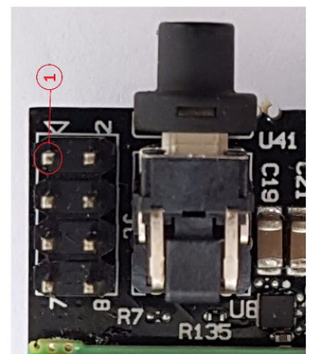

# IB8000 Bios Flash Via DediProg

## Revision and Notes

| **Date**          | **Owner**                                                                                                                                                                                                                                                                                                                                                                                                                                                                                                              | **Revision** | **Notes**       |
| ----------------- | ---------------------------------------------------------------------------------------------------------------------------------------------------------------------------------------------------------------------------------------------------------------------------------------------------------------------------------------------------------------------------------------------------------------------------------------------------------------------------------------------------------------------- | ------------ | --------------- |
| 18 Apr 2022       |                                                                                                                                                                                                                                                                                                                                                                                                                                                                                                                        | 1.0          | Initial release |
| Table of Contents | 
- <a href="ib8000-bios-flash-via-dediprog.md#revision-and-notes">Revision and Notes</a> - <a href="ib8000-bios-flash-via-dediprog.md#dediprog-sf600-intel-solid-pc-bios-update-flashing-guide">DediProg SF600 Intel Solid PC BIOS update/flashing guide</a> - <a href="ib8000-bios-flash-via-dediprog.md#requirements">Requirements</a> - <a href="ib8000-bios-flash-via-dediprog.md#instructions">Instructions</a> - <a href="ib8000-bios-flash-via-dediprog.md#external-links">External Links</a>
 |              |                 |

## DediProg SF600 Intel Solid PC BIOS update/flashing guide

### **Requirements**

Tools required for this task:

* [DediProg SF600 Plus SPI Flash IC Programmer](http://www.dediprog.com/pd/spi-flash-solution/sf600)
* DediProg Programmer accessory » [SF600 Universal Adaptor With SF100 2.54mm 2×4 ISP Cable](http://www.dediprog.com/pd/programmer-accessories/ADP-SF600-TO-SF100xCB)
* DediProg SF600 Plus SPI Flash IC Programmer [Software](http://www.dediprog.com/pd/spi-flash-solution/SF600Plus)
* DediProg SF600 Plus SPI Flash IC Programmer [USB Driver](http://www.dediprog.com/pd/spi-flash-solution/SF600Plus)
* SolidRun SolidPC (SOM+Carrier)
* SolidRun SolidPC power supply

### Instructions

1\. Install the SF600 Plus software

2\. Connect the SF600 Plus to your computer and install the USB Driver

3\. Connect the accessory cable to the SF600 Plus via the PCB end of the cable

4\. Connect the 4×2 end of the accessory cable to the J8 header on the SolidPC

5\. Connect SolidRun SolidPC power supply to the SBC

6\. Run DediProg Engineering (which should be 1 of the 4 icons which the software installation created)

7\. When the application opens, you should receive a query regarding Memory Type Ambiguity. Please select MX25U6435F


**Please Note:** The programmer must drive 1.8v signals; otherwise the main processor might get damaged


8\. Load the Bios image into the DediProg Software prior to flashing:

1. From the DediProg Software toolbar please select FILE
2. Point to the Bios Bin file
3. Data Format: Raw Binary
4. “Truncate file to fit in the target area” should NOT be selected
5. Click “OK”
6. “Operation Completed” should appear in the main program window

9\. In order to write the Bios to the Eprom – on the DediProg Software toolbar please click on BATCH. Please wait during processing. When the task is complete the log in the main window should state “Operation Complete”

### External Links

* [SF600Plus](http://www.dediprog.com/pd/spi-flash-solution/SF600Plus)
* [DediProg](http://www.dediprog.com/)
