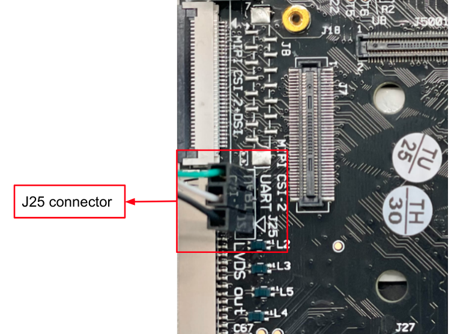

# HummingBoard Edge Quick Start Guide

.png)

<a id="revision-and-notes"></a>

## Revision and Notes

| **Date** | **Owner** | **Revision** | **Notes** |
| --- | --- | --- | --- |
| 14 Nov 2021 |     | 1.0 | Initial release |
| Table of Contents | - [Revision and Notes](#revision-and-notes)<br>- [Introduction](#introduction)<br>- [Hardware Setup](#hardware-setup)<br>  - [Product Specifications](#product-specifications)<br>  - [Block Diagram](#block-diagram)<br>  - [Visual features overview](#visual-features-overview)<br>- [Software Setup](#software-setup)<br>  - [Cable setup and prerequisites](#cable-setup-and-prerequisites)<br>- [Booting form an SD card](#booting-form-an-sd-card)<br>- [Install to eMMC](#install-to-emmc)<br>- [More Features](#more-features)<br>  - [Internet](#internet)<br>    - [Wi-fi](#wi-fi)<br>  - [Bluetooth](#bluetooth)<br>  - [Cellular Modem](#cellular-modem)<br>  - [GPIO pins Control](#gpio-pins-control)<br>  - [Install GUI Support](#install-gui-support)<br>    - [Wayland](#wayland)<br>- [List Of Supported OS](#list-of-supported-os)<br>- [Build U-Boot & Kernel from sources](#build-u-boot-kernel-from-sources)<br>- [Documentation](#documentation)<br>- [Related Articles](#related-articles) |     |     |

<a id="introduction"></a>

## Introduction

The following quick start guide provides background information about the [HummingBoard Edge](https://www.solid-run.com/embedded-industrial-iot/nxp-i-mx6-family/hummingboard/#edge) product which use the i.MX6 System on module.

The guide will give a technical overview about the product and by the end of it you should be able to boot an operating system and begin testing your application.

<a id="hardware-setup"></a>

## Hardware Setup

<a id="product-specifications"></a>

#### Product Specifications

|     |     |
| --- | --- |
| **SOM Model** | NXP i.MX6 based Solo to Quad Core SOM |
| **Memory & Storage** | Up to 2GB DDR3\* |
|     | uSD  <br>M.2 (2242) |
| **Connectivity** | 1xRJ-45\*\* |
|     | 4\*USB 2.0 |
|     | Mini-PCIe with SIM card holder |
| **Media** | HDMI-Out |
|     | LVDS |
|     | Analog Audio |
|     | MIPI-CSI-2 and MIPI-DSI |
|     | Parallel Camera (on GPIO header) |
| **I/O** | Reset Button |
|     | 36 pins GPIO Header |
|     | RTC with Battery |
|     | IR  |
| **OS Support** | Linux |
| **Dimensions** | 102mmx69mm |
| **Power** | 7V-36V, 5.5mm in (Twist and Lock mechanism) |
| **Environment** | Optional metal enclosure |
|     | [Buy Now](https://shop.solid-run.com/product-tag/hummingboard-edge/?_ga=2.56061992.2016484779.1641802897-2012112798.1622706355) |

> [!INFO]
> Supported with i.MX6 SOM. For more detailed information about our SOM-i.MX6 series please visit this user manual : [i.MX6 SOM Hardware User Manual](../../nxp-imx6-based-products/imx6-som-hardware-user-manual.md).

> [!NOTE]
> **Please Note**  
> (\*) RAM type and speed dependent on SOM  
> (\*\*) 1000 Mbps link is limited to 470Mbps actual bandwidth due to internal chip buses

<a id="block-diagram"></a>

#### **Block Diagram**

The following figure describes the HummingBoard Edge Block Diagram.


<a id="visual-features-overview"></a>

#### Visual features overview

Please see below the features overview of the connector side of the HummingBoard Edge.


Print side connector overview of the HummingBoard Edge.


<a id="software-setup"></a>

## Software Setup

<a id="cable-setup-and-prerequisites"></a>

#### Cable setup and prerequisites

Here is what you will need to power up the board:

- Linux or Windows PC
- HummingBoard Edge with SOM
- 12V Power adapter (HummingBoard Edge has wide range input of 9V-36V, it is recommended to use 12V power adapter)
- USB to UART cable
- IP router or IP switch

<a id="booting-form-an-sd-card"></a>

## Booting form an SD card

On the HummingBoard Edge it is possible to boot from different media.

For Booting from an SD card, jumpers need to be setup at J5005 as follows:


> [!NOTE]
> Before you set the boot jumpers, please refer to [HummingBoard Edge/Gate Boot Jumpers](../../nxp-imx6-based-products/imx6-other-articles/hummingboard-edge-gate-boot-jumpers.md) for more information about J5005.

Once you setup the jumpers, you can apply the following for booting from an SD card.

**1\. Downloading the Yocto image**

Download the Yocto image by running the following command on your Linux/Windows PC:

```
wget http://solid-run-images.sos-de-fra-1.exo.io/IMX6/meta-solidrun-arm-imx6/2024-07-05_ab67695/core-image-weston-sdk-imx6qdlcubox.wic.gz
```

- For more Yocto releases, please visit [Yocto Release](https://images.solid-run.com/IMX6/meta-solidrun-arm-imx6).

**2\. Writing the image to the SD card**

Use the following commands for writing the image to an SD card:

```
gzip -dc core-image-weston-sdk-imx6qdlcubox.wic.gz | dd of=/dev/sdX bs=4M conv=sync
```

- For more information, please visit [Flashing an SD Card](../../../../homepage/other-articles/flashing-an-sd-card.md) .

> [!NOTE]
> Note: Plug a micro SD into your Linux PC, the following assumes that the micro SD is added as /dev/sdX and all it’s partitions are unmounted.

**3\. SD card insertion**

Please Insert the SD card into your device.

**4\. Power connection**

Connect your power adaptor to the DC jack, and then connect the adaptor to mains supply.

**5\. Serial connection**

Please connect the UART cable to the pins on connector J25 as shown in the below picture, then you can refer to [Serial Connection](../../../../homepage/other-articles/serial-connection.md) for installing necessary serial connection software in Linux/Windows.



> [!INFO]
> For more information about J25 connector, please refer to [HummingBoard Gate/Edge UART console](../../nxp-imx6-based-products/imx6-other-articles/hummingboard-gate-edge-uart-console.md) .

Once you installed the necessary serial connection software, you should be able to see the following:


- In order to be able to log in , please insert “debian” as a username and password as follows:


<a id="install-to-emmc"></a>

## Install to eMMC

- You can follow this document [Install to eMMC](https://github.com/SolidRun/documentation/blob/bsp/imx6/debian-11_sr1.md#install-to-emmc) to install debian to an eMMC device.

<a id="more-features"></a>

## More Features

<a id="internet"></a>

#### Internet

- Please check you Ethernet connection.
- Use the following commands in order to keep your system up-to-date:

```
apt-get update 
apt-get upgrade 
reboot
```

- For more detailed information, please refer to [i.MX6 Debian](../../nxp-imx6-based-products/imx6-software/imx6-debian.md) .

<a id="wi-fi"></a>

##### Wi-fi

- You can connect to WiFi using any application, such as : [connmanctl](https://manpages.debian.org/testing/connman/connmanctl.1.en.html) or [wpa\_spplicant](https://wiki.archlinux.org/title/wpa_supplicant).

An example for connecting to WiFi using wpa\_supplicant:

1\. To bring a WiFi interface up, run the following :

```
ifconfig wlan0 up 
```

> [!NOTE]
> To discover your wireless network interface name, see [Network Interfaces](https://wiki.archlinux.org/title/Network_configuration#network_interfaces).

2\. Install the wpa\_supplicant package:

```
apt-get install wpasupplicant 
```

3\. Edit network interfaces file :

At the bottom of the file, add the following lines to allow wlan as a network connection:

```
cat <<EOF > /etc/network/interfaces.d/wlan0
allow-hotplug wlan0
iface wlan0 inet dhcp
wpa-conf /etc/wpa_supplicant/wpa_supplicant.conf
iface default inet dhcp

EOF
```

4\. Create a configuration file with the relevant ssid:

```
cat <<EOF > /etc/wpa_supplicant/wpa_supplicant.conf
ctrl_interface=/run/wpa_supplicant
update_config=1

network={
    ssid="MYSSID"
    psk="passphrase" 
}

EOF
```

> [!NOTE]
> Check your personal ssids by running : ‘iw dev wlan0 scan’

5\. Make sure it works:

Restart your device and it should connect to the wireless network. If it doesn't, repeat above steps or get help from an adult.

- For more information about using wpa\_supplicant , you can refer to [wpa\_supplicant](https://www.linuxbabe.com/command-line/ubuntu-server-16-04-wifi-wpa-supplicant) or [wpa\_supplicant](https://blog.nelhage.com/2008/08/using-wpa_supplicant-on-debianubuntu/).

<a id="bluetooth"></a>

#### Bluetooth

1\. For showing all Bluetooth devices, run the following:

```
apt-get install bluez
hciconfig -a
```

2\. Choose a device, and turn it on:

```
 hciconfig hci0 up
```

3\. Set up the Bluetooth name:

```
hciconfig hci0 name 'SolidRun_Ble'
```

4\. Make your Bluetooth detectable by other devices:

```
hciconfig hci0 piscan
```

5\. If you want to connect to other devices:

- Start by scanning for other Bluetooth devices:

```
hcitool scan
```

- Choose a MAC address and connect :

```
rfcomm connect 0  $MAC 10 & 
```

- You can check the communication between the devices by writing :

```
l2ping -c 4  $MAC
```

<a id="cellular-modem"></a>

#### Cellular Modem

The cellular modem is a more fully featured extension of which contains a cellular module with additional hardware interfaces and a SIM card slot.

You can connect your cellular modem to the mPCIe, and insert a SIM card.

- For some cellular modules to be connected, please refer to [Cellular Modules](../../nxp-imx6-based-products/imx6-other-articles/cellular-modules.md) .

<a id="gpio-pins-control"></a>

#### GPIO pins Control

In order to be able to control the GPIO pins, please refer to [HummingBoard Edge/Gate/CBi GPIO Pins Control](../../nxp-imx6-based-products/imx6-other-articles/hummingboard-edge-gate-cbi-gpio-pins-control.md).

<a id="install-gui-support"></a>

#### Install GUI Support

> [!NOTE]
> Note that HDMI doesn’t display anything by default.

<a id="wayland"></a>

##### Wayland

1\. Install Weston :

```
  sudo apt install weston
```

- Connect your HDMI cable and you should be able to see the following :


> [!NOTE]
> `By default one application is available, the terminal emulator, at the upper left corner.`

2\. Start Weston FROM A PHYSICAL TERMINAL (from the above terminal, not remote or serial session):

```
  weston-launch -- --backend=drm-backend.so
```

> [!WARNING]
> Make sure to run the above without sudo.

This will bring up the following:


- For more applications, you can refer to [GUI Support](https://github.com/SolidRun/documentation/blob/bsp/imx6/debian-11_sr1.md#wayland) to install X11, OpenGL-ES, GStreamer, or you can follow this page [Gnome](https://linuxhint.com/install_gnome_debian_10_minimal_server/) for installing Gnome desktop.

<a id="list-of-supported-os"></a>

## List Of Supported OS

| **OS** |     |
| --- | --- |
|  | [i.MX6 Debian](../../nxp-imx6-based-products/imx6-software/imx6-debian.md) |
|  | [Yocto for i.MX6](../../nxp-imx6-based-products/imx6-software/yocto-for-imx6.md) |
|  | [i.MX6 Archlinux](../../nxp-imx6-based-products/imx6-software/imx6-archlinux.md) |
|  | [XBian for i.MX6](../../nxp-imx6-based-products/imx6-software/xbian-for-imx6.md) |

<a id="build-u-boot-kernel-from-sources"></a>

## Build U-Boot & Kernel from sources

- Build a Linux kernel -  [i.MX6 Kernel](../../nxp-imx6-based-products/imx6-software/imx6-kernel.md)
- Build a U-Boot - [i.MX6 U-Boot](../../nxp-imx6-based-products/imx6-software/imx6-u-boot.md)

<a id="documentation"></a>

## Documentation

      

|     | File | Modified |
| --- | --- | --- |
| Labels<br><br>- No labels<br>- [Edit Labels](#section-dabbce9d-60ea-432c-995b-0bd2aea26af2)<br><br>[Preview] [View](/wiki/download/attachments/270401543/HummingBoard2-v1.4-layout_pcb.zip?version=1) [Properties](/wiki/pages/editattachment.action?pageId=270401543&fileName=HummingBoard2-v1.4-layout_pcb.zip&isFromPageView=true) [Delete](/wiki/pages/confirmattachmentremoval.action?pageId=270401543&fileName=HummingBoard2-v1.4-layout_pcb.zip) | ZIP Archive [HummingBoard2-v1.4-layout\_pcb.zip](/wiki/download/attachments/270401543/HummingBoard2-v1.4-layout_pcb.zip?api=v2) | Dec 26, 2021 by [SolidRun](/wiki/people/557058:12be2ae4-3a6e-40cc-a677-bdfc4c987d1f) |
| Labels<br><br>- No labels<br>- [Edit Labels](#section-d402f94e-64d3-426f-80dc-c1e0e899f6cd)<br><br>[Preview] [View](/wiki/download/attachments/270401543/HummingBoard2-gerber-rev1.2.zip?version=1) [Properties](/wiki/pages/editattachment.action?pageId=270401543&fileName=HummingBoard2-gerber-rev1.2.zip&isFromPageView=true) [Delete](/wiki/pages/confirmattachmentremoval.action?pageId=270401543&fileName=HummingBoard2-gerber-rev1.2.zip) | ZIP Archive [HummingBoard2-gerber-rev1.2.zip](/wiki/download/attachments/270401543/HummingBoard2-gerber-rev1.2.zip?api=v2) | Dec 26, 2021 by [SolidRun](/wiki/people/557058:12be2ae4-3a6e-40cc-a677-bdfc4c987d1f) |
| Labels<br><br>- No labels<br>- [Edit Labels](#section-4410d61d-ea11-4184-9c32-81986c77a450)<br><br>[Preview] [View](/wiki/download/attachments/270401543/rtc-datasheet-onboard.pdf?version=1) [Properties](/wiki/pages/editattachment.action?pageId=270401543&fileName=rtc-datasheet-onboard.pdf&isFromPageView=true) [Delete](/wiki/pages/confirmattachmentremoval.action?pageId=270401543&fileName=rtc-datasheet-onboard.pdf) | PDF File [rtc-datasheet-onboard.pdf](/wiki/download/attachments/270401543/rtc-datasheet-onboard.pdf?api=v2) | Dec 26, 2021 by [SolidRun](/wiki/people/557058:12be2ae4-3a6e-40cc-a677-bdfc4c987d1f) |
| Labels<br><br>- No labels<br>- [Edit Labels](#section-db887530-3c3c-4d03-9bdc-7e270395af6b)<br><br>[Preview] [View](/wiki/download/attachments/270401543/HummingBoard2+PCB+parts+assembly+Rev+1.4.zip?version=1) [Properties](/wiki/pages/editattachment.action?pageId=270401543&fileName=HummingBoard2+PCB+parts+assembly+Rev+1.4.zip&isFromPageView=true) [Delete](/wiki/pages/confirmattachmentremoval.action?pageId=270401543&fileName=HummingBoard2+PCB+parts+assembly+Rev+1.4.zip) | ZIP Archive [HummingBoard2 PCB parts assembly Rev 1.4.zip](/wiki/download/attachments/270401543/HummingBoard2%20PCB%20parts%20assembly%20Rev%201.4.zip?api=v2) | Dec 26, 2021 by [SolidRun](/wiki/people/557058:12be2ae4-3a6e-40cc-a677-bdfc4c987d1f) |
| Labels<br><br>- No labels<br>- [Edit Labels](#section-b706b7b3-4742-453e-ab75-fe57028b7add)<br><br>[Preview] [View](/wiki/download/attachments/270401543/HummingBoard2+Schematics.pdf?version=1) [Properties](/wiki/pages/editattachment.action?pageId=270401543&fileName=HummingBoard2+Schematics.pdf&isFromPageView=true) [Delete](/wiki/pages/confirmattachmentremoval.action?pageId=270401543&fileName=HummingBoard2+Schematics.pdf) | PDF File [HummingBoard2 Schematics.pdf](/wiki/download/attachments/270401543/HummingBoard2%20Schematics.pdf?api=v2) | Dec 26, 2021 by [SolidRun](/wiki/people/557058:12be2ae4-3a6e-40cc-a677-bdfc4c987d1f) |
| Labels<br><br>- No labels<br>- [Edit Labels](#section-a7d1cba1-68f7-45c4-a2df-e843e5d75f02)<br><br>[Preview] [View](/wiki/download/attachments/270401543/HummingBoard2+Assembly-Files.zip?version=1) [Properties](/wiki/pages/editattachment.action?pageId=270401543&fileName=HummingBoard2+Assembly-Files.zip&isFromPageView=true) [Delete](/wiki/pages/confirmattachmentremoval.action?pageId=270401543&fileName=HummingBoard2+Assembly-Files.zip) | ZIP Archive [HummingBoard2 Assembly-Files.zip](/wiki/download/attachments/270401543/HummingBoard2%20Assembly-Files.zip?api=v2) | Dec 26, 2021 by [SolidRun](/wiki/people/557058:12be2ae4-3a6e-40cc-a677-bdfc4c987d1f) |
| Labels<br><br>- No labels<br>- [Edit Labels](#section-8c831407-dbb0-48a5-b68e-8a224cf68e2d)<br><br>[Preview] [View](/wiki/download/attachments/270401543/HummingBoard2+Enclosure-Files.zip?version=1) [Properties](/wiki/pages/editattachment.action?pageId=270401543&fileName=HummingBoard2+Enclosure-Files.zip&isFromPageView=true) [Delete](/wiki/pages/confirmattachmentremoval.action?pageId=270401543&fileName=HummingBoard2+Enclosure-Files.zip) | ZIP Archive [HummingBoard2 Enclosure-Files.zip](/wiki/download/attachments/270401543/HummingBoard2%20Enclosure-Files.zip?api=v2) | Dec 26, 2021 by [SolidRun](/wiki/people/557058:12be2ae4-3a6e-40cc-a677-bdfc4c987d1f) |
| Labels<br><br>- No labels<br>- [Edit Labels](#section-23611734-527a-4c91-bb8d-e9c51a57b021)<br><br>[Preview] [View](/wiki/download/attachments/270401543/HummingBoard+Edge+BOM++rev+1.4.2.xlsx?version=1) [Properties](/wiki/pages/editattachment.action?pageId=270401543&fileName=HummingBoard+Edge+BOM++rev+1.4.2.xlsx&isFromPageView=true) [Delete](/wiki/pages/confirmattachmentremoval.action?pageId=270401543&fileName=HummingBoard+Edge+BOM++rev+1.4.2.xlsx) | Microsoft Excel Spreadsheet [HummingBoard Edge BOM rev 1.4.2.xlsx](/wiki/download/attachments/270401543/HummingBoard%20Edge%20BOM%20%20rev%201.4.2.xlsx?api=v2) | Dec 26, 2021 by [SolidRun](/wiki/people/557058:12be2ae4-3a6e-40cc-a677-bdfc4c987d1f) |
| Labels<br><br>- No labels<br>- [Edit Labels](#section-f076176a-7a84-4437-803b-193bb09bbf3f)<br><br>[Preview] [View](/wiki/download/attachments/270401543/mikrobus_specification-rev2.pdf?version=1) [Properties](/wiki/pages/editattachment.action?pageId=270401543&fileName=mikrobus_specification-rev2.pdf&isFromPageView=true) [Delete](/wiki/pages/confirmattachmentremoval.action?pageId=270401543&fileName=mikrobus_specification-rev2.pdf) | PDF File [mikrobus\_specification-rev2.pdf](/wiki/download/attachments/270401543/mikrobus_specification-rev2.pdf?api=v2) | Dec 26, 2021 by [SolidRun](/wiki/people/557058:12be2ae4-3a6e-40cc-a677-bdfc4c987d1f) |

[Download All](/wiki/download/all_attachments?pageId=270401543)

[ Buy a Sample Now](https://shop.solid-run.com/product-tag/hummingboard-edge/?_ga=2.56061992.2016484779.1641802897-2012112798.1622706355)

<a id="related-articles"></a>

## Related Articles

Error rendering macro 'contentbylabel' : CQL was parsed but the search manager was unable to execute the search. Error message: com.atlassian.confluence.api.service.exceptions.scale.SSStatusCodeException: There was an illegal request passed to XP-Search Aggregator API : HTTP/1.1 403 Forbidden