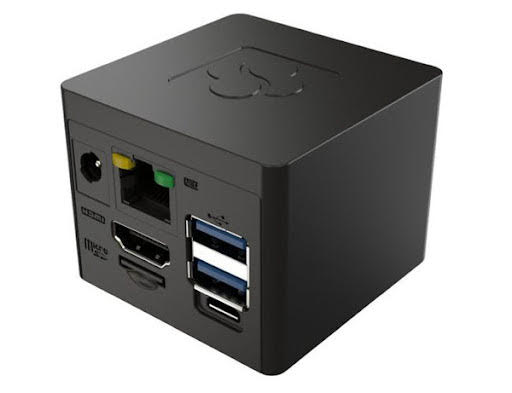

# CuBox-M Quick Start Guide



## Revision and Notes

| **Date**          | **Owner**                                                                                                                                                                                                                                                                                                                                                                                                                                                                                                                                                                                                                                                                                                                                                                                                                                                                                                                                                                                                                                                                                                                                                                                                                                                                                                                                                                                                                                                                                                                             | **Revision** | **Notes**       |
| ----------------- | ------------------------------------------------------------------------------------------------------------------------------------------------------------------------------------------------------------------------------------------------------------------------------------------------------------------------------------------------------------------------------------------------------------------------------------------------------------------------------------------------------------------------------------------------------------------------------------------------------------------------------------------------------------------------------------------------------------------------------------------------------------------------------------------------------------------------------------------------------------------------------------------------------------------------------------------------------------------------------------------------------------------------------------------------------------------------------------------------------------------------------------------------------------------------------------------------------------------------------------------------------------------------------------------------------------------------------------------------------------------------------------------------------------------------------------------------------------------------------------------------------------------------------------- | ------------ | --------------- |
| 21 Oct 2021       |                                                                                                                                                                                                                                                                                                                                                                                                                                                                                                                                                                                                                                                                                                                                                                                                                                                                                                                                                                                                                                                                                                                                                                                                                                                                                                                                                                                                                                                                                                                                       | 1.0          | Initial release |
| Table of Contents | <p>- <a href="cubox-m-quick-start-guide.md#revision-and-notes">Revision and Notes</a><br>- <a href="cubox-m-quick-start-guide.md#introduction">Introduction</a><br>- <a href="cubox-m-quick-start-guide.md#hardware-setup">Hardware Setup</a><br>- <a href="cubox-m-quick-start-guide.md#product-specifications">Product Specifications</a><br>- <a href="cubox-m-quick-start-guide.md#block-diagram">Block Diagram</a><br>- <a href="cubox-m-quick-start-guide.md#visual-features-overview">Visual Features Overview</a><br>- <a href="cubox-m-quick-start-guide.md#software-setup">Software Setup</a><br>- <a href="cubox-m-quick-start-guide.md#cable-setup-and-prerequisites">Cable setup and prerequisites</a><br>- <a href="cubox-m-quick-start-guide.md#booting-form-an-sd-card">Booting form an SD card</a><br>- <a href="cubox-m-quick-start-guide.md#more-features">More Features</a><br>- <a href="cubox-m-quick-start-guide.md#internet">Internet</a><br>- <a href="cubox-m-quick-start-guide.md#wifi">WiFi</a><br>- <a href="cubox-m-quick-start-guide.md#bluetooth">Bluetooth</a><br>- <a href="cubox-m-quick-start-guide.md#tlv-eeprom-support">TLV EEPROM Support</a><br>- <a href="cubox-m-quick-start-guide.md#list-of-supported-os">List Of Supported OS</a><br>- <a href="cubox-m-quick-start-guide.md#build-from-source">Build from source</a><br>- <a href="cubox-m-quick-start-guide.md#documentation">Documentation</a><br>- <a href="cubox-m-quick-start-guide.md#related-articles">Related Articles</a></p> |              |                 |

## Introduction

The following quick start guide provides background information about the [CuBox-M](https://www.solid-run.com/fanless-computers/cubox/#cubox-m).

The guide will give a technical overview about the product and by the end of it you should be able to boot an operating system and begin testing your application.

## Hardware Setup

#### Product Specifications

| **Model**                        | **CuBox-M**                                                                                 |
| -------------------------------- | ------------------------------------------------------------------------------------------- |
| I/Os                             | 2 x USB 3.0                                                                                 |
| Networking                       | <p>1 x Ethernet RJ45 10/100/1000<br>1 x 802.11 a/b/g/n/ac WiFi and Bluetooth (Optional)</p> |
| Processor                        | NXP i.MX8M Plus Quad core Arm Cortex A53 up to 1.8GHz (with Arm M7 GPP)                     |
| Memory & Storage                 | <p>Up to 3GB LPDDR4<br>8GB eMMC<br>MicroSD</p>                                              |
| Display                          | HDMI                                                                                        |
| Misc.                            | <p>GPIO button<br>Indication LEDs<br>RTC<br>IR receiver</p>                                 |
| Development and Debug interfaces | Micro USB                                                                                   |
| Power                            | <p>12V<br>Optional PoE</p>                                                                  |
| Expansion card I/Os              | None                                                                                        |
| Temperature                      | Commercial: 0°C to 40°C                                                                     |
| Dimensions                       | 50 x 50 x 50mm                                                                              |
| Enclosure                        | ABS Plastic                                                                                 |
|                                  | [Buy Now](https://shop.solid-run.com/?s=CuBox+M\&post_type=product)                         |

> \[!INFO] Supported with i.MX8M-PLUS SOM. For more detailed information about our SOM-i.MX8M series please visit this user manual : [i.MX8M Plus SOM Hardware User Manual](imx8m-plus-som-hardware-user-manual.md) .

#### Block Diagram

The following figure describes the i.MX8M-PLUS Block Diagram.


#### Visual Features Overview


## Software Setup

#### Cable setup and prerequisites

* Micro USB cable
* Power supplier : regulated 12V supply with 1.5A source capacity, alternatively you can use a PoE injector to power on the device.
* Micro SD card
* Linux or Windows PC
* Router or switch with Ethernet cable

> \[!WARNING] Note that using an adaptor with an output voltage which is higher than 12V will damage your device and possibly other connected USB devices.

## Booting form an SD card

**1. Downloading the Debian image**

Download the Debian image by running the following command on your Linux/Windows PC:

```
wget https://solid-run-images.sos-de-fra-1.exo.io/IMX8/imx8mp_build/build_date_20240617-rev_87b97f9/imx8mp-sdhc-debian-87b97f9.img.xz
```

* For more Debian releases, please visit [Debian Release for i.MX8](https://github.com/SolidRun/Documentation/tree/bsp/imx8).

**2. Writing the image to the SD card**

Use the following commands for writing the image to an SD card:

```
xz -dc imx8mp-sdhc-debian-87b97f9.img.xz | dd of=/dev/sdX bs=4k conv=fdatasync
```

* For more information, please visit [Flashing an SD Card](https://solidrun.atlassian.net/wiki/spaces/developer/pages/288129025) .

> \[!NOTE] Note: Plug a micro SD into your Linux PC, the following assumes that the micro SD is added as /dev/sdX and all it’s partitions are unmounted.

**3. SD card insertion**

Please Insert the SD card into your device.

**4. Power connection**

Connect your power adaptor to the DC jack, and then connect the adaptor to mains supply.

**5. Serial Connection**

Please insert the micro USB into your device, then you can refer to [Serial Connection](https://solidrun.atlassian.net/wiki/spaces/developer/pages/287801409) for installing necessary serial connection software in Linux/Windows.

Once you installed the necessary serial connection software, you should be able to see the following:

.png>)

* In order to be able to log in , please insert “debian” as a username and password as follows:

.png>)

## More Features

#### Internet

Connect an Ethernet cable to your CuBox-M (for internet access during boot-up).\
Models CuBox-M with WiFi, can be connected via [WiFi](cubox-m-quick-start-guide.md#wifi) or wired Ethernet.

* Please check you Ethernet connection.
* Use the following commands in order to keep your system up-to-date:

```
apt-get update 
apt-get upgrade 
reboot
```

* For more detailed information, please refer to [i.MX8M Debian](https://developer.solid-run.com/knowledge-base/i-mx8m-debian/) .

**WiFi**

* You can connect to WiFi using any application, such as : [connmanctl](https://manpages.debian.org/testing/connman/connmanctl.1.en.html) or [wpa\_spplicant](https://wiki.archlinux.org/title/wpa_supplicant).

An example for connecting to WiFi using wpa\_supplicant:

1. To bring a WiFi interface up, run the following :

```
ifconfig wlan0 up 
```

> \[!NOTE] To discover your wireless network interface name, see [Network Interfaces](https://wiki.archlinux.org/title/Network_configuration#network_interfaces).

2\. Install the wpa\_supplicant package:

```
apt-get install wpasupplicant 
```

3\. Edit network interfaces file :

At the bottom of the file, add the following lines to allow wlan as a network connection:

```
cat <<EOF > /etc/network/interfaces.d/wlan0
allow-hotplug wlan0
iface wlan0 inet dhcp
wpa-conf /etc/wpa_supplicant/wpa_supplicant.conf
iface default inet dhcp

EOF
```

4\. Create a configuration file with the relevant ssid:

```
cat <<EOF > /etc/wpa_supplicant/wpa_supplicant.conf
ctrl_interface=/run/wpa_supplicant
update_config=1

network={
    ssid="MYSSID"
    psk="passphrase" 
}

EOF
```

> \[!NOTE] Check your personal ssids by running : ‘iw dev wlan0 scan’

5\. Make sure it works:

Restart your device and it should connect to the wireless network. If it doesn't, repeat above steps or get help from an adult.

* For more information about using wpa\_supplicant , you can refer to [wpa\_supplicant](https://www.linuxbabe.com/command-line/ubuntu-server-16-04-wifi-wpa-supplicant) or [wpa\_supplicant](https://blog.nelhage.com/2008/08/using-wpa_supplicant-on-debianubuntu/).

#### Bluetooth

1\. For showing all Bluetooth devices, run the following:

```
apt-get install bluez
hciconfig -a
```

2\. Choose a device, and turn it on:

```
 hciconfig hci0 up
```

3\. Set up the Bluetooth name:

```
hciconfig hci0 name 'SolidRun_Ble'
```

4\. Make your Bluetooth detectable by other devices:

```
hciconfig hci0 piscan
```

5\. If you want to connect to other devices:

* Start by scanning for other Bluetooth devices:

```
hcitool scan
```

* Choose a MAC address and connect :

```
rfcomm connect 0  $MAC 10 & 
```

* You can check the communication between the devices by writing :

```
l2ping -c 4  $MAC
```

## TLV EEPROM Support

Starting from April 01. 2022, the EEPROMs on Carriers, i.MX8M Plus SoMs are being programmed with identifying information such as the product name and SKUs to allow for programmatic identification of hardware. Check our [iMXMP EEPROM documentation](https://solidrun.atlassian.net/wiki/spaces/developer/pages/344883516) for additional information.

## List Of Supported OS

| **OS**                                                        |                                                                                                                                |
| ------------------------------------------------------------- | ------------------------------------------------------------------------------------------------------------------------------ |
|        | [Documentation/debian-11\_sr8.md at bsp](https://github.com/SolidRun/documentation/blob/bsp/imx8/debian-11_sr8.md)             |
| .png>) | [GitHub - SolidRun/meta-solidrun-arm-imx8 at zeus-imx8mp](https://github.com/SolidRun/meta-solidrun-arm-imx8/tree/zeus-imx8mp) |
|        | [Cubox-M Android](https://solidrun.atlassian.net/wiki/spaces/developer/pages/261488680)                                        |
|        | [GitHub - SolidRun/imx8mp\_build](https://github.com/SolidRun/imx8mp_build)                                                    |

## Build from source

* [i.MX8M Software](imx8m-plus-mini-nano-software.md)

## Documentation

|                                                                                                                                                                                                                                                                                                                                                                                                    | File                                                                                                                | Modified                                                                       |
| -------------------------------------------------------------------------------------------------------------------------------------------------------------------------------------------------------------------------------------------------------------------------------------------------------------------------------------------------------------------------------------------------- | ------------------------------------------------------------------------------------------------------------------- | ------------------------------------------------------------------------------ |
| <p>Labels<br><br>- No labels<br>- <a href="cubox-m-quick-start-guide.md#section-53f9d402-68fd-4f68-829d-485c0b5d9db3">Edit Labels</a><br><br>[Preview] <a href="../../../wiki/download/attachments/200015887/CuBox-M-Schematics-v1.1.zip">View</a> <a href="../../../wiki/pages/editattachment.action">Properties</a> <a href="../../../wiki/pages/confirmattachmentremoval.action">Delete</a></p> | ZIP Archive [CuBox-M-Schematics-v1.1.zip](../../../wiki/download/attachments/200015887/CuBox-M-Schematics-v1.1.zip) | Mar 13, 2024 by [Yazan Shhady](../../../wiki/people/5f67bce9ed55c7006abc6319/) |

* Drag and drop to upload or \[browse for files]&#x20;

Upload file

File description

|                                                                                                                                                                                                                                                                                                                                                                                                    | File                                                                                                                | Modified                                                                       |
| -------------------------------------------------------------------------------------------------------------------------------------------------------------------------------------------------------------------------------------------------------------------------------------------------------------------------------------------------------------------------------------------------- | ------------------------------------------------------------------------------------------------------------------- | ------------------------------------------------------------------------------ |
| <p>Labels<br><br>- No labels<br>- <a href="cubox-m-quick-start-guide.md#section-e8ddd31b-8621-4e9c-8c6f-fa6d19ccf2a9">Edit Labels</a><br><br>[Preview] <a href="../../../wiki/download/attachments/200015887/CuBox-M-Schematics-v1.1.zip">View</a> <a href="../../../wiki/pages/editattachment.action">Properties</a> <a href="../../../wiki/pages/confirmattachmentremoval.action">Delete</a></p> | ZIP Archive [CuBox-M-Schematics-v1.1.zip](../../../wiki/download/attachments/200015887/CuBox-M-Schematics-v1.1.zip) | Mar 13, 2024 by [Yazan Shhady](../../../wiki/people/5f67bce9ed55c7006abc6319/) |

[Buy a Sample Now](https://shop.solid-run.com/?s=CuBox+M\&post_type=product)

## Related Articles

Error rendering macro 'contentbylabel' : CQL was parsed but the search manager was unable to execute the search. Error message: com.atlassian.confluence.api.service.exceptions.scale.SSStatusCodeException: There was an illegal request passed to XP-Search Aggregator API : HTTP/1.1 403 Forbidden
