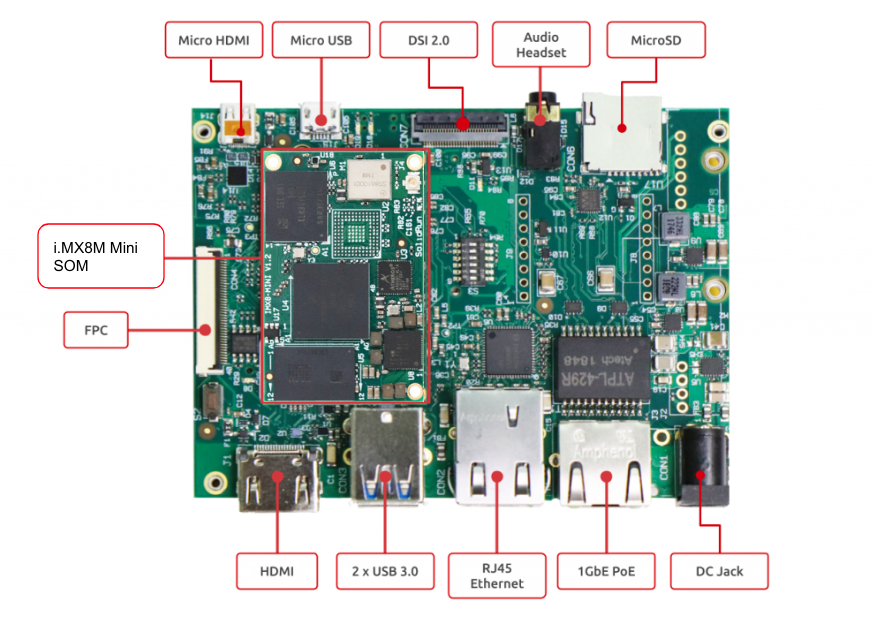

# HummingBoard Pulse & i.MX8M Mini SOM Quick Start Guide

.png)

<a id="introduction"></a>

## Introduction

The following quick start guide provides background information about the [HummingBoard Pulse.](https://www.solid-run.com/embedded-industrial-iot/nxp-i-mx8-family/hummingboard-m/#pulse)

The guide will give a technical overview about the product and by the end of it you should be able to boot an operating system and begin testing your application.

<a id="revision-and-notes"></a>

## Revision and Notes

| **Date** | **Owner** | **Revision** | **Notes** |
| --- | --- | --- | --- |
| 28 Oct 2021 |     | 1.0 | Initial release |
| Table of Contents | - [Introduction](#introduction)<br>- [Revision and Notes](#revision-and-notes)<br>- [Hardware Setup](#hardware-setup)<br>  - [Product specifications](#product-specifications)<br>  - [HummingBoard Pulse](#hummingboard-pulse)<br>  - [Block Diagram](#block-diagram)<br>  - [Visual features overview](#visual-features-overview)<br>- [Software Setup](#software-setup)<br>  - [Cable setup and prerequisites](#cable-setup-and-prerequisites)<br>- [Boot Select](#boot-select)<br>- [Booting from SD card](#booting-from-sd-card)<br>- [More Features](#more-features)<br>  - [Internet](#internet)<br>    - [WiFi](#wifi)<br>  - [Bluetooth](#bluetooth)<br>  - [GPIO Pins Control](#gpio-pins-control)<br>  - [Cellular Modem](#cellular-modem)<br>- [List Of Supported OS](#list-of-supported-os)<br>- [Build from source](#build-from-source)<br>- [Documentation](#documentation)<br>- [Related Articles](#related-articles) |     |     |

<a id="hardware-setup"></a>

## Hardware Setup

<a id="product-specifications"></a>

#### Product specifications

| **Model** | <a id="hummingboard-pulse"></a><br><br>#### HummingBoard Pulse |
| --- | --- |
| SOM Model | NXP i.MX8M Dual / Quad core Arm Cortex A53 up to 1.5GHz (with Arm M4 GPP)<br><br>NXP i.MX8M Mini Single to Quad core Arm Cortex A53 up to 1.8GHz (with Arm M4 GPP) |
| Memory & Storage | Up to 4GB LPDDR4  <br>eMMC  <br>MicroSD |
| Network | 2 x RJ45 |
| Connectivity | 2 x USB 3.0 \*  <br>Mini PCIe  <br>M.2  <br>SIM card slot |
| Media | HDMI 2.0 out \*\*  <br>MIPI-DSI  <br>2 x MIPI-CSI \*\*\*  <br>Digital audio (Riser interface FPC connector)<br><br>Onboard audio codec |
| I/O | 1 x Reset button  <br>1 x Configurable push button  <br>MikroBus click interface  <br>3 x LED indicators  <br>RTC |
| OS Support | Linux |
| Environment | Commercial:  <br>Ambient temp.: 0°C to 70°C  <br>Enclosed ambient temp.: 0°C to 40°C  <br>CPU max die: 105°C<br><br>Industrial:  <br>Ambient temp.: -40°C to 85°C  <br>Enclosed Ambient temp.: -25°C to 65°C  <br>CPU max die: 105°C<br><br>Humidity (non-condensing): 10% – 90% |
| Dimensions | Board: 102mm x 69mm  <br>Enclosed: 141.5 x 78 x 30mm |
| Power | 7V – 28V wide range  <br>PoE sink support |
| Enclosure | Optional extruded aluminum (IP32) enclosure |
|     | [Buy Now](https://shop.solid-run.com/?s=%22HummingBoard+Pulse%22&post_type=product&filter_som-com-family=nxp-i-mx8m-mini) |

> [!INFO]
> Supported with i.MX8M-MINI SOM. For more detailed information about our SOM-i.MX8M series please visit this user manual : [i.MX8M Mini SOM Hardware User Manual](https://solidrun.atlassian.net/wiki/pages/resumedraft.action?draftId=197493788) .

> [!NOTE]
> **Please note**
> (\*) Only USB 2.0 supported with the i.MX8M Mini SoC.  
> (\*\*) Only supported with the i.MX8M SoC.  
> (\*\*\*) Only 1 x MIPI-CSI supported with the i.MX8M Mini SoC.

<a id="block-diagram"></a>

#### Block Diagram

The following figure describes the i.MX8M Mini Block Diagram.


<a id="visual-features-overview"></a>

#### Visual features overview

Please see below the features overview of the connector side of the HummingBoard Pulse.



Print side connector overview of the HummingBoard Pulse.


  

<a id="software-setup"></a>

## Software Setup

<a id="cable-setup-and-prerequisites"></a>

#### Cable setup and prerequisites

Here is what you will need to power up and use the board:

- Linux or Windows PC
- HummingBoard Pulse with SOM
- 12V Power adapter (HummingBoard Pulse has wide range input of 7V-28V), alternatively you can use a PoE injector to power on the device.
- Micro USB to USB for console, the HummingBoard Pulse has an onboard FTDI chip.
- IP router or IP switch

<a id="boot-select"></a>

## Boot Select

Before powering up the board for the first time it is recommended to select the boot media. In order to configure the boot media, please refer to [HummingBoard Pulse and Ripple Boot Select](https://solidrun.atlassian.net/wiki/spaces/developer/pages/287343073) .

<a id="booting-from-sd-card"></a>

## Booting from SD card

The following shows how to set the switches on the boot source selector:


> [!INFO]
> Please Note:
> The black rectangle represents the switch position.

Once you set the switches, you can apply the following for booting from SD card:

**1\. Downloading the Debian image**

Download the Debian image by running the following command on your Linux/Windows PC:

```
wget https://solid-run-images.sos-de-fra-1.exo.io/IMX8/Debian/sr-imx8-debian-buster-20210706-cli-imx8mm-sdhc-hummingboard-pulse.img.xz
```

- For more Debian releases, please visit [Debian Release for i.MX8](https://images.solid-run.com/IMX8/Debian).

**2\. Writing the image to the SD card**

Use the following commands for writing the image to an SD card:

```
xz -dc sr-imx8-debian-buster-20210706-cli-imx8mm-sdhc-hummingboard-pulse.img.xz | dd of=/dev/sdX bs=4k conv=fdatasync
```

- For more information, please visit [Flashing an SD Card](https://solidrun.atlassian.net/wiki/spaces/developer/pages/288129025) .

> [!NOTE]
> Note: Plug a micro SD into your Linux PC, the following assumes that the micro SD is added as /dev/sdX and all it’s partitions are unmounted.

**3\. SD card insertion**

Please Insert the SD card into your device.

**4\. Power connection**

Connect your power adaptor to the DC jack, and then connect the adaptor to mains supply.

**5\. Serial Connection**

Please insert the micro USB into your device, then you can refer to [Serial Connection](https://solidrun.atlassian.net/wiki/spaces/developer/pages/287801409) for installing necessary serial connection software in Linux/Windows.

Once you installed the necessary serial connection software, you should be able to see the following:


- In order to be able to log in , please insert “debian” as a username and password as follows:


<a id="more-features"></a>

## More Features

<a id="internet"></a>

#### Internet

Connect an Ethernet cable to your HummingBoard Pulse (for internet access during boot-up).  
Models HummingBoard with WiFi, can be connected via [WiFi](https://solidrun.atlassian.net/wiki/spaces/developer/pages/200015887/CuBox-M+Quick+Start+Guide#wifi) or wired Ethernet.

- Please check you Ethernet connection.
- Use the following commands in order to keep your system up-to-date:

```
apt-get update 
apt-get upgrade 
reboot
```

- For more detailed information, please refer to [i.MX8M Debian](https://github.com/SolidRun/documentation/blob/bsp/imx8/debian-11_sr8.md) .

<a id="wifi"></a>

##### WiFi

- You can connect to WiFi using any application, such as : [connmanctl](https://manpages.debian.org/testing/connman/connmanctl.1.en.html) or [wpa\_spplicant](https://wiki.archlinux.org/title/wpa_supplicant).

An example for connecting to WiFi using wpa\_supplicant:

1\. To bring a WiFi interface up, run the following :

```
ifconfig wlan0 up 
```

> [!NOTE]
> To discover your wireless network interface name, see [Network Interfaces](https://wiki.archlinux.org/title/Network_configuration#network_interfaces).

2\. Install the wpa\_supplicant package:

```
apt-get install wpasupplicant 
```

3\. Edit network interfaces file :

At the bottom of the file, add the following lines to allow wlan as a network connection:

```
cat <<EOF > /etc/network/interfaces.d/wlan0
allow-hotplug wlan0
iface wlan0 inet dhcp
wpa-conf /etc/wpa_supplicant/wpa_supplicant.conf
iface default inet dhcp

EOF
```

4\. Create a configuration file with the relevant ssid:

```
cat <<EOF > /etc/wpa_supplicant/wpa_supplicant.conf
ctrl_interface=/run/wpa_supplicant
update_config=1

network={
    ssid="MYSSID"
    psk="passphrase" 
}

EOF
```

> [!NOTE]
> Check your personal ssids by running : ‘iw dev wlan0 scan’

5\. Make sure it works:

Restart your device and it should connect to the wireless network. If it doesn't, repeat above steps or get help from an adult.

- For more information about using wpa\_supplicant , you can refer to [wpa\_supplicant](https://www.linuxbabe.com/command-line/ubuntu-server-16-04-wifi-wpa-supplicant) or [wpa\_supplicant](https://blog.nelhage.com/2008/08/using-wpa_supplicant-on-debianubuntu/).

<a id="bluetooth"></a>

#### Bluetooth

1\. For showing all Bluetooth devices, run the following:

```
apt-get install bluez
hciconfig -a
```

2\. Choose a device, and turn it on:

```
 hciconfig hci0 up
```

3\. Set up the Bluetooth name:

```
hciconfig hci0 name 'SolidRun_Ble'
```

4\. Make your Bluetooth detectable by other devices:

```
hciconfig hci0 piscan
```

5\. If you want to connect to other devices:

- Start by scanning for other Bluetooth devices:

```
hcitool scan
```

- Choose a MAC address and connect :

```
rfcomm connect 0  $MAC 10 & 
```

- You can check the communication between the devices by writing :

```
l2ping -c 4  $MAC
```

<a id="gpio-pins-control"></a>

#### GPIO Pins Control

In order to be able to control the GPIO pins, please refer to [GPIO Pins Control - HummingBoard Ripple/Pulse & i.MX8M Mini SOM](../../nxp-imx8-based-products/imx8m-other-articles/gpio-pins-control-hummingboard-ripple-pulse-imx8m-mini-som.md)

<a id="cellular-modem"></a>

#### Cellular Modem

The cellular modem is a more fully featured extension of which contains a cellular module with additional hardware interfaces and a SIM card slot.

You can connect your cellular modem to the mPCIe, and insert a SIM card.

- For some cellular modules to be connected, please refer to [Cellular Modules](https://solidrun.atlassian.net/wiki/spaces/developer/pages/274661454) .

<a id="list-of-supported-os"></a>

## List Of Supported OS

| **OS** |     |
| --- | --- |
|  | [Debian](https://github.com/SolidRun/documentation/blob/bsp/imx8/debian-11_sr8.md) |
|  | [i.MX8M Mini Yocto](../../nxp-imx8-based-products/imx8m-plus-mini-nano-software/imx8m-mini-yocto.md) |
|  | [Buildroot](https://github.com/SolidRun/imx8mm_build) |

<a id="build-from-source"></a>

## Build from source

- [i.MX8M Software](../../nxp-imx8-based-products/imx8m-plus-mini-nano-software.md)

<a id="documentation"></a>

## Documentation

      

|     | File | Modified |
| --- | --- | --- |
| Labels<br><br>- No labels<br>- [Edit Labels](#section-edc0435f-18b0-4648-a22a-eecaac9cf8e4)<br><br>[Preview] [View](/wiki/download/attachments/266829856/HummingBoard+Pulse+Pin+MUX.xlsx?version=1) [Properties](/wiki/pages/editattachment.action?pageId=266829856&fileName=HummingBoard+Pulse+Pin+MUX.xlsx&isFromPageView=true) [Delete](/wiki/pages/confirmattachmentremoval.action?pageId=266829856&fileName=HummingBoard+Pulse+Pin+MUX.xlsx) | Microsoft Excel Spreadsheet [HummingBoard Pulse Pin MUX.xlsx](/wiki/download/attachments/266829856/HummingBoard%20Pulse%20Pin%20MUX.xlsx?api=v2) | Dec 26, 2021 by [SolidRun](/wiki/people/557058:12be2ae4-3a6e-40cc-a677-bdfc4c987d1f) |
| Labels<br><br>- No labels<br>- [Edit Labels](#section-1bb245e5-d235-4d8b-98b0-726531bc31bb)<br><br>[Preview] [View](/wiki/download/attachments/266829856/HummingBoard-Pulse-Part-Assembly.zip?version=1) [Properties](/wiki/pages/editattachment.action?pageId=266829856&fileName=HummingBoard-Pulse-Part-Assembly.zip&isFromPageView=true) [Delete](/wiki/pages/confirmattachmentremoval.action?pageId=266829856&fileName=HummingBoard-Pulse-Part-Assembly.zip) | ZIP Archive [HummingBoard-Pulse-Part-Assembly.zip](/wiki/download/attachments/266829856/HummingBoard-Pulse-Part-Assembly.zip?api=v2) | Dec 26, 2021 by [SolidRun](/wiki/people/557058:12be2ae4-3a6e-40cc-a677-bdfc4c987d1f) |
| Labels<br><br>- No labels<br>- [Edit Labels](#section-4218b767-e01f-458e-96cf-b829de9af45b)<br><br>[Preview] [View](/wiki/download/attachments/266829856/HummingBoard+iMX8+Schematics.zip?version=1) [Properties](/wiki/pages/editattachment.action?pageId=266829856&fileName=HummingBoard+iMX8+Schematics.zip&isFromPageView=true) [Delete](/wiki/pages/confirmattachmentremoval.action?pageId=266829856&fileName=HummingBoard+iMX8+Schematics.zip) | ZIP Archive [HummingBoard iMX8 Schematics.zip](/wiki/download/attachments/266829856/HummingBoard%20iMX8%20Schematics.zip?api=v2) | Dec 26, 2021 by [SolidRun](/wiki/people/557058:12be2ae4-3a6e-40cc-a677-bdfc4c987d1f) |
| Labels<br><br>- No labels<br>- [Edit Labels](#section-b7e494f9-4aa3-4641-afb6-084e9898a117)<br><br>[Preview] [View](/wiki/download/attachments/266829856/HummingBoard+iMX8+Mechanical+Drawings.zip?version=1) [Properties](/wiki/pages/editattachment.action?pageId=266829856&fileName=HummingBoard+iMX8+Mechanical+Drawings.zip&isFromPageView=true) [Delete](/wiki/pages/confirmattachmentremoval.action?pageId=266829856&fileName=HummingBoard+iMX8+Mechanical+Drawings.zip) | ZIP Archive [HummingBoard iMX8 Mechanical Drawings.zip](/wiki/download/attachments/266829856/HummingBoard%20iMX8%20Mechanical%20Drawings.zip?api=v2) | Dec 26, 2021 by [SolidRun](/wiki/people/557058:12be2ae4-3a6e-40cc-a677-bdfc4c987d1f) |
| Labels<br><br>- No labels<br>- [Edit Labels](#section-f2f1e66d-6618-4206-b15a-06fa1d7b3457)<br><br>[Preview] [View](/wiki/download/attachments/266829856/HummingBoard+Puls-REV.2.5-pcb.zip?version=1) [Properties](/wiki/pages/editattachment.action?pageId=266829856&fileName=HummingBoard+Puls-REV.2.5-pcb.zip&isFromPageView=true) [Delete](/wiki/pages/confirmattachmentremoval.action?pageId=266829856&fileName=HummingBoard+Puls-REV.2.5-pcb.zip) | ZIP Archive [HummingBoard Puls-REV.2.5-pcb.zip](/wiki/download/attachments/266829856/HummingBoard%20Puls-REV.2.5-pcb.zip?api=v2) | Dec 26, 2021 by [SolidRun](/wiki/people/557058:12be2ae4-3a6e-40cc-a677-bdfc4c987d1f) |
| Labels<br><br>- No labels<br>- [Edit Labels](#section-685bec13-ee1d-4489-8245-794d31098982)<br><br>[Preview] [View](/wiki/download/attachments/266829856/HummingBoard+iMX8+PCB.zip?version=1) [Properties](/wiki/pages/editattachment.action?pageId=266829856&fileName=HummingBoard+iMX8+PCB.zip&isFromPageView=true) [Delete](/wiki/pages/confirmattachmentremoval.action?pageId=266829856&fileName=HummingBoard+iMX8+PCB.zip) | ZIP Archive [HummingBoard iMX8 PCB.zip](/wiki/download/attachments/266829856/HummingBoard%20iMX8%20PCB.zip?api=v2) | Dec 26, 2021 by [SolidRun](/wiki/people/557058:12be2ae4-3a6e-40cc-a677-bdfc4c987d1f) |
| Labels<br><br>- No labels<br>- [Edit Labels](#section-255e3324-4d71-49b4-9c0d-f7a6c8ece3de)<br><br>[Preview] [View](/wiki/download/attachments/266829856/HummingBoard+iMX8+Gerbers.zip?version=1) [Properties](/wiki/pages/editattachment.action?pageId=266829856&fileName=HummingBoard+iMX8+Gerbers.zip&isFromPageView=true) [Delete](/wiki/pages/confirmattachmentremoval.action?pageId=266829856&fileName=HummingBoard+iMX8+Gerbers.zip) | ZIP Archive [HummingBoard iMX8 Gerbers.zip](/wiki/download/attachments/266829856/HummingBoard%20iMX8%20Gerbers.zip?api=v2) | Dec 26, 2021 by [SolidRun](/wiki/people/557058:12be2ae4-3a6e-40cc-a677-bdfc4c987d1f) |

[Download All](/wiki/download/all_attachments?pageId=266829856)

[ Buy a Sample Now](https://shop.solid-run.com/?s=%22HummingBoard+Pulse%22&post_type=product&filter_som-com-family=nxp-i-mx8m-mini)

<a id="related-articles"></a>

## Related Articles

Error rendering macro 'contentbylabel' : CQL was parsed but the search manager was unable to execute the search. Error message: com.atlassian.confluence.api.service.exceptions.scale.SSStatusCodeException: There was an illegal request passed to XP-Search Aggregator API : HTTP/1.1 403 Forbidden