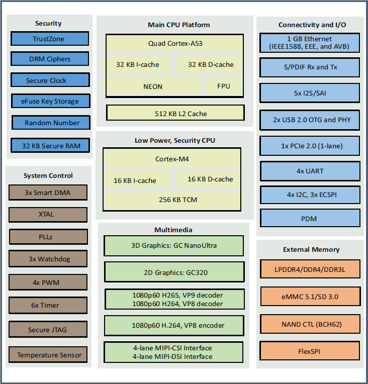
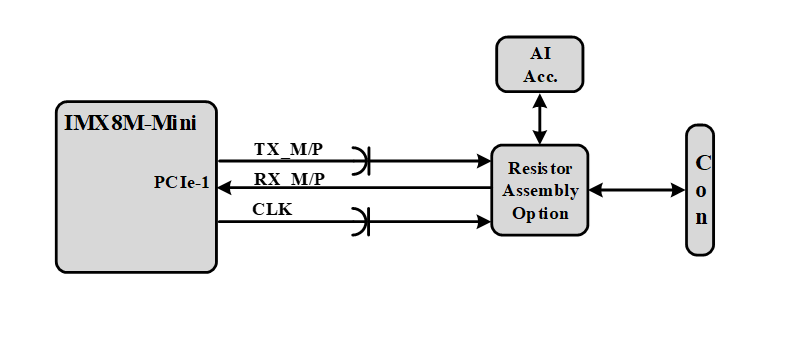
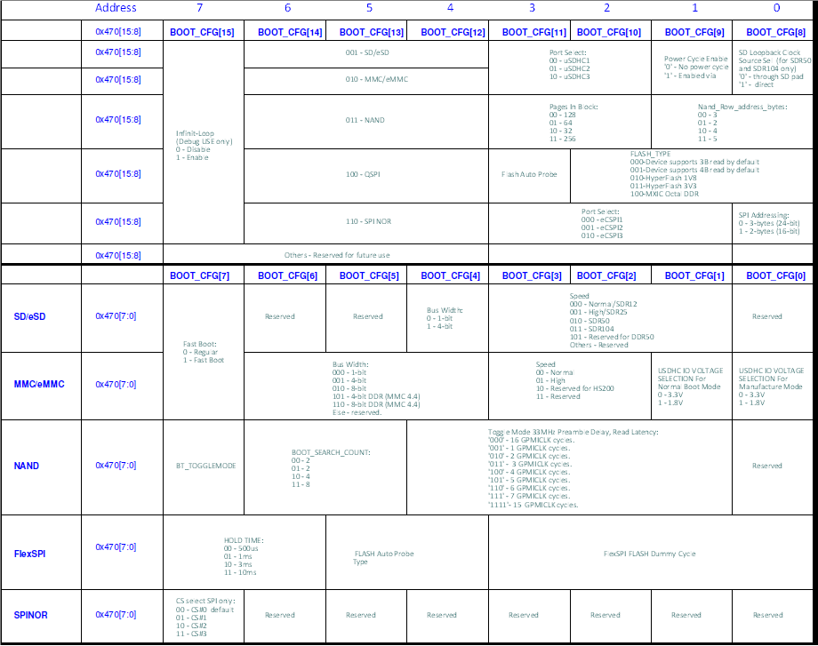

# i.MX8M Mini SOM Hardware User Manual

## Revision and Notes

| **Date** | **Owner** | **Revision** | **Notes** |
| --- | --- | --- | --- |
| 03 Jan 2020 | Noam Weidenfeld | 1.0 |     |
| Table of Contents | - [Revision and Notes](#revision-and-notes) - [Introduction](#introduction)   - [Overview](#overview)   - [Highlighted Features](#highlighted-features)   - [Supporting Products](#supporting-products) - [Description](#description)   - [Block Diagram](#block-diagram)   - [Features Summary](#features-summary) - [Core System Components](#core-system-components)   - [i.MX8M Mini SoC Family](#imx8m-mini-soc-family)     - [Memory](#memory)     - [10/100/1000 MBPS ETHERNET PHY](#10-100-1000-mbps-ethernet-phy)     - [WI-FI (11AC/B/G/N) BT (5.0 BLE)](#wi-fi-11ac-b-g-n-bt-50-ble) - [i.MX8M-Mini External Interfaces](#imx8m-mini-external-interfaces)   - [General](#general)   - [PCIe](#pcie)   - [USB 2.0](#usb-20)   - [MIPI CSI](#mipi-csi)   - [MIPI DSI](#mipi-dsi)   - [Audio](#audio)   - [UART](#uart)   - [eSPI](#espi)   - [I2C](#i2c)   - [uSD](#usd) - [B2B Connector’s Signal Description](#b2b-connectors-signal-description)   - [J5001](#j5001)   - [J7](#j7)   - [J9](#j9) - [Power and Reset](#power-and-reset)   - [Power Architecture](#power-architecture)   - [Reset](#reset) - [i.MX8M-Mini Integration Manual](#imx8m-mini-integration-manual)   - [Power Up Sequence](#power-up-sequence)   - [Booting Options](#booting-options)   - [Fuses Booting](#fuses-booting)   - [Booting from Resistors setting](#booting-from-resistors-setting)   - [I2C Interfaces](#i2c-interfaces)   - [GPIO Interfaces](#gpio-interfaces) - [i.MX8M Mini SOM Debugging Capability](#imx8m-mini-som-debugging-capability) - [i.MX8M-Mini SOM Mechanical Description](#imx8m-mini-som-mechanical-description) - [Documentation](#documentation) - [Related Articles](#related-articles) |     |     |

> [!INFO]
> **Disclaimer**
> No warranty of accuracy is given concerning the contents of the information contained in this publication. To the extent permitted by law no liability (including liability to any person by reason of negligence) will be accepted by SolidRun Ltd., its subsidiaries or employees for any direct or indirect loss or damage caused by omissions from or inaccuracies in this document. SolidRun Ltd. reserves the right to change details in this publication without prior notice. Product and company names herein may be the trademarks of their respective owners.

## Introduction

This User Manual relates to the SolidRun [SOM i.MX8M Mini-series](https://www.solid-run.com/embedded-industrial-iot/nxp-i-mx8-family/imx8m-mini-som/), which includes:

- Single/Dual/Quad core ARM A53 (1.8 GHz) of the i.MX8M Mini SoC.
- A general-purpose Cortex®-M4 400 MHz core processor.

#### Overview

The SolidRun’s SR-SOM-MX8M-Mini is a low power, low cost high performance micro system on module (SOM) based on the highly integrated NXP i.MX8M Mini family of SoCs.

#### Highlighted Features

- Ultra-small footprint SOM (47x30mm) including three board-to-board connectors (250 total pins number).
- NXP i.MX8M-Mini SoC:
  - Up to quad Cortex A53 and up to 1.8GHz
  - 400 MHz Cortex-M4 subsystem processor supports real time tasks.
  - 1080p60 Decoder (H.264/H.265) and Encoder (H.264)
  - Industry-leading audio, voice and video processing for applications
- LPDDR4 (1.5 GHz) memory in x32 configurations supports up to 4GB (Quad version)
- Power management devices
- Gigabit Ethernet interface based on Qualcomm Atheros 8031
- Wi-Fi 802.11a/b/g/n/ac + Bluetooth 5.0 (Murata Type 1MW)
- AI HW accelerator supporting inferencing

#### Supporting Products

The following products are provided from SolidRun both as production level platforms and as reference examples on how to incorporate the SOM in different levels of integration:

- [HummingBoard Pulse & i.MX8M Mini SOM Quick Start Guide](../nxp-imx8-based-products/hummingboard-imx8-sbc-quick-start-guide/hummingboard-pulse-imx8m-mini-som-quick-start-guide.md) – A SBC that incorporates the SOM retains the different Linux distributions while adding extra hardware functionalities and access to the hardware.
- [HummingBoard Pulse & i.MX8M Mini SOM Quick Start Guide](../nxp-imx8-based-products/hummingboard-imx8-sbc-quick-start-guide/hummingboard-ripple-imx8m-mini-som-quick-start-guide.md) –  A low cost SBC computer (Partial assembly of the HummingBoard Pulse) optimized for the i.MX8M-Mini.

## Description

#### Block Diagram

The following figure describes the i.MX8M-mini Blocks Diagram.

#### Features Summary

Following is the features summary of the SOM. Notice that some of the features are pinout multiplexed (please refer to the pin mux table and the NXP i.MX8M [datasheets](https://www.nxp.com/products/processors-and-microcontrollers/arm-processors/i.mx-applications-processors/i.mx-8-processors/i.mx-8m-mini-arm-cortex-a53-cortex-m4-audio-voice-video:i.MX8MMINI?tab=Documentation_Tab)):

- NXP i.MX8M Mini series SoC (Quad/Dual/Single ARM® Cortex™ A53 Processor, up to 1.8 GHz)
- Cortex-M4 subsystem processor.
- AI Accelerator for frames inferencing
- Up to 4GByte LPDDR4 memory
- Eight bits eMMC memory.
- QSPI NOR Flash memory.
- I2C EEPROM.
- 4-lanes MIPI-DSI interface
- 4-lanes MIPI CSI-2 Interface
- 10/100/1000 Mbps Ethernet PHY supporting 1588 standard (PPS output)
- Wi-Fi (11ac/b/g/n) + BT (V5.0 LE)
- Two USB 2.0 Host and OTG
- PCIe interface (PCIe-1 is available only if AI accelerator is not in use).
- Four bits SD interface
- Single eSPI interface.
- Up to three Synchronous Audio Interfaces.
- Up to three Serial interfaces.
- A single 5.0V interface

## Core System Components

### i.MX8M Mini SoC Family

The i.MX8M-Mini processors feature advanced implementation of a quad Arm® Cortex®-A53 core, which operates at speeds of up to 1.8 GHz. A general purpose Cortex®-M4 core processor is for low-power processing. The following figure describes the i.MX8M-Mini main features (For more details refer to NXP’s i.MX8M-Mini [datasheet](https://www.nxp.com/products/processors-and-microcontrollers/arm-processors/i.mx-applications-processors/i.mx-8-processors/i.mx-8m-mini-arm-cortex-a53-cortex-m4-audio-voice-video:i.MX8MMINI?tab=Documentation_Tab)).

#### Memory

The i.MX8M-Mini SOM support varieties of memory interfaces for booting and data storage. The following figure describes the IMX-8M Mini SOM memory interfaces.

**LPDDR4**

- Up to 4GB memory space.
- 32 Bits data bus.
- Up to 3000 MT/s.
- Support various low power modes, clock and power gated operation.
- Support Self-Refresh mode.

**eMMC NAND Flash**

- Up to 64GB memory space.
- 8 Bits data bus.
- Support MMC standard, up to version 5.1.
- Up to 1600 Mbps of data transfer for MMC cards using 8 parallel data lines inSDR mode.
- Up to 3200 Mbps of data transfer for MMC cards using 8 parallel data lines in DDR mode.
- IMX-8 uSDHC-3.
- Can be used as BOOT NVM \*

**Quad Serial NOR Flash (SOM)**

- Each channel can be configured as 1/2/4-bit operation.
- Support both SDR mode and DDR mode
- No reset
- IMX-8 QSPIA/nSS0.
- Can be used as BOOT NVM \*

**EEPROM (SOM)**

- 1Kb EEPROM
- ON-Semi’s CAT24AA01TDI or compatible
- i.MX8M-Mini I2C1
- Address 0X50 (7 bits format)
- Stores SOM’s configurations.

**Micro-SD (Carrier)**

- Optional on Carrier board
- IMX-8 uSDHC-2.
- Implements 4 data bits.
- Support SD/SDIO standard, up to version 3.0.
- Up to 400 Mbps of data transfer in SDR mode and up to 800 Mbps of data transfer in DDR mode using 4 parallel data lines.
- Can be used as BOOT NVM \*

**Serial NOR Flash (Carrier)**

- Optional on Carrier board
- 1 bits data bus.
- i.MX8M-Mini eSPI2/nSS0
- Can be used as BOOT NVM \*

> [!INFO]
> (\*) All boot configuration signals are available on the SOM connector.

#### 10/100/1000 MBPS ETHERNET PHY

The Ethernet PHY is based on the Qualcomm / Atheros AR8031. The following figure describes the Gigabit Ethernet interface.

- i.MX8M-Mini RGMII interface.
- IEEE 802.3 Ethernet interface for 1000BASE-T, 100BASE-TX, and 10BASE-Te.
- Atheros AR8031 PHY.
- Supports 1588 (PPS signal).
- 25M clock supports Synchronous Ethernet.

#### WI-FI (11AC/B/G/N) BT (5.0 BLE)

The following figure describes the WI-FI and BT support in the i.MX8M-Mini SOM.

The WI-FI & BT module is Murata’s 1MW module Based on Cypress CYW43455 chip. The WI-FI main features are:

- Operate at ISM frequency Band (2.4/ 5 GHz)
- IEEE Standards Support 802.11ac, 802.11a, 802.11b, 802.11g and 802.11n
- i.MX8M-mini SDIO-1 interface
- BT 5.0 BR/EDR/LE
- i.MX8M-Mini UART-1 Interface
- Global certification

## i.MX8M-Mini External Interfaces

#### General

The SOM incorporates three Hirose DF40 board-to-board headers. The selection of the Hirose DF40 is due to the following criteria:

- Miniature (0.4m pitch)
- Highly reliable manufacturer
- Availability (worldwide distribution channels)
- Excellent signal integrity (supports 6Gbps)
- Mating height of between 1.5mm to 4.0mm (1.5mm to 3.0mm if using 70-pin Board-to-Board header). i.MX8M-Mini headers are fixed, the final mating height is determined by carrier implementation.

#### PCIe

The i.MX8M-Mini SOM supports a single PCIe interfaces. The following figure describes the PCIe interfaces.

The PCIe main features are:

- On board coupling capacitors for TX and CLK.
- PCIe clock is generated on the i.MX8M-Mini SoC.
- PCIe lane can be used by the AI accelerator chip on the SOM or other module on the carrier. It is an assembly option.
- PCI Express Base Specification 4.0 compliance.
- 5Gb/s, 5.0Gb/s, 8.0Gb/s and 16Gb/s Serializer/Deserializer.
- PHY Interface for the PCI Express Architecture, Version 4.2 compliance.
- Supports Spread Spectrum Clocking in Transmitter and Receiver.

#### USB 2.0

The i.MX8M-Mini supports two USB 2.0 interfaces. The following figure describes the USB interfaces.

The USB main features are:

- USB1 and USB2 are directly connected to the connectors (No HUB).
- Complies with USB specification rev 2.0.
- High-Speed/Full-Speed/Low-Speed OTG core.
- Supports 480-Mbps high-speed, 12-Mbps full-speed, and 1.5-Mbps low-speed (Host mode only) data transmission rates.
- Power control signal are not part of the USB module, any available GPIO can be used.

#### MIPI CSI

The following figure describes the CSI interface.

- MIPI D-PHY specification V1.2.
- Compliant to MIPI CSI2 Specification V1.3 except for C-PHY feature.
- Scalable data lane support, 1 to 4 Data Lanes.
- Virtual Channel support.

#### MIPI DSI

The following figure described the DSI interface.

The DSI main features are:

- Complies to MIPI DSI Standard Specification V1.01r11.
- Maximum resolution ranges up to WQHD (1920x1080p60, 24bpp).
- Supports 1, 2, 3, or 4 data lanes.
- Complies with Protocol-to-PHY Interface (PPI) in 1.0Gbps / 1.5Gbps MIPI DPHY.
- Supports RGB Interface for Video Image Input from general display controller.
- Virtual Channel support.

#### Audio

The i.MX8M-Mini SOM supports up to three Audio channels, SAI1, SAI2 and SAI3. The following figure describes the audio interface.

The Audio main features are:

- SAI1 supports 8TX and 8 RX channels.
- SAI2 and SAI3 supports RX and TX.
- SAI5 support 4 RX channels that can be used for digital Mic.
- SPDIF In/Out.
- Transmitter with independent bit clock and frame sync supporting 1 data line.
- Receiver with independent bit clock and frame sync supporting 1 data line.
- Each data line can support a maximum Frame size of 32 words.

For more details check the i.MX8M-Mini [datasheet](https://www.nxp.com/products/processors-and-microcontrollers/arm-processors/i.mx-applications-processors/i.mx-8-processors/i.mx-8m-mini-arm-cortex-a53-cortex-m4-audio-voice-video:i.MX8MMINI?tab=Documentation_Tab) and AN.

> [!CAUTION]
> SAI1 signals are used as boot configuration during POR.

#### UART

The i.MX8M-Mini SOM can support up to 4 UART interfaces. The following figure describes the UART interfaces.

The UART interfaces main features are:

- UART 1 supports TX, RX, CTS and RTS. It can support one of the following:
  - WI-FI modem on SOM
  - UART signals on SOM connector.
- UART 2 supports TX, RX, CTS and RTS.
- UART 3 Supports TX, RX, CTS and RTS.
- UART 4 support TX, RX, CTS and RTS.
  - UART 4 shares signal with ECSPI.
  - UART 4 can use UART 2 CTS/RTS signals lines for 2 wire configuration.
- High-speed TIA/EIA-232-F compatible, up to Mbit/s.
- 9-bit or Multidrop mode (RS-485) support (automatic slave address detection).
- 7 or 8 data bits for RS-232 characters, or 9 bit RS-485 format.
- Hardware flow control support for request to send (RTS\_B) and clear to send (CTS\_B) signals.
- RS-485 driver direction control via CTS\_B signal.
- Auto baud rate detection (up to 115.2 Kbit/s).
- DCE/DTE capability.

For more information check the i.MX8M-Mini [datasheet](https://www.nxp.com/products/processors-and-microcontrollers/arm-processors/i.mx-applications-processors/i.mx-8-processors/i.mx-8m-mini-arm-cortex-a53-cortex-m4-audio-voice-video:i.MX8MMINI?tab=Documentation_Tab).

#### eSPI

The i.MX8M-Mini SOM supports an eSPI interface. The following figure describes the eSPI interface.

- i.MX8M-Mini’s eSPI channel 2.
- Single chip select nSS0.
- Master/Slave configurable.
- Polarity and phase of the Chip Select (SS) and SPI Clock (SCLK) are configurable.

> [!WARNING]
> eSPI Shares signals with UART-4.

#### I2C

The IMX-8M Mini supports up to four I2c Interfaces. The following figure describes the I2C interfaces.  

The I2C main features are:

- I2C-1 is used only on the SOM. It is connected to the SOM EEPROM and PMIC.
- I2C-2, I2C-3 and I2C4 are available on the connector by default.
- Multi-master operation.
- In Standard mode, I2C supports the data transfer rates up to 100 kbits/s.
- In Fast mode, data transfer rates up to 400 kbits/s can be achieved.

For more details check the i.MX8M-Mini [datasheet](https://www.nxp.com/products/processors-and-microcontrollers/arm-processors/i.mx-applications-processors/i.mx-8-processors/i.mx-8m-mini-arm-cortex-a53-cortex-m4-audio-voice-video:i.MX8MMINI?tab=Documentation_Tab).

#### uSD

The uSD supports the following features:

- IMXM8-Mini uSDHC-2.
- Implements 4 data bits.
- Support SD/SDIO standard, up to version 3.0.
- Up to 400 Mbps of data transfer in SDR mode and up to 800 Mbps of data transfer in DDR mode using 4 parallel data lines.
- 8V or 3.3V support is supported in SOM.

## B2B Connector’s Signal Description

#### J5001

#### J7

#### J9

## Power and Reset

#### Power Architecture

The i.MX8M-Mini power is a single 5V source. It uses ROHM’s PMIC to source all the i.MX8M-Mini power rails. The following figure describes the i.MX-8M Mini power architecture.  

The power architecture main features are:

- Single 5V power source.
- ROHM’s BD71847 source the i.MX8M-Mini power rails.
- SNVS\_3V3 can’t be power by a battery (No separate input).
- 3V output up to 2A (Need to calculate system and SOM power).
- Power up sequence is supported by the PMIC configuration.

#### Reset

The i.MX8M-Mini POR signal is activated by the PMIC output.

A reset can be triggered by an external reset signal (Switch) or the internal Watchdog. There is a pull-up on the SOM.

## i.MX8M-Mini Integration Manual

#### Power Up Sequence

The i.MX8M-Mini is sourced by a single 5V input. All power sequences are supported by the PMIC.  
When using the SOM 3.3V output there is no need to consider its power sequence. If an external power source is used, it needs to be power according to the power sequence rules. (See i.MX8M-Mini [datasheet](https://www.nxp.com/products/processors-and-microcontrollers/arm-processors/i.mx-applications-processors/i.mx-8-processors/i.mx-8m-mini-arm-cortex-a53-cortex-m4-audio-voice-video:i.MX8MMINI?tab=Documentation_Tab) for details)

#### Booting Options

#### Fuses Booting

The i.MX8M-Mini can boot from its internal fuses map. Booting from the fuses is enabled when the BOOT\_MODE\[1..0\] is set to “00”.

#### Booting from Resistors setting

The i.MX8M-Mini SOM can boot from different NVM according to an external resistors configuration. The boot from the resistors configuration BOOT\_MODE\[1..0\] is set to “10”.

The available booting NVM are:

- eMMC on uSDH3.
- uSD card on uSDH2.
- QSPI on QSPIA.

The booting signals are SAI1RXD\[0..7\] and SAI1TXD\[0..7\]. The following table describes the booting signals and its status during and after POR.

The following table describes how the booting signals need to be set to support the different booting options.

> [!WARNING]
> **Please note**
> - NAND booting is not an option on the i.MX8M-mini SOM.
> - SPI NOR is an option on the carrier board (Not on the SOM).
> - The configuration signals can be used as I/O or Audio interfaces after POR. Make sure that during POR it keep the booting requirements.

#### I2C Interfaces

The i.MX8M-Mini SOM uses I2C1 interface for its internal configurations. The following table describes the address mapping.

|     |     |     |     |     |     |     |     |     |     |     |     |     |
| --- | --- | --- | --- | --- | --- | --- | --- | --- | --- | --- | --- | --- |
| **Ref.** | **Chip** | **I2C Port** | **Address A** |     |     |     |     |     |     |     | **Port** | **Description** |
| **U15** | **PMIC** | **1** | **1** | **0** | **0** | **1** | **0** | **1** | **1** | **RW** | **4BH** | **ROHM PMIC** |
| **U17** | **EEPROM** | **1** | **1** | **0** | **1** | **0** | **0** | **0** | **0** | **RW** | **50H** | **EEPROM** |

#### GPIO Interfaces

The i.MX8M-Mini SoC uses some GPIO signals for its internal controls. The following table describes the GPIO allocation.

|     |     |     |     |
| --- | --- | --- | --- |
| **Signal** | **I/O** | **Description** | **Remarks** |
| AI\_RSTN | GPIO1.IO\[15\] | Reset the AI accelerator | Active Low |
| ENET\_nRST | GPIO4.IO\[22\] | Reset the Ethernet | Active High |
| ENET\_WoL | GPIO1.IO\[11\] | Ethernet Wake-Up signal | Active Low |
| ENET\_nINT | GPIO1.IO\[10\] | Ethernet interrupt | Active Low |
| REF\_CLK\_32K | GPIO1.IO\[00\] | 32K clock for the WI-FI module |     |
| WL\_WAKE\_HOST | GPIO2.IO\[9\] | Wake Host on LAN | Active Low |
| WL\_REG\_ON | GPIO2.IO\[10\] | Enable the WLAN | Active High |
| BT\_REG\_ON | GPIO2.IO\[6\] | Enable the BT | Active High |
| BT\_WAKE\_HOST | GPIO2.IO\[8\] | Bluetooth HOST\_WAK | Active High |
| BT\_WAKE\_DEV | GPIO2.IO\[7\] | Bluetooth DEV\_WAKE | Active High |

## i.MX8M Mini SOM Debugging Capability

The i.MX8M Mini SOM supports two main debugging interfaces:

- UART interface
- JTAG interface

The UART interface is a null modem interface that is internally pulled up and support using UART2 TX/RX signals.

he UART interface is optional to use and mentioned here since most of the software infrastructure used in HummingBoard Pulse uses those two signals for debugging.

JTAG interface is on the i.MX8M-Mini SOM and is exposed as test pins on print side. Following is a snapshot of the test points and its connectivity traces:

TP-1 -> JTAG\_nTRST.  TP-2 -> JTAG\_TDI. TP-3 -> JTAG\_TMS.

TP-4 -> JTAG\_TCK. TP-5 -> JTAG\_TDO.

## i.MX8M-Mini SOM Mechanical Description

Following is a diagram of the Bottom VIEW of the SR-SOM-MX8M-Mini.

Note the following details:

- The carrier board must use the same footprint as in the above mechanical footprint.  
Since this is a TOP VIEW of the print side of the SR-SOM-MX8-Mini, the diagram above describes the dimensions and placement of the board-to-board headers, mechanical holes and boundaries of the SR-SOM-MX8-Mini, as-is.
- J9 is the main board-to-board header (bottom side in the diagram).
- J7 is the second board-to-board header (upper side in the diagram).
- J5001 is the third board-to-board header (right side in the diagram).
- In case 1.5mm mating height was chosen, then the SR-SOM-MX8-Mini requirement would be that all area beneath it on the carrier will be all dedicated ONLY for the board-to-board connectivity; no other components are allowed.  
In case higher mating is chosen, then 1.5mm should be reserved for the SR-SOM-MX8-Mini. For instance, if 3.5mm mating height is chosen, then 1.5mm is dedicated to the SR-SOM-MX8\_Mini print side components and the remaining 2mm for the carrier components underneath the SR-SOM-MX8-Mini.

Refer to SolidRun HummingBoard design and layout, where there are examples of the main and second 80 pin header board-to-board usage.

## Documentation

      

|     | File | Modified |
| --- | --- | --- |
| Labels  - No labels - [Edit Labels](#section-fd9ef74b-a7ca-4772-a5b9-220fb5fe9507)  [Preview] [View](/wiki/download/attachments/197493788/sr-imx8m-carrierboard-heatsink-rev1.0.zip?version=1) [Properties](/wiki/pages/editattachment.action?pageId=197493788&fileName=sr-imx8m-carrierboard-heatsink-rev1.0.zip&isFromPageView=true) [Delete](/wiki/pages/confirmattachmentremoval.action?pageId=197493788&fileName=sr-imx8m-carrierboard-heatsink-rev1.0.zip) | ZIP Archive [sr-imx8m-carrierboard-heatsink-rev1.0.zip](/wiki/download/attachments/197493788/sr-imx8m-carrierboard-heatsink-rev1.0.zip?api=v2) | Nov 07, 2021 by [SolidRun](/wiki/people/557058:12be2ae4-3a6e-40cc-a677-bdfc4c987d1f) |
| Labels  - No labels - [Edit Labels](#section-61355f84-b7fc-4caa-84a3-ff22d331b0b6)  [Preview] [View](/wiki/download/attachments/197493788/i.MX8M+Mini+SOM+-+Documentation+Board+%26+Assembly+Models.rar?version=1) [Properties](/wiki/pages/editattachment.action?pageId=197493788&fileName=i.MX8M+Mini+SOM+-+Documentation+Board+%26+Assembly+Models.rar&isFromPageView=true) [Delete](/wiki/pages/confirmattachmentremoval.action?pageId=197493788&fileName=i.MX8M+Mini+SOM+-+Documentation+Board+%26+Assembly+Models.rar) | File [i.MX8M Mini SOM - Documentation Board & Assembly Models.rar](/wiki/download/attachments/197493788/i.MX8M%20Mini%20SOM%20-%20Documentation%20Board%20%26%20Assembly%20Models.rar?api=v2) | Nov 07, 2021 by [SolidRun](/wiki/people/557058:12be2ae4-3a6e-40cc-a677-bdfc4c987d1f) |
| Labels  - No labels - [Edit Labels](#section-ad245f35-5808-4bd3-8915-208e5b35ecd5)  [Preview] [View](/wiki/download/attachments/197493788/imx8m-mini-simplified-schematics-r1.2.pdf?version=1) [Properties](/wiki/pages/editattachment.action?pageId=197493788&fileName=imx8m-mini-simplified-schematics-r1.2.pdf&isFromPageView=true) [Delete](/wiki/pages/confirmattachmentremoval.action?pageId=197493788&fileName=imx8m-mini-simplified-schematics-r1.2.pdf) | PDF File [imx8m-mini-simplified-schematics-r1.2.pdf](/wiki/download/attachments/197493788/imx8m-mini-simplified-schematics-r1.2.pdf?api=v2) | Nov 07, 2021 by [SolidRun](/wiki/people/557058:12be2ae4-3a6e-40cc-a677-bdfc4c987d1f) |
| Labels  - No labels - [Edit Labels](#section-46197cc6-2704-409f-bfe6-103dcca7c28d)  [Preview] [View](/wiki/download/attachments/197493788/Reliability+prediction+for+MX8M+Mini+V1.pdf?version=1) [Properties](/wiki/pages/editattachment.action?pageId=197493788&fileName=Reliability+prediction+for+MX8M+Mini+V1.pdf&isFromPageView=true) [Delete](/wiki/pages/confirmattachmentremoval.action?pageId=197493788&fileName=Reliability+prediction+for+MX8M+Mini+V1.pdf) | PDF File [Reliability prediction for MX8M Mini V1.pdf](/wiki/download/attachments/197493788/Reliability%20prediction%20for%20MX8M%20Mini%20V1.pdf?api=v2) | Apr 14, 2022 by [SolidRun](/wiki/people/557058:12be2ae4-3a6e-40cc-a677-bdfc4c987d1f) |

[Download All](/wiki/download/all_attachments?pageId=197493788)

[Buy a Sample Now](https://shop.solid-run.com/?filter_som-com-family=nxp-i-mx8m-mini&_ga=2.160415294.2016484779.1641802897-2012112798.1622706355)

## Related Articles

Error rendering macro 'contentbylabel' : CQL was parsed but the search manager was unable to execute the search. Error message: com.atlassian.confluence.api.service.exceptions.scale.SSStatusCodeException: There was an illegal request passed to XP-Search Aggregator API : HTTP/1.1 403 Forbidden