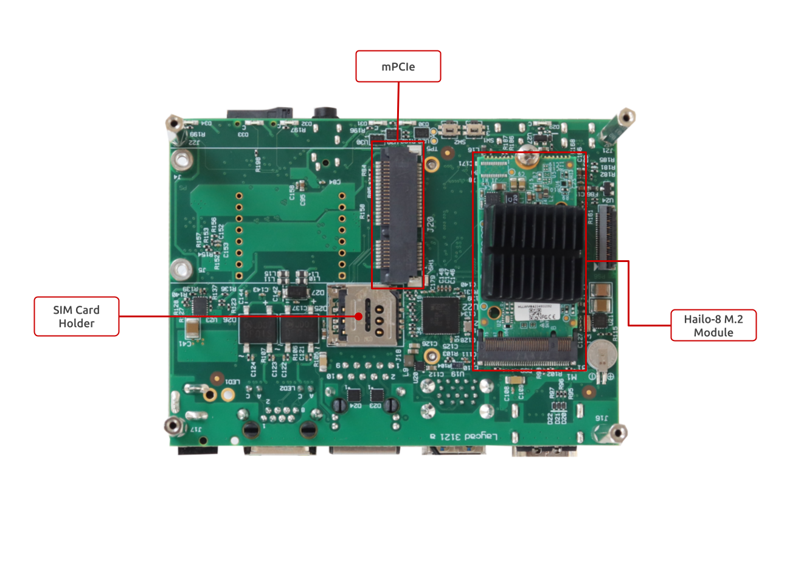

# Getting started with HUMMINGBOARD 8P EDGE AI

## Getting started with HUMMINGBOARD 8P EDGE AI

## Introduction

This guide contains tips and resources for a quick start with IMX8MP HummingBoard Pro and [Hailo-8 AI accelerator](https://hailo.ai/products/hailo-8-m2-module/).

## Revision and Notes

| **Date**          | **Owner**                                                                                                                                                                                                                                                                                                                                                                                                                                                                                                                                                                                                                                                                                                                                                                                                                                                                                                                                                                                                                                                                                                                                                                                        | **Revision** | **Notes**                                  |
| ----------------- | ------------------------------------------------------------------------------------------------------------------------------------------------------------------------------------------------------------------------------------------------------------------------------------------------------------------------------------------------------------------------------------------------------------------------------------------------------------------------------------------------------------------------------------------------------------------------------------------------------------------------------------------------------------------------------------------------------------------------------------------------------------------------------------------------------------------------------------------------------------------------------------------------------------------------------------------------------------------------------------------------------------------------------------------------------------------------------------------------------------------------------------------------------------------------------------------------ | ------------ | ------------------------------------------ |
| 07 Aug 2023       | Mikhail Anikin                                                                                                                                                                                                                                                                                                                                                                                                                                                                                                                                                                                                                                                                                                                                                                                                                                                                                                                                                                                                                                                                                                                                                                                   | 1            | Initial release                            |
| 27 Jul 2025       | Josua Mayer                                                                                                                                                                                                                                                                                                                                                                                                                                                                                                                                                                                                                                                                                                                                                                                                                                                                                                                                                                                                                                                                                                                                                                                      | 2            | Fix boot select switch setting for microSD |
| Table of Contents | <p>- <a href="getting-started-with-hummingboard-8p-edge-ai.md#introduction">Introduction</a><br>- <a href="getting-started-with-hummingboard-8p-edge-ai.md#revision-and-notes">Revision and Notes</a><br>- <a href="getting-started-with-hummingboard-8p-edge-ai.md#setup">Setup</a><br>- <a href="getting-started-with-hummingboard-8p-edge-ai.md#cable-setup-and-prerequisites">Cable setup and prerequisites</a><br>- <a href="getting-started-with-hummingboard-8p-edge-ai.md#preparing-a-boot-sd-card">Preparing a boot SD card</a><br>- <a href="getting-started-with-hummingboard-8p-edge-ai.md#boot-select">Boot Select</a><br>- <a href="getting-started-with-hummingboard-8p-edge-ai.md#booting-from-sd-card">Booting from SD card</a><br>- <a href="getting-started-with-hummingboard-8p-edge-ai.md#preparing-the-board">Preparing the board</a><br>- <a href="getting-started-with-hummingboard-8p-edge-ai.md#boot">Boot</a><br>- <a href="getting-started-with-hummingboard-8p-edge-ai.md#launching-demo-applications">Launching demo applications</a><br>- <a href="getting-started-with-hummingboard-8p-edge-ai.md#additional-autostart-demos">Additional autostart demos</a></p> |              |                                            |

## Setup

### Cable setup and prerequisites

Here is what you will need to power up and use the board:

* Linux or Windows PC
* HummingBoard Pro with IMX.8MP SOM and Hailo-8 M.2 B+M module (hummingBoard 8P EDGE AI kit)
* 12V Power adapter (HummingBoard Pro has wide range input of 7V-28V), alternatively you can use a PoE injector to power the device.
* Micro USB to USB cable.
* HDMI Cable and monitor
* MicroSD Card

### Preparing a boot SD card

To start the IMX.8 HummingBoard Pro with Hailo-8, [download the prebuilt demo image](https://images.solid-run.com/IMX8/meta-solidrun-arm-imx8/kirkstone-lf-5.15.71-2.2.2) or [build the demo image from the sources](https://github.com/SolidRun/meta-solidrun-arm-imx8/tree/kirkstone-imx8m).

**Writing the image to the SD card**

Use the following commands for writing the image to an SD card:

```
zstd -k -d imx-hailo-demo-image-imx8mpsolidrun.wic.zst
sudo dd if=imx-hailo-demo-image-imx8mpsolidrun.wic of=/dev/sdX bs=1M
```

* For more information, please visit [Flashing an SD Card](https://solidrun.atlassian.net/wiki/spaces/developer/pages/288129025).

> \[!NOTE] Note: Plug a micro SD into your Linux PC, the following assumes that the micro SD is added as /dev/sdX and all its partitions are unmounted.

### Boot Select

Before powering up the board for the first time it is recommended to select the boot media. On first use microSD is recommended source, configure dip switch S3 as follows:

| **Function/Switch** | **1** | **2** | **3** | **4** | **5** | **6** |
| ------------------- | ----- | ----- | ----- | ----- | ----- | ----- |
| microSD             | ON    | ON    | X     | X     | X     | X     |

“X” means don’t care, leave as is.

For additional options, please refer to [i.MX8M Series HummingBoard Boot Select](https://solidrun.atlassian.net/wiki/spaces/developer/pages/287343073) page.

### Booting from SD card

The following shows how to set the switches on the boot source selector:

.png>)

> \[!INFO] Note: The black rectangle represents the switch position.

Once you set the switches, you can apply the following for booting from an SD card.

### Preparing the board

Ensure the Hailo-8 M.2 module with a heatsink is installed into the M.2 connector on the bottom of the board.

* Connect an HDMI and micro USB cable.
* Insert an SD card into the board.
* \[optional] Connect the MIPI camera to the MIPI interface.




## Boot

Please refer to [Serial Connection](https://solidrun.atlassian.net/wiki/spaces/developer/pages/287801409) for installing the necessary serial connection software in Linux/Windows. You are ready to boot the board once you have installed the required serial connection software. Plug the DC power supply. The board will start booting, and you will see the boot log in your terminal.

```
[  OK  ] Started User Database Manager.                                                                                        
[  OK  ] Created slice User Slice of UID 0.                                                                                    
         Starting User Runtime Directory /run/user/0...                                                                        
[  OK  ] Finished User Runtime Directory /run/user/0.                                                                          
         Starting User Manager for UID 0...                                                                                    
[  OK  ] Started User Manager for UID 0.                                                                                       
[  OK  ] Started Session c1 of User root.                                                                                      
[  OK  ] Started Weston, a Wayland …mpositor, as a system service.                                                             
[  OK  ] Reached target Graphical Interface.                                                                                   
         Starting Record Runlevel Change in UTMP...                                                                            
[  OK  ] Finished Record Runlevel Change in UTMP.                                                                              
                                                                                                                               
NXP i.MX Release Distro 5.15-kirkstone imx8mpsolidrun ttymxc1                                                                  
                                                                                                                               
imx8mpsolidrun login: 

```

The default user is **root**.

Also, you will see a Weston desktop environment on the monitor screen:


## Launching demo applications

By default, there are three demo applications included in the imx-hailo-demo-image.

* detection
* license\_plate\_recognition
* multistream\_detection

The **detection** demo takes the video source from the v4l video device, and you need a camera connected to the device to run this demo.

Usually, the MIPI camera is represented as /dev/video2 device in Linux.

To run this demo:

```
./apps/detection/detection.sh -i /dev/video2
```

The **license\_plate\_recognition** demo uses prerecorded video for detecting car license plates.

To run this demo:

```
./apps/license_plate_recognition/license_plate_recognition.sh
```


The **multistream\_detection** demo uses prerecorded videos. To run this demo:

```
./apps/multistream_detection/multi_stream_detection.sh
```

For more demo applications, please refer to the [Hailo Tappas repo](https://github.com/hailo-ai/tappas/).

For more info about the hailo devices, libraries, and network training, please refer to the [Hailo Developer Zone](https://hailo.ai/developer-zone/).

## Additional autostart demos

It is possible to include additional demos into the image that will be running at the start.

To enable additional demos, add the following line to your local.conf

```
CORE_IMAGE_EXTRA_INSTALL += "hailo-detection-demo"
```

By default, the service starts the general detection demo.

To change it, add the following line to your local.conf

```
HAILO_DEMO_APP = "lpr_loop.sh"
```

Available demos:

* general\_detection.sh - Live stream from MIPI-CSI camera with general object detection.
* lpr\_loop.sh - Looped license plate recognition demo.
* multistream\_detection.sh - Live stream from two MIPI-CSI cameras with general object detection.

> \[!INFO] Note: these demos are tested only with imx-hailo-demo-image.
