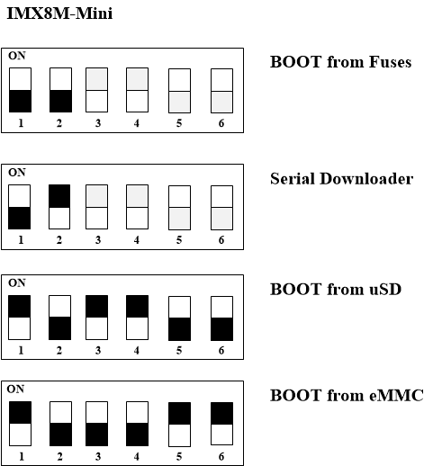
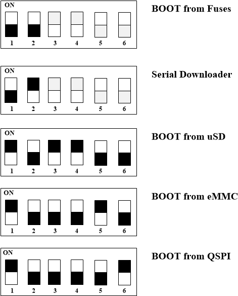

# HummingBoard Pulse/Ripple/Mate and Pro Boot Select

## HummingBoard Pulse/Ripple/Mate and Pro Boot Select

Before powering up a board for the first time it is recommended to select specific boot media. In order to configure the boot media to please reference one of below diagrams according to which SoM is used:

## i.MX8M Plus SoM

> \[!INFO] **The black rectangle represents the switch position.**

## i.MX8M Mini SoM

> \[!INFO] **The black rectangle represents the switch position.**

## i.MX8M SoM

This is the original i.MX8M SoM, the first in SolidRun i.MX8 family.

### Carrier Revision 2.3 and later:

Please note , after HummingBoard Pulse/Ripple revision 2.3 and up the dip switch has been changed and the following description applies.

> \[!INFO] **The black rectangle represents the switch position.**

### Carrier Revision 2.2 and earlier:

> \[!INFO] **The black rectangle represents the switch position.**
