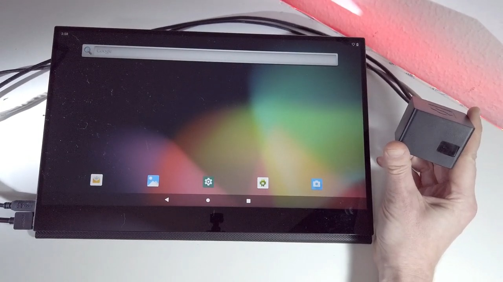

# Cubox-M Android

## Introduction

The main intention of this repository is to provide a guide for running Android on Cubox-M .

## SD Card Preparation

**1. Downloading the Debian image**

Download the Debian image by running the following command on your Linux/Windows PC:

```
wget https://solid-run-images.sos-de-fra-1.exo.io/IMX8/Android/android_10_cubox-m.img.xz
```

**2. Writing the image to the SD card**

Use the following commands for writing the image to an SD card:

```
xz -dc android_10_cubox-m.img.xz | dd of=/dev/sdX bs=4M conv=fsync
```

* For more Debian releases, please visit [Debian Release](https://images.solid-run.com/IMX8/Android)
* For an Android Demo video you can refer to : [SolidRun Cubox-M – Android Demo Video](https://www.youtube.com/watch?v=frZKMvDxdvs\&t=7s)

The following is an implementation of the android screen:


