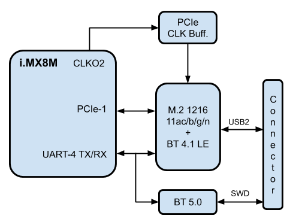
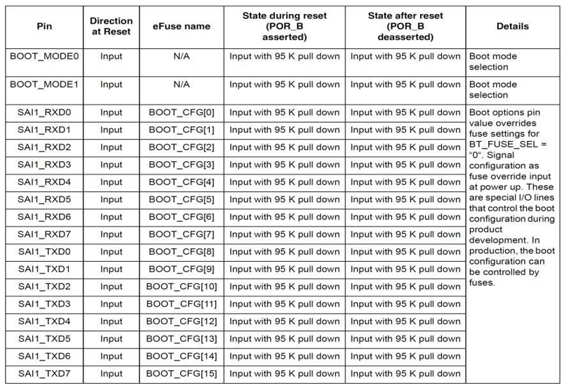
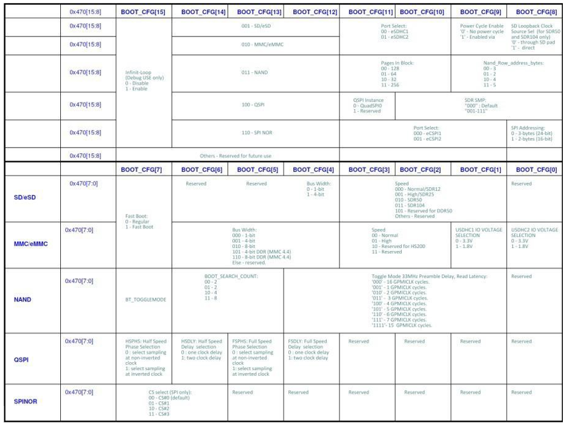

# i.MX8M SOM Hardware User Manual

## Revision and Notes

| **Date**          | **Owner**                                                                                                                                                                                                                                                                                                                                                                                                                                                                                                                                                                                                                                                                                                                                                                                                                                                                                                                                                                                                                                                                                                                                                                                                                                                                                                                                                                                                                                                                                                                                                                                                                                                                                                                                                                                                                                                                                                                                                                                                                                                                                                                                                                                                                                                                                                                                                                                                                                                                                                                                                                                                                                                                                                                                                                                                                                                                                                                                                                                                                                                                                                                                                                                                                                                                                                                                                                                                                                                                                                                                                                                                                                                                                                                                                                                                                                                                                                                                                                                                                                                                                                                                                                                                                                                                                                                                                                                                                                                                                                                                                                                        | **Revision** | **Notes**       |
| ----------------- | ------------------------------------------------------------------------------------------------------------------------------------------------------------------------------------------------------------------------------------------------------------------------------------------------------------------------------------------------------------------------------------------------------------------------------------------------------------------------------------------------------------------------------------------------------------------------------------------------------------------------------------------------------------------------------------------------------------------------------------------------------------------------------------------------------------------------------------------------------------------------------------------------------------------------------------------------------------------------------------------------------------------------------------------------------------------------------------------------------------------------------------------------------------------------------------------------------------------------------------------------------------------------------------------------------------------------------------------------------------------------------------------------------------------------------------------------------------------------------------------------------------------------------------------------------------------------------------------------------------------------------------------------------------------------------------------------------------------------------------------------------------------------------------------------------------------------------------------------------------------------------------------------------------------------------------------------------------------------------------------------------------------------------------------------------------------------------------------------------------------------------------------------------------------------------------------------------------------------------------------------------------------------------------------------------------------------------------------------------------------------------------------------------------------------------------------------------------------------------------------------------------------------------------------------------------------------------------------------------------------------------------------------------------------------------------------------------------------------------------------------------------------------------------------------------------------------------------------------------------------------------------------------------------------------------------------------------------------------------------------------------------------------------------------------------------------------------------------------------------------------------------------------------------------------------------------------------------------------------------------------------------------------------------------------------------------------------------------------------------------------------------------------------------------------------------------------------------------------------------------------------------------------------------------------------------------------------------------------------------------------------------------------------------------------------------------------------------------------------------------------------------------------------------------------------------------------------------------------------------------------------------------------------------------------------------------------------------------------------------------------------------------------------------------------------------------------------------------------------------------------------------------------------------------------------------------------------------------------------------------------------------------------------------------------------------------------------------------------------------------------------------------------------------------------------------------------------------------------------------------------------------------------------------------------------------------------------------------------ | ------------ | --------------- |
| 18 Feb 2018       | Noam Weidenfeld                                                                                                                                                                                                                                                                                                                                                                                                                                                                                                                                                                                                                                                                                                                                                                                                                                                                                                                                                                                                                                                                                                                                                                                                                                                                                                                                                                                                                                                                                                                                                                                                                                                                                                                                                                                                                                                                                                                                                                                                                                                                                                                                                                                                                                                                                                                                                                                                                                                                                                                                                                                                                                                                                                                                                                                                                                                                                                                                                                                                                                                                                                                                                                                                                                                                                                                                                                                                                                                                                                                                                                                                                                                                                                                                                                                                                                                                                                                                                                                                                                                                                                                                                                                                                                                                                                                                                                                                                                                                                                                                                                                  | 1.0          | Initial release |
| 01 Aug 2019       | Noam Weidenfeld                                                                                                                                                                                                                                                                                                                                                                                                                                                                                                                                                                                                                                                                                                                                                                                                                                                                                                                                                                                                                                                                                                                                                                                                                                                                                                                                                                                                                                                                                                                                                                                                                                                                                                                                                                                                                                                                                                                                                                                                                                                                                                                                                                                                                                                                                                                                                                                                                                                                                                                                                                                                                                                                                                                                                                                                                                                                                                                                                                                                                                                                                                                                                                                                                                                                                                                                                                                                                                                                                                                                                                                                                                                                                                                                                                                                                                                                                                                                                                                                                                                                                                                                                                                                                                                                                                                                                                                                                                                                                                                                                                                  | 1.1          | Revision update |
| Table of Contents | 
- <a href="imx8m-som-hardware-user-manual.md#revision-and-notes">Revision and Notes</a> - <a href="imx8m-som-hardware-user-manual.md#introduction">Introduction</a> - <a href="imx8m-som-hardware-user-manual.md#overview">Overview</a> - <a href="imx8m-som-hardware-user-manual.md#highlighted-features">Highlighted Features</a> - <a href="imx8m-som-hardware-user-manual.md#supporting-products">Supporting Products</a> - <a href="imx8m-som-hardware-user-manual.md#description">Description</a> - <a href="imx8m-som-hardware-user-manual.md#block-diagram">Block Diagram</a> - <a href="imx8m-som-hardware-user-manual.md#feature-summary">Feature Summary</a> - <a href="imx8m-som-hardware-user-manual.md#core-system-components">Core System Components</a> - <a href="imx8m-som-hardware-user-manual.md#imx8-soc-family">i.MX8 SoC Family</a> - <a href="imx8m-som-hardware-user-manual.md#memory">Memory</a> - <a href="imx8m-som-hardware-user-manual.md#lpddr4">LPDDR4</a> - <a href="imx8m-som-hardware-user-manual.md#emmc-nand-flash">eMMC NAND Flash</a> - <a href="imx8m-som-hardware-user-manual.md#quad-serial-nor-flash-som">Quad Serial NOR Flash (SOM)</a> - <a href="imx8m-som-hardware-user-manual.md#eeprom-som">EEPROM (SOM)</a> - <a href="imx8m-som-hardware-user-manual.md#micro-sd-carrier">Micro-SD (Carrier)</a> - <a href="imx8m-som-hardware-user-manual.md#serial-nor-flash-carrier">Serial NOR Flash (Carrier)</a> - <a href="imx8m-som-hardware-user-manual.md#10-100-1000-mbps-ethernet-phy">10/100/1000 MBPS Ethernet PHY</a> - <a href="imx8m-som-hardware-user-manual.md#wi-fi-11ac-b-g-n-2tx2r-type-1216-and-bt-50">WI-FI (11AC/B/G/N 2TX2R) TYPE 1216 AND BT 5.0</a> - <a href="imx8m-som-hardware-user-manual.md#the-following-figure-describes-the-wi-fi-and-bt-support-in-the-imx-8-som">The following figure describes the WI-FI and BT support in the IMX-8 SOM.</a> - <a href="imx8m-som-hardware-user-manual.md#wi-fi">WI-FI</a> - <a href="imx8m-som-hardware-user-manual.md#bt-50">BT 5.0</a> - <a href="imx8m-som-hardware-user-manual.md#mipi-csi-2-camera-interface">MIPI CSI-2 CAMERA INTERFACE</a> - <a href="imx8m-som-hardware-user-manual.md#imx8m-som-external-interfaces">i.MX8M SOM External Interfaces</a> - <a href="imx8m-som-hardware-user-manual.md#general">General</a> - <a href="imx8m-som-hardware-user-manual.md#pcie">PCIe</a> - <a href="imx8m-som-hardware-user-manual.md#usb-30">USB 3.0</a> - <a href="imx8m-som-hardware-user-manual.md#mipi-csi">MIPI CSI</a> - <a href="imx8m-som-hardware-user-manual.md#mipi-dsi">MIPI DSI</a> - <a href="imx8m-som-hardware-user-manual.md#audio">Audio</a> - <a href="imx8m-som-hardware-user-manual.md#hdmi">HDMI</a> - <a href="imx8m-som-hardware-user-manual.md#uart">UART</a> - <a href="imx8m-som-hardware-user-manual.md#espi">eSPI</a> - <a href="imx8m-som-hardware-user-manual.md#i2c">I2C</a> - <a href="imx8m-som-hardware-user-manual.md#microsd">MicroSD</a> - <a href="imx8m-som-hardware-user-manual.md#b2b-connectors-signal-description">B2B Connector’s Signal Description</a> - <a href="imx8m-som-hardware-user-manual.md#j5001">J5001</a> - <a href="imx8m-som-hardware-user-manual.md#j7">J7</a> - <a href="imx8m-som-hardware-user-manual.md#j9">J9</a> - <a href="imx8m-som-hardware-user-manual.md#power-and-reset">Power and Reset</a> - <a href="imx8m-som-hardware-user-manual.md#reset">Reset</a> - <a href="imx8m-som-hardware-user-manual.md#imx8m-som-integration-manual">i.MX8M SOM Integration Manual</a> - <a href="imx8m-som-hardware-user-manual.md#power-up-sequence">Power up sequence</a> - <a href="imx8m-som-hardware-user-manual.md#booting-options">Booting Options</a> - <a href="imx8m-som-hardware-user-manual.md#fuses-booting">Fuses Booting</a> - <a href="imx8m-som-hardware-user-manual.md#booting-from-resistors-settings">Booting From Resistors Settings</a> - <a href="imx8m-som-hardware-user-manual.md#i2c-interfaces">I2C Interfaces</a> - <a href="imx8m-som-hardware-user-manual.md#gpio-interfaces">GPIO Interfaces</a> - <a href="imx8m-som-hardware-user-manual.md#imx8m-som-debugging-capability">i.MX8M SOM Debugging Capability</a> - <a href="imx8m-som-hardware-user-manual.md#imx8m-som-mechanical-description">i.MX8M SOM Mechanical Description</a> - <a href="imx8m-som-hardware-user-manual.md#documentation">Documentation</a>
 |              |                 |

> \[!INFO] **Disclaimer** No warranty of accuracy is given concerning the contents of the information contained in this publication. To the extent permitted by law no liability (including liability to any person by reason of negligence) will be accepted by SolidRun Ltd., its subsidiaries or employees for any direct or indirect loss or damage caused by omissions from or inaccuracies in this document. SolidRun Ltd. reserves the right to change details in this publication without prior notice. Product and company names herein may be the trademarks of their respective owners.

## Introduction

This User Manual relates to the SolidRun [SOM i.MX8M series](https://www.solid-run.com/embedded-industrial-iot/nxp-i-mx8-family/imx8-som/), which includes:

* Dual core ARM A53 (1.5 GHz) of the i.MX8M
* Quad lite core ARM A53 (1.5GHz) of the i.MX8M
* Quad core ARM A53 (1.5GHz) of the i.MX8M

#### Overview

The SolidRun’s SOM i.MX8M is a high-performance system on module (SOM) based on the highly integrated NXP i.MX8M family of products.

#### Highlighted Features

* Ultra-small footprint SOM (47x30mm) including three board-to-board connectors (250 total pins number).
* NXP i.MX8M SoC (supports dual, quad lite and quad versions)
  * Up to quad Cortex A53 and up to 5GHz
  * Cortex-M4 subsystem processor supports real time
  * Industry-leading audio,voice and video processing for applications
  * OpenGL ES 3.1, OpenCL 1.2, OpenGL 3.0, OpenVG and Vulkan standards
* LPDDR4 memory in x32 configurations supports up to 4GB (Quad version)
* Power management devices
* Gigabit Ethernet interface based on Qualcomm Atheros 8031
* Wi-Fi (11ac/b/g/n 2Tx2R) + BT (V4.1 LE) M.2 Type 1216 based on Qualcomm Atheros QCA6174A-5.
* BT V5.0 based on Nordic’s nRF52832\*\*.\*\*
* PCIe clock generator supporting
* 4-Lanes CSI connector for direct connection to a camera.

#### Supporting Products

The following products are provided from SolidRun both as production level platforms and as reference examples on how to incorporate the SOM in different levels of integration:

* HummingBoard Pulse– A board computer that incorporates the SOM retains the same Android and different Linux distributions while adding extra hardware functionalities and access to the
* CuBox Pulse – A minicomputer that is only 2″x2″x2″ in size that runs Android and Linux with different distribution variants, use cases.

#### Description

#### Block Diagram

The following figure describes the i.MX8M blocks diagram.

#### Feature Summary

Following is the features summary of the SOM. Notice that some of the features are pinout multiplexed (please refer to the pin mux table below and the NXP i.MX8M data sheets):

* NXP i.MX8M series SoC (Dual/Quad Lite/Quad ARM® Cortex™ A53 Processor, up to 1.5 GHz)
* Cortex-M4 subsystem
* Up to 4GByte LPDDR4 memory
* Eight bits eMMC
* QSPI NOR Flash memory.
* I2C
* HDMI 2.0a, HDMI 1.4 interface
* 4-lanes MIPI-DSI interface
* Two 4 lanes MIPI CSI-2 ()
* 10/100/1000 Mbps Ethernet PHY supporting 1588 standard (PPS output)
* Wi-Fi (11ac/b/g/n 2Tx2R) + BT (V4.1 LE) M.2 Type 1216 based on Qualcomm Atheros QCA6174A-5.
* BT V5.0 based on Nordic’s nRF52832
* Two USB 3.0 Host and OTG
* Two PCIe interfaces (PCIe-1 is available only if Wi-Fi is not inuse).
* PCIe clock
* Four bits SD interface
* Single eSPI
* Up to three Synchronous Audio
* Up to three Serial
* Required power sources:
  * A single 5.0V interface
  * 8/3.3V to support uSD card optional IO power.

## Core System Components

#### i.MX8 SoC Family

The i.MX8M Dual / 8M QuadLite / 8M Quad processors feature advanced implementation of a quad Arm® Cortex®-A53 core, which operates at speeds of up to 1.5 GHz. A general- purpose Cortex®-M4 core processor is for low-power processing.

The following figure describes the i.MX8 SoC’s main features (For more details refer to NXP’s i.MX8 datasheet).

i.MX8M supports three variants; the following table describes the main differences:

#### Memory

The i.MX8M SOM support varieties of memory interfaces for booting and data storage. The following figure describes the i.MX8M SOM memory interfaces.

#### LPDDR4

* Up to 4GB memory space (Quad-Lite and Dual up to 3GB).
* 32 Bits data
* Up to 3200 MT/s.
* Supports D1, D2 and D4 die chips (Two CS).
* Support various low power modes, clock and power gated
* Support Self-Refresh

#### eMMC NAND Flash

* Up to 64GB memory
* 8 Bits data
* Support MMC standard, up to version 0.
* Up to 1600 Mbps of data transfer for MMC cards using 8 parallel data lines in SDR mode.
* Up to 3200 Mbps of data transfer for MMC cards using 8 parallel data lines in DDR mode.
* IMX-8 uSDHC-1.
* Can be used as BOOT NVM \*

#### Quad Serial NOR Flash (SOM)

* Each channel can be configured as 1/2/4-bit
* Support both SDR mode and DDR mode
* No reset
* IMX-8 QSPIA/nSS0.
* Can be used as BOOT NVM \*

#### EEPROM (SOM)

* 1Kb EEPROM
* ON-Semi’s CAT24AA01TDI or compatible
* IMX-6 I2C1
* Address 0X50 (7 bits format)
* Stores SOM’s

#### Micro-SD (Carrier)

* Optional on Carrier board
* IMX-8 uSDHC-1.
* Implements 4 data
* Support SD/SDIO standard, up to version 0.
* Up to 400 Mbps of data transfer in SDR mode and up to 800 Mbps of data transfer in DDR mode using 4 parallel data
* Can be used as BOOT NVM \*

#### Serial NOR Flash (Carrier)

* Optional on Carrier board
* 1 bits data
* IMX-8 eSPI2/nSS0
* Can be used as BOOT NVM \*

> \[!INFO] **Please Note** All boot configuration signals are available on the SOM connector.

#### 10/100/1000 MBPS Ethernet PHY

The Ethernet PHY is based on the Qualcomm / Atheros AR8031. The following figure describes the Giga Ethernet interface.

* IMX-8 RGMII
* IEEE 802.3 Ethernet interface for 1000BASE-T, 100BASE-TX, and 10BASE-Te.
* Atheros AR8031
* Supports 1588 (PPS signal).
* 25M clock supports Synchronous

#### WI-FI (11AC/B/G/N 2TX2R) TYPE 1216 AND BT 5.0

#### The following figure describes the WI-FI and BT support in the IMX-8 SOM.

#### WI-FI

The WI-FI module is an M.2 1216 standard LGA module. The i.MX8 WI-FI module is Silex’s

WCBN3507A which based on Qualcomm Atheros QCA6174A-5 chip. The WI-FI main features are:

* Operate at ISM frequency Band (2.4/ 5 GHz)
* IEEE Standards Support 802.11ac, 802.11a, 802.11b, 802.11g and 11n
* IMX-8 PCIe-1 interface
* Enterprise level security supporting: WPA, WPA2
* Support 2 transmission and 2 receiving, transmission rate can up to 867Mbps(Physical Rate) in downstream and upstream
* USB2 connection is optional from carrier board to support BT over the M.2 module (\*).
* Global

#### BT 5.0

The i.MX8 SOM uses U-BLOX’s NINA-B111 module. The module is based on Nordic’s nRF52832 BT SoC. The module main features are:

* Bluetooth
* Advanced Serial Port
* GATT server and
* Open CPU with Arm® Mbed™ and Nordic
* External
* Global

> \[!WARNING] **Please note** The Silex M.2 module doesn’t support BT over UART.

#### MIPI CSI-2 CAMERA INTERFACE

The i.MX8 SOM supports a 4-Lanes MIPI CSI-2 interface. A 22 pins FPC connector on the SOM board enables a direct connection to a Camera supporting the CSI interface.

The connector pin-out is according to Allied Vision, a cameras manufacturer. The figure to the right describes the interface signals.

* IMX-8 MIPI CSI channel
* Implements all three CSI-2 MIPI layers
* Scalable data lane support, 1 to 4 Data lanes
* Supports high speed mode (80Mbps – 1.5Gbps) per lane, providing 4K@30fpscapability for the 4 lanes
* Virtual Channel

## i.MX8M SOM External Interfaces

#### General

The SOM incorporates three Hirose DF40 board-to-board headers. The selection of the Hirose DF40 is due to the following criteria:

* Miniature (0.4m pitch)
* Highly reliable manufacturer
* Availability (worldwide distribution channels)
* Excellent signal integrity (supports 6Gbps)
  * Please contact Hirose or SolidRun for reliability and test result data.
* Mating height of between 1.5mm to 4.0mm (1.5mm to 3.0mm if using 70-pin Board- to- Board header). SR-SOM-MX6 headers are fixed, the final mating height is determined by carrier implementation.

#### PCIe

The i.MX8 SOM supports two PCIe interfaces. The following figure describes the PCIe interfaces.

The PCIe main features are:

* On board clock buffer sources all PCIe interfaces, on SOM and on Carrier
* The IMX-8 CLK2\_P/N clock output feeds the PCIe clock buffer
* PCIe-1 can be used by the WI-FI module on the SOM or other module on the carrier. It is an assembly option.
* 5 / 2.5 / 3.0 / 5.0 / 6.0 Gbps Serializer / Deserializer.
* Compliant with PCI Express Base Specification 2.1
* Supports Spread Spectrum Clocking in Transmitter and Receiver
* x1 Gen2
* The PCIe TX signals are DC coupled by capacitors.
* The clock are HSTL compatible, no decoupling capacitors.

#### USB 3.0

The i.MX8M supports two USB 3.0 interfaces. The following figure describes the USB interfaces.

The USB main features are:

* USB 1 and USB 2 are directly connected to the connectors (No HUB).
* The TX signals are DC coupled by capacitors.
* Complies with USB specification rev 3.0 (xHCI compatible).
* USB dual-role operation and can be configured as host or device.
* &#x20;Super-speed (5 Gbit/s), high-speed (480 Mbit/s), full-speed (12 Mbit/s), and low speed (1.5 Mbit/s) operations.
* Supports four programmable, bidirectional USB endpoints.
* OTG (on-the-go) 2.0 compliant, which includes both device and host capability. Super-speed operation is not supported when OTG is enabled.
* The USB 3.0 module operates in following modes:
  * Host Mode: SS/HS/FS/LS
  * Device Mode: SS/HS/FS
  * OTG: HS/FS/LS.
* Power control signal are not part of the USB module, any available GPIO can be used.

#### MIPI CSI

The following figure describes the CSI interface.

* MX8 MIPI CSI channel 1.
* Implements all three CSI-2 MIPI layers.
* Scalable data lane support, 1 to 4 Data lanes.
* Supports high speed mode (80Mbps – 1.5Gbps) per lane, providing 4K@30fpscapability for the 4 lanes.
* Virtual Channel

#### MIPI DSI

The following figure described the DSI interface.

The DSI main features are:

* Implements all three DSI layers.
* Support for Command and Video modes
* Host Version
* Scalable data lane support, 1 to 4 Data Lanes. (Optional bidirectional support on lane 0).
* Support for all DSI data types and formats.
* Virtual Channel
* MIPI Alliance Specification for Display Serial Interface Version 1.1

#### Audio

The i.MX8M SOM supports up to three Audio channels, SAI1, SAI2 and SAI3. The following figure describes the audio interface.

The Audio main features are:

* SAI1 supports 8TX and 8 RX channels.
* SAI2 and SAI3 supports RX and TX
* SPDIF Out.
* Transmitter with independent bit clock and frame sync supporting 1 data line.
* Receiver with independent bit clock and frame sync supporting 1 data line.
* Each data line can support a maximum Frame size of 32 words.

For more details check the i.MX8M datasheet and AN.

> \[!WARNING] **Please note** SAI1 signals are used as boot configuration during POR.

#### HDMI

The i.MX8M supports the HDMI interface including the signal termination. The following figure describes the HDMI interface :

The HDMI main features are:

* On board pull-up termination to support HDMI levels.
* HDMI HPD support 5V level.
* HDMI DDC doesn’t support PU, need to support on carrier board.
* Up to 4Kp60 video/graphics display over HDMI 2.0a with HDCP 2.2 encryption and audio formats including Dolby Digital, DTS, TrueHD,LPCM.

For more details check the i.MX8 datasheet.

> \[!WARNING] **Please note** To support DPI, the pull-Up termination resistors are not assembled.

#### UART

The i.MX8 SOM can support up to 4 UART interfaces. The following figure describes the UART interfaces.

The UART interfaces main features are:

* UART 1 supports TX and RX. Can be used as debug terminal.
* UART 2 supports TX, RX, CTS and RTS. When using the RTS and CTS signals UART 4 is not available.
* UART 3 Supports TX, RX, CTS and RTS.
* UART 4 support TX and RX. It has an assembly options:
  * On SOM BT module.
  * Free UART on carrier board.
* High-speed TIA/EIA-232-F compatible, up to Mbit/s.
* 9-bit or Multidrop mode (RS-485) support (automatic slave address detection).
* 7 or 8 data bits for RS-232 characters, or 9 bit RS-485 format.
* Hardware flow control support for request to send (RTS\_B) and clear to send (CTS\_B) signals.
* RS-485 driver direction control via CTS\_B signal.
* Auto baud rate detection (up to 115.2 Kbit/s).
* DCE/DTE capability.

For more information check the i.MX8 datasheet.

#### eSPI

The i.MX8 SOM supports an eSPI interface. The following figure describes the eSPI interface.

* MX8’s eSPI channel 2.
* Single chip select nSS0.
* Master/Slave configurable.
* Polarity and phase of the Chip Select (SS) and SPI Clock (SCLK) are configurable.

> \[!WARNING] **Please note** eSPI channel 1 is not available as default configuration. The signals supporting channel 1 are available as GPIO.

#### I2C

i.MX8 supports up to four I2c Interfaces. The following figure describes the I2C interfaces.

The I2C main features are:

* I2C-1 is used only on the SOM. It is connected to the SOM EEPROM, PMIC and camera FPC connector.
* I2C-2 and I2C-3 are available on the connector by default.
* I2C-4 is not available as default configuration; it signals are available as GPIO.
* Multimaster operation.
* Software programmability for one of 64 different serial clock frequencies.
* In Standard mode, I2C supports the data transfer rates up to 100 kbits/s.
* In Fast mode, data transfer rates up to 400 kbits/s can be achieved.

#### MicroSD

The MicroSD supports the following features:

* MX8 uSDHC-1.
* Implements 4 data bits.
* Support SD/SDIO standard, up to version 3.0.
* Up to 400 Mbps of data transfer in SDR mode and up to 800 Mbps of data transfer in DDR mode using 4 parallel data lines.
* 8V or 3.3V support using SD2\_VSELECT signal.

## B2B Connector’s Signal Description

#### J5001

| **PIN** | **PWR** | **Main**               | **GPIO**                         |   | **PIN** | **PWR** | **Main**             | **GPIO**                         |
| ------- | ------- | ---------------------- | -------------------------------- | - | ------- | ------- | -------------------- | -------------------------------- |
| 1       | 3V3     | PMIC\_ON               |                                  |   | 2       |         |                      |                                  |
| 3       | 3V3     | BOOT\_MODE0            |                                  |   | 4       |         | DSI\_DN3             |                                  |
| 5       | 3V3     | BOOT\_MODE1            |                                  |   | 6       |         | DSI\_DP3             |                                  |
| 7       | GND     | GND                    |                                  |   | 8       | GND     | GND                  |                                  |
| 9       |         | DSI\_CKP               |                                  |   | 10      | GND     | GND                  |                                  |
| 11      |         | DSI\_CKN               |                                  |   | 12      |         | DSI\_DN0             |                                  |
| 13      | GND     | GND                    |                                  |   | 14      |         | DSI\_DP0             |                                  |
| 15      |         | DSI\_DN2               |                                  |   | 16      | GND     | GND                  |                                  |
| 17      |         | DSI\_DP2               |                                  |   | 18      |         | PCIE1\_REF\_CLKP\_CN |                                  |
| 19      | GND     | GND                    |                                  |   | 20      |         | PCIE1\_REF\_CLKN\_CN |                                  |
| 21      |         | DSI\_DN1               |                                  |   | 22      | GND     | GND                  |                                  |
| 23      |         | DSI\_DP1               |                                  |   | 24      | 3V3     | PCIE\_nPME           | [gpio3.IO](http://gpio3.io)\[5]  |
| 25      | GND     | GND                    |                                  |   | 26      | 3V3     | PCIe\_nWAKE          | [gpio3.IO](http://gpio3.io)\[12] |
| 27      | 3V3     | PWM1\_OUT              |                                  |   | 28      | 3V3     | USB1\_SS\_SEL        | [gpio3.IO](http://gpio3.io)\[15] |
| 29      | 3V3     | UART3\_TXD             | [gpio5.IO](http://gpio5.io)\[27] |   | 30      | GND     | GND                  |                                  |
| 31      | 3V3     | UART3\_RXD             | [gpio5.IO](http://gpio5.io)\[26] |   | 32      |         | PCIE1\_TXP\_C        |                                  |
| 33      | GND     | GND                    |                                  |   | 34      |         | PCIE1\_TXN\_C        |                                  |
| 35      |         |                        |                                  |   | 36      | GND     | GND                  |                                  |
| 37      | 3V3     | UART3\_CTS             | [gpio5.IO](http://gpio5.io)\[9]  |   | 38      |         | PCIE1\_RXP\_C        |                                  |
| 39      | 3V3     | UART3\_RTS             | [gpio5.IO](http://gpio5.io)\[10] |   | 40      |         | PCIE1\_RXN\_C        |                                  |
| 41      | 3V3     | SAI1\_TXD2 (BT\_CFG10) | [gpio4.IO](http://gpio4.io)\[14] |   | 42      | GND     | GND                  |                                  |
| 43      | 3V3     | DSI\_TS\_nINT          | [gpio5.IO](http://gpio5.io)\[7]  |   | 44      | 3V3     | UART2\_RXD           | [gpio5.IO](http://gpio5.io)\[24] |
| 45      |         |                        |                                  |   | 46      | 3V3     | UART2\_TXD           | [gpio5.IO](http://gpio5.io)\[25] |
| 47      | GND     | GND                    |                                  |   | 48      | 3V3     | UART2\_CTS           | uart4.RX/gpio5.IO\[28]           |
| 49      |         |                        |                                  |   | 50      | 3V3     | UART2\_RTS           | uart4.TX/gpio5.IO\[29]           |
| 51      |         | SAI1\_TXD4 (BT\_CFG12) | [gpio4.IO](http://gpio4.io)\[16] |   | 52      | GND     | GND                  |                                  |
| 53      |         | WIFI\_DP               |                                  |   | 54      |         | CSI\_P1\_DN0         |                                  |
| 55      |         | WIFI\_DN               |                                  |   | 56      |         | CSI\_P1\_DP0         |                                  |
| 57      | GND     | GND                    |                                  |   | 58      | GND     | GND                  |                                  |
| 59      |         | CSI\_P1\_CKP           |                                  |   | 60      |         | CSI\_P1\_DP2         |                                  |
| 61      |         | CSI\_P1\_CKN           |                                  |   | 62      |         | CSI\_P1\_DN2         |                                  |
| 63      | GND     | GND                    |                                  |   | 64      | GND     | GND                  |                                  |
| 65      |         | CSI\_P1\_DP3           |                                  |   | 66      |         | CSI\_P1\_DP1         |                                  |
| 67      |         | CSI\_P1\_DN3           |                                  |   | 68      |         | CSI\_P1\_DN1         |                                  |
| 69      | GND     | GND                    |                                  |   | 70      | GND     | GND                  |                                  |

#### J7

| **PIN** | **PWR** | **Main**              | **GPIO**                         |   | **PIN** | **PWR** | **Main**               | **GPIO**                         |
| ------- | ------- | --------------------- | -------------------------------- | - | ------- | ------- | ---------------------- | -------------------------------- |
| 1       |         | PCIE2\_REF\_CLKP\_CN  |                                  |   | 2       |         | PCIE2\_RXN             |                                  |
| 3       |         | PCIE2\_REF\_CLKN\_CN  |                                  |   | 4       |         | PCIE2\_RXP             |                                  |
| 5       | GND     | GND                   |                                  |   | 6       | GND     | GND                    |                                  |
| 7       |         | PCIE2\_TXN            |                                  |   | 8       | 3V3     | SAI3\_MCLK             | [gpio5.IO](http://gpio5.io)\[2]  |
| 9       |         | PCIE2\_TXP            |                                  |   | 10      | 3V3     | SAI3\_RXC              | [gpio4.IO](http://gpio4.io)\[29] |
| 11      | GND     | GND                   |                                  |   | 12      | 3V3     | SAI1\_TXC              | [gpio4.IO](http://gpio4.io)\[11] |
| 13      | 3V3     | SAI3\_TXFS            | [gpio4.IO](http://gpio4.io)\[31] |   | 14      | 3V3     | SAI3\_TXC              | [gpio5.IO](http://gpio5.io)\[0]  |
| 15      | 3V3     | SAI3\_RXFS            | [gpio4.IO](http://gpio4.io)\[28] |   | 16      | 3V3     | SPDIF\_TX              | [gpio5.IO](http://gpio5.io)\[3]  |
| 17      | GND     | GND                   |                                  |   | 18      | 3V3     | IR\_CAP                | [gpio1.IO](http://gpio1.io)\[12] |
| 19      |         | HDMI\_TXP2            |                                  |   | 20      | 3V3     | SAI1\_TXD7 (BT\_CFG15) | [gpio4.IO](http://gpio4.io)\[19] |
| 21      |         | HDMI\_TXN2            |                                  |   | 22      | 3V3     | SAI1\_TXD0 (BT\_CFG8)  | [gpio4.IO](http://gpio4.io)\[12] |
| 23      | GND     | GND                   |                                  |   | 24      | 3V3     | SAI1\_TXD1 (BT\_CFG9)  | [gpio4.IO](http://gpio4.io)\[13] |
| 25      |         | HDMI\_TXP1            |                                  |   | 26      | 3V3     | SAI3\_RXD              | [gpio4.IO](http://gpio4.io)\[30] |
| 27      |         | HDMI\_TXN1            |                                  |   | 28      | 3V3     | SAI1\_TXD3 (BT\_CFG11) | [gpio4.IO](http://gpio4.io)\[15] |
| 29      | GND     | GND                   |                                  |   | 30      | 3V3     | SAI1\_TXFS             | [gpio4.IO](http://gpio4.io)\[10] |
| 31      |         | HDMI\_TXP0            |                                  |   | 32      | 3V3     | nWDOG                  | [gpio1.IO](http://gpio1.io)\[2]  |
| 33      |         | HDMI\_TXN0            |                                  |   | 34      |         |                        |                                  |
| 35      | GND     | GND                   |                                  |   | 36      | 3V3     | SAI1\_MCLK             | [gpio4.IO](http://gpio4.io)\[20] |
| 37      |         | HDMI\_CLKP            |                                  |   | 38      | 3V3     | CLKO2                  | [gpio1.IO](http://gpio1.io)\[15] |
| 39      |         | HDMI\_CLKN            |                                  |   | 40      |         |                        |                                  |
| 41      | GND     | GND                   |                                  |   | 42      | GND     | GND                    |                                  |
| 43      | 3V3     | HDMI\_CEC             |                                  |   | 44      |         | Tanya                  | [gpio5.IO](http://gpio5.io)\[21] |
| 45      | 5V      | HDMI\_DDC\_SCL        |                                  |   | 46      |         | SAI1\_RXD7 (BT\_CFG7)  | [gpio4.IO](http://gpio4.io)\[9]  |
| 47      | 5V      | HDMI\_DDC\_SDA        |                                  |   | 48      | GND     | GND                    |                                  |
| 49      | 5V      | HDMI\_HPD             |                                  |   | 50      | 3V3     | SAI1\_RXD5 (BT\_CFG5)  | [gpio4.IO](http://gpio4.io)\[7]  |
| 51      | 3V3     | SAI2\_TXC             | [gpio4.IO](http://gpio4.io)\[25] |   | 52      | 3V3     | UART1\_TXD             | [gpio5.IO](http://gpio5.io)\[23] |
| 53      | 3V3     | SAI2\_TXD             | [gpio4.IO](http://gpio4.io)\[26] |   | 54      | 3V3     | UART1\_RXD             | [gpio5.IO](http://gpio5.io)\[22] |
| 55      | 3V3     | SAI2\_TXFS            | [gpio4.IO](http://gpio4.io)\[24] |   | 56      | 3V3     | USB1\_ID               |                                  |
| 57      | 3V3     | SAI2\_RXD             | [gpio4.IO](http://gpio4.io)\[23] |   | 58      | GND     | GND                    |                                  |
| 59      | 3V3     | SAI2\_MCLK            | [gpio4.IO](http://gpio4.io)\[27] |   | 60      |         | USB2\_RXP              |                                  |
| 61      | GND     | GND                   |                                  |   | 62      |         | USB2\_RXN              |                                  |
| 63      | 3V3     | SAI1\_RXD6 (BT\_CFG6) | [gpio4.IO](http://gpio4.io)\[8]  |   | 64      | GND     | GND                    |                                  |
| 65      | 3V3     | SYS\_nRST             |                                  |   | 66      |         | USB2\_TXN              |                                  |
| 67      | 3V3     | SAI1\_RXD4 (BT\_CFG4) | [gpio4.IO](http://gpio4.io)\[6]  |   | 68      |         | USB2\_TXP              |                                  |
| 69      | 3V3     | SAI1\_RXC             | [gpio4.IO](http://gpio4.io)\[1]  |   | 70      | GND     | GND                    |                                  |
| 71      | 3V3     | SAI1\_RXFS            | [gpio4.IO](http://gpio4.io)\[0]  |   | 72      | 3V3     | SAI1\_RXD2 (BT\_CFG2)  | [gpio4.IO](http://gpio4.io)\[4]  |
| 73      | 3V3     | SD2\_VSELECT          | [gpio1.IO](http://gpio1.io)\[4]  |   | 74      | 3V3     | SAI1\_RXD3 (BT\_CFG3)  | [gpio4.IO](http://gpio4.io)\[5]  |
| 75      | GND     | GND                   |                                  |   | 76      | GND     | GND                    |                                  |
| 77      |         | HDMI\_AUXP            |                                  |   | 78      | 3V3     | SAI1\_RXD0 (BT\_CFG0)  | [gpio4.IO](http://gpio4.io)\[2]  |
| 79      |         | HDMI\_AUXN            |                                  |   | 80      | 3V3     | SAI1\_RXD1 (BT\_CFG1)  | [gpio4.IO](http://gpio4.io)\[3]  |

#### J9

| **PIN** | **PWR**  | **Main**                | **GPIO**                         |   | **PIN** | **PWR** | **Main**               | **GPIO**                         |
| ------- | -------- | ----------------------- | -------------------------------- | - | ------- | ------- | ---------------------- | -------------------------------- |
| 1       |          | MDI\_TRXN3              |                                  |   | 2       | GND     | GND                    |                                  |
| 3       |          | MDI\_TRXP3              |                                  |   | 4       |         | USB1\_TXP              |                                  |
| 5       | GND      | GND                     |                                  |   | 6       |         | USB1\_TXN              |                                  |
| 7       |          | MDI\_TRXN2              |                                  |   | 8       | GND     | GND                    |                                  |
| 9       |          | MDI\_TRXP2              |                                  |   | 10      |         | USB1\_RXP              |                                  |
| 11      | GND      | GND                     |                                  |   | 12      |         | USB1\_RXN              |                                  |
| 13      |          | MDI\_TRXN1              |                                  |   | 14      | GND     | GND                    |                                  |
| 15      |          | MDI\_TRXP1              |                                  |   | 16      |         | USB1\_DP               |                                  |
| 17      | GND      | GND                     |                                  |   | 18      |         | USB1\_DN               |                                  |
| 19      |          | MDI\_TRXN0              |                                  |   | 20      | GND     | GND                    |                                  |
| 21      |          | MDI\_TRXP0              |                                  |   | 22      |         | USB2\_DP               |                                  |
| 23      | GND      | GND                     |                                  |   | 24      |         | USB2\_DN               |                                  |
| 25      | 3V3      | LED\_10\_100\_LED\_1000 |                                  |   | 26      | GND     | GND                    |                                  |
| 27      | 3V3      | LED\_ACT                |                                  |   | 28      | 3V3     | USB\_H1\_PWR\_EN       | [gpio3.IO](http://gpio3.io)\[4]  |
| 29      | 3V3      | PPS                     |                                  |   | 30      | 3V3     | USB\_OTG\_PWR\_EN      | [gpio3.IO](http://gpio3.io)\[2]  |
| 31      | 3V3      | I2C3\_SCL               | [gpio5.IO](http://gpio5.io)\[18] |   | 32      | 3V3     | ECSPI2\_SS0            | [gpio5.IO](http://gpio5.io)\[13] |
| 33      | 3V3      | I2C3\_SDA               | [gpio5.IO](http://gpio5.io)\[19] |   | 34      | 3V3     | DSI\_EN                | [gpio5.IO](http://gpio5.io)\[6]  |
| 35      | GND      | GND                     |                                  |   | 36      | GND     | GND                    |                                  |
| 37      | 3V3      | CSI\_nRST               | [gpio1.IO](http://gpio1.io)\[6]  |   | 38      | 3V3     | SD2\_CLK               | [gpio2.IO](http://gpio2.io)\[13] |
| 39      | 3V3      | AUD\_nMUTE              | [gpio1.IO](http://gpio1.io)\[8]  |   | 40      | 3V3     | SD2\_CMD               | [gpio2.IO](http://gpio2.io)\[14] |
| 41      | 3V3      | CLKO\_25MHz             | [gpio3.IO](http://gpio3.io)\[11] |   | 42      | 3V3     | SD2\_DATA0             | [gpio2.IO](http://gpio2.io)\[15] |
| 43      | 5V       | USB1\_VBUS              |                                  |   | 44      | 3V3     | SD2\_DATA1             | [gpio2.IO](http://gpio2.io)\[16] |
| 45      | 3V3      | ECSPI2\_MISO            | [gpio5.IO](http://gpio5.io)\[12] |   | 46      | 3V3     | SD2\_DATA2             | [gpio2.IO](http://gpio2.io)\[17] |
| 47      | 3V3      | ECSPI2\_MOSI            | [gpio5.IO](http://gpio5.io)\[11] |   | 48      | 3V3     | SD2\_DATA3             | [gpio2.IO](http://gpio2.io)\[18] |
| 49      | 3V3      | ECSPI2\_SCLK            | [gpio5.IO](http://gpio5.io)\[10] |   | 50      | 3V3     | SD2\_nCD               | [gpio2.IO](http://gpio2.io)\[12] |
| 51      | 3V3      | I2C2\_SDA               | [gpio5.IO](http://gpio5.io)\[17] |   | 52      | 5V      | USB2\_VBUS             |                                  |
| 53      | 3V3      | I2C2\_SCL               | [gpio5.IO](http://gpio5.io)\[16] |   | 54      | 3V3     | SAI1\_TXD5 (BT\_CFG13) | [gpio4.IO](http://gpio4.io)\[17] |
| 55      | 3V3      | SWDCLK1                 |                                  |   | 56      |         |                        |                                  |
| 57      | 3V3      | CLK\_25M                |                                  |   | 58      |         |                        |                                  |
| 59      | 3V3      | SWDIO1                  |                                  |   | 60      |         |                        |                                  |
| 61      | 1.8/3.3V | NVCC\_SD2               |                                  |   | 62      | 3V3     | ONOFF                  |                                  |
| 63      | 3V3      | 3V3\_OUT                |                                  |   | 64      | 3V3     | SAI1\_TXD6 (BT\_CFG14) | [gpio4.IO](http://gpio4.io)\[18] |
| 65      | 3V3      | 3V3\_OUT                |                                  |   | 66      |         |                        |                                  |
| 67      | 3V3      | 3V3\_OUT                |                                  |   | 68      | 3V3     | PWM2\_OUT              | [gpio1.IO](http://gpio1.io)\[13] |
| 69      | 3V3      | 3V3\_OUT                |                                  |   | 70      | GND     | GND                    |                                  |
| 71      | 5V       | VIN\_5V0                |                                  |   | 72      | GND     | GND                    |                                  |
| 73      | 5V       | VIN\_5V0                |                                  |   | 74      | GND     | GND                    |                                  |
| 75      | 5V       | VIN\_5V0                |                                  |   | 76      | GND     | GND                    |                                  |
| 77      | 5V       | VIN\_5V0                |                                  |   | 78      | GND     | GND                    |                                  |
| 79      | 5V       | VIN\_5V0                |                                  |   | 80      | GND     | GND                    |                                  |

## Power and Reset

The i.MX8M power is a single 5V source. It uses NXP’s PMIC and discreet power converter to source all the i.MX8M power rails. The following figure describes the i.MX8M power architecture.

The power architecture main features are:

* Single 5V power source.
* NXP’s PF4210 source most of the IMX-8 power rails.
* Two discrete DC-to-DC converters source the CPU SOC and ARM powers.
* SNVS\_3V3 can’t be power by a battery (No separate input).
* 3.3V output up to 2A (Need to calculate system and SOM power).
* Power up sequence is supported by the PMIC configuration.

#### Reset

The i.MX8M POR signal is activated by the PMIC output. The following figure describes the reset architecture.

A reset can be triggered by an external reset signal (Switch) or the internal Watch-Dog. Both signals are OR to disable the VDD\_SOC power source. The power source PG signal enables/disables the PMIC.

## i.MX8M SOM Integration Manual

#### Power up sequence

The i.MX8M is source by a single 5V input. Al power sequences are supported by the SOM.

When using the SOM 3.3V output there is no need to consider its power sequence. If an external power source is used, it needs to be power according to the power sequence rules. (See IMX-8 datasheet for details)

#### Booting Options

#### Fuses Booting

The i.MX8M can boot from its internal fuses map. Booting from the fuses is enabled when the BOOT\_MODE\[1..0] is set to “00”.

#### Booting From Resistors Settings

The i.MX8M SOM can boot from different NVM according to an external resistors configuration. The boot from the resistors configuration BOOT\_MODE\[1..0] is set to “10”.

The available booting NVM are:

* eMMC on uSDH1.
* MicroSD card on uSDH2.
* QSPI on QSPIA.

The booting signals are SAI1RXD\[0..7] and SAI1TXD\[0..7]. The following table describes the booting signals and its status during and after POR.

The following table describes how the booting signals need to be set to support the different booting options.

> \[!INFO] NAND booting is not an option on the i.MX8M SOM. 2. SPI NOR is an option on the carrier board (Not on the SOM). 3. The configuration signals can be used as I/O or Audio interfaces after POR. Make sure that during POR it keep the booting requirements.

#### I2C Interfaces

The i.MX8 SOM uses I2C1 interface for its internal configurations. The following table describes the address mapping.

|          |            |              |               |       |       |       |       |       |       |        |          |               |                 |
| -------- | ---------- | ------------ | ------------- | ----- | ----- | ----- | ----- | ----- | ----- | ------ | -------- | ------------- | --------------- |
| **Ref.** | **Chip**   | **I2C Port** | **Address A** |       |       |       |       |       |       |        | **Port** | **Address B** | **Description** |
|          |            |              |               |       |       |       |       |       |       |        |          |               |                 |
| **U15**  | **PMIC**   | **1**        | **0**         | **0** | **0** | **1** | **0** | **0** | **0** | **RW** | **08H**  |               | **IMX8 PMIC**   |
| **U17**  | **EEPROM** | **1**        | **1**         | **0** | **1** | **0** | **0** | **0** | **0** | **RW** | **50H**  | **EEPROM**    |                 |

#### GPIO Interfaces

The i.MX8M SOM uses some GPIO signals for it internal controls. The following table describes the GPIO allocation.

|                |                                  |                                |             |
| -------------- | -------------------------------- | ------------------------------ | ----------- |
| **Signal**     | **I/O**                          | **Description**                | **Remarks** |
| PCIE1\_nCLKREQ | [gpio5.IO](http://gpio5.io)\[20] | Input from WI-FI module        | Active Low  |
| WL\_REG\_ON    | [gpio5.IO](http://gpio5.io)\[5]  | Enable the WI-FI RF            | Active High |
| WL\_nPERST     | [gpio4.IO](http://gpio4.io)\[21] | Reset the WI-FI module         | Active Low  |
| REF\_CLK\_32K  | [gpio3.IO](http://gpio3.io)\[3]  | 32K clock for the WI-FI module | N.I.U.      |
| UBLOX\_RSTN    | [gpio5.IO](http://gpio5.io)\[1]  | Reset the BT module            | Active Low  |
| ENET\_nRST     | [gpio1.IO](http://gpio1.io)\[9]  | Ethernet PHY reset             | Active Low  |
| ENET\_WoL      | [gpio1.IO](http://gpio1.io)\[10] | Ethernet Wake-Up signal        | Active Low  |
| ENET\_nINT     | [gpio1.IO](http://gpio1.io)\[11] | Ethernet interrupt             | Active Low  |
| PMIC\_nINT     | [gpio1.IO](http://gpio1.io)\[7]  | PMIC interrup                  | Active Low  |

## i.MX8M SOM Debugging Capability

The i.MX8M SOM supports two main debugging interfaces:

* UART interface
* JTAG interface

The UART interface is a null modem interface that is internally pulled up and support using UART1 TX/RX signals.

The UART interface is optional to use and mentioned here since most of the software infrastructure used in CuBox-Pulse and HummingBoard Pulse uses those two signals for debugging.

JTAG interface is on the IMX-8 SOM and is exposed as test pins on component side. Following is a snapshot of the test points and its connectivity traces:

TP-4 -> JTAG\_nTRST. TP-5 -> JTAG\_TDI. TP-6 -> JTAG\_TMS. TP-7 -> JTAG\_TCK. TP-8 -> JTAG\_TDO.

## i.MX8M SOM Mechanical Description

The following is a diagram of the TOP VIEW of the i.MX8 SOM.

Note the following details:

* The carrier board must use the same footprint as in the above mechanical footprint. Since this is a TOP VIEW of the print side of the SOM i.MX8, the diagram above describes the dimensions and placement of the board-to- board headers, mechanical holes and boundaries of the SOM i.MX8, as-is.
* J5002 is the main board-to-board header (bottom side in the diagram).
* J8004 is the second board-to-board header (upper side in the diagram).
* J5001 is the third board-to-board header (right side in the diagram).
* CuBox-i design does not use the mechanical holes, since the mating strength of two Hirose DF40 pairs and the internal heat spreader is satisfactory for the design requirements.
* In case 1.5mm mating height was chosen, then the SOM i.MX8 requirement would be that all area beneath it on the carrier will be all dedicated ONLY for the board- to-board connectivity; no other components are allowed.
* In case higher mating is chosen, then 1.5mm should be reserved for the SOM i.MX8M. For instance, if 3.5mm mating height is chosen, then 1.5mm is dedicated to the SOM i.MX8M print side components and the remaining 2mm for the carrier components underneath the SOM i.MX8M.

Refer to SolidRun HummingBoard and CuBox Pulse design and layout, where there are examples of the main and second 80 pin header board-to- board usage.

## Documentation

|                                                                                                                                                                                                                                                                                                                                                                                                                                       | File                                                                                                                                                                       | Modified                                                                                      |
| ------------------------------------------------------------------------------------------------------------------------------------------------------------------------------------------------------------------------------------------------------------------------------------------------------------------------------------------------------------------------------------------------------------------------------------- | -------------------------------------------------------------------------------------------------------------------------------------------------------------------------- | --------------------------------------------------------------------------------------------- |
| 
Labels  - No labels - <a href="imx8m-som-hardware-user-manual.md#section-624f99c8-36d7-4620-81dd-cb917fbee76b">Edit Labels</a>  [Preview] <a href="../../../wiki/download/attachments/287899798/imx8m-simplified-schematics-v2.pdf">View</a> <a href="../../../wiki/pages/editattachment.action">Properties</a> <a href="../../../wiki/pages/confirmattachmentremoval.action">Delete</a>
                        | PDF File [imx8m-simplified-schematics-v2.pdf](../../../wiki/download/attachments/287899798/imx8m-simplified-schematics-v2.pdf)                                             | Dec 28, 2021 by [SolidRun](../../../wiki/people/557058:12be2ae4-3a6e-40cc-a677-bdfc4c987d1f/) |
| 
Labels  - No labels - <a href="imx8m-som-hardware-user-manual.md#section-ca26e4e4-003e-4a7d-ab6f-13e079f37025">Edit Labels</a>  [Preview] <a href="../../../wiki/download/attachments/287899798/sr-imx8m-heatsink-rev1.0.zip">View</a> <a href="../../../wiki/pages/editattachment.action">Properties</a> <a href="../../../wiki/pages/confirmattachmentremoval.action">Delete</a>
                              | ZIP Archive [sr-imx8m-heatsink-rev1.0.zip](../../../wiki/download/attachments/287899798/sr-imx8m-heatsink-rev1.0.zip)                                                      | Dec 28, 2021 by [SolidRun](../../../wiki/people/557058:12be2ae4-3a6e-40cc-a677-bdfc4c987d1f/) |
| 
Labels  - No labels - <a href="imx8m-som-hardware-user-manual.md#section-a53b921f-d87d-4c9b-b1f0-1148b72f9808">Edit Labels</a>  [Preview] <a href="../../../wiki/download/attachments/287899798/i.MX8M+SOM+Documentation+Board+&#x26;+Assembly+Models.rar">View</a> <a href="../../../wiki/pages/editattachment.action">Properties</a> <a href="../../../wiki/pages/confirmattachmentremoval.action">Delete</a>
 | File [i.MX8M SOM Documentation Board & Assembly Models.rar](../../../wiki/download/attachments/287899798/i.MX8M%20SOM%20Documentation%20Board%20&%20Assembly%20Models.rar) | Dec 28, 2021 by [SolidRun](../../../wiki/people/557058:12be2ae4-3a6e-40cc-a677-bdfc4c987d1f/) |

[Download All](../../../wiki/download/all_attachments)
