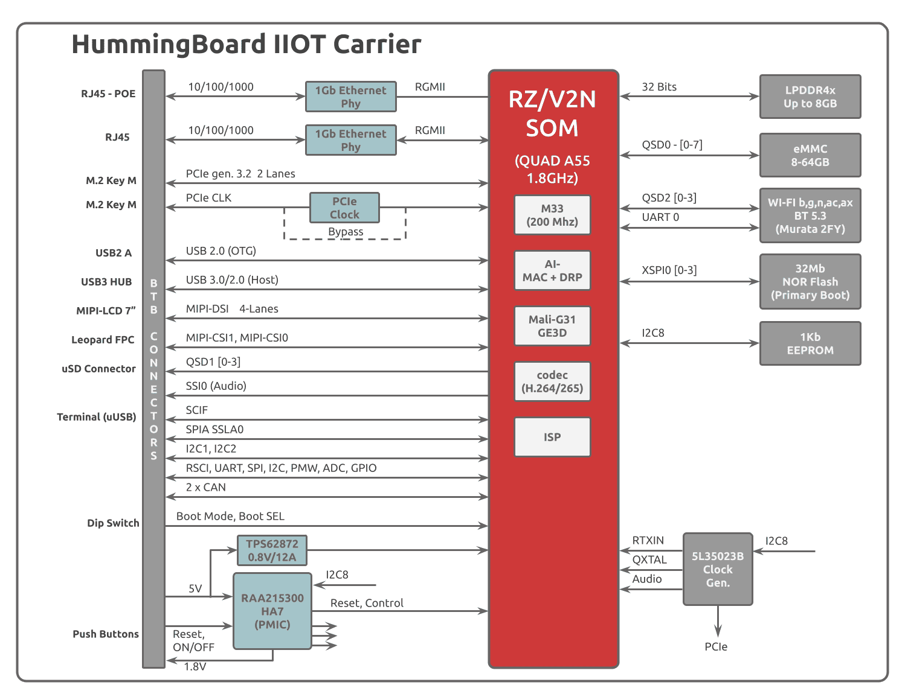
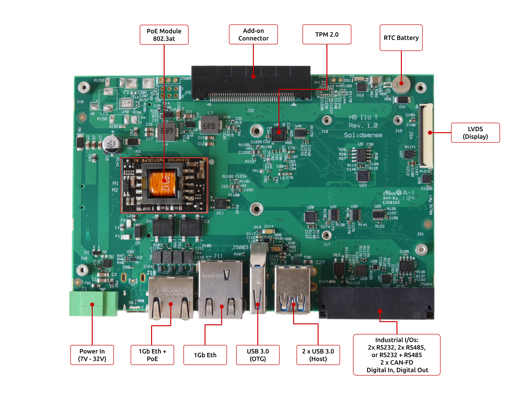

# HummingBoard IIOT & RZ/V2N SOM Quick Start Guide


<a id="introduction"></a>

## Introduction

The following quick start guide provides background information about the HummingBoard IIOT.

The guide will give a technical overview about the product and by the end of it you should be able to boot an operating system and begin testing your application.

<a id="revision-and-notes"></a>

## Revision and Notes

| **Date** | **Owner** | **Revision** | **Notes** |
| --- | --- | --- | --- |
| 20 Nov 2025 | Yazan | 1.0 | Initial release |
| Table of Contents | - [Introduction](#introduction)<br>- [Revision and Notes](#revision-and-notes)<br>- [Hardware Setup](#hardware-setup)<br>  - [Product specifications](#product-specifications)<br>  - [Block Diagram](#block-diagram)<br>  - [Visual features overview](#visual-features-overview)<br>- [Software Setup](#software-setup)<br>  - [Cable setup and prerequisites](#cable-setup-and-prerequisites)<br>- [Boot Select](#boot-select)<br>- [Booting from SPI and loading Yocto from uSD card](#booting-from-spi-and-loading-yocto-from-usd-card)<br>- [Boot Select](#boot-select)<br>- [Streaming USB Webcam Video from RZ/V2N Yocto to a PC](#streaming-usb-webcam-video-from-rz-v2n-yocto-to-a-pc)<br>  - [1\. Yocto Image Requirements](#1-yocto-image-requirements)<br>  - [2\. Installing GStreamer on the PC](#2-installing-gstreamer-on-the-pc)<br>  - [3\. Verifying Webcam Detection on RZ/V2N (Yocto) Before streaming, verify that the USB webcam is detected.](#3-verifying-webcam-detection-on-rz-v2n-yocto-before-streaming-verify-that-the-usb-webcam-is-detected)<br>    - [Check USB enumeration](#check-usb-enumeration)<br>    - [Check video devices](#check-video-devices)<br>  - [If no /dev/video0 found](#if-no-dev-video0-found)<br>    - [Check supported formats](#check-supported-formats)<br>  - [4\. Network Streaming Overview](#4-network-streaming-overview)<br>  - [5\. GStreamer Commands](#5-gstreamer-commands)<br>    - [5.1 On the RZ/V2N (Sender – Yocto)](#51-on-the-rz-v2n-sender-yocto)<br>    - [5.2 On the PC (Receiver)](#52-on-the-pc-receiver)<br>      - [Linux (Ubuntu, Fedora, Debian, etc.)](#linux-ubuntu-fedora-debian-etc)<br>      - [Windows (PowerShell)](#windows-powershell)<br>- [TLV EEPROM Support](#tlv-eeprom-support)<br>- [List Of Supported OS](#list-of-supported-os)<br>- [Build from source](#build-from-source)<br>- [Documentation](#documentation)<br>- [Related Articles](#related-articles) |     |     |

<a id="hardware-setup"></a>

## Hardware Setup

<a id="product-specifications"></a>

#### Product specifications

| **Model** | HummingBoard RZ/V2N IIOT SBC |
| --- | --- |
| **Processor** | [Renesas RZ/V2N SOM](https://www.solid-run.com/embedded-industrial-iot/renesas-rz-family/rz-v2n-som/) 4 x Arm Cortex-A55  <br>1 x Cortex-M33  <br>Up to 1.8 GHz |
| **Memory & Storage** | Up to 8GB LPDDR4  <br>Up to 128GB eMMC  <br>MicroSD |
| **AI Accelerator** | DRP-AI3 (15 Sparse TOPS / 4 Dense TOPS) |
| **Display** | MIPI-DSI |
| **I/Os** | 2 x RS232, 2 x RS485, or RS232 + RS485  <br>2 x CAN-FD  <br>2 x USB2.0  <br>1 x USB3.2  <br>1 x MIPI-CSI 4 lanes |
| **Networking** | 2 x Ethernet RJ45 10/100/1000  <br>1 x 802.11 a/b/g/n/ac WiFi and Bluetooth (2.4/5 GHz) |
| **Misc.** | GPIO  <br>RTC  <br>EEPROM |
| **Power** | 7V – 32V  <br>PoE sink support 802.3at  <br>Reverse polarity support |
| **Expansion card I/Os** | M.2 B-Key LTE modem  <br>(eSIM, NanoSim) |
| **Temperature** | Industrial: -40°C to 85°C |
| **Dimensions** | PCBA: 88 x 135 mm  <br>Enclosure (Optional): 150 x 145 x 40mm |
| **Enclosure** | Extruded aluminum |
|     | [Buy Now](https://www.solid-run.com/contact-us/) |

> [!INFO]
> Supported with RZ/V2N SOM. For more detailed information about our SOM RZ/V2N series please visit this user manual : RZ/V2N SOM Hardware User Manual **<TBD>** .

<a id="block-diagram"></a>

#### Block Diagram

The following figure describes the RZ/V2N Block Diagram.



<a id="visual-features-overview"></a>

#### Visual features overview

Please see below the features overview of the connector side of the HummingBoard IIOT & RZ/V2N SOM.


Print side connector overview of the HummingBoard IIOT & RZ/V2N SOM.




**Power Input Polarity \[J1\]:**

- **Connector Type**: Green two-terminal connector \[J1\].
- **Voltage Range**: 7V to 32V.
- **Polarity**:
  - **\+ (Positive)**: Left terminal (as marked in the image).
  - **\- (Negative)**: Right terminal (as marked in the image).

> [!NOTE]
> Plug for connector **J1** : 2 Position Terminal Block Plug, Female Sockets 0.138" (3.50mm).

**J5004** {2x RS485, 2x CAN-FD, 2x RS232, DIG\_IN, DIG\_OUT}


> [!NOTE]
> Plug for connector **J5004** : 20 Position Terminal Block Plug, Female Sockets 0.138" (3.50mm) like [this](https://www.digikey.com/en/products/detail/phoenix-contact/1738885/3606115).

<a id="software-setup"></a>

## Software Setup

<a id="cable-setup-and-prerequisites"></a>

#### Cable setup and prerequisites

Here is what you will need to power up and use the board:

- Linux or Windows PC
- HummingBoard IIOT with SOM
- 12V Power adapter (HummingBoard IIOT has wide range input of 7V-28V), alternatively you can use a PoE injector to power on the device.
- Type-C to USB for console, the HummingBoard IIOT has an onboard FTDI chip.
- IP router or IP switch

<a id="boot-select"></a>

## Boot Select


Before powering up the board for the first time it is recommended to select the boot media using onboard DIP switch **S5**:

| **Switch** | **1**  <br>(MD0) | **2**  <br>(MD1) | **3**  <br>N/A | **4**  <br>N/A | **5**  <br>(VDD\_1.8V) | **6**  <br>(VDD\_3.3V) |
| --- | --- | --- | --- | --- | --- | --- |
| **SPI** | OFF | **ON** | X   | X   | OFF | **ON** |
| **eMMC** | **ON** | OFF | X   | X   | OFF | **ON** |
| **Serial Dowanloder** | **ON** | **ON** | X   | X   | OFF | **ON** |

> [!INFO]
> **MDx = BOOT\_MODEx.**  
> **VDD\_BOOT** can be either **1.8V** or **3.3V** (selectable via **S5\[5\]** or **S5\[6\]**).
> - **BOOT\_MODE2 = ‘1’** → fixed to **1.8V** at the SOM level
> - **BOOT\_MODE3** and **BOOT\_MODE4** → fixed to **GND** at the SOM level
> **Note:** MD1 and MD0 are swapped between **PCB version 1.1** and **PCB version 1.0**.

<a id="booting-from-spi-and-loading-yocto-from-usd-card"></a>

## Booting from SPI and loading Yocto from uSD card

<a id="boot-select"></a>

## Boot Select

Here is the correct DIP switch position for SPI boot:


> [!INFO]
> Note: The black rectangle represents the switch position.
> The unit comes with a pre-programmed bootloader on the SPI NOR flash.

Once you set the switches, you can apply the following for booting from an SPI card.

1. **Downloading the Yocto image**

Download the Debian image by running the following command on your Linux/Windows PC:

```
wget https://solid-run-images.sos-de-fra-1.exo.io/renesas/rzv2n/core-image-weston-rzv2n-evk.rootfs-20251224162903.wic.gz
```

- For more Debian releases, please visit [https://images.solid-run.com/renesas/rzv2n](https://images.solid-run.com/renesas/rzv2n).

2. **Writing the image to the SD card**

Use the following commands for writing the image to an SD card:

```
gunzip -dc core-image-weston-rzv2n-evk.rootfs-20251224162903.wic.gz | dd of=/dev/sdX bs=4k conv=fdatasync 
```

- For more information, please visit [Flashing an SD Card](../../../homepage/other-articles/flashing-an-sd-card.md) .

> [!NOTE]
> Note: Plug a micro SD into your Linux PC, the following assumes that the micro SD is added as /dev/sdX and all it’s partitions are unmounted.

3. **SD card insertion**

Please Insert the SD card into your device.

4. **Power connection**

Connect your power adaptor to the DC jack, and then connect the adaptor to mains supply.

5. **Serial Connection**

Please insert the micro USB into your device, then you can refer to [Serial Connection](../../../homepage/other-articles/serial-connection.md) for installing necessary serial connection software in Linux/Windows.

Once you installed the necessary serial connection software, you should be able to see the following:


- In order to be able to log in, please insert “**root**” as a username and password.

<a id="streaming-usb-webcam-video-from-rz-v2n-yocto-to-a-pc"></a>

## Streaming USB Webcam Video from RZ/V2N Yocto to a PC

This section describes how to stream live video from a USB webcam connected to a **SolidRun RZ/V2N** board running **Yocto Linux**, and display the video on a **remote PC** (Linux or Windows) over the network using **GStreamer**.  
The streaming pipeline uses **MJPEG over RTP**, which is supported by most USB webcams and does not require hardware H.264 encoding on the device.

GStreamer provides command-line tools for capturing, encoding, sending, receiving, and displaying video streams.

<a id="1-yocto-image-requirements"></a>

### **1\. Yocto Image Requirements**

- v4l2 support
- GStreamer core + good/bad/ugly plugins
- v4l-utils (recommended)

Suggested additions to `local.conf` if missing:

```
IMAGE_INSTALL:append = " gstreamer1.0 gstreamer1.0-plugins-good gstreamer1.0-plugins-bad gstreamer1.0-plugins-ugly v4l-utils "
```

<a id="2-installing-gstreamer-on-the-pc"></a>

### **2\. Installing GStreamer on the PC**

For Ubuntu/Debian distros:

```
sudo apt install gstreamer1.0-plugins-ugly gstreamer1.0-plugins-bad gstreamer1.0-libav
```

For Fedora/RHEL distros:

```
sudo dnf install gstreamer1 gstreamer1-plugins-base gstreamer1-plugins-good gstreamer1-plugins-bad-free gstreamer1-plugins-bad-free-gtk
```

For Windows:

- **Download the Installer**: Go to the [GStreamer official website](https://gstreamer.freedesktop.org/download/) and download the appropriate installer for your Windows version.
- **Run the Installer**: Execute the downloaded file. During installation, **select "Complete Installation"** to install all basic plugins.
- **Set Environment Variables**: To use GStreamer from the command line, add GStreamer to your system's PATH as described [here](https://gstreamer.freedesktop.org/documentation/installing/on-windows.html?gi-language=c).

> [!INFO]
> For Windows, you might need to configure the Firewall to allow the stream. Make sure that `10.0.0.2` is a private network.

<a id="3-verifying-webcam-detection-on-rz-v2n-yocto-before-streaming-verify-that-the-usb-webcam-is-detected"></a>

### **3\. Verifying Webcam Detection on RZ/V2N (Yocto)**  
Before streaming, verify that the USB webcam is detected.

<a id="check-usb-enumeration"></a>

#### **Check USB enumeration**

```
lsusb
```

Example:

```
Bus 001 Device 004: ID 046d:085c Logitech, Inc. C922 Pro Stream Webcam
```

<a id="check-video-devices"></a>

#### **Check video devices**

```
ls /dev/video*
```

Expected:

```
/dev/video0
```

> [!NOTE]
> <a id="if-no-dev-video0-found"></a>
> 
> ### **If no /dev/video0 found**
> Enable UVC driver:
> ```
> modprobe uvcvideo
> ```

<a id="check-supported-formats"></a>

#### **Check supported formats**

```
v4l2-ctl --list-formats -d /dev/video0
```

Typical output:

```
YUYV 4:2:2
MJPG
```

***Note**:* The Logitech C922 supports MJPEG, so MJPEG-over-RTP streaming is used.

<a id="4-network-streaming-overview"></a>

### **4\. Network Streaming Overview**

1. The RZ/V2N board captures MJPEG frames from the USB webcam (`/dev/video0`).
2. Frames are packetized into **RTP** and sent via **UDP** to the PC on port **5000**.
3. The PC receives the RTP stream, extracts the MJPEG frames, decodes them, and displays the video.

<a id="5-gstreamer-commands"></a>

### **5\. GStreamer Commands**

<a id="51-on-the-rz-v2n-sender-yocto"></a>

#### **5.1 On the RZ/V2N (Sender – Yocto)**

Replace `<LAPTOP_IP>` with the IP address of the PC receiving the video.  
Example: `192.168.33.17`

```
gst-launch-1.0 -v \
  v4l2src device=/dev/video0 ! \
  image/jpeg,width=1280,height=720,framerate=30/1 ! \
  rtpjpegpay ! \
  udpsink host=<LAPTOP_IP> port=5000 sync=false async=false
```

**Pipeline explanation**

- **v4l2src** – captures video from the webcam
- **image/jpeg** – requests MJPEG format
- **rtpjpegpay** – packetizes JPEG frames into RTP
- **udpsink** – sends RTP stream to the PC

* * *

<a id="52-on-the-pc-receiver"></a>

#### **5.2 On the PC (Receiver)**

<a id="linux-ubuntu-fedora-debian-etc"></a>

##### **Linux (Ubuntu, Fedora, Debian, etc.)**

```
gst-launch-1.0 -v \
  udpsrc port=5000 caps="application/x-rtp,encoding-name=JPEG,payload=26" ! \
  rtpjpegdepay ! \
  jpegdec ! \
  videoconvert ! \
  autovideosink sync=false
```

<a id="windows-powershell"></a>

##### **Windows (PowerShell)**

```
gst-launch-1.0 -v `
  udpsrc port=5000 caps="application/x-rtp,encoding-name=JPEG,payload=26" ! `
  rtpjpegdepay ! `
  jpegdec ! `
  videoconvert ! `
  autovideosink sync=false
```

**Pipeline explanation**

- **udpsrc** – receives RTP packets
- **rtpjpegdepay** – extracts MJPEG frames
- **jpegdec** – decodes JPEG video
- **autovideosink** – displays the video on the PC

<a id="tlv-eeprom-support"></a>

## TLV EEPROM Support

RZ/V2N SoMs are being programmed with identifying information such as the product name, MAC Address and SKUs to allow for programmatic identification of hardware.

<a id="list-of-supported-os"></a>

## List Of Supported OS

| **OS** |     |
| --- | --- |
|  | <TBD> |
|  | <TBD> |
|  | <TBD> |

<a id="build-from-source"></a>

## Build from source

- [GitHub - SolidRun](https://github.com/SolidRun/)

<a id="documentation"></a>

## Documentation

     

|     | File | Modified |
| --- | --- | --- |

No files shared here yet.

- Drag and drop to upload or [browse for files] 

Upload file 

File description  

[ Buy a Sample Now](https://shop.solid-run.com/?s=%22HummingBoard+Pulse%22&post_type=product&_ga=2.156269240.2016484779.1641802897-2012112798.1622706355)

<a id="related-articles"></a>

## Related Articles

Error rendering macro 'contentbylabel' : CQL was parsed but the search manager was unable to execute the search. Error message: com.atlassian.confluence.api.service.exceptions.scale.SSStatusCodeException: There was an illegal request passed to XP-Search Aggregator API : HTTP/1.1 403 Forbidden