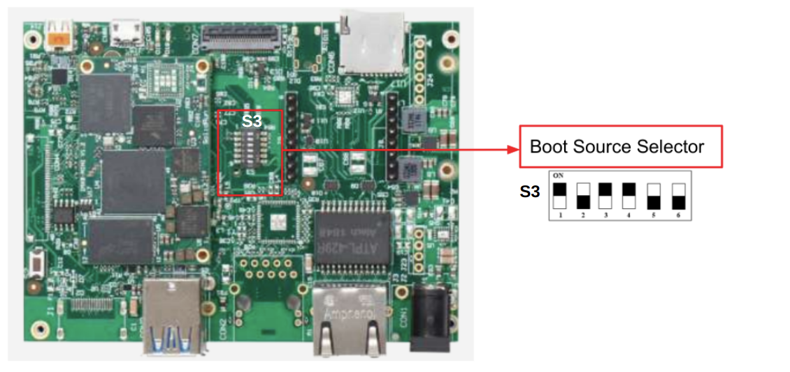
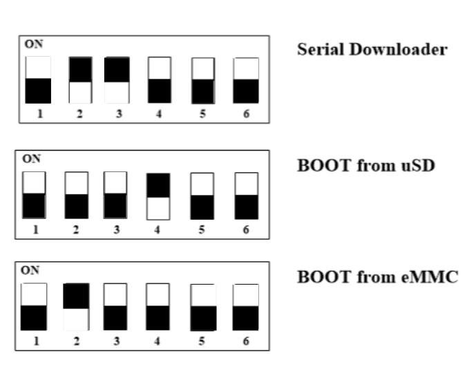

# HummingBoard RZ/G2LC/G2UL/G2L/V2l Boot Select

<a id="sd-card"></a>

## SD Card

You will need to download an operating system for the HummingBoard RZ/G2LC | RZ/G2L | RZ/V2L and flash into a blank SD card to use the system. You can download official release distributions and find flashing instructions at our [software](https://developer.solid-run.com/software/) page. If you need help to flash the SD card, please see our article [Flashing an SD Card](https://solidrun.atlassian.net/wiki/spaces/developer/pages/288129025) .

<a id="boot-select"></a>

#### Boot Select

Before powering up the board for the first time it is recommended to select the boot media. In order to configure the boot media to please reference the below diagram :

> [!INFO]
> The black rectangle represents the switch position.



<a id="when-using-hummingboard-ripple-rz-g2lc-or-rz-g2ul-som"></a>

## When using HummingBoard Ripple & RZ/G2LC or RZ/G2UL SOM


> [!NOTE]
> SD boot (Dip-Switch) \[**S3** \= {1:off, 2:off, 3:off,4-5: N/C, 6:on}\]
> eMMC boot (Dip-Switch) \[**S3** \= {1:off, 2:on, 3:off,4-5: N/C, 6:off}\]
> Serial Downloader (Dip-Switch) \[**S3** \= {1:off, 2:on, 3:on,4-5: N/C, 6:off}\]

<a id="when-using-hummingboard-pro-rz-g2lc-or-rz-g2ul-som"></a>

## When using HummingBoard Pro & RZ/G2LC or RZ/G2UL SOM



> [!NOTE]
> SD boot (Dip-Switch) \[**S3** \= {1:off, 2:off, 3:off, 4:on, 5-6: N/C}\]
> eMMC boot (Dip-Switch) \[**S3** \= {1:off, 2:on, 3:off, 4: off, 5-6: N/C}\]
> Serial Downloader (Dip-Switch) \[**S3** \= {1:off, 2:on, 3:on, 4: off, 5-6: N/C}\]

<a id="when-using-hummingboard-ripple-rz-g2l-or-rz-v2l-som"></a>

## When using HummingBoard Ripple & RZ/G2L or RZ/V2L SOM


> [!NOTE]
> SD boot (Dip-Switch) \[**S3** \= {1-3: off, 4-5: N/C, 6: off}\]
> eMMC boot (Dip-Switch) \[**S3** \= {1:off, 2:on, 3:off, 4-5: N/C, 6:on}\]
> Serial Downloader (Dip-Switch) \[**S3** \= {1:off, 2:on, 3:on, 4-5: N/C, 6:on}\]

<a id="when-using-hummingboard-pro-rz-g2l-or-rz-v2l-som"></a>

## When using HummingBoard Pro & RZ/G2L or RZ/V2L SOM


> [!NOTE]
> SD boot (Dip-Switch) \[**S3** \= {1:off, 2:off, 3:off, 4:off, 5-6: N/C}\]
> eMMC boot (Dip-Switch) \[**S3** \= {1:off, 2:on, 3:off, 4: on, 5-6: N/C}\]
> Serial Downloader (Dip-Switch) \[**S3** \= {1:off, 2-4: on, 5-6: N/C}\]

<a id="choosing-the-sd-emmc-device-for-the-linux-from-u-boot"></a>

## Choosing the SD/eMMC device for the Linux from u-boot

In the u-boot, selecting a device (SD or eMMC) that will be used in Linux is possible. The device selection is based on the environment variable in the u-boot.

For the SD card selection:

```
setenv sdio_select sd
```

For the eMMC card selection:

```
setenv sdio_select emmc
```