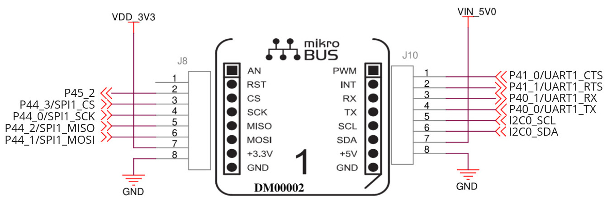

# Working with mikroBUS on the RZ/G2LC HummingBoard

This guide will show you how to control the mikroBUS GPIOs, SPI, I2C, and UART from the RZ/G2LC HummingBoard Linux userspace.

- [Choosing the pin function](#choosing-the-pin-function)
- [GPIO](#gpio)
- [UART](#uart)
- [CANFD](#canfd)
- [I2C](#i2c)
- [SPI](#spi)

Here is a microBUS connector pinout:



<a id="choosing-the-pin-function"></a>

# Choosing the pin function

According to the SOC specification, most pins can be used as GPIO or alternative function pins.

- The pin P45\_2 can be used as GPIO.
- The pins P44\_3, P44\_0, P44\_2, and P44\_1 can be used as GPIOs by default. Enable the `spi1` node in the devise tree to use them as SPI.
- By default, the pins P41\_0, P41\_1, P40\_1, and P40\_0 are used as uart ttySC1. Disable the `scif1` node in the devise tree to use them as GPIOs.
- The pins P40\_1, and P40\_0 Can be used as CANFD RX/TX. Disable the `scif1` node and enable canfd node in the devise tree to use them as CANFD.
- I2C0\_SCL and I2C0\_SDA can’t be used as GPIOs, only as I2C pins.

<a id="gpio"></a>

# GPIO

To use GPIO in Linux, either gpiod or sysfs can be used.

Both methods need the GPIO number that Linux assigned during the enumeration. This number is dynamically assigned to the GPIO based on the number of pins, GPIO controllers, etc. **Usually, this number is stable, but it might change during the BSP updates.** The gpioinfo utility gives us information about the number of the GPIO we need to use according to its label:

```
$ gpioinfo | grep P45_2
        line 362:      "P45_2"       unused   input  active-high
```

In this example, the GPIO P45\_2 has the number 362.

Setting GPIO using gpiod:

```
gpioset -m wait gpiochip0 362=1
```

> [!INFO]
> Note: after exit, the gpioset utility will reset GPIO to its default state (input hi-z); for more info, read about [gpioset modes](https://manpages.debian.org/bookworm/gpiod/gpioset.1.en.html).

Reading GPIO using gpiod:

```
gpioget gpiochip0 362
```

Setting GPIO using sysfs:

The export number of the GPIO can be calculated as the GPIO controller base plus the GPIO number.

```
$ ls /sys/class/gpio/
export       gpiochip120  unexport
```

The GPIO controller base is 120, and the GPIO number is 362.

The export number is 120 + 362 = 482

```
echo 482 > /sys/class/gpio/export 
echo out > /sys/class/gpio/P45_2/direction 
echo 1 > /sys/class/gpio/P45_2/value 
```

> [!NOTE]
> The GPIO number can be calculated using the function below:  
> **XX** = Linux gpio number = <GPIO\_controll\_base> + <GPIO\_Bank> \* 8 + <GPIO\_Bit>  
> → **XX =** 120 + <GPIO\_Bank> \* 8 + <gpio\_bit>
> **Example:** To calculate the GPIO number of mikroBus J8 \[pin 2\] (RST)  
> **Pad Name:** P45\_2 → {**GPIO\_Bank**\= 45; **GPIO\_Bit** = 2}
> **XX** = 120 + ( 45) \* 8 + 2 = 120 + 362 = 482

<a id="uart"></a>

# UART

UART is available in Linux as a standard serial device /dev/ttySC1.

To use it, you can use the default utilities:

```
# stty -F /dev/ttySC1 9600
# echo "test string" > /dev/ttySC1
```

You can also use Picocom, minicom, screen, etc.

<a id="canfd"></a>

# CANFD

The CANFD RX/TX pins are available on P40\_1 and P40\_0. These pins conflict with SCIF1 RX/TX. To enable CANFD, the `scif1` node needs to be disabled, and the `canfd` node needs to be enabled in the dts.

```
&canfd {
	status = "okay";
};

&scif1 {
	status = "disabled";
};
```

The CANFD will be available with the /dev/can0 interface.

Basic CAN usage:

```
# ip link set can0 type can bitrate 1000000 dbitrate 4000000 fd on
# ip link set up can0
# candump can0
```

> [!INFO]
> Note: this CANFD controller supports a nominal bit rate: max. 1Mbps, data bit rate: max. 4Mbps

> [!CAUTION]
> For the electrical connection, a CANFD transceiver should be used. Do not connect the RX/TX pins to the CAN\_H/CAN\_L lines directly; this will damage the SOM.

<a id="i2c"></a>

# I2C

The I2C0\_SCL and I2C0\_SDA pins can be utilized as an I2C0 connection and are available via /dev/i2c-0.

New devices can be detected via the i2cdetect utility:

```
$ i2cdetect -y 0
     0  1  2  3  4  5  6  7  8  9  a  b  c  d  e  f
00:          -- -- -- -- -- -- -- -- -- -- -- -- -- 
10: -- -- -- -- -- -- -- -- -- -- -- -- -- -- -- -- 
20: -- -- -- -- -- -- -- -- -- -- -- -- -- -- -- -- 
30: -- -- -- -- -- -- -- -- UU -- -- -- UU UU -- UU 
40: -- -- -- -- -- -- -- -- -- -- -- -- -- -- -- -- 
50: UU -- -- -- -- -- -- UU -- -- -- -- -- -- -- -- 
60: -- -- -- -- -- -- -- -- -- UU -- -- -- -- -- -- 
70: -- -- -- -- -- -- -- --       
```

> [!WARNING]
> Note: The I2C0 bus is used for many devices on the board. Be careful connecting to this pin something that can fault the I2C bus.

Options to control the device:

- i2c-tools utilities
- Add device to i2c0 node in the dts
- Also possible that the kernel will bind the driver automatically during the i2c bus scan

<a id="spi"></a>

# SPI

The mikroBUS connector's SPI pins are connected to the SOC's SPI1 interface. To use them, configure the `spi1` node in the dts first.

Depending on the task, the spi1 node can be configured as a specific or dummy SPI device.

Here is an example of the dummy device configuration:

```
&spi1 {
	status = "okay";
	spidevice@0 {
		compatible = "linux,spidev";
		reg = <0>;
		spi-max-frequency = <12000000>;
	};
};
```

After this configuration, the SPI would be accessible via the /dev/spidev0.0 device and can be used with the spidev\_test utility or tools that can work with spidev (for example, flashrom).

To fully use SPI, replace the spidev node with a specific device node and use a particular driver.