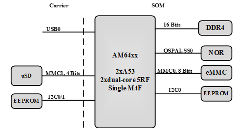
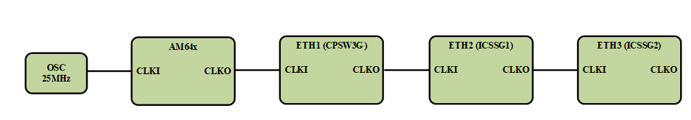
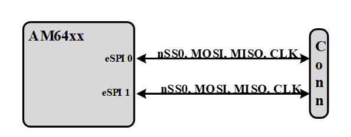

# AM64x SOM Hardware User Manual

## Revisions and Notes

|                   |                                                                                                                                                                                                                                                                                                                                                                                                                                                                                                                                                                                                                                                                                                                                                                                                                                                                                                                                                                                                                                                                                                                                                                                                                                                                                                                                                                                                                                                                                                                                                                                                                                                                                                                                                                                                                                                                                                                                                                                                                                                                                                                                                                                                                                                                                                                                                                                                                                                                                                                                                                                                                                                                                                                                                                                                                                                                                                                                                                                                                                                                                                                                                                                                                                                                                                                                                                                                                                                                                                                                                                                                                                                                                                                                                                                                                                                                                                                                                                                                                                                                                                                                                                                                                                                                                                                                                                                                 |              |                                                                                                                                       |
| ----------------- | ----------------------------------------------------------------------------------------------------------------------------------------------------------------------------------------------------------------------------------------------------------------------------------------------------------------------------------------------------------------------------------------------------------------------------------------------------------------------------------------------------------------------------------------------------------------------------------------------------------------------------------------------------------------------------------------------------------------------------------------------------------------------------------------------------------------------------------------------------------------------------------------------------------------------------------------------------------------------------------------------------------------------------------------------------------------------------------------------------------------------------------------------------------------------------------------------------------------------------------------------------------------------------------------------------------------------------------------------------------------------------------------------------------------------------------------------------------------------------------------------------------------------------------------------------------------------------------------------------------------------------------------------------------------------------------------------------------------------------------------------------------------------------------------------------------------------------------------------------------------------------------------------------------------------------------------------------------------------------------------------------------------------------------------------------------------------------------------------------------------------------------------------------------------------------------------------------------------------------------------------------------------------------------------------------------------------------------------------------------------------------------------------------------------------------------------------------------------------------------------------------------------------------------------------------------------------------------------------------------------------------------------------------------------------------------------------------------------------------------------------------------------------------------------------------------------------------------------------------------------------------------------------------------------------------------------------------------------------------------------------------------------------------------------------------------------------------------------------------------------------------------------------------------------------------------------------------------------------------------------------------------------------------------------------------------------------------------------------------------------------------------------------------------------------------------------------------------------------------------------------------------------------------------------------------------------------------------------------------------------------------------------------------------------------------------------------------------------------------------------------------------------------------------------------------------------------------------------------------------------------------------------------------------------------------------------------------------------------------------------------------------------------------------------------------------------------------------------------------------------------------------------------------------------------------------------------------------------------------------------------------------------------------------------------------------------------------------------------------------------------------------------------- | ------------ | ------------------------------------------------------------------------------------------------------------------------------------- |
| **Date**          | **Owner**                                                                                                                                                                                                                                                                                                                                                                                                                                                                                                                                                                                                                                                                                                                                                                                                                                                                                                                                                                                                                                                                                                                                                                                                                                                                                                                                                                                                                                                                                                                                                                                                                                                                                                                                                                                                                                                                                                                                                                                                                                                                                                                                                                                                                                                                                                                                                                                                                                                                                                                                                                                                                                                                                                                                                                                                                                                                                                                                                                                                                                                                                                                                                                                                                                                                                                                                                                                                                                                                                                                                                                                                                                                                                                                                                                                                                                                                                                                                                                                                                                                                                                                                                                                                                                                                                                                                                                                       | **Revision** | **Notes**                                                                                                                             |
| 25 May 2022       | Noam Weidenfeld                                                                                                                                                                                                                                                                                                                                                                                                                                                                                                                                                                                                                                                                                                                                                                                                                                                                                                                                                                                                                                                                                                                                                                                                                                                                                                                                                                                                                                                                                                                                                                                                                                                                                                                                                                                                                                                                                                                                                                                                                                                                                                                                                                                                                                                                                                                                                                                                                                                                                                                                                                                                                                                                                                                                                                                                                                                                                                                                                                                                                                                                                                                                                                                                                                                                                                                                                                                                                                                                                                                                                                                                                                                                                                                                                                                                                                                                                                                                                                                                                                                                                                                                                                                                                                                                                                                                                                                 | 1.0          |                                                                                                                                       |
| Nov 9, 2023       | Shahar Fridman                                                                                                                                                                                                                                                                                                                                                                                                                                                                                                                                                                                                                                                                                                                                                                                                                                                                                                                                                                                                                                                                                                                                                                                                                                                                                                                                                                                                                                                                                                                                                                                                                                                                                                                                                                                                                                                                                                                                                                                                                                                                                                                                                                                                                                                                                                                                                                                                                                                                                                                                                                                                                                                                                                                                                                                                                                                                                                                                                                                                                                                                                                                                                                                                                                                                                                                                                                                                                                                                                                                                                                                                                                                                                                                                                                                                                                                                                                                                                                                                                                                                                                                                                                                                                                                                                                                                                                                  | 1.1          | Add power consumption table                                                                                                           |
| Dec 12, 2023      | Josua Mayer                                                                                                                                                                                                                                                                                                                                                                                                                                                                                                                                                                                                                                                                                                                                                                                                                                                                                                                                                                                                                                                                                                                                                                                                                                                                                                                                                                                                                                                                                                                                                                                                                                                                                                                                                                                                                                                                                                                                                                                                                                                                                                                                                                                                                                                                                                                                                                                                                                                                                                                                                                                                                                                                                                                                                                                                                                                                                                                                                                                                                                                                                                                                                                                                                                                                                                                                                                                                                                                                                                                                                                                                                                                                                                                                                                                                                                                                                                                                                                                                                                                                                                                                                                                                                                                                                                                                                                                     | 1.2          | 
Update Pinout Tables:  - add SoC ball names - add SoC ball numbers - update usafe by carrier for hummingboard v1.2
 |
| Table of Contents | 
- <a href="am64x-som-hardware-user-manual.md#revisions-and-notes">Revisions and Notes</a> - <a href="am64x-som-hardware-user-manual.md#introduction">Introduction</a> - <a href="am64x-som-hardware-user-manual.md#overview">Overview</a> - <a href="am64x-som-hardware-user-manual.md#highlighted-features">Highlighted Features</a> - <a href="am64x-som-hardware-user-manual.md#supporting-products">Supporting Products</a> - <a href="am64x-som-hardware-user-manual.md#description">Description</a> - <a href="am64x-som-hardware-user-manual.md#block-diagram">Block Diagram</a> - <a href="am64x-som-hardware-user-manual.md#features-summary">Features Summary</a> - <a href="am64x-som-hardware-user-manual.md#core-system-components">Core System Components</a> - <a href="am64x-som-hardware-user-manual.md#am64xx-sitara-soc-family">AM64xx Sitara SoC Family</a> - <a href="am64x-som-hardware-user-manual.md#memories">Memories</a> - <a href="am64x-som-hardware-user-manual.md#ddr4">DDR4</a> - <a href="am64x-som-hardware-user-manual.md#emmc-nand-flash">eMMC NAND Flash</a> - <a href="am64x-som-hardware-user-manual.md#octal-serial-nor-flash-som">Octal Serial NOR Flash (SOM)</a> - <a href="am64x-som-hardware-user-manual.md#eeprom-som">EEPROM (SOM)</a> - <a href="am64x-som-hardware-user-manual.md#micro-sd-carrier">Micro-SD (Carrier)</a> - <a href="am64x-som-hardware-user-manual.md#10-100-1000-mbps-ethernet-interfaces">10/100/1000 Mbps Ethernet Interfaces</a> - <a href="am64x-som-hardware-user-manual.md#pru_icssg">PRU_ICSSG</a> - <a href="am64x-som-hardware-user-manual.md#cpsw3g">CPSW3G</a> - <a href="am64x-som-hardware-user-manual.md#clock-chaining">Clock Chaining</a> - <a href="am64x-som-hardware-user-manual.md#am64xx-external-interfaces">AM64xx External Interfaces</a> - <a href="am64x-som-hardware-user-manual.md#general">General</a> - <a href="am64x-som-hardware-user-manual.md#supported-interfaces-main">Supported Interfaces - Main</a> - <a href="am64x-som-hardware-user-manual.md#pcie-usb3">PCIe &#x26; USB3</a> - <a href="am64x-som-hardware-user-manual.md#uart">UART</a> - <a href="am64x-som-hardware-user-manual.md#espi">eSPI</a> - <a href="am64x-som-hardware-user-manual.md#i2c">I2C</a> - <a href="am64x-som-hardware-user-manual.md#usd">uSD</a> - <a href="am64x-som-hardware-user-manual.md#mcan">MCAN</a> - <a href="am64x-som-hardware-user-manual.md#adc">ADC</a> - <a href="am64x-som-hardware-user-manual.md#gpio">GPIO</a> - <a href="am64x-som-hardware-user-manual.md#connectors-signal-description">Connector’s Signal Description</a> - <a href="am64x-som-hardware-user-manual.md#j5001">J5001</a> - <a href="am64x-som-hardware-user-manual.md#j7">J7</a> - <a href="am64x-som-hardware-user-manual.md#j9">J9</a> - <a href="am64x-som-hardware-user-manual.md#power-reset">Power &#x26; Reset</a> - <a href="am64x-som-hardware-user-manual.md#power-architecture">Power Architecture</a> - <a href="am64x-som-hardware-user-manual.md#vpp_1v8">VPP_1V8</a> - <a href="am64x-som-hardware-user-manual.md#reset">Reset</a> - <a href="am64x-som-hardware-user-manual.md#power-consumption">Power Consumption</a> - <a href="am64x-som-hardware-user-manual.md#integration-manual">Integration Manual</a> - <a href="am64x-som-hardware-user-manual.md#power-up-sequence">Power Up Sequence</a> - <a href="am64x-som-hardware-user-manual.md#booting-options">Booting Options</a> - <a href="am64x-som-hardware-user-manual.md#fuses-booting">Fuses Booting</a> - <a href="am64x-som-hardware-user-manual.md#booting-from-resistors-setting">Booting from Resistors setting</a> - <a href="am64x-som-hardware-user-manual.md#i2c-interfaces">I2C Interfaces</a> - <a href="am64x-som-hardware-user-manual.md#gpio-interfaces">GPIO Interfaces</a> - <a href="am64x-som-hardware-user-manual.md#am64xx-debugging-capability">AM64xx Debugging Capability</a> - <a href="am64x-som-hardware-user-manual.md#mechanical-description">Mechanical Description</a> - <a href="am64x-som-hardware-user-manual.md#documentation">Documentation</a> - <a href="am64x-som-hardware-user-manual.md#related-articles">Related Articles</a>
 |              |                                                                                                                                       |

> \[!INFO] **Disclaimer** No warranty of accuracy is given concerning the contents of the information contained in this publication. To the extent permitted by law no liability (including liability to any person by reason of negligence) will be accepted by SolidRun Ltd., its subsidiaries or employees for any direct or indirect loss or damage caused by omissions from or inaccuracies in this document. SolidRun Ltd. reserves the right to change details in this publication without prior notice. Product and company names herein may be the trademarks of their respective owners.

## Introduction

This User Manual relates to the SolidRun SR-SOM-AM64xx-series, which includes

* Single/Dual core ARM A53 (1.0 GHz).
* Single/Dual cores Cortex®-R5F 800 MHz processor.
* A general-purpose Cortex®-M4F 400 MHz processor.

## Overview

The SolidRun’s SR-SOM-AM64xx is a low power, low-cost high performance micro system on module (S.O.M.) based on the highly integrated TI's AM64xx family of products targeting the Industrial Market Applications.

## Highlighted Features

* Ultra-small footprint SOM (47x30mm) including three board-to-board connectors (250 total pins number).
* TI's AM64XX SoC:\
  \-  Single/Dual core Cortex A53 up to 1.0GHz\
  \-  400 MHz Cortex-M4F subsystem processor supports real time tasks.\
  \- Up to two dual-core Cortex-R5F MCU subsystems at up to 800 MHz, integrated for real-time processing.\
  \- Safety & Security engines
* DDR4 (1.6 GHz) memory in x16 configurations supports up to 2GB and inline ECC
* Up to two 1GB Ethernet port supporting Industrial Ethernet protocols.
* Single Gigabit Ethernet interface.
* Two ports TSN GE switch.
* Industrial IO supports – CAN, RS-485 etc.
* Single PCIe Gen 2 or USB 3 interface.
* Low latency interfaces to motor control front.

## Supporting Products

The following products are provided from SolidRun both as production level platforms and as reference examples on how to incorporate the SOM in different levels of integration:

* [HummingBoard AM64x](https://solidrun.atlassian.net/wiki/spaces/developer/pages/197493843)– A board computer that incorporates the SOM retains the same Linux distributions while adding extra hardware functionalities and access to the hardware.

## Description

#### Block Diagram

The following figure describes the AM64xx SOM's Blocks Diagram.

#### Features Summary

Following is the features summary of the SOM. Notice that some of the features are pinout multiplexed (please refer to the pin mux table and the TI's AM64xx data sheets):

·         Dual/Single ARM® Cortex™ A53 Processor, up to 1.0 GHz

·         Dual or single dual-core Cortex R5F Up to 800 MHz

·         Cortex-M4 subsystem processor up to 400 MHz

·         Up to 2GByte DDR4 memory

·         Up to 64 GB eight bits eMMC memory.

·         OSPI/QSPI NOR Flash memory.

·         I2C EEPROM.

·         Up to 3 x 10/100/1000 Mbps Ethernet PHY

o   Up to two gigabit Industrial Communication Subsystems e.g., ECAT, Profinet etc.

o   Time stamping

o   TSN

·         SUB Giga modem (CC1312)

·         Variety of interfaces and IO on Board-to-Board connectors.

A single 5.0V interface

## Core System Components

#### AM64xx Sitara SoC Family

The AM64xx Sitara processors feature advanced implementation of a duad Arm® Cortex®-A53 core, which operates at speeds of up to 1.0 GHz. A general-purpose Cortex®-M4 core processor is for low-power processing and two dual-core Cortex-R5F supporting industrial protocols.

The following figure describes the AM64xx main features (For more details refer to TI’s AM64x datasheet).

#### Memories

The AM64xx SOM supports varieties of memory interfaces for booting and data storage. The following figure describes the AM64xx SOM memory interfaces.

#### DDR4

* Up to 2GB memory space.
* 16 Bits data bus.
* Up to 1600 MT/s.
* Inline ECC.

#### eMMC NAND Flash

&#x20;Up to 64GB memory space.

* 8 Bits data bus.
* Support of eMMC5.1 Host Specification (JESD84-B51).
* HS200 SDR: 1.8 V, 0-200 MHz, 8/4-bit bus width, 200/100 MB/s
* HS400 DDR is NOT supported.
* Can be used as BOOT NVM \*

#### Octal Serial NOR Flash (SOM)

* Supports 1/2/4 or 8-bit operation.
* Support for DDR Mode and DTR protocol.
* Programmable device sizes
* DMA NOT supported.
* In Octal-SPI and Quad-SPI mode, Mode 1, 2, and 3 are NOT supported.
* Can be used as BOOT NVM \*

#### EEPROM (SOM)

&#x20;·       1Kb EEPROM

·       ON-Semi’s CAT24AA01TDI or compatible

·       Address 0X50 (7 bits format)

·       Stores SOM’s configuration such as MAC addresses, Memory Configuration, Serial Number etc.\
&#x20;      → Not recommended for customer data.

#### Micro-SD (Carrier)

&#x20;·        Optional on Carrier board

·        Implements 4 data bits.

·        SD Host Controller Standard Specification 4.10 and SD Physical Layer Specification v3.01.

·        SDIO Specification v3.00

·        DDR50: UHS-I 1.8 V signalling, frequency up to 50 MHz, up to 50 MBps.

·        SDR104 is NOT supported.

·        Can be used as BOOT NVM \*

> \[!WARNING] **\*Note – All boot configuration signals are available on the SOM connector.**

#### 10/100/1000 Mbps Ethernet Interfaces

The AM64xx SOM supports three Giga-Ethernet interfaces. One of the interfaces is connected directly to the Ethernet switch (CPSW3G) and the two others are part of the Programmable Real-Time Unit and Industrial Communication Subsystem – Gigabit (PRU\_ICSSG). The following figure describes the Ethernet port interfaces.

The three Giga Ethernet PHY are TI’s DP83869:

* Low RGMII Latency
* Low Power Consumption
* Time Sensitive Network (TSN) Compliant
* IEEE1588 Support
* Cable Diagnostics
* Recovered Clock Output for SyncE
* MDI or MDIX support.

#### PRU\_ICSSG

* Two Real-Time Ethernet ports.
* MDIO port to control external Ethernet PHY
* Time Stamping support.
* Industrial protocols used in master and slave mode, such as:

o   EtherCAT®

o   PROFINET™

o   EtherNet/IP™

o   Others

#### CPSW3G

* Single Giga Ethernet port
* Synchronous 10/100/1000 Mbit operation
* MDIO port to control external Ethernet PHY
* Support for Audio/Video Bridging (P802.1Qav/D6.0 and 802.1Qaz)
* Support for IEEE 1588 Clock Synchronization (2008 Annex D, Annex E and Annex F)
* IPV4/IPV6 UDP/TCP checksum offload.

#### Clock Chaining

The following figure describes the Ethernet reference clock configuration.

The 25Mhz clock source is the CPU’s CLOCOUT1 signal. It is connected to the CPCW3G Ethernet PHY.

ICSSG1 clock is connected to CPSW3G output clock and ICSSG2 is connected to ICSSG1 clock.

> \[!WARNING] **Note – Clock need to be active before reset signal is de-asserts**

## AM64xx External Interfaces

#### General

The SOM incorporates three Hirose DF40 board-to-board headers.

The selection of the Hirose DF40 is due to the following criteria:

·         Miniature (0.4m pitch)

·         Highly reliable manufacturer

·         Availability (worldwide distribution channels)

·         Excellent signal integrity (supports 6Gbps)

o   Please contact Hirose or SolidRun for reliability and test result data.

·         Mating height of between 1.5mm to 3.0mm. AM64xx headers are fixed, the final mating height is determined by carrier implementation

#### Supported Interfaces - Main

#### PCIe & USB3

The AM64xx supports a single Ser/Des interface. The Ser/Des can be configured as a PCIe or a USB3.0 interface. The following figure describes the optional Ser/Des configurations.

**The PCIe main features are:**

·         Ser/Des is configured as PCIe.

·         On board coupling capacitors for TX and CLK.

·         PCIe clock is generated on the AM64xx SoC.

·         Single PCIe lane up to 5.0GT/lane.

·         Gen2 (5 Gbps 8/10-bit encoding), and Gen1 (2.5 Gbps 8/10-bit encoding) with auto-negotiation.

·         Compliant to PCI-Express® Base Specification, Revision 4.0 (Version 0.7).

·         PHY Interface for the PCI Express Architecture, Version 4.2 compliance.

·         Supports Spread Spectrum Clocking in Transmitter and Receiver.

**USB main features are:**

·         Ser/Des is configured as USB 3.1.

·         Universal Serial Bus 3.1 (USB) subsystem with integrated USB2.0 PHY

·         Dual-Role Device (DRD) capability

·         Compliance with USB 3.1 Gen1 Specification

·         Support of Peripheral (aka Device) mode at Super Speed (SS at 5 Gbps), High Speed (HS at 480 Mbps), and Full Speed (FS at 12 Mbps)

·         Support of Host mode at Super Speed (SS at 5 Gbps), High Speed (HS at 480 Mbps), Full Speed (FS at 12 Mbps), and Low Speed (LS at 1.5 Mbps)

·         ECC on internal RAMs

> \[!WARNING] **NOTE – USB 2.0 is always available even if the Ser/Des is configured as PCIe**.

#### UART

The AM64xx SOM can support up to 4 UART interfaces. The following figure describes the UART interfaces.

The UART interfaces main features are:

·         UART 0 supports TX, RX, CTS and RTS. After POR it is used as terminal.

·         UART 2 supports TX, RX, CTS and RTS.

·         UART 3 Supports TX, RX, CTS and RTS.

·         UART 4 support TX, RX

·         RS-485 external transceiver auto flow control support.

·         Baud rates up to 3.6 Mbps. Auto-baud between 1200 bits/s and 115.2 Kbits/s.

·         Flow control: Hardware (RTS/CTS) or software (XON/XOFF).

·         Optional multi-drop transmission.

> \[!WARNING] **Note – The UART signals are multiplexed with other functional options. Refer to the Pin MUX tools for optional functionalities.**

#### eSPI

The AM64xx SOM supports two eSPI interface. The following figure describes the eSPI interface.

·         Single HW chip select nSS0.

·         Master/Slave configurable.

·         Serial clock with programmable frequency, polarity, and phase for each channel.

> \[!WARNING] **Note – The eSPI signals are multiplexed with other functional options. Refer to the Pin MUX tools for optional functionalities.**

#### I2C

The AM64xx SOM supports up to two I2C Interfaces. The following figure describes the I2C interfaces.

The I2C main features are:

·         I2C-0 is connected to the SOM EEPROM and BtB connector.

·         I2C-1 is available on the connector by default.

·         Pull-up resistors assembled on SOM.

·         Multi-master operation.

·         In Standard mode, I2C supports the data transfer rates up to 100 kbits/s.

·         In Fast mode, data transfer rates up to 400 kbits/s can be achieved.

> \[!WARNING] **Note – The I2C signals are multiplexed with other functional options. Refer to the Pin MUX tools for optional functionalities.**

#### uSD

The uSD supports the following features:

·         AM64xx’s MMC-1.

·        Optional on Carrier board

·        Implements 4 data bits.

·        SD Host Controller Standard Specification 4.10 and SD Physical Layer Specification v3.01.

·        SDIO Specification v3.00

·        DDR50: UHS-I 1.8 V signalling, frequency up to 50 MHz, up to 50 MBps.

·        SDR104 is NOT supported.

·        Can be used as BOOT NVM \*

> \[!WARNING] **Note – The SDIO signals are multiplexed with other functional options. Refer to the Pin MUX tools for optional functionalities.**

#### MCAN

The AM64xx supports up to two CAN interfaces.

MCAN main features are:

·         Conforms with CAN Protocol 2.0 A, B and ISO 11898-1:2015.

·         Full CAN FD support (up to 64 data bytes).

> \[!WARNING] **Note – The MCAN signals are multiplexed with other functional options. Refer to the Pin MUX tools for optional functionalities.**

#### ADC

The AM64xx support up to eight Analog to Digital lines. The Analog-to-Digital Converter (ADC) module contains a single 12-bit ADC which can be multiplexed to any 1of 8 analog inputs (channels).

·         4 MSPS rate with a 60 MHz SMPL\_CLK.

·         Functional Internal Diagnostic Debug Mode.

·         Single-ended or differential input options.

·         Simultaneous sampling is NOT supported.

#### GPIO

The AM64xx support GPIO interfaces that can be multiplex with alternative function interfaces. Some of the interfaces are:

·         Fast serial interface (FSI).

·         Enhanced Capture Module.

·         Enhanced PWM.

·         Timers

·         More

> \[!INFO] Refer to the Pin MUX tools for optional functionalities.

## Connector’s Signal Description

#### J5001

| **Pin Number** | **Signal Name (SoM v1.1 schematics)** | **SoC Ball Name** | **SoC Ball Number** | **IO Voltage** | **Function on HummingBoard-T Carrier**      | **Signal Name (HummingBoard-T v1.2 Schematics)** |
| -------------- | ------------------------------------- | ----------------- | ------------------- | -------------- | ------------------------------------------- | ------------------------------------------------ |
| 1              | BOOTMODE0 (GPIO0\_15)                 | GPMC0\_AD0        | T20                 | 3V3            |                                             | NC                                               |
| 2              | BOOTMODE13//FSI\_RX1\_D1 (GPIO0\_28)  | GPMC0\_AD13       | V18                 | 3V3            | PU/PD (R88/R99)                             | BOOTMODE13//FSI\_RX1\_D1                         |
| 3              | BOOTMODE3 (GPIO0\_18)                 | GPMC0\_AD3        | U20                 | 3V3            | DIP-Switch (S1-12, PD)                      | BOOTMODE3                                        |
| 4              | BOOTMODE12//FSI\_RX1\_D0 (GPIO0\_27)  | GPMC0\_AD12       | W21                 | 3V3            | PU/PD (R89/R100)                            | BOOTMODE12//FSI\_RX1\_D0                         |
| 5              | BOOTMODE1 (GPIO0\_16)                 | GPMC0\_AD1        | U21                 | 3V3            |                                             | NC                                               |
| 6              | BOOTMODE11/FSI\_RX1\_CLK (GPIO0\_26)  | GPMC0\_AD11       | W20                 | 3V3            | PU/PD (R90/R101)                            | BOOTMODE11/FSI\_RX1\_CLK                         |
| 7              | PRG0\_MDIO0\_MDIO (GPIO1\_40)         | PRG0\_MDIO0\_MDIO | P2                  | 3V3            | SerDes MUX Select (M1 or M2)                | PCIe\_SEL                                        |
| 8              | WLAN\_IRQ GPIO0\_12                   | OSPI0\_CSN1       | L18                 | 1V8            | M.2 Reset (M2-67)                           | M.2\_RESET#                                      |
| 9              | BOOTMODE5 (GPIO0\_83)                 | GPMC0\_AD5        | U19                 | 3V3            | DIP-Switch (S1-10, PD) / EXTENDER (J5-4)    | BOOTMODE5                                        |
| 10             | GPMC0\_DIR (GPIO0\_40)                | GPMC0\_DIR        | N17                 | 3V3            | Battery Charger Processor Hot (U3-11)       | PROCHOTn                                         |
| 11             | BOOTMODE4 (GPIO0\_82)                 | GPMC0\_AD4        | U18                 | 3V3            | DIP-Switch (S1-11, PD)                      | BOOTMODE4                                        |
| 12             | BOOTMODE9/FSI\_RX0\_D0 (GPIO0\_24)    | GPMC0\_AD9        | T17                 | 3V3            | DIP-Switch (S1-7, PD)                       | BOOTMODE9/FSI\_RX0\_D0                           |
| 13             | GND                                   |                   |                     |                |                                             | GND                                              |
| 14             | BOOTMODE8/FSI\_RX0\_CLK (GPIO0\_23)   | GPMC0\_AD8        | V19                 | 3V3            | DIP-Switch (S1-8, PD)                       | BOOTMODE8/FSI\_RX0\_CLK                          |
| 15             | BOOTMODE7 (GPIO0\_22)                 | GPMC0\_AD7        | V21                 | 3V3            | PU/PD (R87/R98)                             | BOOTMODE7                                        |
| 16             | GND                                   |                   |                     |                |                                             | GND                                              |
| 17             | BOOTMODE6 (GPIO0\_21)                 | GPMC0\_AD6        | V20                 | 3V3            | DIP-Switch (S1-9, PD) / EXTENDER (J5-5)     | BOOTMODE6                                        |
| 18             | GPMC0\_ADVn\_ALE  (GPIO0\_32)         | GPMC0\_ADVN\_ALE  | P16                 | 3V3            | M.2 WiFi Disable (M2-8)                     | M.2\_W\_DIS#                                     |
| 19             | PRG0\_MDIO0\_MDC (GPIO1\_41)          | PRG0\_MDIO0\_MDC  | P3                  | 3V3            | SerDes MUX Enable                           | PCIe\_EN                                         |
| 20             | PRG0\_PRU0GPO5/UART3\_RTSn            | PRG0\_PRU0\_GPO5  | R3                  | 3V3            | RS-485-RE#/DE (U18-2/3)                     | PRG0\_PRU0GPO5/UART3\_RTSn                       |
| 21             | BOOTMODE2 (GPIO0\_17)                 | GPMC0\_AD2        | T18                 | 3V3            |                                             | NC                                               |
| 22             | GND                                   |                   |                     |                |                                             | GND                                              |
| 23             | WL\_RTC\_CLK (GPIO0\_34)              | GPCM0\_WEN        | T21                 | 3V3            | M.2 Bluetooth / GPS Disable (M2-26)         | M.2\_GPS\_BT\_EN#                                |
| 24             | PRG0\_PRU1GPO6                        | PRG0\_PRU1\_GPO6  | R5                  | 3V3            | EXTENDER (J5-17)                            | PRG0\_PRU1GPO6                                   |
| 25             | PRG0\_PRU1GPO5                        | PRG0\_PRU1\_GPO5  | R4                  | 3V3            | EXTENDER (J5-15)                            | PRG0\_PRU1GPO5                                   |
| 26             | PRG0\_PRU0GPO15                       | PRG0\_PRU0\_GPO15 | T5                  | 3V3            | M.2 PCI Reset (M2-50, M1-52)                | PERST#                                           |
| 27             | PRG0\_PRU0GPO1                        | PRG0\_PRU0\_GPO1  | R4                  | 3V3            | EXTENDER (J5-33)                            | PRG0\_PRU0GPO1                                   |
| 28             | PRG0\_PRU1GPO13                       | PRG0\_PRU1\_GPO13 | T6                  | 3V3            | EXTENDER (J5-21)                            | PRG0\_PRU1GPO13                                  |
| 29             | PRG0\_PRU0GPO13                       | PRG0\_PRU0\_GPO13 | R6                  | 3V3            | EXTENDER (J5-7)                             | PRG0\_PRU0GPO13                                  |
| 30             | PRG0\_PRU1GPO14                       | PRG0\_PRU1\_GPO14 | U6                  | 3V3            | EXTENDER (J5-14)                            | PRG0\_PRU1GPO14                                  |
| 31             | PRG1\_IEP0\_EDC\_SYNC\_OUT2           | PRG1\_PRU0\_GPO17 | U7                  | 3V3            |                                             | NC                                               |
| 32             | PRG0\_PRU1GPO15                       | PRG0\_PRU1\_GPO15 | U5                  | 3V3            | M.2 PCI Clock Request (M2-52)               | CLKREQ1#                                         |
| 33             | GND                                   |                   |                     | 3V3            |                                             | GND                                              |
| 34             | BT\_EN GPIO1\_78                      | MMC1\_SDWP        | C20                 | 3V3            | SoC Programming power enable                | VPP\_LDO\_EN                                     |
| 35             | PRG0\_PRU1GPO3                        | PRG0\_PRU1\_GPO3  | T4                  | 3V3            | EXTENDER (J5-12)                            | PRG0\_PRU1GPO3                                   |
| 36             | GND                                   |                   |                     |                |                                             | GND                                              |
| 37             | PRG0\_PRU0GPO16                       | PRG0\_PRU0\_GPO16 | U4                  | 3V3            |                                             | NC                                               |
| 38             | NC                                    |                   |                     |                |                                             | NC                                               |
| 39             | PRG0\_PRU0GPO19/UART3\_RXD            | PRG0\_PRU0\_GPO19 | W1                  | 3V3            | RS-485-R (U18-1)                            | PRG0\_PRU0GPO19/UART3\_RXD                       |
| 40             | PRG0\_PRU1GPO2                        | PRG0\_PRU1\_GPO2  | V3                  | 3V3            | EXTENDER (J5-31)                            | PRG0\_PRU1GPO2                                   |
| 41             | GPMC0\_WAIT0 (GPIO0\_37)              | GPMC0\_WAIT0      | W19                 | 3V3            | Tamper Detection External Interrupt (J15-1) | TAMPER                                           |
| 42             | PRG0\_PRU0GPO6                        | PRG0\_PRU0\_GPO6  | T3                  | 3V3            | EXTENDER (J5-26)                            | PRG0\_PRU0GPO6                                   |
| 43             | PRG0\_PRU0GPO0                        | PRG0\_PRU0\_GPO0  | Y1                  | 3V3            | EXTENDER (J5-32)                            | PRG0\_PRU0GPO0                                   |
| 44             | PRG0\_PRU1GPO1                        | PRG0\_PRU1\_GPO1  | W2                  | 3V3            | EXTENDER (J5-22)                            | PRG0\_PRU1GPO1                                   |
| 45             | PRG0\_PRU1GPO0                        | PRG0\_PRU1\_GPO0  | Y2                  | 3V3            | EXTENDER (J5-23)                            | PRG0\_PRU1GPO0                                   |
| 46             | PRG0\_PRU0GPO3/UART3\_CTSn            | PRG0\_PRU0\_GPO3  | V2                  | 3V3            | RS-485-RE#/DE (U18-2/3)                     | PRG0\_PRU0GPO3/UART3\_CTSn                       |
| 47             | GND                                   |                   |                     |                |                                             | GND                                              |
| 48             | PRG0\_PRU0GPO2                        | PRG0\_PRU0\_GPO2  | U2                  | 3V3            |                                             | NC                                               |
| 49             | PRG0\_PRU1GPO16                       | PRG0\_PRU1\_GPO16 | AA4                 | 3V3            |                                             | NC                                               |
| 50             | PRG0\_PRU0GPO11                       | PRG0\_PRU0\_GPO11 | Y3                  | 3V3            | M.2 PCI Clock Request (M1-53)               | CLKREQ2#                                         |
| 51             | PRG0\_PRU0GPO12                       | PRG0\_PRU0\_GPO12 | AA3                 | 3V3            | EXTENDER (J5-6)                             | PRG0\_PRU0GPO12                                  |
| 52             | GND                                   |                   |                     |                |                                             | GND                                              |
| 53             | PRG0\_PRU0GPO8                        | PRG0\_PRU0\_GPO8  | T2                  | 3V3            |                                             | NC                                               |
| 54             | PRG0\_PRU0GPO4/UART3\_TXD             | PRG0\_PRU0\_GPO4  | AA2                 | 3V3            | RS-485-D (U18-4)                            | PRG0\_PRU0GPO4/UART3\_TXD                        |
| 55             | PRG0\_PRU0GPO7                        | PRG0\_PRU0\_GPO7  | T1                  | 3V3            | EXTENDER (J5-16)                            | PRG0\_PRU0GPO8                                   |
| 56             | PRG0\_PRU0GPO18                       | PRG0\_PRU0\_GPO18 | V1                  | 3V3            |                                             | NC                                               |
| 57             | GND                                   |                   |                     |                |                                             | GND                                              |
| 58             | PRG0\_PRU1GPO12                       | PRG0\_PRU1\_GPO12 | Y4                  | 3V3            | EXTENDER (J5-18)                            | PRG0\_PRU1GPO12                                  |
| 59             | PRG0\_PRU1GPO8                        | PRG0\_PRU1\_GPO8  | R1                  | 3V3            | EXTENDER (J5-20)                            | PRG0\_PRU1GPO8                                   |
| 60             | PRG0\_PRU0GPO17                       | PRG0\_PRU0\_GPO17 | U18                 | 3V3            | PCIe\_3V3\_EN (M.2 PWR\_EN)                 | PCIe\_3V3\_EN                                    |
| 61             | PRG0\_PRU1GPO4                        | PRG0\_PRU1\_GPO4  | W3                  | 3V3            | EXTENDER (J5-13)                            | PRG0\_PRU1GPO4                                   |
| 62             | PRG0\_PRU1GPO11                       | PRG0\_PRU1\_GPO11 | W4                  | 3V3            | EXTENDER (J5-19)                            | PRG0\_PRU1\_GPO11                                |
| 63             | GND                                   |                   |                     |                |                                             | GND                                              |
| 64             | GND                                   |                   |                     |                |                                             | GND                                              |
| 65             | PRG0\_PRU0GPO14                       | PRG0\_PRU0\_GPO14 | V4                  | 3V3            |                                             | NC                                               |
| 66             | SoC\_WARM\_RESETZ                     | RESET\_REQZ       | E18                 | 3V3            |                                             | NC                                               |
| 67             | PRG1\_IEP0\_EDC\_LATCH\_IN0           | PRG1\_PRU0\_GPO18 | V7                  | 3V3            |                                             | NC                                               |
| 68             | NC                                    |                   |                     |                |                                             | NC                                               |
| 69             | PRG1\_IEP0\_EDC\_SYNC\_OUT0           | PRG1\_PRU0\_GPO19 | W7                  | 3V3            |                                             | NC                                               |
| 70             | NC                                    |                   |                     |                |                                             | NC                                               |

#### J7

| **Pin Number** | **Signal Name (SoM schematics)**                 | **SoC Ball Name**                                   | **SoC Ball Number** | **IO Voltage** | **Function on HummingBoard-T Carrier** | **Signal Name (HummingBoard-T v1.2 Schematics)** |
| -------------- | ------------------------------------------------ | --------------------------------------------------- | ------------------- | -------------- | -------------------------------------- | ------------------------------------------------ |
| 1              | GPMC0\_BE1n/I2C2\_SDA (GPIO0\_44)                | GPMC0\_CSN3                                         | R21                 | 3V3            | Real-Time Clock Interrupt              | RTC\_INT#                                        |
| 2              | GPMC0\_BE1n/FSI\_TX0\_CLK (GPIO0\_37)            | GPMC0\_BE1N                                         | T19                 | 3V3            |                                        | NC                                               |
| 3              | GPMC0\_WAIT1/FSI\_TX1\_D1 (GPIO0\_38)            | GPMC0\_WAIT1                                        | Y18                 | 3V3            | EXTENDER (J5-2)                        | FSI\_TX1\_D1                                     |
| 4              | GPMC0\_CSn1 (GPIO0\_42)                          | GPMC0\_CSN1                                         | R20                 | 3V3            | USB-Hub Reset                          | USB-HUB\_RST#                                    |
| 5              | BOOTMODE15/FSI\_TX0\_D1 (GPIO0\_30)              | GPMC0\_AD15                                         | Y20                 | 3V3            | LED Enable (D25)                       | LED2                                             |
| 6              | GND                                              |                                                     |                     |                |                                        | GND                                              |
| 7              | BOOTMODE14/FSI\_TX0\_D0 (GPIO0\_29)              | GPMC0\_AD14                                         | Y21                 | 3V3            | LED Enable (D24)                       | LED1                                             |
| 8              | GPMC0\_CSn0 (GPIO0\_41)                          | GPMC0\_CSN0                                         | R19                 | 3V3            | Battery Charger Power Good (U3-4)      | CHRG\_OK                                         |
| 9              | ADC0\_AIN3                                       | ADC0\_AIN3                                          | D20                 | 1V8            |                                        | NC                                               |
| 10             | GPMC0\_BE1n/I2C2\_SCL (GPIO0\_43)                | GPMC0\_CSN2                                         | P19                 | 3V3            | Watchdog Timer Reset (U17-2)           | WDI                                              |
| 11             | ADC0\_AIN0                                       | ADC0\_AIN0                                          | G20                 | 1V8            | EXTENDER (J5-38)                       | ADC0\_AIN0                                       |
| 12             | BOOTMODE10/FSI\_RX0\_D1 (GPIO0\_25)              | GPMC0\_AD10                                         | R16                 | 3V3            | PU/PD (R91/R102)                       | BOOTMODE10/FSI\_RX0\_D1                          |
| 13             | ADC0\_AIN1                                       | ADC0\_AIN1                                          | F20                 | 1V8            | EXTENDER (J5-39)                       | ADC0\_AIN1                                       |
| 14             | ADC0\_AIN2                                       | ADC0\_AIN2                                          | E21                 | 1V8            | EXTENDER (J5-40)                       | ADC0\_AIN2                                       |
| 15             | ADC0\_AIN7                                       | ADC0\_AIN7                                          | E20                 | 1V8            |                                        | NC                                               |
| 16             | GPMC0\_OEn\_REn (GPIO0\_33)                      | GPMC0\_OEN\_REN                                     | R18                 | 3V3            | LED Enable (D26)                       | LED3                                             |
| 17             | GND                                              |                                                     |                     |                |                                        | GND                                              |
| 18             | ADC0\_AIN4                                       | ADC0\_AIN4                                          | G21                 | 1V8            |                                        | NC                                               |
| 19             | SoC\_I2C0\_SCL                                   | I2C0\_SCL                                           | A18                 | 3V3            | Semsors, Battery Charger               | SoC\_I2C0\_SCL                                   |
| 20             | GPMC0\_CLK (GPIO0\_31)                           | GPMC0\_CLK                                          | R17                 |                |                                        | NC                                               |
| 21             | SoC\_I2C0\_SDA                                   | I2C0\_SDA                                           | B18                 | 3V3            | Semsors, Battery Charger               | SoC\_I2C0\_SDA                                   |
| 22             | GPMC0\_BE0n\_CLE/FSI\_TX1\_D0 (GPIO0\_35)        | GPMC0\_BE0N\_CLE                                    | P17                 |                | EXTENDER (J5-3)                        | FSI\_TX1\_D0                                     |
| 23             | GND                                              |                                                     |                     |                |                                        | GND                                              |
| 24             | ADC0\_AIN5                                       | ADC0\_AIN5                                          | F21                 | 1V8            |                                        | NC                                               |
| 25             | SYNC1\_OUT\_TP (GPIO1\_68)                       | ECAP0\_IN\_APWM\_OUT                                | D18                 | 3V3            |                                        | NC                                               |
| 26             | ADC0\_AIN6                                       | ADC0\_AIN6                                          | F19                 | 1V8            |                                        | NC                                               |
| 27             | SoC\_I2C1\_SCL                                   | I2C1\_SCL                                           | C18                 | 3V3            | RTC, EXTENDER (J5-25)                  | SoC\_I2C1\_SCL                                   |
| 28             | GPMC0\_WPn/FSI\_TX1\_CLK (GPIO0\_39)             | GPMC0\_WPN                                          | N16                 |                | EXTENDER (J5-1)                        | FSI\_TX1\_CLK                                    |
| 29             | SoC\_I2C1\_SDA                                   | I2C1\_SDA                                           | B19                 | 3V3            | RTC, EXTENDER (J5-24)                  | SoC\_I2C1\_SDA                                   |
| 30             | RESETSTATz                                       | RESETSTATZ                                          | F16                 | 3V3            | SD Reset (Power Disable)               | RESETSTATz                                       |
| 31             | HSE\_MCAN1\_RX/I2C3\_SDA (GPIO1\_63)             | MCAN1\_RX                                           | D17                 | 3V3            | CAN RX from Transceiver (U19-4)        | HSE\_MCAN1\_RX                                   |
| 32             | MCU\_SAFETY\_ERRORz\_1V8                         |                                                     |                     | 1V8            | NC                                     |                                                  |
| 33             | HSE\_MCAN1\_TX/I2C3\_SCL (GPIO1\_62)             | MCAN1\_TX                                           | C17                 | 3V3            | CAN TX to Transceiver (U19-1)          | HSE\_MCAN1\_TX                                   |
| 34             | PORz\_OUT                                        | PORZ\_OUT                                           | E17                 | 3V3            | SD Reset (Power Disable)               | PORz\_OUT                                        |
| 35             | GND                                              |                                                     |                     |                |                                        | GND                                              |
| 36             | SoC\_CLKIN                                       | MCU\_OSC0\_XI (only if R119 assembled, default dnp) | C21                 | 1V8            |                                        | NC                                               |
| 37             | HSE\_MCAN0\_RX/UART4\_TXD (GPIO1\_61)            | MCAN0\_RX                                           | B17                 | 3V3            | CAN RX from Transceiver (U20-4)        | HSE\_MCAN0\_RX                                   |
| 38             | SOC\_MAIN\_UART0\_CTS\_3V3 (GPIO1\_54)           | UART0\_CTSN                                         | B16                 | 3V3            |                                        | NC                                               |
| 39             | HSE\_MCAN0\_TX/UART4\_RXD (GPIO1\_60)            | MCAN0\_TX                                           | A17                 | 3V3            | CAN TX to Transceiver (U20-1)          | HSE\_MCAN0\_TX                                   |
| 40             | SOC\_MAIN\_UART0\_RTS\_3V3 (GPIO1\_55)           | UART0\_RTSN                                         | A16                 | 3V3            |                                        | NC                                               |
| 41             | GND                                              |                                                     |                     |                |                                        | GND                                              |
| 42             | GND                                              |                                                     |                     |                |                                        | GND                                              |
| 43             | SOC\_MAIN\_UART3\_RX\_3V3/UART1\_CTS (GPIO1\_58) | UART1\_CTSN                                         | D16                 | 3V3            | EXTENDER (J5-29)                       | SOC\_MAIN\_UART3\_RX\_3V3/UART1\_CTS             |
| 44             | MCU\_RESETSTATz                                  | MCU\_RESETSTATZ                                     | B13                 | 3V3            |                                        | NC                                               |
| 45             | SOC\_MAIN\_UART3\_TX\_3V3/UART1\_RTS (GPIO1\_59) | UART1\_RTSN                                         | E16                 | 3V3            | EXTENDER (J5-27)                       | SOC\_MAIN\_UART3\_TX\_3V3/UART1\_RTS             |
| 46             | SOC\_SPI1\_CLK (GPIO1\_49)                       | SPI1\_CLK                                           | C14                 | 3V3            |                                        | NC                                               |
| 47             | SOC\_MAIN\_UART1\_RX\_3V3 (GPIO1\_56)            | UART1\_RXD                                          | E15                 | 3V3            | EXTENDER (J5-30)                       | SOC\_MAIN\_UART1\_RX\_3V3                        |
| 48             | SOC\_SPI1\_MOSI (GPIO1\_50)                      | SPI1\_D0                                            | B15                 | 3V3            |                                        | NC                                               |
| 49             | SOC\_MAIN\_UART1\_TX\_3V3 (GPIO1\_57)            | UART1\_TXD                                          | E14                 | 3V3            | EXTENDER (J5-28)                       | SOC\_MAIN\_UART1\_TX\_3V3                        |
| 50             | SOC\_SPI1\_MISO (GPIO1\_51)                      | SPI1\_D1                                            | A15                 | 3V3            |                                        | NC                                               |
| 51             | SOC\_SPI0\_CLK (GPIO1\_44)                       | SPI0\_CLK                                           | D13                 | 3V3            | EXTENDER (J5-8)                        | SOC\_SPI0\_CLK                                   |
| 52             | SOC\_MAIN\_UART0\_TX\_3V3 (TERMINAL)             | UART0\_TXD                                          | C16                 | 3V3            | USB Console Port                       | SOC\_MAIN\_UART0\_TX\_3V3                        |
| 53             | SOC\_SPI0\_MISO (GPIO1\_46)                      | SPI0\_D1                                            | A14                 | 3V3            | EXTENDER (J5-9)                        | SOC\_SPI0\_MISO                                  |
| 54             | SOC\_MAIN\_UART0\_RX\_3V3 (TERMINAL)             | UART0\_RXD                                          | D15                 | 3V3            | USB Console Port                       | SOC\_MAIN\_UART0\_RX\_3V3                        |
| 55             | SOC\_SPI0\_MOSI (GPIO1\_45)                      | SPI0\_D0                                            | A13                 | 3V3            | EXTENDER (J5-10)                       | SOC\_SPI0\_MOSI                                  |
| 56             | SOC\_SPI1\_CS0 (GPIO1\_51)                       | SPI1\_CS0                                           | B14                 | 3V3            |                                        | NC                                               |
| 57             | SOC\_SPI0\_CS0 (GPIO1\_42)                       | SPI0\_CS0                                           | D12                 | 3V3            | EXTENDER (J5-11)                       | SOC\_SPI0\_CS0                                   |
| 58             | SOC\_SPI1\_CS1 (GPIO1\_48)                       | SPI1\_CS1                                           | D14                 | 3V3            |                                        | NC                                               |
| 59             | SOC\_SPI0\_CS1 (GPIO1\_43)                       | SPI0\_CS1                                           | C13                 | 3V3            |                                        | NC                                               |
| 60             | MCU\_I2C1\_SDA (MCU\_GPIO0\_21)                  | MCU\_I2C1\_SDA                                      | B10                 | 3V3            |                                        | NC                                               |
| 61             | GND                                              |                                                     |                     |                |                                        | GND                                              |
| 62             | MCU\_I2C0\_SCL                                   | MCU\_I2C0\_SCL                                      | E9                  | 3V3            |                                        | NC                                               |
| 63             | MCU\_I2C1\_SCL (MCU\_GPIO0\_20)                  | MCU\_I2C1\_SCL                                      | A11                 | 3V3            |                                        | NC                                               |
| 64             | MCU\_I2C0\_SDA                                   | MCU\_I2C0\_SDA                                      | A10                 | 3V3            |                                        | NC                                               |
| 65             | PORz                                             | MCU\_PORz (level-shifted)                           | B21                 | VIN            | Reset Button (S2)                      | PORz                                             |
| 66             | MCU\_UART0\_RX\_3V3 (MCU\_GPIO0\_3)              | MCU\_UART0\_RXD                                     | A9                  | 3V3            |                                        | NC                                               |
| 67             | MCU\_UART0\_RTS\_3V3 (MCU\_GPIO0\_0)             | MCU\_UART0\_RTSN                                    | E8                  | 3V3            |                                        | NC                                               |
| 68             | MCU\_UART0\_TX\_3V3 (MCU\_GPIO0\_23)             | MCU\_UART0\_TXD                                     | A8                  | 3V3            |                                        | NC                                               |
| 69             | MCU\_UART0\_CTS\_3V3 (MCU\_GPIO0\_1)             | MCU\_UART0\_CTSN                                    | D8                  | 3V3            |                                        | NC                                               |
| 70             | GND                                              |                                                     |                     |                |                                        | GND                                              |
| 71             | MCU\_SPI1\_MISO (MCU\_GPIO0\_9)                  | MCU\_SPI1\_D1                                       | C8                  | 3V3            |                                        | NC                                               |
| 72             | MCU\_SPI1\_CS1 (MCU\_GPIO0\_6)                   | MCU\_SPI1\_CS1                                      | B7                  | 3V3            |                                        | NC                                               |
| 73             | MCU\_SPI1\_CLK (MCU\_GPIO0\_7)                   | MCU\_SPI1\_CLK                                      | D7                  | 3V3            |                                        | NC                                               |
| 74             | MCU\_SPI1\_CS0 (MCU\_GPIO0\_5)                   | MCU\_SPI1\_CS0                                      | A7                  | 3V3            |                                        | NC                                               |
| 75             | MCU\_SPI1\_MOSI (MCU\_GPIO0\_8)                  | MCU\_SPI1\_D0                                       | C7                  | 3V3            |                                        | NC                                               |
| 76             | MCU\_SPI0\_CS0 (MCU\_GPIO0\_13)                  | MCU\_SPI0\_CS0                                      | D6                  | 3V3            |                                        | NC                                               |
| 77             | MCU\_SPI0\_MOSI (MCU\_GPIO0\_10)                 | MCU\_SPI0\_D0                                       | E7                  | 3V3            |                                        | NC                                               |
| 78             | MCU\_SPI0\_CS1 (MCU\_GPIO0\_12)                  | MCU\_SPI0\_CS1                                      | C6                  | 3V3            |                                        | NC                                               |
| 79             | MCU\_SPI0\_CLK (MCU\_GPIO0\_11)                  | MCU\_SPI0\_CLK                                      | E6                  | 3V3            |                                        | NC                                               |
| 80             | MCU\_SPI0\_MISO (MCU\_GPIO0\_4)                  | MCU\_SPI0\_D1                                       | B6                  | 3V3            |                                        | NC                                               |

#### J9

| **Pin Number** | **Signal Name (SoM schematics)** | **SoC Ball Name**                    | **SoC Ball Number** | **IO Voltage** | **Function on HummingBoard-T Carrier**  | **Signal Name (HummingBoard-T v1.2 Schematics)** |
| -------------- | -------------------------------- | ------------------------------------ | ------------------- | -------------- | --------------------------------------- | ------------------------------------------------ |
| 1              | CPSW\_ETH1\_D3M                  |                                      |                     | 2.5V           | Ethernet Connector (J13, POE)           | CPSW\_ETH1\_D3M                                  |
| 2              | GND                              |                                      |                     |                |                                         | GND                                              |
| 3              | CPSW\_ETH1\_D3P                  |                                      |                     | 2.5V           | Ethernet Connector (J13, POE)           | CPSW\_ETH1\_D3P                                  |
| 4              | SERDES\_TXP0                     | SERDES0\_TX0\_P                      | AA17                | 1V8            | PCIe Switch (M2 or M1)                  | SERDES\_TXP0                                     |
| 5              | GND                              |                                      |                     |                |                                         | GND                                              |
| 6              | SERDES\_TXN0                     | SERDES0\_TX0\_N                      | AA16                | 1V8            | PCIe Switch (M2 or M1)                  | SERDES\_TXN0                                     |
| 7              | CPSW\_ETH1\_D2M                  |                                      |                     | 2.5V           | Ethernet Connector (J13, POE)           | CPSW\_ETH1\_D2M                                  |
| 8              | GND                              |                                      |                     |                |                                         | GND                                              |
| 9              | CPSW\_ETH1\_D2P                  |                                      |                     | 2.5V           | Ethernet Connector (J13, POE)           | CPSW\_ETH1\_D2P                                  |
| 10             | SERDES\_RXP0                     | SERDES0\_RX0\_P                      | Y16                 | 1V8            | PCIe Switch (M2 or M1)                  | SERDES\_RXP0                                     |
| 11             | GND                              |                                      |                     |                |                                         | GND                                              |
| 12             | SERDES\_RXN0                     | SERDES0\_RX0\_N                      | Y15                 | 1V8            | PCIe Switch (M2 or M1)                  | SERDES\_RXN0                                     |
| 13             | CPSW\_ETH1\_D1M                  |                                      |                     | 2.5V           | Ethernet Connector (J13, POE)           | CPSW\_ETH1\_D1M                                  |
| 14             | GND                              |                                      |                     |                |                                         | GND                                              |
| 15             | CPSW\_ETH1\_D1P                  |                                      |                     | 2.5V           | Ethernet Connector (J13, POE)           | CPSW\_ETH1\_D1P                                  |
| 16             | USB0\_DP                         | USB0\_DP                             | AA19                |                | USB HUB or USB Type-1 (Assembly option) | USB0\_DP                                         |
| 17             | GND                              |                                      |                     |                |                                         | GND                                              |
| 18             | USB0\_DM                         | USB0\_DM                             | AA20                |                | USB HUB or USB Type-1 (Assembly option) | USB0\_DM                                         |
| 19             | CPSW\_ETH1\_D0M                  |                                      |                     | 2.5V           | Ethernet Connector (J13, POE)           | CPSW\_ETH1\_D0M                                  |
| 20             | GND                              |                                      |                     |                |                                         | GND                                              |
| 21             | CPSW\_ETH1\_D0P                  |                                      |                     | 2.5V           | Ethernet Connector (J13, POE)           | CPSW\_ETH1\_D0P                                  |
| 22             | SERDES\_REFCLK0\_P               | SERDES0\_REFCLK0P                    | W17                 | 1V8            | ClocK Distributer                       | PCIe\_CLKP2                                      |
| 23             | GND                              |                                      |                     |                |                                         | GND                                              |
| 24             | SERDES\_REFCLK0\_N               | SERDES0\_REFCLK0N                    | W16                 | 1V8            | ClocK Distributer                       | PCIe\_CLKN2                                      |
| 25             | CPSW\_ETH1\_LED\_1000            | [PHY@0](mailto:PHY@0) LED\_1/RX\_ER  |                     | 3V3            | Ethernet Connector (J13, POE)           | CPSW\_ETH1\_LED\_1000                            |
| 26             | USB0\_AB\_ID                     | USB0\_ID                             | U16                 | 3V3            | NC                                      |                                                  |
| 27             | CPSW\_ETH1\_LED\_ACT             | [PHY@0](mailto:PHY@0) LED\_2/GPIO\_0 |                     | 3V3            | Ethernet Connector (J13, POE)           | CPSW\_ETH1\_LED\_ACT                             |
| 28             | VPP\_1V8                         | VPP                                  | G15                 | 1V8            | efuse programming supply for SoM        | VPP\_1V8                                         |
| 29             | PRG1\_ETH2\_LED\_1000/RX\_ER     | [PHY@3](mailto:PHY@3) LED\_1/RX\_ER  |                     | 3V3            | Ethernet Connector (J14B)               | PRG1\_ETH2\_LED\_1000/RX\_ER                     |
| 30             | USB0\_DRVBUS                     | USB0\_DRVVBUS                        | E19                 | 3V3            | USB Type-A PWR\_EN (Assembly option)    | USB0\_DRVBUS                                     |
| 31             | PRG1\_ETH2\_D2P                  |                                      |                     | 2.5V           | Ethernet Connector (J14B)               | PRG1\_ETH2\_D2P                                  |
| 32             | PRG1\_ETH2\_D3M                  |                                      |                     | 2V5            | Ethernet Connector (J14B)               | PRG1\_ETH2\_D3M                                  |
| 33             | PRG1\_ETH2\_D2M                  |                                      |                     | 2.5V           | Ethernet Connector (J14B)               | PRG1\_ETH2\_D2M                                  |
| 34             | PRG1\_ETH2\_D3P                  |                                      |                     | 2V5            | Ethernet Connector (J14B)               | PRG1\_ETH2\_D3P                                  |
| 35             | GND                              |                                      |                     |                |                                         | GND                                              |
| 36             | GND                              |                                      |                     |                |                                         | GND                                              |
| 37             | PRG1\_ETH2\_D1P                  |                                      |                     | 2.5V           | Ethernet Connector (J14B)               | PRG1\_ETH2\_D1P                                  |
| 38             | MMC1\_CLK                        |                                      |                     | 1V8/3V3        | uSD Connector (J8)                      | MMC1\_CLK                                        |
| 39             | PRG1\_ETH2\_D1M                  |                                      |                     | 2.5V           | Ethernet Connector (J14B)               | PRG1\_ETH2\_D1M                                  |
| 40             | MMC1\_CMD                        |                                      |                     | 1V8/3V3        | uSD Connector (J8)                      | MMC1\_CMD                                        |
| 41             | GND                              |                                      |                     |                |                                         | GND                                              |
| 42             | MMC1\_D0                         | MMC1\_DAT0                           | K21                 | 1V8/3V3        | uSD Connector (J8)                      | MMC1\_D0                                         |
| 43             | USB0\_VBUS                       | USB0\_VBUS                           | T14                 | 5V             | USB Type-A VBUS (Assembly option)       | USB\_HOST1\_VBUS                                 |
| 44             | MMC1\_D1                         | MMC1\_DAT1                           | L21                 | 1V8/3V3        | uSD Connector (J8)                      | MMC1\_D1                                         |
| 45             | PRG1\_ETH2\_LED\_ACT             | [PHY@3](mailto:PHY@3) LED\_2/GPIO\_0 |                     | 3V3            | Ethernet Connector (J14B)               | PRG1\_ETH2\_LED\_ACT                             |
| 46             | MMC1\_D2                         | MMC1\_DAT2                           | K19                 | 1V8/3V3        | uSD Connector (J8)                      | MMC1\_D2                                         |
| 47             | GND                              |                                      |                     |                |                                         | GND                                              |
| 48             | MMC1\_D3                         | MMC1\_DAT3                           | K18                 | 1V8/3V3        | uSD Connector (J8)                      | MMC1\_D3                                         |
| 49             | PRG1\_ETH2\_D0P                  |                                      |                     | 2.5V           | Ethernet Connector (J14B)               | PRG1\_ETH2\_D0P                                  |
| 50             | MMC1\_SDCD                       | MMC1\_SDCD                           | D19                 | 1V8/3V3        | PD                                      | MMC1\_SDCD                                       |
| 51             | PRG1\_ETH2\_D0M                  |                                      |                     | 2.5V           | Ethernet Connector (J14B)               | PRG1\_ETH2\_D0M                                  |
| 52             | GND                              |                                      |                     |                |                                         | GND                                              |
| 53             | GND                              |                                      |                     |                |                                         | GND                                              |
| 54             | PRG1\_ETH3\_D2M                  |                                      |                     | 2V5            | Ethernet Connector (J14A)               | PRG1\_ETH3\_D2M                                  |
| 55             | PRG1\_ETH3\_LED\_ACT             | [PHY@F](mailto:PHY@F) LED\_2/GPIO\_0 |                     |                | Ethernet Connector (J14A)               | PRG1\_ETH3\_LED\_ACT                             |
| 56             | PRG1\_ETH3\_D2P                  |                                      |                     | 2V5            | Ethernet Connector (J14A)               | PRG1\_ETH3\_D2P                                  |
| 57             | PRG1\_ETH3\_D3M                  |                                      |                     | 2.5V           | Ethernet Connector (J14A)               | PRG1\_ETH3\_D3M                                  |
| 58             | GND                              |                                      |                     |                |                                         | GND                                              |
| 59             | PRG1\_ETH3\_D3P                  |                                      |                     | 2.5V           | Ethernet Connector (J14A)               | PRG1\_ETH3\_D3P                                  |
| 60             | PRG1\_ETH3\_D1M                  |                                      |                     | 2V5            | Ethernet Connector (J14A)               | PRG1\_ETH3\_D1M                                  |
| 61             | PRG1\_ETH3\_LED\_1000/RX\_ER     | [PHY@F](mailto:PHY@F) LED\_1/RX\_ER  |                     | 3V3            | Ethernet Connector (J14A)               | PRG1\_ETH3\_LED\_1000/RX\_ER                     |
| 62             | PRG1\_ETH3\_D1P                  |                                      |                     | 2V5            | Ethernet Connector (J14A)               | PRG1\_ETH3\_D1P                                  |
| 63             | VCC\_3V3\_SYS                    |                                      |                     |                | 3V3 Power from SoM, for Carrier         | VDD\_3V3                                         |
| 64             | GND                              |                                      |                     |                |                                         | GND                                              |
| 65             | VCC\_3V3\_SYS                    |                                      |                     |                | 3V3 Power from SoM, for Carrier         | VDD\_3V3                                         |
| 66             | PRG1\_ETH3\_D0P                  |                                      |                     | 2V5            | Ethernet Connector (J14A)               | PRG1\_ETH3\_D0P                                  |
| 67             | VCC\_3V3\_SYS                    |                                      |                     |                | 3V3 Power from SoM, for Carrier         | VDD\_3V3                                         |
| 68             | PRG1\_ETH3\_D0M                  |                                      |                     | 2V5            | Ethernet Connector (J14A)               | PRG1\_ETH3\_D0M                                  |
| 69             | VCC\_3V3\_SYS                    |                                      |                     |                | 3V3 Power from SoM, for Carrier         | VDD\_3V3                                         |
| 70             | GND                              |                                      |                     |                |                                         | GND                                              |
| 71             | VIN                              |                                      |                     | 5V             | 5V Power for SoM, from Carrier          | VIN                                              |
| 72             | GND                              |                                      |                     |                |                                         | GND                                              |
| 73             | VIN                              |                                      |                     | 5V             | 5V Power for SoM, from Carrier          | VIN                                              |
| 74             | GND                              |                                      |                     |                |                                         | GND                                              |
| 75             | VIN                              |                                      |                     | 5V             | 5V Power for SoM, from Carrier          | VIN                                              |
| 76             | GND                              |                                      |                     |                |                                         | GND                                              |
| 77             | VIN                              |                                      |                     | 5V             | 5V Power for SoM, from Carrier          | VIN                                              |
| 78             | GND                              |                                      |                     |                |                                         | GND                                              |
| 79             | VIN                              |                                      |                     | 5V             | 5V Power for SoM, from Carrier          | VIN                                              |
| 80             | GND                              |                                      |                     |                |                                         | GND                                              |

## Power & Reset

#### Power Architecture

The AM64xx SOM’s power is a single 5V source. It uses Discreet power converter to generate its power rails. The following figure describes the power architecture and power up sequencing.

The power architecture main features are:

·         Single 5V power source.

·         Buck-Boost on the input enable lower power connection e.g. battery.

·         3.3V output up to 1A (Need to calculate system and SOM power).

#### VPP\_1V8

To program the CPU a power of 1.8V is required. To program the CPU, connect a 1.8V to J9-28. For normal operation leave this pin floating.

#### Reset

The AM64xx power is monitored by a voltage supervisor.

A reset can be triggered by an external reset signal (Switch) or the internal power fail. There is a pull-up on the SOM.

#### Power Consumption

power consumption table of the TI SOM:

| **Mode**                                                                                                        | **Voltage** | **Current** | **Power** |
| --------------------------------------------------------------------------------------------------------------- | ----------- | ----------- | --------- |
| Idle, Linux up                                                                                                  | 5V          | 604mA       | 3.02W     |
| Linux up, eth0 up, communicating with PC by iperf3                                                              | 5V          | 720mA       | 3.6W      |
| Linux up, eth1 & eth2 up, eth loop communication by iperf3                                                      | 5V          | 751mA       | 3.755W    |
| Linux up, eth0-eth2 up, communicating with PC by iperf3 and iperf3 eth loop communication between eth1 and eth2 | 5V          | 871mA       | 4.355W    |
| Linux up, CPU stress to maximum                                                                                 | 5V          | 696mA       | 3.48W     |
| All utilities are active in the same time (CPU stress, all the eth ports)                                       | 5V          | 892mA       | 4.46W     |

## Integration Manual

#### Power Up Sequence

The AM64xx is sourced by a single 5V input. All power sequences are supported by the PMIC.

When using the SOM 3.3V output there is no need to consider its power sequence. If an external power source is used, it needs to be power according to the power sequence rules. (See AM64xx datasheet for details)

#### Booting Options

#### Fuses Booting

Not Supported.

#### Booting from Resistors setting

The AM64xx SOM can boot from different NVM according to an external resistors configuration.

The available booting NVM are:

·         eMMC on MMC0.

·         uSD card on MMC1.

·         QSPI on QSPIA.

·         UART

·         USB

> \[!CAUTION] Note – Ethernet boot is NOT supported

There are 16 boot mode signals \[BOOTMODE 0-15]. The table below describes the supported boot option in the AM64xx system (SOM and Carrier).

> \[!WARNING] **Note – the PLL frequency is set on the SOM. Other frequencies required a special SKU.** **Note – The Boot signals have an alternative functionality. Make sure it fixed during reset.**

#### I2C Interfaces

The AM64xx SOM uses I2C0 interface for its internal configurations. The following table describes the address mapping.

#### GPIO Interfaces

The AM64XX SoC uses some GPIO signals for its internal controls. The following table describes the GPIO allocation.

| **Signal**        | **I/O**   | **Description**                 | **Remarks** |
| ----------------- | --------- | ------------------------------- | ----------- |
| PRG1\_RGMII\_INTn | EXTINTn   | Ethernet PHYs interrupt         | Active Low  |
| GPIO\_CPSW1\_RST  | GPIO0\_84 | Reset Ethernet CPSW1            | Active Low  |
| GPIO\_RGMII1\_RST | GPIO0\_52 | Reset Ethernet ICSSG1 - RGMII 1 | Active Low  |
| GPIO\_RGMII2\_RST | GPIO0\_20 | Reset Ethernet ICSSG1 - RGMII 2 | Active Low  |

#### AM64xx Debugging Capability

The AM64XX SOM supports UART interface for debugging.

The UART interface is a null modem interface that is internally pulled up and support using SOC\_MAIN\_UART0\_TX/RX signals.

he UART interface is optional to use and mentioned here since most of the software infrastructure used in HummingBoard Pulse uses it for debugging.

## Mechanical Description

Following is a diagram of the TOP and BOTTOM view of the SR-AM64xx.

**Note the following details:**

·         The carrier board must use the same footprint as in the above mechanical footprint.\
Since this is a TOP VIEW of the print side of the AM64xx, the diagram above describes the dimensions and placement of the board-to-board  headers, mechanical holes and boundaries of the AM64xx, as-is.

·         J9 is the main board-to-board  header (bottom side in the diagram).

·         J7 is the second board-to-board  header (upper side in the diagram).

·         J5001 is the third board-to-board  header (right side in the diagram).

·         In case 1.5mm mating height was chosen, then the AM64xx requirement would be that all area beneath it on the carrier will be all dedicated ONLY for the board-to-board connectivity; no other components are allowed.\
In case higher mating is chosen, then 1.5mm should be reserved for the AM64xx. For instance, if 3.5mm mating height is chosen, then 1.5mm is dedicated to the AM64xx print side components and the remaining 2mm for the carrier components underneath the AM64xx.

Refer to SolidRun HummingBoard design and layout, where there are examples of the main and second 80 pin header board-to-board usage.

## Documentation

|                                                                                                                                                                                                                                                                                                                                                                                                                            | File                                                                                                                                                               | Modified                                                                                      |
| -------------------------------------------------------------------------------------------------------------------------------------------------------------------------------------------------------------------------------------------------------------------------------------------------------------------------------------------------------------------------------------------------------------------------- | ------------------------------------------------------------------------------------------------------------------------------------------------------------------ | --------------------------------------------------------------------------------------------- |
| 
Labels  - No labels - <a href="am64x-som-hardware-user-manual.md#section-43c4797e-37ac-472b-8558-9509184a66e7">Edit Labels</a>  [Preview] <a href="../../../wiki/download/attachments/197493821/Reliability+prediction+for+TI+AM64x+SOM+V1.pdf">View</a> <a href="../../../wiki/pages/editattachment.action">Properties</a> <a href="../../../wiki/pages/confirmattachmentremoval.action">Delete</a>
 | PDF File [Reliability prediction for TI AM64x SOM V1.pdf](../../../wiki/download/attachments/197493821/Reliability%20prediction%20for%20TI%20AM64x%20SOM%20V1.pdf) | Apr 14, 2022 by [SolidRun](../../../wiki/people/557058:12be2ae4-3a6e-40cc-a677-bdfc4c987d1f/) |

[Signals%20Allocation.xlsx](attachments/Signals%20Allocation.xlsx)

[Buy a Sample Now](https://shop.solid-run.com/?filter_som-com-family=ti-am64x)

## Related Articles

Error rendering macro 'contentbylabel' : CQL was parsed but the search manager was unable to execute the search. Error message: com.atlassian.confluence.api.service.exceptions.scale.SSStatusCodeException: There was an illegal request passed to XP-Search Aggregator API : HTTP/1.1 403 Forbidden
