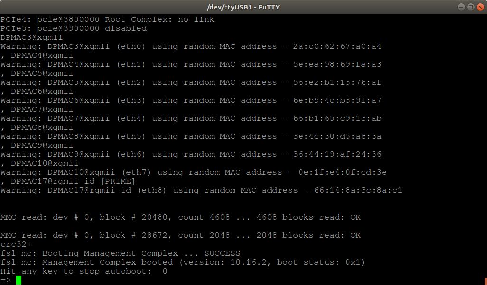

# HoneyComb AMD Quick Start Guide


## Introduction

The following quick start guide provides background information about the [HoneyComb LX2](https://www.solid-run.com/arm-servers-networking-platforms/honeycomb-workstation/) and [ClearFog CX LX2](https://www.solid-run.com/embedded-networking/nxp-lx2160a-family/cex7-lx2160/#carrier-boards) products which use the LX2160A Computer on module.

The guide will give a technical overview about the product and by the end of it you should be able to boot an operating system and begin testing your application.

## Revision and Notes

| **Date**          | **Owner**                                                                                                                                                                                                                                                                                                                                                                                                                                                                                                                                                                                                                                                                                                                                                                                                                                                                                                                                                                                                                                                                                                                                                                                                                                                                                                                                                                                                                                                                                                                                                                                                                                                                                                                                                                                                                                                                                               | **Revision** | **Notes** |
| ----------------- | ------------------------------------------------------------------------------------------------------------------------------------------------------------------------------------------------------------------------------------------------------------------------------------------------------------------------------------------------------------------------------------------------------------------------------------------------------------------------------------------------------------------------------------------------------------------------------------------------------------------------------------------------------------------------------------------------------------------------------------------------------------------------------------------------------------------------------------------------------------------------------------------------------------------------------------------------------------------------------------------------------------------------------------------------------------------------------------------------------------------------------------------------------------------------------------------------------------------------------------------------------------------------------------------------------------------------------------------------------------------------------------------------------------------------------------------------------------------------------------------------------------------------------------------------------------------------------------------------------------------------------------------------------------------------------------------------------------------------------------------------------------------------------------------------------------------------------------------------------------------------------------------------------- | ------------ | --------- |
| 28 Oct 2021       |                                                                                                                                                                                                                                                                                                                                                                                                                                                                                                                                                                                                                                                                                                                                                                                                                                                                                                                                                                                                                                                                                                                                                                                                                                                                                                                                                                                                                                                                                                                                                                                                                                                                                                                                                                                                                                                                                                         | 1.0          |           |
| Table of Contents | <p>- <a href="honeycomb-amd-quick-start-guide.md#introduction">Introduction</a><br>- <a href="honeycomb-amd-quick-start-guide.md#revision-and-notes">Revision and Notes</a><br>- <a href="honeycomb-amd-quick-start-guide.md#hardware-setup">Hardware Setup</a><br>- <a href="honeycomb-amd-quick-start-guide.md#product-specifications">Product Specifications</a><br>- <a href="honeycomb-amd-quick-start-guide.md#block-diagram">Block Diagram</a><br>- <a href="honeycomb-amd-quick-start-guide.md#visual-features-overview">Visual features overview</a><br>- <a href="honeycomb-amd-quick-start-guide.md#software-setup">Software Setup</a><br>- <a href="honeycomb-amd-quick-start-guide.md#cable-setup-and-prerequisites">Cable setup and prerequisites</a><br>- <a href="honeycomb-amd-quick-start-guide.md#recommended-cables">Recommended Cables</a><br>- <a href="honeycomb-amd-quick-start-guide.md#boot-select">Boot Select</a><br>- <a href="honeycomb-amd-quick-start-guide.md#booting-from-an-sd-card">Booting from an SD card</a><br>- <a href="honeycomb-amd-quick-start-guide.md#sfp-modules">SFP Modules</a><br>- <a href="honeycomb-amd-quick-start-guide.md#using-the-built-in-nics">Using the built-in NICs</a><br>- <a href="honeycomb-amd-quick-start-guide.md#packet-generator-using-dpdk">Packet Generator using DPDK</a><br>- <a href="honeycomb-amd-quick-start-guide.md#gpus">GPUs</a><br>- <a href="honeycomb-amd-quick-start-guide.md#tips">Tips</a><br>- <a href="honeycomb-amd-quick-start-guide.md#example-to-install-gentoo-from-the-ubuntu">Example to install Gentoo from the Ubuntu</a><br>- <a href="honeycomb-amd-quick-start-guide.md#build-from-source">Build From Source</a><br>- <a href="honeycomb-amd-quick-start-guide.md#documentation">Documentation</a><br>- <a href="honeycomb-amd-quick-start-guide.md#related-articles">Related Articles</a></p> |              |           |

## Hardware Setup

#### Product Specifications

|                                  | **ClearFog CX LX2**                                                                  | **HoneyComb LX2**                                                   |
| -------------------------------- | ------------------------------------------------------------------------------------ | ------------------------------------------------------------------- |
| I/Os                             | <p>3 x USB 3.0<br>3 x USB 2.0</p>                                                    | <p>3 x USB 3.0<br>3 x USB 2.0</p>                                   |
| Networking                       | <p>1 x QSFP port 100GbE<br>4 x SFP+ ports (10GbE each)<br>1 x 1GbE copper (RJ45)</p> | <p>4 x SFP+ ports (10GbE each)<br>1 x 1GbE copper (RJ45)</p>        |
| Processor                        | NXP Layerscape LX2160A 16-core Arm Cortex A72 up to 2GHz                             | NXP Layerscape LX2160A 16-core Arm Cortex A72 up to 2GHz            |
| Memory & Storage                 | <p>Up to 64GB DDR4 DIMM<br>64GB eMMC<br>MicroSD<br>4 x SATA 3.0</p>                  | <p>Up to 64GB DDR4 DIMM<br>64GB eMMC<br>MicroSD<br>4 x SATA 3.0</p> |
| Misc.                            | USB to STM32 for remote management                                                   | USB to STM32 for remote management                                  |
| Development and Debug interfaces | <p>Micro USB<br>JTAG</p>                                                             | <p>Micro USB<br>JTAG</p>                                            |
| Power                            | ATX standard                                                                         | ATX standard                                                        |
| Expansion card I/Os              | <p>1 x PCIe x8 Gen 3.0, open slot (can support x16)<br>1 x M.2</p>                   | <p>1 x PCIe x8 Gen 3.0, open slot (can support x16)<br>1 x M.2</p>  |
| Temperature                      | Commercial: 0°C to 70°C                                                              | Commercial: 0°C to 70°C                                             |
| Dimensions                       | PCBA: 170 x 170mm                                                                    | PCBA: 170 x 170mm                                                   |



* See list of tested [LX2160A COM Tested SO-DIMM Memory](https://solidrun.atlassian.net/wiki/spaces/developer/pages/197494332) modules.
* The difference between the two versions is that HoneyComb does not have a QSFP interface
* Serdes-1 lanes 0..3 are routed to the QSFP28 connector via TI retimers
* Serdes-1 lanes 4..7 are directly connected to the 4xSFP+ ports



## **Block Diagram**

The following figure describes the ClearFog CX Block Diagram.


## Visual features overview

Please see below the features overview of the connector side of the HoneyComb


## Software Setup

#### Cable setup and prerequisites

Here is what you will need to power up the board:

* Linux or Windows PC
* ClearFog CX/ HoneyComb
* ATX 150W+ or Pico PSU 5A@12V
* Micro USB to USB for console, the ClearFog Base has an onboard FTDI chip.
* IP router or IP switch

## Recommended Cables

The following is a list of industry-standard cables, sorted by type, with the necessary compliance requirements that have been proven to work well with the ClearFog product family.

These examples are the cables which SolidRun uses for testing, and should provide enough information to source products from your preferred cable vendor.

* Ethernet cable: Monoprice 24AWG Cat6A 500MHz STP
* USB Cable: SuperSpeed USB 3.0 Type A Male to Female Extension Cable in Black
* SFP connector: GigaLite GE-GB-P1RT-E SFP module with Monoprice 24AWG Cat6A 500MHz STP cable

## Boot Select

Before powering up the board for the first time it is recommended to select the boot media. In order to configure the boot media, please refer to the following DIP switch:

|            |          |          |          |          |          |
| ---------- | -------- | -------- | -------- | -------- | -------- |
| Boot media | Switch 1 | Switch 2 | Switch 3 | Switch 4 | Switch 5 |
| SD         | OFF      | ON       | ON       | ON       | X        |
| eMMC       | OFF      | ON       | ON       | OFF      | X        |
| SPI        | OFF      | OFF      | OFF      | OFF      | X        |

The following shows how to set the switches on the boot source selector:


## Booting from an SD card

The switches on the boot source **SW1** selector must be set as follows:

|          |          |          |          |          |
| -------- | -------- | -------- | -------- | -------- |
| Switch 1 | Switch 2 | Switch 3 | Switch 4 | Switch 5 |
| OFF      | ON       | ON       | ON       | X        |

The following shows how to set the switches on the boot source selector:


Once you set the switches, you can apply the following for booting from an SD card.

**1. Downloading the image**

Download a pre-built snapshot image from [SolidRun Images](https://images.solid-run.com/LX2k/lx2160a_build)

Those images are built with the suffix of the commit ID of the [GitHub - SolidRun/lx2160a\_build](https://github.com/SolidRun/lx2160a_build)  project that you can clone and build by yourself.


**Please note** The prebuilt images are configured for SO-DIMM DDR4 with speed of 3200, 2900, 2600 and 2400 Mtps (with or without ECC support),. Images that have the prefix lx2160a\_xspi are intended to be flashed into SPI and recommended for later use after being booted from micro SD



You can build your own image using the script in here – [GitHub - SolidRun/lx2160a\_build](https://github.com/SolidRun/lx2160a_build)

**2. Writing the image to the SD card**

Use the following commands for writing the image to an SD card:

```
xz -dc lx2160acex7_2000_700_....img.xz | dd of=/dev/sdX bs=4k conv=fdatasync
```

* For more information, please visit [Flashing an SD Card](/homepage/other-articles/flashing-an-sd-card.md) .


Note: Plug a micro SD into your Linux PC, the following assumes that the micro SD is added as /dev/sdX and all it’s partitions are unmounted.



**3. SD card insertion**

Please Insert the SD card into your device.

**4. Power connection**

Connect your power ATX, and then connect the adaptor to mains supply.

**5. Serial Connection**

Please insert the micro USB into your device, then you can refer to [Serial Connection](https://solidrun.atlassian.net/wiki/spaces/developer/pages/287801409) for installing necessary serial connection software in Linux/Windows.

&#x20;Stop the u-boot count down by clicking any key –



To flash to eMMC run the following commands (it will wipre your data on the eMMC device).


For this to work eMMC distroboot support is required (patch is here – [LSDK-19.09 u-boot support · SolidRun/lx2160a\_build@75891e5](https://github.com/SolidRun/lx2160a_build/commit/75891e5cb4d2171a2094c1e35087374b1f47acdd)  )



```
load mmc 0:1 0xa4000000 ubuntu-core.img
mmc dev 1
mmc write 0xa4000000 0 0xd2000
```



**Please Note:** The above commands should be run only once (in the fist boot).



Boot the machine by running ‘**boot**’ in u-boot.

Once you installed the necessary serial connection software and ran the above commands , you should be able to see the following:


* In order to be able to log in , please insert “**root**” as a username and password as follows:



**Please note** If you are willing to use a similar image in production you must change this password, or completely disable root login.



**6. Final stages**

The following stages need to be done in order to finalise the imaging:

1. Run `fdisk /dev/mmcblk0` if using SD, or run if using `fdisk /dev/mmcblk1` eMMC.
2. Recreate the first partition by deleting it and then creating a new partition that starts at block 131072 and extends to the end of the drive (or less depending on your needs).
3. Write the new partition, when prompt about ‘Do you want to remove the signature?’ then answer with No.
4. Run `resize2fs /dev/mmcblk0p1` if using SD Card, or Run `resize2fs /dev/mmcblk1p1` if using eMMC.
5. In this stage the root partition should be big enough to start populating it; but first update the RTC clock.
6. Connect the RJ45 to your network with internet access (and DHCP server); and then run `dhclient` .
7. Update the RTC clock by running `ntpdate pool.ntp.org` and then `hwclock -w`.
8. Run apt-update commands below and then populate the root filesystem as you wish.

```
apt-get update && apt-get upgrade -y
```

Please see below an example of resizing the filesystem :


## SFP Modules

For some SFP modules that work on SolidRun networking hardware platforms, please refer to [SFP Modules](https://solidrun.atlassian.net/wiki/spaces/developer/pages/287212203) .

## Using the built-in NICs

In case of SERDES configuration of 8 (default build) then dpmac.3 to dpmac.10 can be exposed. Those are 8x10Gbps interfaces where first 4 dpmac.3 to dpmac.6 can be obtained by using a 40G to 4x10G splitter cable (or so called octopus cable) when connected to HoneyComb / ClearFog CX QSFP28 port and dpmac.7 to dpmac.10 are on the 2×2 SFP+ connector cage.

For example – dpmac.9 is the SFP+ port on the upper row and left towards PCB edge –

```
ls-addni dpmac.9
```

and then a new ethX ethernet interface is attached to the kernel.

For SERDES SD1 config 20 which is dual 40G, then dpmac.1 and dpmac.2 are to be used where dpmac.1 is achieved directly by using the QSFP port and dpmac.2 by using an 40G to 4x10G splitter cable where the splitter cable is connected to HoneyComb.

For different dpmac configuration please refer to the reference manual on different SERDES configuration and how it’s map to the different dpmacs.

## Packet Generator using DPDK

Following is an example instructions that demonstrates using the DPDK framework that is built in the lx2160a\_build project under build/dpdk/ directory –

1. Make sure that the kernel is booted with the following variables in the command line –

```
default_hugepagesz=1024m hugepagesz=1024m hugepages=2 isolcpus=1-15 iommu.passthrough=1
```

If using the above installation of Ubuntu then the /extlinux/extlinux.conf file should look as follows (the default installation with the addition of isolcpus=1-15 iommu.passthrough=1) –

```
  TIMEOUT 30
  DEFAULT linux
  MENU TITLE linux-lx2160a boot options
  LABEL primary
  MENU LABEL primary kernel
  LINUX /boot/Image
    FDT /boot/fsl-lx2160a-cex7.dtb
    APPEND console=ttyAMA0,115200 earlycon=pl011,mmio32,0x21c0000 default_hugepagesz=1024m hugepagesz=1024m hugepages=2 isolcpus=1-15 iommu.passthrough=1 pci=pcie_bus_perf root=PARTUUID=30303030-01 rw rootwait
```

2. From build/dpdk directory under the lx2160a\_build project, search for dynamic\_dpl.sh and testpmd files and copy them over to the LX2160A Ubuntu root filesystem
3. Run the following that will generate 10Gbps traffic on dpmac.10 using only a single core. Can be used to generate traffic on dpmac.1 and other interfaces –

```
dynamic_dpl.sh dpmac.10
export DPRC=dprc.2
testpmd -c 0x3 -n 1 -- --txd=1500 --txpkts=1500 --tx-first --auto-start --forward-mode=txonly --stats-period=10
```

Notice that DPRC variable in this case holds the output of dynamic\_dpl.sh

An alternative way to run testpmd in interactive mode is as follows –

```
dynamic_dpl.sh dpmac.10
export DPRC=dprc.2
testpmd -c 0x3 -n 1 -- --txd=1500 -i
set fwd txonly
set txpkts 1500
show port info 0
show config txpkts
start

```

## GPUs

GPUs that were briefly tested –

1. AMD RX550 2GB – requires installing the kernel modules first and then ‘linux-firmware’ package. Running ‘glmark2’ under X results 4633 and ‘glmark2 –fullscreen’ results 3983.
2. GeForce GTX 1050 2GT OCV1 – requires instsalling the kernel modules (simply untar on the root filesystem root directory) then the GPU is recognized and initialized. windowed glmark2 result is 150; which is very poor and most probably related to the OSS drivers (no binary drivers for ARM as for the time writing this article).

## Tips

1. sshd is disabled by default for root access. Edit /etc/ssh/sshd\_config and set ‘PermitRootLogin yes’
2. ssh to the machine might take long time after boot. To accelerate that install ‘rng-tools’ where it’s main daemon increases the kernel’s entropy and accelerates random number key generation (which used by libssl and sshd afterwards).

## Example to install Gentoo from the Ubuntu

Gentoo is a free and open-source distribution with a rolling-release model.\
The bootloader and kernel provided are recent enough to install Gentoo from the eMMC Ubuntu to the NVMe or SATA device.

```
 apt install btrfs-progs
 mkfs.btrfs /dev/nvme0n1p1
 mount /dev/nvme0n1p1 /mnt
 cd /mnt
# change 20200609 with what's available here http://distfiles.gentoo.org/experimental/arm64/
 wget http://distfiles.gentoo.org/experimental/arm64/stage3-arm64-20200609.tar.bz2
 mount --rbind /dev dev
 mount --make-rslave dev
 mount -t proc /proc proc
 mount --rbind /sys sys
 mount --make-rslave sys
 mount --rbind /tmp tmp
 cp /etc/resolv.conf etc
 chroot . /bin/bash
 env-update && . /etc/profile
 emerge-webrsync
 emerge superadduser openssh vim
# Set the root password
 passwd 
# enable root login
 vim /etc/ssh/sshd_config 
# or create your user
 superadduser your_user
 ln -s /etc/init.d/net.{lo,eth0}
 rc-update add sshd default
 reboot
```


**Please note**
* If you need to install the Gentoo to the SATA change the /dev/nvme0n1p1 to /dev/sdx.
* In the same way, can install Debian or another Linux arm64 distribution.




**Please note**
* The default bootcmd probes every device and looks for a /extlinux/extlinux.conf
* The kernel command line uses the PARTUUID to boot the right drive can editing the root in the extlinux.conf to use directly root=/dev/nvme0n1p1 or  root=/dev/sdx .



## Build From Source

* You can build your own image using the script in here – [GitHub - SolidRun/lx2160a\_build](https://github.com/SolidRun/lx2160a_build)
* Generating UEFI firmware for the LX2160a - [GitHub - SolidRun/lx2160a\_uefi](https://github.com/SolidRun/lx2160a_uefi)
* Using HoneyComb LX2K as a Desktop - [https://github.com/Wooty-B/LX2K\_Guide](https://github.com/Wooty-B/LX2K_Guide)


* Download a pre-built snapshot image based on Ubuntu 20.04 from here [SolidRun Images](https://images.solid-run.com/LX2k/lx2160a_build)
* Download a UEFI firmware for the LX2160a from here [SolidRun Images](https://images.solid-run.com/LX2k/lx2160a_uefi)



## Documentation

|                                                                                                                                                                                                                                                                                                                                                                                                                                       | File                                                                                                                                                                          | Modified                                                                                           |
| ------------------------------------------------------------------------------------------------------------------------------------------------------------------------------------------------------------------------------------------------------------------------------------------------------------------------------------------------------------------------------------------------------------------------------------- | ----------------------------------------------------------------------------------------------------------------------------------------------------------------------------- | -------------------------------------------------------------------------------------------------- |
| <p>Labels<br><br>- No labels<br>- <a href="honeycomb-amd-quick-start-guide.md#section-7d18792c-abda-406a-ba7d-dfe403321f7a">Edit Labels</a><br><br>[Preview] <a href="../../../wiki/download/attachments/593330177/ClearFog+CX+LX2,+HoneyComb+LX2+Mechanical.zip">View</a> <a href="../../../wiki/pages/editattachment.action">Properties</a> <a href="../../../wiki/pages/confirmattachmentremoval.action">Delete</a></p>            | ZIP Archive [ClearFog CX LX2, HoneyComb LX2 Mechanical.zip](../../../wiki/download/attachments/593330177/ClearFog%20CX%20LX2,%20HoneyComb%20LX2%20Mechanical.zip)             | Jan 31, 2024 by [Rabeeh Khoury](../../../wiki/people/557058:99a92153-3f5e-430e-b8cf-907fde28b14e/) |
| <p>Labels<br><br>- No labels<br>- <a href="honeycomb-amd-quick-start-guide.md#section-0e2e5c88-4a40-4afa-b1e7-10cd71706bf0">Edit Labels</a><br><br>[Preview] <a href="../../../wiki/download/attachments/593330177/ClearFog-CX-and-HoneyComb-Schematics-and-Layout-4977.zip">View</a> <a href="../../../wiki/pages/editattachment.action">Properties</a> <a href="../../../wiki/pages/confirmattachmentremoval.action">Delete</a></p> | ZIP Archive [ClearFog-CX-and-HoneyComb-Schematics-and-Layout-4977.zip](../../../wiki/download/attachments/593330177/ClearFog-CX-and-HoneyComb-Schematics-and-Layout-4977.zip) | Jan 31, 2024 by [Rabeeh Khoury](../../../wiki/people/557058:99a92153-3f5e-430e-b8cf-907fde28b14e/) |

[Download All](../../../wiki/download/all_attachments)

## Related Articles

Error rendering macro 'contentbylabel' : CQL was parsed but the search manager was unable to execute the search. Error message: com.atlassian.confluence.api.service.exceptions.scale.SSStatusCodeException: There was an illegal request passed to XP-Search Aggregator API : HTTP/1.1 403 Forbidden
