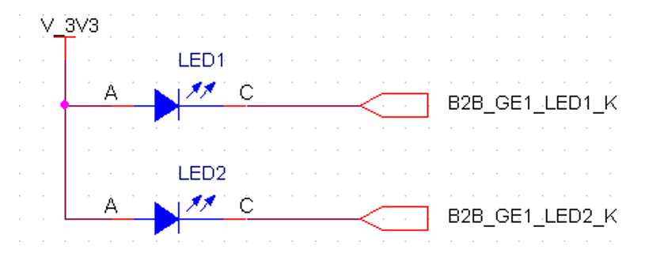

# A388 SOM Hardware User Manual

## Revision and Notes

| **Date**          | **Owner**                                                                                                                                                                                                                                                                                                                                                                                                                                                                                                                                                                                                                                                                                                                                                                                                                                                                                                                                                                                                                                                                                                                                                                                                                                                                                                                                                                                                                                                                                                                   | **Revision** | **Notes**               |
| ----------------- | --------------------------------------------------------------------------------------------------------------------------------------------------------------------------------------------------------------------------------------------------------------------------------------------------------------------------------------------------------------------------------------------------------------------------------------------------------------------------------------------------------------------------------------------------------------------------------------------------------------------------------------------------------------------------------------------------------------------------------------------------------------------------------------------------------------------------------------------------------------------------------------------------------------------------------------------------------------------------------------------------------------------------------------------------------------------------------------------------------------------------------------------------------------------------------------------------------------------------------------------------------------------------------------------------------------------------------------------------------------------------------------------------------------------------------------------------------------------------------------------------------------------------- | ------------ | ----------------------- |
| 11 Oct 2015       |                                                                                                                                                                                                                                                                                                                                                                                                                                                                                                                                                                                                                                                                                                                                                                                                                                                                                                                                                                                                                                                                                                                                                                                                                                                                                                                                                                                                                                                                                                                             | 1.0          | Initial release         |
| May 21, 2023      |                                                                                                                                                                                                                                                                                                                                                                                                                                                                                                                                                                                                                                                                                                                                                                                                                                                                                                                                                                                                                                                                                                                                                                                                                                                                                                                                                                                                                                                                                                                             | 1.1          | Added Errata for eFuses |
| Table of Contents | 
- <a href="a388-som-hardware-user-manual.md#revision-and-notes">Revision and Notes</a> - <a href="a388-som-hardware-user-manual.md#a388-som-block-diagram">A388 SOM Block Diagram</a> - <a href="a388-som-hardware-user-manual.md#connecting-to-the-a388-som">Connecting to the A388 SOM</a> - <a href="a388-som-hardware-user-manual.md#power-and-power-management">Power and Power Management</a> - <a href="a388-som-hardware-user-manual.md#power-up-sequence">Power up sequence</a> - <a href="a388-som-hardware-user-manual.md#power-up-sequence">Power up sequence</a> - <a href="a388-som-hardware-user-manual.md#multi-purpose-pins-mpp">Multi-Purpose Pins (MPP)</a> - <a href="a388-som-hardware-user-manual.md#high-speed-serdes">High Speed SERDES</a> - <a href="a388-som-hardware-user-manual.md#usb-host-connectivity">USB Host Connectivity</a> - <a href="a388-som-hardware-user-manual.md#usb-device-connectivity">USB Device connectivity</a> - <a href="a388-som-hardware-user-manual.md#integrated-gige-phy">Integrated GigE PHY</a> - <a href="a388-som-hardware-user-manual.md#miscellaneous">Miscellaneous</a> - <a href="a388-som-hardware-user-manual.md#cpu-speed-setting">CPU Speed setting</a> - <a href="a388-som-hardware-user-manual.md#known-issues">Known Issues</a> - <a href="a388-som-hardware-user-manual.md#documentation">Documentation</a> - <a href="a388-som-hardware-user-manual.md#related-articles">Related Articles</a>
 |              |                         |

## A388 SOM Block Diagram

Below is the block diagram description of the [A388 SOM](https://www.solid-run.com/embedded-networking/marvell-armada-family/armada-som/):

## **Connecting to the A388 SOM**

The A388 SOM has two Board-to-Board connectors used to connect to the carrier board. The SOM uses an 80 pin header from Hirose {part number “**DF40C-80DP-0.4V{51)**“). The carrier board must use a mating Hirose Receptacle such as the “**DF40C-80DS-0.4V{51)**” {producing 1.5mm mating height). Other Receptacles can be used to produce different mating heights up to 4.0mm.

The Board-to-Board pins are used for a variety of functionalities and purposes. The following sections describe those in detail.

## Power and Power Management

The A388 SOM has one global ground domain, four power input domains and one power output domain.

|               |                      |             |           |                                                                                            |
| ------------- | -------------------- | ----------- | --------- | ------------------------------------------------------------------------------------------ |
| **Name**      | **Description**      | **Voltage** | **Power** | **Notes / Instructions**                                                                   |
| GND           | Global Ground Net    | N/A         | N/A       | Connect to carrier ground plane.                                                           |
| B2B V MAIN    | Main voltage domain  | 3.3v-5.0v   | 7.5W1     | 
Connect to 5.0V DC-DC output or to 3.3V DC-DC output {or any value  between).
 |
| B2B V 3V3     | Low speed I/O domain | 3.3V        | 0.75W     | Connect to 3.3V DC-DC output.                                                              |
| B2B V RTC     |                      | 3.0V – 3.3V | \~0w      | Recommend to use two diodes to connect to backup battery and to B2B V 3V3                  |
| B2B V 1V8 VHV |                      | 1.8V        | \~0w      | Connect to B2B V 1V8 to enable programming internal fuses. Otherwise keep floating.        |

> \[!NOTE] **Notes:**
>
> 1. Power consumption of 7.5W on B2B V MAIN domain assuming all devices are assembled and all functions are operating at full utilization.
> 2. The A388 SOM has one B2B V 1V8 output power domain which is used to power the High Speed SERDES PHYs as well as the GigE PHY. In addition to those loads, the B2B 1V8 source can provide additional 0.5A to loads on carrier board.

In addition to the power domain signals, there are other signals which are used for power management and power-up/down sequencing:

| Name                 | Pullup/down               | Description                                                                                              | Notes / Instructions                                                                                 |
| -------------------- | ------------------------- | -------------------------------------------------------------------------------------------------------- | ---------------------------------------------------------------------------------------------------- |
| B2B 1V8 1V35 EN      | None                      | Enable signal of SOM I/O DC- DC.                                                                         | Do not float. Pullup to B2B\_V\_MAIN                                                                 |
| B2B 1V8 PWR EN       | PU {100 kO) to B2B V 3V3  | Advance power management                                                                                 | Do not connect to this signal.                                                                       |
| B2B MV VSDRAM PWR EN | PU {100 kO) to B2B V 3V3  | Advance power management                                                                                 | Do not connect to this signal.                                                                       |
| B2B OD 3V3 PG        | PU {4.7 kO) to B2B V MAIN | Carrier based DC- DC units feeding SOM are stable. Triggers CPU/Core DC-DC to start operating.           | Drive low until all power inputs to SOM are stable. Also Drive low to disable CPU/Core power domain. |
| B2B V CPU CORE PG    | OD                        | Indicates that CPU/Core power domain is up. This also means all other domains on the SOM are up as well. | If this signal needs to be sampled then add a 4.7 kO pullup resistor.                                |

## **Power up sequence**

The A388 SOM requires that all power inputs are stable before allowing B2B OD 3V3 PG to go high. Use DC-DC devices with power-good indication and drive B2B OD 3V3 PG low as long as the power- good indications SOM voltages are driven low.

#### **Power up sequence**

The A388 SOM requires that all power inputs are stable before allowing B2B OD 3V3 PG to go high. Use DC-DC devices with power-good indication and drive B2B OD 3V3 PG low as long as the power- good indications SOM voltages are driven low.

| Name            | Pullup/down              | Description                                                                                                                                    | Notes / Instructions                                                                                                                                           |
| --------------- | ------------------------ | ---------------------------------------------------------------------------------------------------------------------------------------------- | -------------------------------------------------------------------------------------------------------------------------------------------------------------- |
| B2B MRN         | PU {100 kO) to B2B V 3V3 | Manual Reset input. B2B SYSRST OUTN is driven low for as long as B2B MRn is driven low plus additional 100mS after B2B MRn is de-asserted.     | Connect to system push button reset or other system reset triggers. Make sure it is pulled high when not active. See ClearFog Pro reference design schematics. |
| B2B SYSRST OUTN | PU {4.7 kO) to B2B V 3V3 | Active low reset output asserted when B2B MRn is asserted, plus additional 100mS. Power on reset circuit will trigger B2B SYSRST OUTN as well. | This signal should be used to reset any device in the system that is intended to be reset by the B2B MRn reset event.                                          |
| B2B SYSRST INN  | None                     | Armada 388 input reset signal.                                                                                                                 | Short to B2B SYSRST OUTN to trigger Armada 388 reset on B2B MRn reset trigger event.                                                                           |

## **Multi-Purpose Pins (MPP)**

The Armada 388 has 60 Multi Purpose Pins. Each of those can be programmed to be a GPIO, Interrupt

input or have a specialized function. Appendix-A for details.

Out of the 60 pins 12 signals are used as RGMII0 on the SOM to connect to the GigE PHY and are not connected to the Board-to-Board {except MPP\[7:9] who are exposed to the Board-to-Board for the mere purpose of sampling at reset the boot select field.). The remainder pins can be used as GPIO, Interrupt input, UART, I2C, SPI, SDIO, PWM and more. Check spreadsheet in Appendix-A for more details.

Please notice that, if assembled, the onboard SPI ROM is connected to B2B MPP pins 56:59. Also, if assembled the eMMC device on the SOM is connected to B2B MPP pins 21, 28 and 37:40. If assembled those signals are terminated at the eMMC device and are not exposed to the Board-to-Board connector. Otherwise they are connected to the Board-to-Board in order to be potentially used on the carrier board.

For proper operation of the system, special attention is required for the following.

| Board-to-Board signal | Domain | Default Pull up/down | Special function / instructions.                                                      |
| --------------------- | ------ | -------------------- | ------------------------------------------------------------------------------------- |
| B2B UA0 RXD {MPP0)    | V 3V3  | PD                   |                                                                                       |
| B2B UA0 TXD {MPP1)    | V 3V3  | PD {510 O)           | Reserved. Pull down or float during reset.                                            |
| B2B I2C0 SCK {MPP2)   | V 3V3  | PU {4.7 kO)          |                                                                                       |
| B2B I2C0 SDA {MPP3)   | V 3V3  | PU {4.7 kO)          |                                                                                       |
| B2B GE MDC {MPP4)     | V 1V8  | PD {510 O)           | 
CPU0 Endianess. Do not modify default pull- up/down during reset.
           |
| B2B BOOT SEL 0 {MPP7) | V 1V8  | PD                   | 
Boot Device Mode[0]. Pull-up/down based on desired boot device.
             |
| B2B BOOT SEL 1 {MPP8) | V 1V8  | PU                   | 
Boot Device Mode[1] ]. Pull-up/down based on desired boot device.
           |
| B2B BOOT SEL 2 {MPP9) | V 1V8  | PU                   | 
Boot Device Mode[2] ]. Pull-up/down based on desired boot device.
           |
| B2B MPP22             | V 3V3  | PD                   | 
CPU0 Thumb Exception Init. Do not modify default pull-up/down during reset.
 |
| B2B MPP23             | V 3V3  | PU                   | PCI0 Express Clock Configuration                                                      |
| B2B MPP28             | V 3V3  | PD                   | I2C Serial ROM Initialization                                                         |
| B2B MPP29             | V 3V3  | PD                   | Core Clock Frequency Select                                                           |
| B2B MPP30             | V 3V3  | PD                   | CPU Subsystem Clock Frequency Options\[1]                                             |
| B2B MPP31             | V 3V3  | PU                   | CPU Subsystem Clock Frequency Options\[2]                                             |
| B2B MPP32             | V 3V3  | PD                   | 
CPU0 NMFI Enable. Do not modify default pull- up/down during reset.
         |
| B2B MPP33             | V 3V3  | PD                   | CPU Subsystem Clock Frequency Options\[0]                                             |
| B2B MPP34             | V 3V3  | PU                   | CPU Subsystem Clock Frequency Options\[3]                                             |
| B2B MPP35             | V 3V3  | PD                   | CPU Subsystem Clock Frequency Options\[4]                                             |
| B2B MPP36             | V 3V3  | PU                   | Reserved. Do not pull up or down during reset.                                        |
| B2B MPP38             | V 3V3  | PU                   | Revision ID - Do not pull up or down during reset.                                    |
| B2B MPP39             | V 3V3  | PU                   | Revision ID - Do not pull up or down during reset.                                    |
| B2B MPP40             | V 3V3  | PU                   | Revision ID - Do not pull up or down during reset.                                    |
| B2B MPP42             | V 3V3  | PU                   | 
Boot Device Mode[4] ]. Pull-up/down based on desired boot device.
           |
| B2B MPP44             | V 3V3  | PU                   | Reserved. Do not pull up or down during reset.                                        |
| B2B MPP47             | V 3V3  | PD                   | Reserved. Do not pull up or down during reset.                                        |
| B2B MPP51             | V 3V3  | PD                   | 
SSCG Disable. Do not modify default pull-up/down during reset.
              |
| B2B MPP56             | V 3V3  | PU                   | 
Boot Device Mode[5] ]. Pull-up/down based on desired boot device.
           |
| B2B MPP57             | V 3V3  | PD                   | 
Boot Device Mode[3] ]. Pull-up/down based on desired boot device.
           |

## High Speed SERDES

A388 SOM modules based on Marvell 88F6810 SoC {single core) have five High Speed SERDES lanes and modules based on Marvell 88F6820 and 88F6828 SoC have 6 lanes. The high speed lanes can be configured to support PCIe gen 2, SATA gen 3 {6Gbps), SGMII {up to 2.5Gbps), QSGMII or USB-3.0.

## USB Host Connectivity

## **USB Device connectivity**

## **Integrated GigE PHY**

A GigE PHY {Marvell 88E1512) is integrated into the A388 SOM and is connected to MAC0 via the SoC’s RGMII-0 interface. The following PHY interfaces are exposed to the Board-to-Board connector.

| Interface      | Domain    | Pullup/down           | Special function / instructions.                  |
| -------------- | --------- | --------------------- | ------------------------------------------------- |
| MDIO           | N/A       | N/A                   | Four Differential pairs carrying network traffic. |
| B2B PHY1 INTN  | B2B V 1V8 | PU {10 kO)            | Interrupt output of GigE PHY                      |
| B2B PHY1 RSTN  | B2B V 1V8 | PU {4.7 kO)           | Reset input of the GigE PHY.                      |
| B2B GE1 LED1 K | B2B V 1V8 | 510 O series resistor | Drive low on link. Blink on activity.1            |
| B2B GE1 LED2 K | B2B V 1V8 | 510 O series resistor | Drive low on 1000Mbps link1                       |

> \[!INFO] **Note** Based on default PHY device driver programming of PHY configuration registers.

Following is one way of connecting the B2B GE1 LEDx K signals to the actual LED devices. Notice that the LED devices must have a high enough Vf {Forward voltage) to ensure no light is emitted when the B2B GE1 LEDx K signals are high {approximately 1.8v).

## Miscellaneous

|             |                                                                                                                                                        |
| ----------- | ------------------------------------------------------------------------------------------------------------------------------------------------------ |
| **Setting** | **Details**                                                                                                                                            |
| 0X0         | BootROM Enabled, Boot from NOR:8 bits width,DEV\_Wen and DEV\_Oen are not muxed with DEV\_A(16:15), using MPP multiplexing option of NOR 8 bits        |
| 0X1         | BootROM Enabled, Boot from NOR:8 bits width,DEV\_Wen and DEV\_Oen are muxed with DEV\_A(16:15), using MPP multiplexing option of NOR 8 bits            |
| 0X4         | BootROM Enabled, Boot from NOR:16 bits width,DEV\_Wen and DEV\_Oen are not muxed with DEV\_A(16:15), using MPP multiplexing option of NOR 16 bits      |
| 0X5         | BootROM Enabled, Boot from NOR:16 bits width,DEV\_Wen and DEV\_Oen are muxed with DEV\_A(16:15), using MPP multiplexing option of NOR 16 bits          |
| 0X6         | Reserved                                                                                                                                               |
| 0X7         | Reserved                                                                                                                                               |
| 0X8         | BootROM Enabled, Boot from NAND:8 bits width,with page size of 512B, 3 Address cycles support per page, using MPP multiplexing option of NAND 8 bits   |
| 0X9         | BootROM Enabled, Boot from NAND:8 bits width,with page size of 512B, 4 Address cycles support per page, using MPP multiplexing option of NAND 8 bits   |
| 0X0A        | BootROM Enabled, Boot from NAND:8 bits width,with page size of 2KB, 4 bits ECC support per page, using MPP multiplexing option of NAND 8 bits          |
| 0X0B        | BootROM Enabled, Boot from NAND:8 bits width,with page size of 2KB, 8 bits ECC support per page, using MPP multiplexing option of NAND 8 bits          |
| 0X0E        | BootROM Enabled, Boot from NAND:8 bits width,with page size of 4KB, 4 bits ECC support per page, using MPP multiplexing option of NAND 8 bits          |
| 0X0F        | BootROM Enabled, Boot from NAND:8 bits width,with page size of 4KB, 8 bits ECC support per page, using MPP multiplexing option of NAND 8 bits          |
| 0X18        | BootROM Enabled, Boot from NAND: 16bits width,with page size of 512B, 3 Address Cycles support per page, using MPP multiplexing option of NAND 16 bits |
| 0X19        | BootROM Enabled, Boot from NAND: 16bits width,with page size of 512B, 4 Address Cycles support per page, using MPP multiplexing option of NAND 16 bits |
| 0X1A        | BootROM Enabled, Boot from NAND: 16 bits width,with page size of 2KB, 4 bits ECC support per page, using MPP multiplexing option of NAND 16 bits       |
| 0X1B        | BootROM Enabled, Boot from NAND: 16 bits width,with page size of 2KB, 8 bits ECC support per page, using MPP multiplexing option of NAND 16 bits       |
| 0X1E        | BootROM Enabled, Boot from NAND: 16 bits width,with page size of 4KB, 4 bits ECC support per page, using MPP multiplexing option of NAND 16 bits       |
| 0X1F        | BootROM Enabled, Boot from NAND: 16 bits width,with page size of 4KB, 8 bits ECC support per page, using MPP multiplexing option of NAND 16 bits       |
| 0X26        | BootROM Enabled, Boot from SPI: Controller #0. NAND Flash type, using MPP multiplexing option of SPI on MPP \[25:22]                                   |
| 0X27        | BootROM Enabled, Boot from SPI: Controller # 1. NAND Flash type, using MPP multiplexing option of SPI on MPP \[59:56]                                  |
| 0X28        | BootROM Enabled, Boot from UART: Controller # 0. supporting Boot, using MPP multiplexing option of UART on MPP \[1:0]                                  |
| 0X2A        | BootROM Enabled, Boot from SATA0: Controller # 0. using SERDERS multiplexing option of SATA on Lane # 0                                                |

|      |                                                                                                                                      |
| ---- | ------------------------------------------------------------------------------------------------------------------------------------ |
| 0X2B | BootROM Enabled, Boot from SATA0: Controller # 0. using SERDERS multiplexing option of SATA on Lane # 1                              |
| 0X2C | BootROM Enabled, Boot from PCle0: Controller # 0. using SERDERS multiplexing option of PCLe on Lane # 0                              |
| 0X2D | BootROM Enabled, Boot from PCle0: Controller # 0. using SERDERS multiplexing option of PCLe on Lane #1                               |
| 0X30 | BootROM Enabled, Boot from SDIO: Controller #0. using MPP multiplexing option of SDIO on {MPP \[59:57], MP\[55:52], MPP\[50:48]}     |
| 0X31 | BootROM Enabled, Boot from SDIO: Controller #0. using MPP multiplexing option of SDIO on {MPP \[40:37], MPP\[28:24], MPP\[21]}       |
| 0X32 | BootROM Enabled, Boot from SPI: Controller #0. 24 address bits, NOR Flash type using MPP multiplexing option of SPI on MPP \[25:22]  |
| 0X33 | BootROM Enabled, Boot from SPI: Controller #0. 32 address bits, NOR Flash type using MPP multiplexing option of SPI on MPP \[25:22]  |
| 0X34 | BootROM Enabled, Boot from SPI: Controller # 1. 24 address bits, NOR Flash type using MPP multiplexing option of SPI on MPP \[59:56] |
| 0X35 | BootROM Enabled, Boot from SPI: Controller # 1. 32address bits, NOR Flash type using MPP multiplexing option of SPI on MPP \[59:56]  |
| 0X36 | Reversed                                                                                                                             |
| 0X38 | Reversed                                                                                                                             |

## C**PU Speed setting**

Following are the defined values. All other values are reserved:

| **Setting** | **Details**                |
| ----------- | -------------------------- |
| 0x0         | Processor speed of 666MHz  |
| 0x2         | Processor speed of 666MHz  |
| 0x4         | Processor speed of 1066MHz |
| 0x6         | Processor speed of 1200MHz |
| 0x8         | Processor speed of 1333MHz |
| 0xC         | Processor speed of 1600MHz |

We run our boards at 1600MHz. Industrial devices are limited to 1333MHz. DRAM runs at half the Processor speed.

## Known Issues

* Programming eFuses can result in invalid data programmed if VHV power is enabled at power-on (Marvell HWE-3718342).\
  As workaround VHV power should be enabled programmatically, after SoC power-up is complete, and only before burning eFuses - e.g. via gpio controlled switch on the carrier. B2B\_V\_1V8\_VHV signal on the B2B connector supplies the VHV.

## **Documentation**

|                                                                                                                                                                                                                                                                                                                                                                                                                              | File                                                                                                                                                           | Modified                                                                                      |
| ---------------------------------------------------------------------------------------------------------------------------------------------------------------------------------------------------------------------------------------------------------------------------------------------------------------------------------------------------------------------------------------------------------------------------- | -------------------------------------------------------------------------------------------------------------------------------------------------------------- | --------------------------------------------------------------------------------------------- |
| 
Labels  - No labels - <a href="a388-som-hardware-user-manual.md#section-bf182453-c0a6-4c15-8295-97e1c9d7c2d2">Edit Labels</a>  [Preview] <a href="../../../wiki/download/attachments/197493392/sr-a38x-microsom-rev1.0-sample_board_assembly.pdf">View</a> <a href="../../../wiki/pages/editattachment.action">Properties</a> <a href="../../../wiki/pages/confirmattachmentremoval.action">Delete</a>
 | PDF File [sr-a38x-microsom-rev1.0-sample\_board\_assembly.pdf](../../../wiki/download/attachments/197493392/sr-a38x-microsom-rev1.0-sample_board_assembly.pdf) | Nov 07, 2021 by [SolidRun](../../../wiki/people/557058:12be2ae4-3a6e-40cc-a677-bdfc4c987d1f/) |
| 
Labels  - No labels - <a href="a388-som-hardware-user-manual.md#section-55ebb985-9493-4f2a-b94d-533ffc7888c4">Edit Labels</a>  [Preview] <a href="../../../wiki/download/attachments/197493392/a38x-microsom-schematics-simplified-rev2.1.pdf">View</a> <a href="../../../wiki/pages/editattachment.action">Properties</a> <a href="../../../wiki/pages/confirmattachmentremoval.action">Delete</a>
    | PDF File [a38x-microsom-schematics-simplified-rev2.1.pdf](../../../wiki/download/attachments/197493392/a38x-microsom-schematics-simplified-rev2.1.pdf)         | Nov 07, 2021 by [SolidRun](../../../wiki/people/557058:12be2ae4-3a6e-40cc-a677-bdfc4c987d1f/) |
| 
Labels  - No labels - <a href="a388-som-hardware-user-manual.md#section-bef46019-8c2c-460f-a327-a9c99758088e">Edit Labels</a>  [Preview] <a href="../../../wiki/download/attachments/197493392/a38x-microsom-pin-muxing.xlsx">View</a> <a href="../../../wiki/pages/editattachment.action">Properties</a> <a href="../../../wiki/pages/confirmattachmentremoval.action">Delete</a>
                     | Microsoft Excel Spreadsheet [a38x-microsom-pin-muxing.xlsx](../../../wiki/download/attachments/197493392/a38x-microsom-pin-muxing.xlsx)                        | Nov 07, 2021 by [SolidRun](../../../wiki/people/557058:12be2ae4-3a6e-40cc-a677-bdfc4c987d1f/) |
| 
Labels  - No labels - <a href="a388-som-hardware-user-manual.md#section-cc0222d7-6cfc-42a7-a1ca-99044e708e95">Edit Labels</a>  [Preview] <a href="../../../wiki/download/attachments/197493392/a38x-microsom-step-rev2.0.zip">View</a> <a href="../../../wiki/pages/editattachment.action">Properties</a> <a href="../../../wiki/pages/confirmattachmentremoval.action">Delete</a>
                     | ZIP Archive [a38x-microsom-step-rev2.0.zip](../../../wiki/download/attachments/197493392/a38x-microsom-step-rev2.0.zip)                                        | Nov 07, 2021 by [SolidRun](../../../wiki/people/557058:12be2ae4-3a6e-40cc-a677-bdfc4c987d1f/) |
| 
Labels  - No labels - <a href="a388-som-hardware-user-manual.md#section-8122eae8-f7be-4861-bb63-29c00d718a27">Edit Labels</a>  [Preview] <a href="../../../wiki/download/attachments/197493392/a38x-microsom-3d-design-rev2.0.pdf">View</a> <a href="../../../wiki/pages/editattachment.action">Properties</a> <a href="../../../wiki/pages/confirmattachmentremoval.action">Delete</a>
                | PDF File [a38x-microsom-3d-design-rev2.0.pdf](../../../wiki/download/attachments/197493392/a38x-microsom-3d-design-rev2.0.pdf)                                 | Nov 07, 2021 by [SolidRun](../../../wiki/people/557058:12be2ae4-3a6e-40cc-a677-bdfc4c987d1f/) |
| 
Labels  - No labels - <a href="a388-som-hardware-user-manual.md#section-5425a220-793e-4db4-864b-0ac9e57d33c7">Edit Labels</a>  [Preview] <a href="../../../wiki/download/attachments/197493392/a38x-microsom-dxf-rev2.0.zip">View</a> <a href="../../../wiki/pages/editattachment.action">Properties</a> <a href="../../../wiki/pages/confirmattachmentremoval.action">Delete</a>
                      | ZIP Archive [a38x-microsom-dxf-rev2.0.zip](../../../wiki/download/attachments/197493392/a38x-microsom-dxf-rev2.0.zip)                                          | Nov 07, 2021 by [SolidRun](../../../wiki/people/557058:12be2ae4-3a6e-40cc-a677-bdfc4c987d1f/) |

[Download All](../../../wiki/download/all_attachments)

[Buy a Sample Now](https://shop.solid-run.com/?filter_som-com-family=marvell-a388&_ga=2.85367450.2016484779.1641802897-2012112798.1622706355)

## Related Articles

Error rendering macro 'contentbylabel' : CQL was parsed but the search manager was unable to execute the search. Error message: com.atlassian.confluence.api.service.exceptions.scale.SSStatusCodeException: There was an illegal request passed to XP-Search Aggregator API : HTTP/1.1 403 Forbidden
