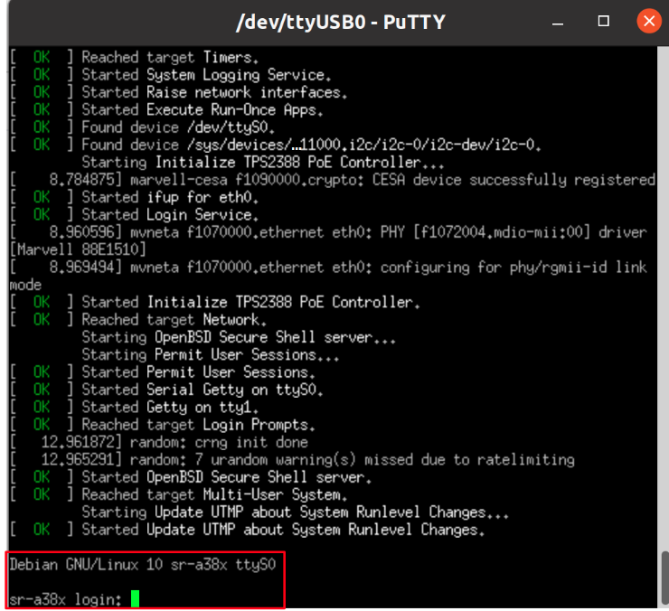

# ClearFog A388 Base Quick Start Guide

.png>)

## Revision and Notes

| **Date**          | **Owner**                                                                                                                                                                                                                                                                                                                                                                                                                                                                                                                                                                                                                                                                                                                                                                                                                                                                                                                                                                                                                                                                                                                                                                                                                                                                                                                                                                                                                                                                                                                                                                                                                                                                                                                                                                                                            | **Revision** | **Notes**                                                                                                                    |
| ----------------- | -------------------------------------------------------------------------------------------------------------------------------------------------------------------------------------------------------------------------------------------------------------------------------------------------------------------------------------------------------------------------------------------------------------------------------------------------------------------------------------------------------------------------------------------------------------------------------------------------------------------------------------------------------------------------------------------------------------------------------------------------------------------------------------------------------------------------------------------------------------------------------------------------------------------------------------------------------------------------------------------------------------------------------------------------------------------------------------------------------------------------------------------------------------------------------------------------------------------------------------------------------------------------------------------------------------------------------------------------------------------------------------------------------------------------------------------------------------------------------------------------------------------------------------------------------------------------------------------------------------------------------------------------------------------------------------------------------------------------------------------------------------------------------------------------------------------- | ------------ | ---------------------------------------------------------------------------------------------------------------------------- |
| 07 Dec 2021       |                                                                                                                                                                                                                                                                                                                                                                                                                                                                                                                                                                                                                                                                                                                                                                                                                                                                                                                                                                                                                                                                                                                                                                                                                                                                                                                                                                                                                                                                                                                                                                                                                                                                                                                                                                                                                      | 1.0          | Initial release                                                                                                              |
| 12 Nov 2024       | Yazan Shhady                                                                                                                                                                                                                                                                                                                                                                                                                                                                                                                                                                                                                                                                                                                                                                                                                                                                                                                                                                                                                                                                                                                                                                                                                                                                                                                                                                                                                                                                                                                                                                                                                                                                                                                                                                                                         | 1.1          | Revised the block diagram to include the uSIM connection within the M.2 module and updated the M.2 type from Key-M to Key-B. |
| 28 Nov 2024       | Yazan Shhady                                                                                                                                                                                                                                                                                                                                                                                                                                                                                                                                                                                                                                                                                                                                                                                                                                                                                                                                                                                                                                                                                                                                                                                                                                                                                                                                                                                                                                                                                                                                                                                                                                                                                                                                                                                                         | 1.2          | Add Clearfog-Base schematics rev 1.4                                                                                         |
| Table of Contents | <p>- <a href="clearfog-a388-base-quick-start-guide.md#revision-and-notes">Revision and Notes</a><br>- <a href="clearfog-a388-base-quick-start-guide.md#introduction">Introduction</a><br>- <a href="clearfog-a388-base-quick-start-guide.md#hardware-setup">Hardware Setup</a><br>- <a href="clearfog-a388-base-quick-start-guide.md#product-specifications">Product Specifications</a><br>- <a href="clearfog-a388-base-quick-start-guide.md#block-diagram">Block Diagram</a><br>- <a href="clearfog-a388-base-quick-start-guide.md#visual-features-overview">Visual features overview</a><br>- <a href="clearfog-a388-base-quick-start-guide.md#software-setup">Software Setup</a><br>- <a href="clearfog-a388-base-quick-start-guide.md#cable-setup-and-prerequisites">Cable setup and prerequisites</a><br>- <a href="clearfog-a388-base-quick-start-guide.md#recommended-cables">Recommended Cables</a><br>- <a href="clearfog-a388-base-quick-start-guide.md#boot-select">Boot Select</a><br>- <a href="clearfog-a388-base-quick-start-guide.md#booting-from-an-sd-card">Booting from an SD card</a><br>- <a href="clearfog-a388-base-quick-start-guide.md#gpio-pins-control">GPIO pins Control</a><br>- <a href="clearfog-a388-base-quick-start-guide.md#sfp-modules">SFP Modules</a><br>- <a href="clearfog-a388-base-quick-start-guide.md#sim-card-slot">SIM Card Slot</a><br>- <a href="clearfog-a388-base-quick-start-guide.md#list-of-supported-os">List Of Supported OS</a><br>- <a href="clearfog-a388-base-quick-start-guide.md#build-u-boot-kernel-from-sources">Build U-Boot &#x26; kernel from sources</a><br>- <a href="clearfog-a388-base-quick-start-guide.md#documentation">Documentation</a><br>- <a href="clearfog-a388-base-quick-start-guide.md#related-articles">Related Articles</a></p> |              |                                                                                                                              |

## Introduction

The following quick start guide provides background information about the [ClearFog Base](https://www.solid-run.com/embedded-networking/marvell-armada-family/clearfog/#base) product which use the A388 System on module.

The guide will give a technical overview about the product and by the end of it you should be able to boot an operating system and begin testing your application.

For CN9130 SOM Software, please refrer to the following link:[CN913x Build](../marvell-cn913x-based-products/cn913x-software/cn913x-build.md)

## Hardware Setup

#### Product Specifications

|                      |                                                                                                                                                                         |
| -------------------- | ----------------------------------------------------------------------------------------------------------------------------------------------------------------------- |
| **SOM CPU**          | ARMADA A388                                                                                                                                                             |
| **Processor**        | 32-bit Cortex A9                                                                                                                                                        |
| **Core Frequency**   | up to 1.6GHz                                                                                                                                                            |
| **Memory & Storage** | 32bit DDR3 W/ ECC, Up to 2GB at 1600MT/s                                                                                                                                |
|                      | M.2\*\*                                                                                                                                                                 |
|                      | MicroSD or 8GB eMMC (Optional)\*\*\*                                                                                                                                    |
| **Connectivity**     | 1 x mPCIE PCIe X1 Gen2.0                                                                                                                                                |
|                      | 1 x USB 3.0 port                                                                                                                                                        |
|                      | 2 x Port dedicated Ethernet                                                                                                                                             |
|                      | 1 x SFP 2.5GbE                                                                                                                                                          |
| **I/O & Misc.**      | mikroBUS                                                                                                                                                                |
|                      | Indication LEDs                                                                                                                                                         |
|                      | User Push Buttons                                                                                                                                                       |
|                      | PoE expansion header                                                                                                                                                    |
|                      | RTC Battery                                                                                                                                                             |
|                      | FTDI (Console Only)                                                                                                                                                     |
| **OS Support**       | Linux, OpenWrt/LEDE, Yocto                                                                                                                                              |
| **Power**            | Wide range 9V-32V                                                                                                                                                       |
| **Dimensions**       | 103mm x 75mm (PCBA)                                                                                                                                                     |
|                      | 125mm x 80mm x 31mm (enclosed)                                                                                                                                          |
| **Enclosure**        | Optional Metal Enclosure                                                                                                                                                |
|                      | [Buy Now](https://shop.solid-run.com/product-category/embedded-computers/marvell-family/clearfog-base-pro/?_ga=2.126128654.2016484779.1641802897-2012112798.1622706355) |

> \[!NOTE] **Please Note :** (\*\*) M.2 includes USB 3.0, SATA, GNSS, 3G modules support (in carrier Base only)\
> (\*\*\*) Assembly option on the SOM

> \[!INFO] Supported with A388 SOM. For more detailed information about our A388 SOM series please visit this user manual : [A388 SOM Hardware User Manual](a388-som-hardware-user-manual.md) .

## **Block Diagram**

The following figure describes the ClearFog Base Block Diagram.


## Visual features overview

Please see below the features overview of the connector side of the ClearFog Base (A388 SoM assembled).


Print side connector overview of the ClearFog Base.


## Software Setup

#### Cable setup and prerequisites

Here is what you will need to power up the board:

* Linux or Windows PC
* ClearFog Base with SOM
* 12V Power adapter (ClearFog Base has wide range input of 9V-32V, it is recommended to use 12V power adapter)
* Micro USB to USB for console, the ClearFog Base has an onboard FTDI chip.
* IP router or IP switch

## Recommended Cables

The following is a list of industry-standard cables, sorted by type, with the necessary compliance requirements that have been proven to work well with the ClearFog product family (ClearFog Base / Pro).

These examples are the cables which SolidRun uses for testing, and should provide enough information to source products from your preferred cable vendor.

* Ethernet cable: Monoprice 24AWG Cat6A 500MHz STP
* USB Cable: SuperSpeed USB 3.0 Type A Male to Female Extension Cable in Black
* SFP connector: GigaLite GE-GB-P1RT-E SFP module with Monoprice 24AWG Cat6A 500MHz STP cable

## Boot Select

Before powering up the board for the first time it is recommended to select the boot media. In order to configure the boot media, please refer to [ClearFog A388 Boot Select](a388-other-articles/clearfog-a388-boot-select.md) .

## Booting from an SD card

The switches on the boot source selector must be set as follows:

|          |          |          |          |          |
| -------- | -------- | -------- | -------- | -------- |
| Switch 1 | Switch 2 | Switch 3 | Switch 4 | Switch 5 |
| OFF      | OFF      | ON       | ON       | ON       |

The following shows how to set the switches on the boot source selector:


Once you set the switches, you can apply the following for booting from an SD card.

**1. Downloading the Debian image**

```
wget https://images.solid-run.com/A38X/Debian/sr-a38x-debian-bullseye-20220427.img.xz
```

* For more Debian releases, please visit [Debian Releases for Armada 38X](https://images.solid-run.com/A38X/Debian).

**2. Writing the image to the SD card**

Use the following commands for writing the image to an SD card:

```
xz -dc sr-a38x-debian-bullseye-20220427.img.xz | dd of=/dev/sdX bs=4k conv=fdatasync
```

* For more information, please visit [Flashing an SD Card](../../other-articles/flashing-an-sd-card.md) .

> \[!NOTE] Note: Plug a micro SD into your Linux PC, the following assumes that the micro SD is added as /dev/sdX and all it’s partitions are unmounted.

**3. U-Boot installation**

```
wget https://images.solid-run.com/A38X/U-Boot/u-boot-clearfog-base-sdhc.kwb 
```

**4. Writing U-Boot to the SD card**

```
dd if=u-boot-clearfog-base-sdhc.kwb of=/dev/sdX bs=512 seek=1 conv=sync status=progress
```

* For more information, you can refer to [A38X U-Boot](a388-software/a38x-u-boot.md) .

**5. SD card insertion**

Please Insert the SD card into your device.

**6. Power connection**

Connect your power adaptor to the DC jack, and then connect the adaptor to mains supply.

**7. Serial Connection**

Please insert the micro USB into your device, then you can refer to [Serial Connection](../../other-articles/serial-connection.md) for installing necessary serial connection software in Linux/Windows.

Once you installed the necessary serial connection software, you should be able to see the following:



* In order to be able to log in , please insert “debian” as a username and password as follows:


## GPIO pins Control

To control on the GPIO pins, please follow this page [ClearFog Base/Pro GPIO Pins Control](a388-other-articles/clearfog-base-pro-gpio-pins-control.md) .

## SFP Modules

For some SFP modules that work on SolidRun networking hardware platforms, please refer to [SFP Modules](a388-other-articles/sfp-modules.md) .

## SIM Card Slot

It is possible to utilize a Cellular connection by inserting a SIM card into the SIM card slot. Please observe that a GSM Cellular modem needs to be installed utilizing the mini PCIe connection in order to exploit the cellular connection.

> \[!WARNING] **Please Note** If your ClearFog has dual SIM card slots, an additional cellular modem will need to be installed in the mini PCIe connection in order to utilize the 2nd SIM connection.

## List Of Supported OS

| **OS**                                                  |                                                                               |
| ------------------------------------------------------- | ----------------------------------------------------------------------------- |
|  | [A388 Buildroot](a388-software/a388-buildroot.md)                             |
|  | [Yocto for Clearfog Platforms](a388-software/yocto-for-clearfog-platforms.md) |
|  | [OpenWrt](a388-software/a388-openwrt.md)                                      |
|  | [SolidRun Images](https://images.solid-run.com/A38X/Debian)                   |

## Build U-Boot & kernel from sources

* U-Boot Build - [A38X U-Boot](a388-software/a38x-u-boot.md)
* Kernel Build - [A388 Kernel](a388-software/a388-kernel.md)

## Documentation

|                                                                                                                                                                                                                                                                                                                                                                                                                              | File                                                                                                                                                  | Modified                                                                                      |
| ---------------------------------------------------------------------------------------------------------------------------------------------------------------------------------------------------------------------------------------------------------------------------------------------------------------------------------------------------------------------------------------------------------------------------- | ----------------------------------------------------------------------------------------------------------------------------------------------------- | --------------------------------------------------------------------------------------------- |
| <p>Labels<br><br>- No labels<br>- <a href="clearfog-a388-base-quick-start-guide.md#section-b04d1d4a-e471-4b7b-8a1c-fd5a1a747170">Edit Labels</a><br><br>[Preview] <a href="../../../wiki/download/attachments/267943944/ClearFog+Base+Rev+1.1+vs+Rev+1.2.pdf">View</a> <a href="../../../wiki/pages/editattachment.action">Properties</a> <a href="../../../wiki/pages/confirmattachmentremoval.action">Delete</a></p>       | PDF File [ClearFog Base Rev 1.1 vs Rev 1.2.pdf](../../../wiki/download/attachments/267943944/ClearFog%20Base%20Rev%201.1%20vs%20Rev%201.2.pdf)        | Dec 26, 2021 by [SolidRun](../../../wiki/people/557058:12be2ae4-3a6e-40cc-a677-bdfc4c987d1f/) |
| <p>Labels<br><br>- No labels<br>- <a href="clearfog-a388-base-quick-start-guide.md#section-7456a8c1-50b9-47b8-adbe-f3ddc05ea5f6">Edit Labels</a><br><br>[Preview] <a href="../../../wiki/download/attachments/267943944/ClearFog-Base-Mechanical+Files.zip">View</a> <a href="../../../wiki/pages/editattachment.action">Properties</a> <a href="../../../wiki/pages/confirmattachmentremoval.action">Delete</a></p>         | ZIP Archive [ClearFog-Base-Mechanical Files.zip](../../../wiki/download/attachments/267943944/ClearFog-Base-Mechanical%20Files.zip)                   | Dec 26, 2021 by [SolidRun](../../../wiki/people/557058:12be2ae4-3a6e-40cc-a677-bdfc4c987d1f/) |
| <p>Labels<br><br>- No labels<br>- <a href="clearfog-a388-base-quick-start-guide.md#section-4c671e56-210d-425b-a541-dbe1484f24a6">Edit Labels</a><br><br>[Preview] <a href="../../../wiki/download/attachments/267943944/ClearFog+Base+Enclosure+Files.zip">View</a> <a href="../../../wiki/pages/editattachment.action">Properties</a> <a href="../../../wiki/pages/confirmattachmentremoval.action">Delete</a></p>          | ZIP Archive [ClearFog Base Enclosure Files.zip](../../../wiki/download/attachments/267943944/ClearFog%20Base%20Enclosure%20Files.zip)                 | Dec 26, 2021 by [SolidRun](../../../wiki/people/557058:12be2ae4-3a6e-40cc-a677-bdfc4c987d1f/) |
| <p>Labels<br><br>- No labels<br>- <a href="clearfog-a388-base-quick-start-guide.md#section-49f7882a-4851-42a6-aeff-62132375cc49">Edit Labels</a><br><br>[Preview] <a href="../../../wiki/download/attachments/267943944/ClearFog+Base+BOM+rev+1.2.4.xlsx">View</a> <a href="../../../wiki/pages/editattachment.action">Properties</a> <a href="../../../wiki/pages/confirmattachmentremoval.action">Delete</a></p>           | Microsoft Excel Spreadsheet [ClearFog Base BOM rev 1.2.4.xlsx](../../../wiki/download/attachments/267943944/ClearFog%20Base%20BOM%20rev%201.2.4.xlsx) | Dec 26, 2021 by [SolidRun](../../../wiki/people/557058:12be2ae4-3a6e-40cc-a677-bdfc4c987d1f/) |
| <p>Labels<br><br>- No labels<br>- <a href="clearfog-a388-base-quick-start-guide.md#section-4d9194ed-d50f-4f9f-be1a-d6658fa45d27">Edit Labels</a><br><br>[Preview] <a href="../../../wiki/download/attachments/267943944/clearfog_base-rev.1.2-gerber.zip">View</a> <a href="../../../wiki/pages/editattachment.action">Properties</a> <a href="../../../wiki/pages/confirmattachmentremoval.action">Delete</a></p>           | ZIP Archive [clearfog\_base-rev.1.2-gerber.zip](../../../wiki/download/attachments/267943944/clearfog_base-rev.1.2-gerber.zip)                        | Dec 26, 2021 by [SolidRun](../../../wiki/people/557058:12be2ae4-3a6e-40cc-a677-bdfc4c987d1f/) |
| <p>Labels<br><br>- No labels<br>- <a href="clearfog-a388-base-quick-start-guide.md#section-78896022-b740-45b3-a00c-5ce7109d7787">Edit Labels</a><br><br>[Preview] <a href="../../../wiki/download/attachments/267943944/clearfog_base-rev1.1-MTBF.pdf">View</a> <a href="../../../wiki/pages/editattachment.action">Properties</a> <a href="../../../wiki/pages/confirmattachmentremoval.action">Delete</a></p>              | PDF File [clearfog\_base-rev1.1-MTBF.pdf](../../../wiki/download/attachments/267943944/clearfog_base-rev1.1-MTBF.pdf)                                 | Dec 26, 2021 by [SolidRun](../../../wiki/people/557058:12be2ae4-3a6e-40cc-a677-bdfc4c987d1f/) |
| <p>Labels<br><br>- No labels<br>- <a href="clearfog-a388-base-quick-start-guide.md#section-7f4fe8d9-3a5c-42b5-b2c4-3cba610c426f">Edit Labels</a><br><br>[Preview] <a href="../../../wiki/download/attachments/267943944/clearfog_base-rev1.2-pcb-layout.zip">View</a> <a href="../../../wiki/pages/editattachment.action">Properties</a> <a href="../../../wiki/pages/confirmattachmentremoval.action">Delete</a></p>        | ZIP Archive [clearfog\_base-rev1.2-pcb-layout.zip](../../../wiki/download/attachments/267943944/clearfog_base-rev1.2-pcb-layout.zip)                  | Dec 26, 2021 by [SolidRun](../../../wiki/people/557058:12be2ae4-3a6e-40cc-a677-bdfc4c987d1f/) |
| <p>Labels<br><br>- No labels<br>- <a href="clearfog-a388-base-quick-start-guide.md#section-94010995-2202-47b4-b38c-9aea5d55edd9">Edit Labels</a><br><br>[Preview] <a href="../../../wiki/download/attachments/267943944/ClearFog-Base-Schematics.zip">View</a> <a href="../../../wiki/pages/editattachment.action">Properties</a> <a href="../../../wiki/pages/confirmattachmentremoval.action">Delete</a></p>               | ZIP Archive [ClearFog-Base-Schematics.zip](../../../wiki/download/attachments/267943944/ClearFog-Base-Schematics.zip)                                 | Dec 26, 2021 by [SolidRun](../../../wiki/people/557058:12be2ae4-3a6e-40cc-a677-bdfc4c987d1f/) |
| <p>Labels<br><br>- No labels<br>- <a href="clearfog-a388-base-quick-start-guide.md#section-be2d5a41-8b2a-4335-859f-d6d2a23e8b37">Edit Labels</a><br><br>[Preview] <a href="../../../wiki/download/attachments/267943944/clearfog-base-cn9130-schematics-rev1.4.pdf">View</a> <a href="../../../wiki/pages/editattachment.action">Properties</a> <a href="../../../wiki/pages/confirmattachmentremoval.action">Delete</a></p> | PDF File [clearfog-base-cn9130-schematics-rev1.4.pdf](../../../wiki/download/attachments/267943944/clearfog-base-cn9130-schematics-rev1.4.pdf)        | Nov 28, 2024 by [Yazan Shhady](../../../wiki/people/5f67bce9ed55c7006abc6319/)                |
| <p>Labels<br><br>- No labels<br>- <a href="clearfog-a388-base-quick-start-guide.md#section-d3d2e0ca-4fd9-42e7-8755-806e60a44c2d">Edit Labels</a><br><br>[Preview] <a href="../../../wiki/download/attachments/267943944/clearfog-base-schematics-rev1.4.pdf">View</a> <a href="../../../wiki/pages/editattachment.action">Properties</a> <a href="../../../wiki/pages/confirmattachmentremoval.action">Delete</a></p>        | PDF File [clearfog-base-schematics-rev1.4.pdf](../../../wiki/download/attachments/267943944/clearfog-base-schematics-rev1.4.pdf)                      | Nov 28, 2024 by [Yazan Shhady](../../../wiki/people/5f67bce9ed55c7006abc6319/)                |

[Download All](../../../wiki/download/all_attachments)

[Buy a Sample Now](https://shop.solid-run.com/product-category/embedded-computers/marvell-family/clearfog-base-pro/?_ga=2.126128654.2016484779.1641802897-2012112798.1622706355)

## Related Articles

Error rendering macro 'contentbylabel' : CQL was parsed but the search manager was unable to execute the search. Error message: com.atlassian.confluence.api.service.exceptions.scale.SSStatusCodeException: There was an illegal request passed to XP-Search Aggregator API : HTTP/1.1 403 Forbidden
