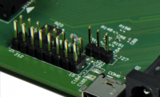
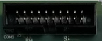

# MACCHIATObin Single/Double Shot Quick Start Guide

<a id="introduction"></a>

## Introduction

The following quick start guide provides background information about the

[MACCHIATObin Single/Double Shot.](https://www.solid-run.com/arm-servers-networking-platforms/macchiatobin/#overview)

The guide will give a technical overview about the product and by the end of it you should be able to boot an operating system and begin testing your application.

<a id="revision-and-notes"></a>

## Revision and Notes

| **Date** | **Owner** | **Revision** | **Notes** |
| --- | --- | --- | --- |
| 28 Oct 2021 |     | 1.0 | Initial release |
| Table of Contents | - [Introduction](#introduction)<br>- [Revision and Notes](#revision-and-notes)<br>- [Marvell ARMADA 8040 Networking](#marvell-armada-8040-networking)<br>  - [Overview](#overview)<br>  - [Network](#network)<br>- [Marvell ARMADA 8040 SPI](#marvell-armada-8040-spi)<br>  - [Overview](#overview)<br>- [Marvell ARMADA 8040 Low Speed Expansion](#marvell-armada-8040-low-speed-expansion)<br>  - [Overview](#overview)<br>  - [Marvell TDM module header](#marvell-tdm-module-header)<br>- [Marvell ARMADA 8040 Development and Debug Interfaces](#marvell-armada-8040-development-and-debug-interfaces)<br>  - [Overview](#overview)<br>  - [UART Header](#uart-header)<br>  - [JTAG Header](#jtag-header)<br>  - [MicroUSB](#microusb)<br>- [Marvell ARMADA 8040 High Speed Expansion](#marvell-armada-8040-high-speed-expansion)<br>  - [Overview](#overview)<br>  - [USB 2.0 Connectors](#usb-20-connectors)<br>  - [USB 3.0 Host](#usb-30-host)<br>  - [PCIe Slot](#pcie-slot)<br>- [Marvell ARMADA 8040 Memory](#marvell-armada-8040-memory)<br>  - [Overview](#overview)<br>  - [DDR4 DIMM](#ddr4-dimm)<br>  - [Dipswitch](#dipswitch)<br>    - [Marvell ARMADA 8040 Dipswitch](#marvell-armada-8040-dipswitch)<br>    - [Overview](#overview)<br>  - [Boot and frequency DIP switches (SW1+SW2)](#boot-and-frequency-dip-switches-sw1sw2)<br>  - [Boot selection](#boot-selection)<br>  - [Frequency selection](#frequency-selection)<br>- [Marvell ARMADA 8040 Additional Headers](#marvell-armada-8040-additional-headers)<br>  - [MCI](#mci)<br>  - [Reset](#reset)<br>  - [FAN Header](#fan-header)<br>  - [GND (12v) Connectors](#gnd-12v-connectors)<br>- [Flash MACCHIATObin DoubleShot 10G Ethernet PHYs](#flash-macchiatobin-doubleshot-10g-ethernet-phys)<br>- [Documentation](#documentation)<br>- [Related Articles](#related-articles) |     |     |

<a id="marvell-armada-8040-networking"></a>

## Marvell ARMADA 8040 Networking

<a id="overview"></a>

#### Overview

The A8040 offers different interfaces: One 1Gbit Ethernet interface, one 2.5 Gbit SFP Slot, and two 3310 Phys, which offers either usings a 10Gbit Ethernet via copper or SFP.


**Each 3310 Phy need its own heatsink!**

<a id="network"></a>

#### Network

- 10/100/1000 Mbit: RJ45 Ethernet: CP1 SRD0 | 1512 PHY
- 2.5Gbit SFP+: SGMII SFP: CP1 SRD5
- 10G Ethernet: CP1 SRD4 | 3310 PHY (supporting either copper or SFP+)
- 10G Ethernet: CP0 SRD4 | 3310 PHY (supporting either copper or SFP+)

<a id="marvell-armada-8040-spi"></a>

## Marvell ARMADA 8040 SPI

<a id="overview"></a>

#### Overview


The A8040 got one SPI flash onboard, which can be used to flash u-boot on.  
It is a Winbond 32mbit SPI Chip [W25Q32FVZPIG](https://www.winbond.com/resource-files/w25q32fv%20revi%2010202015.pdf)

Please have a look at the U-Boot section how to write data to the spi: [Flashing Instructions](../marvell-a8040-based-products/a8040-software/a8040-u-boot.md)

<a id="marvell-armada-8040-low-speed-expansion"></a>

## Marvell ARMADA 8040 Low Speed Expansion

<a id="overview"></a>

#### Overview

The 8040 board offers one low speed expansion: Marvell TDM module header

<a id="marvell-tdm-module-header"></a>

#### Marvell TDM module header



> [!TIP]
> TDM Header pinout. Pin-1 marked on PCB

| Pin | Function | Connection | Pin | Function | Connection |
| --- | --- | --- | --- | --- | --- |
| 1   | SPI CSn | CP1 MPP12 | 2   | SPI MISO | CP1 MPP13 |
| 3   | SPI MOSI | CP1 MPP15 | 4   | SPI CLK | CP1 MPP16 |
| 5   | I2C SDA | CP0 MPP38 | 6   | I2C SCL | CP0 MPP37 |
| 7   | TDM INTn | CP1 MPP5 | 8   | TDM RSTn | CP1 MPP4 |
| 9   | TDM DTX | CP1 MPP2 | 10  | TDM PCLK | CP1 MPP0 |
| 11  | TDM DRX | CP1 MPP1 | 12  | TDM FSYNC | CP1 MPP3 |
| 13  | Ground |     | 14  | Ground |     |
| 15  | 12V |     | 16  | 3.3V |     |

<a id="marvell-armada-8040-development-and-debug-interfaces"></a>

## Marvell ARMADA 8040 Development and Debug Interfaces

<a id="overview"></a>

#### Overview

The 8040 board offers different interfaces for development and debugging:

- Console port (UART) over microUSB connector
- 20-pin Connector for CPU JTAG debugger
- 2 X UART Headers

<a id="uart-header"></a>

#### UART Header


> [!TIP]
> UART Header pinout. Pin-1 marked on PCB

**UART Header 1 (CAP1-UA0) Pinout**

| Pin | Function | Connection |
| --- | --- | --- |
| 1   | Ground |     |
| 2   | RXD (In) | CP0 MPP41 |
| 3   | TXD (Out) | CP0 MPP40 |

**UART Header 2 (CAP0-UA0) Pinout**

| Pin | Function | Connection |
| --- | --- | --- |
| 1   | Ground |     |
| 2   | RXD (In) | CP1 MPP6 |
| 3   | TXD (Out) | CP0 CP1 MPP7 |

<a id="jtag-header"></a>

#### JTAG Header




<a id="microusb"></a>

#### MicroUSB


At the bottom of the board you can find a MicroUSB connector. \[AP\_MPP11 (TX), AP\_MPP19 (RX)\]It includes a FT230X USB to Serial and can be used as serial console.

<a id="marvell-armada-8040-high-speed-expansion"></a>

## Marvell ARMADA 8040 High Speed Expansion

<a id="overview"></a>

#### Overview

The 8040 board offers different high speed expansions:

- PCIex4 3.0 slot
- USB 2.0 Headers (Internal)
- USB 3.0 connector

<a id="usb-20-connectors"></a>

#### USB 2.0 Connectors

The board got two USB 2.0 on board headers


- CP0-USB0 (USB-2.0)
- CP0-USB1 (USB-2.0)

| Pin | Function | Connection | Pin | Function | Connection |
| --- | --- | --- | --- | --- | --- |
| 1   | 5V  |     | 2   | 5V  |     |
| 3   | DM  | CP0\_USB2\_0\_DM | 4   | DM  | CP0\_USB2\_1\_DM |
| 5   | DP  | CP0\_USB2\_0\_DP | 6   | DP  | CP0\_USB2\_1\_DP |
| 7   | Ground |     | 8   | Ground |     |
| void | void |     | 9   | Key | N.C. |

<a id="usb-30-host"></a>

#### USB 3.0 Host


#CP1 SRD2 / #CP1-USB0 (USB-2.0)

<a id="pcie-slot"></a>

#### PCIe Slot


The PCIe Slot supports PCIe x4. Please make sure the power consumption can changed when using a PCIe card, The PCIe is connected to CP0 SRD\[3:0\]

<a id="marvell-armada-8040-memory"></a>

## Marvell ARMADA 8040 Memory

<a id="overview"></a>

#### Overview

The board got a DDR4 DIMM slot with optional ECC and single/dual


<a id="ddr4-dimm"></a>

#### DDR4 DIMM

We ship our device with 4GB till 16GB DDR4 DIMM, up to 2400 speed. (Optional ECC)  
Tested and Working:  
4GB DDR4 2400MHz Samsung M378A5244CB0-CRC00  
8GB : mta9asf1g72az-2g3b1zg Micron  
16GB DDR4 2400MHz Samsung M378A2K43BB1-CRC00  
16GB : HMA82GU6AFR8N-UHN0 Hynix

<a id="dipswitch"></a>

#### Dipswitch

<a id="marvell-armada-8040-dipswitch"></a>

##### Marvell ARMADA 8040 Dipswitch

<a id="overview"></a>

##### Overview


<a id="boot-and-frequency-dip-switches-sw1sw2"></a>

#### Boot and frequency DIP switches (SW1+SW2)

The board incorporates two blocks of DIP switches, SW1 and SW2 where each has 5 positions.

> SW2\[1..5\] and SW1\[1\] are for boot selection and SW1\[2..5\] is for frequency selection.

<a id="boot-selection"></a>

#### Boot selection


Following is configuration of SW2\[1..5\] and SW1\[1\] (6 positions from left to right) –

|     |     |     |     |     |     |     |     |     |     |     |
| --- | --- | --- | --- | --- | --- | --- | --- | --- | --- | --- |
| Boot from: | SW2(1/5) | SW2(2/5) | SW2(3/5) | SW2(4/5) | SW2(5/5) | SW1(1/5) | SW1(2/5) | SW1(3/5) | SW1(4/5) | SW1(5/5) |
| SPI ROM (onboard) | off | off | off | on  | on  | off | x   | x   | x   | x   |
| SD card | off | on  | on  | on  | off | on  | x   | x   | x   | x   |
| eMMC (onboard) | off | on  | on  | on  | on  | off | x   | x   | x   | x   |

<a id="frequency-selection"></a>

#### Frequency selection

Following is configuration of SW1\[2:5\] –


|     |     |     |     |     |     |     |     |     |     |     |
| --- | --- | --- | --- | --- | --- | --- | --- | --- | --- | --- |
| Boot from: | SW2(1/5) | SW2(2/5) | SW2(3/5) | SW2(4/5) | SW2(5/5) | SW1(1/5) | SW1(2/5) | SW1(3/5) | SW1(4/5) | SW1(5/5) |
| CPU=1333MHz, DDR=1600MTps | x   | x   | x   | x   | x   | x   | on  | off | on  | on  |
| CPU=1600MHz, DDR=2100MTps | x   | x   | x   | x   | x   | x   | on  | on  | on  | off |
| CPU=1800MHz, DDR=2400MTps | x   | x   | x   | x   | x   | x   | off | off | on  | off |
| CPU=2000MHz, DDR=2100MTps | x   | x   | x   | x   | x   | x   | off | on  | off | off |
| CPU=2000MHz, DDR=2400MTps | x   | x   | x   | x   | x   | x   | off | on  | on  | off |

<a id="marvell-armada-8040-additional-headers"></a>

## Marvell ARMADA 8040 Additional Headers

<a id="mci"></a>

#### MCI


This connector is for internal use only!

> [!CAUTION]
> Do not connect USB Type C accessories!

<a id="reset"></a>

#### Reset


RESET Header(CP\_MR#): For panel reset button support.  
RESET Button(CP\_MR#): For reset functionality.

<a id="fan-header"></a>

#### FAN Header


FAN Header pinout. Pin-1 marked on PCB

| **Pin** | **Function** | **Connection** |
| --- | --- | --- |
| 1   | PWM | CP0 MPP48 |
| 2   | N.C. |     |
| 3   | 12V |     |
| 4   | Ground |     |

<a id="gnd-12v-connectors"></a>

#### GND (12v) Connectors


12V Header, GND pair

<a id="flash-macchiatobin-doubleshot-10g-ethernet-phys"></a>

## Flash MACCHIATObin DoubleShot 10G Ethernet PHYs

Follow these instructions to flash the firmware on both 10G PHYs of the MACCHIATObin DoubleShot. This is a one time operation.

1. Download this archive: [mcbin-phy-firmware-flash.tar.gz](https://developer.solid-run.com/wp-content/uploads/2019/05/mcbin-phy-firmware-flash.tar.gz).
2. The file sdcard-8040-dec-11-only-for-phy-firmware.img is an SD card image with a special version of U-Boot that can program the 10G PHY.
3. The two other files are the PHY firmware files. Copy these files to a USB storage device.
4. At U-Boot prompt run the following commands:
```
fatload usb 0:1 0x06000000 x3310fw_0_2_1_0_8125.hdr
fatload usb 0:1 0x05000000 x3240flashdlslave_0_4_1_0_7847.bin
phy_fw_down 0x06000000 164868 0x05000000 9948 8
phy_fw_down 0x06000000 164868 0x05000000 9948 0
```

<a id="documentation"></a>

## Documentation

Please refer to [Marvell MACCHIATObin](https://macchiatobin.net/).

[Buy a Sample Now](https://shop.solid-run.com/?s=MACCHIATObin&post_type=product)

<a id="related-articles"></a>

## Related Articles

Error rendering macro 'contentbylabel' : CQL was parsed but the search manager was unable to execute the search. Error message: com.atlassian.confluence.api.service.exceptions.scale.SSStatusCodeException: There was an illegal request passed to XP-Search Aggregator API : HTTP/1.1 403 Forbidden