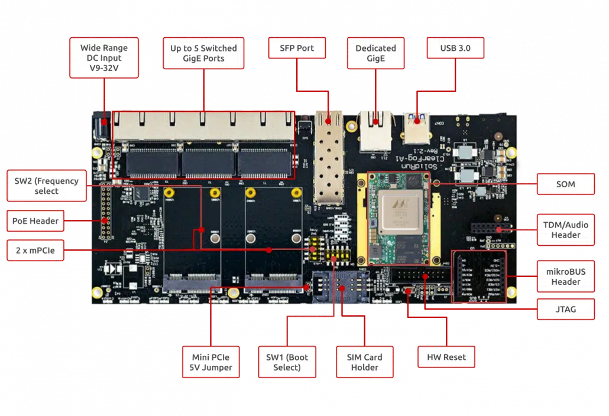

# ClearFog CN9130 Pro Quick Start Guide

.jpg>)

## Revision and Notes

| **Date**          | **Owner**                                                                                                                                                                                                                                                                                                                                                                                                                                                                                                                                                                                                                                                                                                                                                                                                                                                                                                                                                                                                                                                                                                                                                                                                                                                                                                                                                                                                                                                                                                                                                                                                                                                                                                                                                                                                                                                                                                                                                                                                                                                                                                                                                                                                                                                                         | **Revision** | **Notes**                                                                                                |
| ----------------- | --------------------------------------------------------------------------------------------------------------------------------------------------------------------------------------------------------------------------------------------------------------------------------------------------------------------------------------------------------------------------------------------------------------------------------------------------------------------------------------------------------------------------------------------------------------------------------------------------------------------------------------------------------------------------------------------------------------------------------------------------------------------------------------------------------------------------------------------------------------------------------------------------------------------------------------------------------------------------------------------------------------------------------------------------------------------------------------------------------------------------------------------------------------------------------------------------------------------------------------------------------------------------------------------------------------------------------------------------------------------------------------------------------------------------------------------------------------------------------------------------------------------------------------------------------------------------------------------------------------------------------------------------------------------------------------------------------------------------------------------------------------------------------------------------------------------------------------------------------------------------------------------------------------------------------------------------------------------------------------------------------------------------------------------------------------------------------------------------------------------------------------------------------------------------------------------------------------------------------------------------------------------------------- | ------------ | -------------------------------------------------------------------------------------------------------- |
| 07 Dec 2021       |                                                                                                                                                                                                                                                                                                                                                                                                                                                                                                                                                                                                                                                                                                                                                                                                                                                                                                                                                                                                                                                                                                                                                                                                                                                                                                                                                                                                                                                                                                                                                                                                                                                                                                                                                                                                                                                                                                                                                                                                                                                                                                                                                                                                                                                                                   | 1.0          | Initial release                                                                                          |
| 09 Feb 2025       | Yazan Shhady                                                                                                                                                                                                                                                                                                                                                                                                                                                                                                                                                                                                                                                                                                                                                                                                                                                                                                                                                                                                                                                                                                                                                                                                                                                                                                                                                                                                                                                                                                                                                                                                                                                                                                                                                                                                                                                                                                                                                                                                                                                                                                                                                                                                                                                                      | 1.1          | Adding detailed information on the mPCIe connectors and their corresponding SIM holder interface mapping |
| Table of Contents | <p>- <a href="clearfog-cn9130-pro-quick-start-guide.md#revision-and-notes">Revision and Notes</a><br>- <a href="clearfog-cn9130-pro-quick-start-guide.md#introduction">Introduction</a><br>- <a href="clearfog-cn9130-pro-quick-start-guide.md#hardware-setup">Hardware Setup</a><br>- <a href="clearfog-cn9130-pro-quick-start-guide.md#product-specifications">Product Specifications</a><br>- <a href="clearfog-cn9130-pro-quick-start-guide.md#block-diagram">Block Diagram</a><br>- <a href="clearfog-cn9130-pro-quick-start-guide.md#visual-features-overview">Visual features overview</a><br>- <a href="clearfog-cn9130-pro-quick-start-guide.md#mpcie-connectors-and-sim-holder-interface-mapping">mPCIe Connectors and SIM Holder Interface Mapping</a><br>- <a href="clearfog-cn9130-pro-quick-start-guide.md#con2-mpcie-connector">CON2 (mPCIe Connector)</a><br>- <a href="clearfog-cn9130-pro-quick-start-guide.md#con3-mpcie-connector">CON3 (mPCIe Connector)</a><br>- <a href="clearfog-cn9130-pro-quick-start-guide.md#software-setup">Software Setup</a><br>- <a href="clearfog-cn9130-pro-quick-start-guide.md#cable-setup-and-prerequisites">Cable setup and prerequisites</a><br>- <a href="clearfog-cn9130-pro-quick-start-guide.md#recommended-cables">Recommended Cables</a><br>- <a href="clearfog-cn9130-pro-quick-start-guide.md#boot-select">Boot Select</a><br>- <a href="clearfog-cn9130-pro-quick-start-guide.md#booting-from-an-spi-card">Booting from an SPI card</a><br>- <a href="clearfog-cn9130-pro-quick-start-guide.md#install-to-emmc">Install to eMMC</a><br>- <a href="clearfog-cn9130-pro-quick-start-guide.md#sfp-modules">SFP Modules</a><br>- <a href="clearfog-cn9130-pro-quick-start-guide.md#sim-card-slot">SIM Card Slot</a><br>- <a href="clearfog-cn9130-pro-quick-start-guide.md#tlv-eeprom-support">TLV EEPROM Support</a><br>- <a href="clearfog-cn9130-pro-quick-start-guide.md#list-of-supported-os">List Of Supported OS</a><br>- <a href="clearfog-cn9130-pro-quick-start-guide.md#build-from-source">Build from source</a><br>- <a href="clearfog-cn9130-pro-quick-start-guide.md#documentation">Documentation</a><br>- <a href="clearfog-cn9130-pro-quick-start-guide.md#related-articles">Related Articles</a></p> |              |                                                                                                          |

## Introduction

The following quick start guide provides background information about the [ClearFog Pro](https://www.solid-run.com/embedded-networking/marvell-octeon-tx2-family/clearfog-cn9130/#pro) product which use the CN9130 System on module.

The guide will give a technical overview about the product and by the end of it you should be able to boot an operating system and begin testing your application.

## Hardware Setup

#### Product Specifications

| **SOM Model**        | OCTEON CN9130                                                                                                                               |
| -------------------- | ------------------------------------------------------------------------------------------------------------------------------------------- |
| **Processor**        | 64-bit Cortex A72                                                                                                                           |
| **Core Frequency**   | up to 2.2GHz                                                                                                                                |
| **Memory & Storage** | 64bit DDR4 W/O ECC, Up to 8GB at 2400MT/s                                                                                                   |
|                      | M.2                                                                                                                                         |
|                      | uSD and 8GB eMMC                                                                                                                            |
| **Connectivity**     | 2 x mSATA/mPCIE                                                                                                                             |
|                      | 1 x USB 3.0 port                                                                                                                            |
|                      | 1 x Port dedicated Ethernet                                                                                                                 |
|                      | 5 x Port switched Ethernet                                                                                                                  |
|                      | 1 x SFP+ 10GbE                                                                                                                              |
| **I/O & Misc.**      | Not supported                                                                                                                               |
|                      | GPIO Header (mikroBUS)                                                                                                                      |
|                      | Indication LEDs                                                                                                                             |
|                      | PoE expansion header                                                                                                                        |
|                      | RTC Battery                                                                                                                                 |
|                      | FTDI (Console Only)/Debug Header                                                                                                            |
|                      | JTAG Header                                                                                                                                 |
| **OS Support**       | Linux Kernel 4.x, OpenWRT/LEDE, Yocto                                                                                                       |
| **Power**            | Wide range 9V- 32V                                                                                                                          |
|                      | Advanced Power Control                                                                                                                      |
|                      | Fan Control                                                                                                                                 |
| **Dimensions**       | 225mm x 100mm (PCBA)                                                                                                                        |
|                      | 226mm x 104mm x 33mm (Enclosed)                                                                                                             |
| **Enclosure**        | Optional metal enclosure                                                                                                                    |
|                      | [Buy Now](https://shop.solid-run.com/?s=ClearFog+Pro+CN9130\&post_type=product&_ga=2.122003336.2016484779.1641802897-2012112798.1622706355) |

> \[!INFO] Supported with CN9130 SOM. For more detailed information about our CN9130 SOM series please visit this user manual : [CN9130 SOM Hardware User Manual](cn9130-som-hardware-user-manual.md) .

## **Block Diagram**

The following figure describes the ClearFog Pro Block Diagram.

 Pro block diagram.png>)

## Visual features overview

Please see below the features overview of the connector side of the ClearFog Pro (CN9130 SOM assembled).



Print side connector overview of the ClearFog Pro.


> \[!NOTE]
>
> #### **mPCIe Connectors and SIM Holder Interface Mapping**
>
> **CON2 (mPCIe Connector)**
>
> * **Supported Interfaces:** PCIe only
> * **Associated SIM Holder:** **CON1** (Upper SIM holder) – Connected to **CON2 mPCIe interface**
>
> **CON3 (mPCIe Connector)**
>
> * **Supported Interfaces:** PCIe and USB
> * **Associated SIM Holder:** **CON10** (Lower uSIM holder) – Connected to **CON3 mPCIe interface**
> * **Tested with:** **LTE Quectel EC25** – Confirmed full functionality, successfully detecting **uSIM in CON10**.

## Software Setup

#### Cable setup and prerequisites

Here is what you will need to power up the board:

* Linux or Windows PC
* ClearFog Pro with SOM
* 12V Power adapter (ClearFog Pro has wide range input of 9V-32V, it is recommended to use 12V power adapter)
* Micro USB to USB for console, the ClearFog Pro has an onboard FTDI chip.
* IP router or IP switch

## Recommended Cables

The following is a list of industry-standard cables, sorted by type, with the necessary compliance requirements that have been proven to work well with the ClearFog product family (ClearFog Base / Pro).

These examples are the cables which SolidRun uses for testing, and should provide enough information to source products from your preferred cable vendor.

* Ethernet cable: Monoprice 24AWG Cat6A 500MHz STP
* USB Cable: SuperSpeed USB 3.0 Type A Male to Female Extension Cable in Black
* SFP connector: GigaLite GE-GB-P1RT-E SFP module with Monoprice 24AWG Cat6A 500MHz STP cable

## Boot Select

Before powering up the board for the first time it is recommended to select the boot media. In order to configure the boot media, please refer to [ClearFog CN9130 Boot Select](cn913x-other-articles/clearfog-cn9130-boot-select.md) .

## Booting from an SPI card

The switches on the boot source selector must be set as follows:

|          |          |          |          |          |
| -------- | -------- | -------- | -------- | -------- |
| Switch 1 | Switch 2 | Switch 3 | Switch 4 | Switch 5 |
| ON       | X        | OFF      | ON       | X        |

The following shows how to set the switches on the boot source selector:

.png>)

Once you set the switches, you can apply the following for booting from an **SPI** card and loading the Ubuntu from an **SD** card.

> \[!WARNING] **Please Note:** The **SPI** includes U-Boot by default.

**1. Downloading the Ubuntu 20.04 image**

```
wget https://solid-run-images.sos-de-fra-1.exo.io/CN913x/cn913x_build/20240603-f591a0b/ubuntu-cn9130-cf-pro-mmc:1:0.img.xz
```

* For more Ubuntu releases, please visit [Ubuntu Releases for CN913x](https://images.solid-run.com/CN913x).

**2. Writing the image to the SD card**

Use the following commands for writing the image to an SD card:

```
xz -dc ubuntu-cn9130-cf-pro-mmc:1:0.img.xz | dd of=/dev/sdX bs=4k conv=fdatasync
```

* For more information, please visit [Flashing an SD Card](../../other-articles/flashing-an-sd-card.md).

> \[!NOTE] Note: Plug a micro SD into your Linux PC, the following assumes that the micro SD is added as /dev/sdX and all it’s partitions are unmounted.

**3. SD card insertion**

Please Insert the SD card into your device.

**4. Power connection**

Connect your power adaptor to the DC jack, and then connect the adaptor to the main supply.

**5. Serial Connection**

Please insert the micro USB into your device, then you can refer to [Serial Connection](../../other-articles/serial-connection.md) for installing the necessary serial connection software in Linux/Windows.

In u-boot prompt, to continue booting from the SD card, run the following:

```
setenv get_images "load mmc 1:1 $kernel_addr_r boot/Image /
load mmc 1:1 $fdt_addr_r boot/cn9130-cf-pro.dtb /
setenv root 'root=/dev/mmcblk1p1 rootwait rw' /
setenv ramdisk_addr_r -"
saveenv
boot
```

> \[!WARNING] **Please Note:** Boot is made from SPI by default, so in order to continue booting from an SD card, the above commands should be run only once (in the fist boot).

Once you installed the necessary serial connection software and ran the above commands, you should be able to see the following:

.png>)

* In order to be able to log in , please insert “root” as a username and password as follows:

.png>)

**6. Final stages**

The following stages need to be done in order to finalize the imaging:

1. Run `fdisk /dev/mmcblk1` if using SD, or run if using `fdisk /dev/mmcblk0` eMMC.
2. Recreate the first partition by deleting it and then creating a new partition that starts at block 131072 and extends to the end of the drive (or less depending on your needs).
3. Write the new partition, when prompt about ‘Do you want to remove the signature?’ then answer with yes.
4. Run `resize2fs /dev/mmcblk1p1` if using SD Card, or Run `resize2fs /dev/mmcblk0p1` if using eMMC.
5. In this stage the root partition should be big enough to start populating it; but first update the RTC clock.
6. Connect the RJ45 to your network with internet access (and DHCP server); and then run `dhclient` .
7. Update the RTC clock by running `ntpdate pool.ntp.org` and then `hwclock -w`.
8. Run `apt-update` and then populate the root filesystem as you wish.

Please see below an example of resizing the filesystem :

.png>)

## Install to eMMC

The switches on the boot source selector must be set as follows:

|          |          |          |          |          |
| -------- | -------- | -------- | -------- | -------- |
| Switch 1 | Switch 2 | Switch 3 | Switch 4 | Switch 5 |
| OFF      | X        | OFF      | ON       | X        |

**1. Downloading the Ubunto image**

```
wget https://solid-run-images.sos-de-fra-1.exo.io/CN913x/cn9130-cf-pro_config_2_ubuntu-4cbe176.img.xz
```

**2. Writing the image to eMMC**

```
xz -dc cn9130-cf-pro_config_2_ubuntu-4cbe176.img.xz | dd of=/dev/mmcblk0 bs=4k conv=sync
```

**3. Power connection**

Connect your power adaptor to the DC jack, and then connect the adaptor to the main supply.

**4. Serial Connection**

Please insert the micro USB into your device, then you can refer to [Serial Connection](../../other-articles/serial-connection.md) for installing the necessary serial connection software in Linux/Windows.

**5. Set the boot command to load the image from the eMMC device:**

In U-boot prompt, run the following commands only in the first boot:

```
setenv get_images "load mmc 0:1 $kernel_addr_r boot/Image /
load mmc 0:1 $fdt_addr_r boot/cn9130-cf-pro.dtb /
setenv root 'root=/dev/mmcblk0p1 rootwait rw' /
setenv ramdisk_addr_r -"; saveenv; boot
```

* Use ‘root’ as a username and password to be able to log in.

**6. Final stages**

The following stages need to be done in order to finalize the imaging:

1. Run `fdisk /dev/mmcblk1` if using SD, or run if using `fdisk /dev/mmcblk0` eMMC.
2. Recreate the first partition by deleting it and then creating a new partition that starts at block 131072 and extends to the end of the drive (or less depending on your needs).
3. Write the new partition, when prompt about ‘Do you want to remove the signature?’ then answer with yes.
4. Run `resize2fs /dev/mmcblk1p1` if using SD Card, or Run `resize2fs /dev/mmcblk0p1` if using eMMC.
5. In this stage the root partition should be big enough to start populating it; but first update the RTC clock.
6. Connect the RJ45 to your network with internet access (and DHCP server); and then run `dhclient` .
7. Update the RTC clock by running `ntpdate pool.ntp.org` and then `hwclock -w`.
8. Run `apt-update` and then populate the root filesystem as you wish.

Please see below an example of resizing the filesystem :

.png>)

## SFP Modules

For some SFP modules that work on SolidRun networking hardware platforms, please refer to [SFP Modules](../marvell-a38x-based-products/a388-other-articles/sfp-modules.md) .

## SIM Card Slot

It is possible to utilize a Cellular connection by inserting a SIM card into the SIM card slot. Please observe that a GSM Cellular modem needs to be installed utilizing the mini PCIe connection in order to exploit the cellular connection.

> \[!WARNING] **Please Note** If you your ClearFog has dual SIM card slots, an additional cellular modem will need to be installed in the mini PCIe connection in order to utilize the 2nd SIM connection.

## TLV EEPROM Support

Starting from April 01. 2022, the EEPROMs on Carriers, SoMs and COM-Express Modules are being programmed with identifying information such as the product name and SKUs to allow for programmatic identification of hardware. Check our [CN913x EEPROM documentation](cn913x-other-articles/cn913x-eeprom-programming-tlv.md) for additional information.

## List Of Supported OS

| **OS**                                                        |                                                                                                                        |
| ------------------------------------------------------------- | ---------------------------------------------------------------------------------------------------------------------- |
| .png>) | [https://github.com/SolidRun/Documentation/tree/bsp/cn913x](https://github.com/SolidRun/Documentation/tree/bsp/cn913x) |
|        | [https://github.com/SolidRun/cn913x\_build](https://github.com/SolidRun/cn913x_build)                                  |

## Build from source

* CN913x Build - [CN913x Build - Script](cn913x-software/cn913x-build.md)
* U-Boot, Atf and Mv-ddr-marvel Build - [CN913x u-boot, atf and mv-ddr-marvell - Self Build](https://developer.resources.solid-run.com/wiki/spaces/developer/pages/200769556/CN913x+u-boot+atf+and+mv-ddr-marvell+-+Self+Build)
* Debian Image Builder - [GitHub - SolidRun/debian-builder](https://github.com/SolidRun/debian-builder/tree/7f1357cc6e262f19f1031e76b5c98870faeb7b79)

## Documentation

|                                                                                                                                                                                                                                                                                                                                                                                                                                                  | File                                                                                                                                                                                      | Modified                                                                                      |
| ------------------------------------------------------------------------------------------------------------------------------------------------------------------------------------------------------------------------------------------------------------------------------------------------------------------------------------------------------------------------------------------------------------------------------------------------ | ----------------------------------------------------------------------------------------------------------------------------------------------------------------------------------------- | --------------------------------------------------------------------------------------------- |
| <p>Labels<br><br>- No labels<br>- <a href="clearfog-cn9130-pro-quick-start-guide.md#section-2136ff1d-c6c8-4d99-916d-f2bfe4053666">Edit Labels</a><br><br>[Preview] <a href="../../../wiki/download/attachments/268140545/clearfog_pro-cn9130-rev.2.1-gerber.zip">View</a> <a href="../../../wiki/pages/editattachment.action">Properties</a> <a href="../../../wiki/pages/confirmattachmentremoval.action">Delete</a></p>                        | ZIP Archive [clearfog\_pro-cn9130-rev.2.1-gerber.zip](../../../wiki/download/attachments/268140545/clearfog_pro-cn9130-rev.2.1-gerber.zip)                                                | Dec 26, 2021 by [SolidRun](../../../wiki/people/557058:12be2ae4-3a6e-40cc-a677-bdfc4c987d1f/) |
| <p>Labels<br><br>- No labels<br>- <a href="clearfog-cn9130-pro-quick-start-guide.md#section-e8a2ca85-e4bb-4926-83bd-98ee8b4388ab">Edit Labels</a><br><br>[Preview] <a href="../../../wiki/download/attachments/268140545/clearfog_pro-cn9130-rev.2.1-mechanical_assembly-3dpdf-pdf.zip">View</a> <a href="../../../wiki/pages/editattachment.action">Properties</a> <a href="../../../wiki/pages/confirmattachmentremoval.action">Delete</a></p> | ZIP Archive [clearfog\_pro-cn9130-rev.2.1-mechanical\_assembly-3dpdf-pdf.zip](../../../wiki/download/attachments/268140545/clearfog_pro-cn9130-rev.2.1-mechanical_assembly-3dpdf-pdf.zip) | Dec 26, 2021 by [SolidRun](../../../wiki/people/557058:12be2ae4-3a6e-40cc-a677-bdfc4c987d1f/) |
| <p>Labels<br><br>- No labels<br>- <a href="clearfog-cn9130-pro-quick-start-guide.md#section-7c212e8d-5793-4908-970c-64214f8c7322">Edit Labels</a><br><br>[Preview] <a href="../../../wiki/download/attachments/268140545/clearfog_pro-cn9130-rev2.1-pcb-layout.zip">View</a> <a href="../../../wiki/pages/editattachment.action">Properties</a> <a href="../../../wiki/pages/confirmattachmentremoval.action">Delete</a></p>                     | ZIP Archive [clearfog\_pro-cn9130-rev2.1-pcb-layout.zip](../../../wiki/download/attachments/268140545/clearfog_pro-cn9130-rev2.1-pcb-layout.zip)                                          | Dec 26, 2021 by [SolidRun](../../../wiki/people/557058:12be2ae4-3a6e-40cc-a677-bdfc4c987d1f/) |
| <p>Labels<br><br>- No labels<br>- <a href="clearfog-cn9130-pro-quick-start-guide.md#section-5a30bb17-17f6-4679-8b14-79258d223123">Edit Labels</a><br><br>[Preview] <a href="../../../wiki/download/attachments/268140545/mikrobus_specification-rev2.pdf">View</a> <a href="../../../wiki/pages/editattachment.action">Properties</a> <a href="../../../wiki/pages/confirmattachmentremoval.action">Delete</a></p>                               | PDF File [mikrobus\_specification-rev2.pdf](../../../wiki/download/attachments/268140545/mikrobus_specification-rev2.pdf)                                                                 | Dec 26, 2021 by [SolidRun](../../../wiki/people/557058:12be2ae4-3a6e-40cc-a677-bdfc4c987d1f/) |
| <p>Labels<br><br>- No labels<br>- <a href="clearfog-cn9130-pro-quick-start-guide.md#section-31a208c3-cb64-419e-b87a-27ad905c39ac">Edit Labels</a><br><br>[Preview] <a href="../../../wiki/download/attachments/268140545/ClearFog-Pro-CN9130-Enclosure-Files.zip">View</a> <a href="../../../wiki/pages/editattachment.action">Properties</a> <a href="../../../wiki/pages/confirmattachmentremoval.action">Delete</a></p>                       | ZIP Archive [ClearFog-Pro-CN9130-Enclosure-Files.zip](../../../wiki/download/attachments/268140545/ClearFog-Pro-CN9130-Enclosure-Files.zip)                                               | Dec 26, 2021 by [SolidRun](../../../wiki/people/557058:12be2ae4-3a6e-40cc-a677-bdfc4c987d1f/) |
| <p>Labels<br><br>- No labels<br>- <a href="clearfog-cn9130-pro-quick-start-guide.md#section-2dfbe8d9-adaa-456b-b183-879f1609cb5b">Edit Labels</a><br><br>[Preview] <a href="../../../wiki/download/attachments/268140545/clearfog-pro-cn9130-schematics-2.1.pdf">View</a> <a href="../../../wiki/pages/editattachment.action">Properties</a> <a href="../../../wiki/pages/confirmattachmentremoval.action">Delete</a></p>                        | PDF File [clearfog-pro-cn9130-schematics-2.1.pdf](../../../wiki/download/attachments/268140545/clearfog-pro-cn9130-schematics-2.1.pdf)                                                    | Dec 26, 2021 by [SolidRun](../../../wiki/people/557058:12be2ae4-3a6e-40cc-a677-bdfc4c987d1f/) |
| <p>Labels<br><br>- No labels<br>- <a href="clearfog-cn9130-pro-quick-start-guide.md#section-5acb5f4d-ff55-4a39-b975-9f4bd0c46286">Edit Labels</a><br><br>[Preview] <a href="../../../wiki/download/attachments/268140545/rtc-datasheet-onboard.pdf">View</a> <a href="../../../wiki/pages/editattachment.action">Properties</a> <a href="../../../wiki/pages/confirmattachmentremoval.action">Delete</a></p>                                     | PDF File [rtc-datasheet-onboard.pdf](../../../wiki/download/attachments/268140545/rtc-datasheet-onboard.pdf)                                                                              | Dec 26, 2021 by [SolidRun](../../../wiki/people/557058:12be2ae4-3a6e-40cc-a677-bdfc4c987d1f/) |
| <p>Labels<br><br>- No labels<br>- <a href="clearfog-cn9130-pro-quick-start-guide.md#section-915f9871-dc31-4320-b155-4bd8a5727405">Edit Labels</a><br><br>[Preview] <a href="../../../wiki/download/attachments/268140545/ClearFog+Pro+CN9130+BOM+rev+2.1.4.xlsx">View</a> <a href="../../../wiki/pages/editattachment.action">Properties</a> <a href="../../../wiki/pages/confirmattachmentremoval.action">Delete</a></p>                        | Microsoft Excel Spreadsheet [ClearFog Pro CN9130 BOM rev 2.1.4.xlsx](../../../wiki/download/attachments/268140545/ClearFog%20Pro%20CN9130%20BOM%20rev%202.1.4.xlsx)                       | Dec 26, 2021 by [SolidRun](../../../wiki/people/557058:12be2ae4-3a6e-40cc-a677-bdfc4c987d1f/) |
| <p>Labels<br><br>- No labels<br>- <a href="clearfog-cn9130-pro-quick-start-guide.md#section-ee1b25d4-0a75-431f-abc1-54a2d83b017c">Edit Labels</a><br><br>[Preview] <a href="../../../wiki/download/attachments/268140545/ARMighty-Rev-2.2-pcb.zip">View</a> <a href="../../../wiki/pages/editattachment.action">Properties</a> <a href="../../../wiki/pages/confirmattachmentremoval.action">Delete</a></p>                                      | ZIP Archive [ARMighty-Rev-2.2-pcb.zip](../../../wiki/download/attachments/268140545/ARMighty-Rev-2.2-pcb.zip)                                                                             | Sep 26, 2022 by [alon rotman](../../../wiki/people/5f67bce7460930007791b95f/)                 |
| <p>Labels<br><br>- No labels<br>- <a href="clearfog-cn9130-pro-quick-start-guide.md#section-8388e82c-7c75-41ed-94bb-7ff128fb5587">Edit Labels</a><br><br>[Preview] <a href="../../../wiki/download/attachments/268140545/clearfo-pro-schematics-rev2.2.pdf">View</a> <a href="../../../wiki/pages/editattachment.action">Properties</a> <a href="../../../wiki/pages/confirmattachmentremoval.action">Delete</a></p>                             | PDF File [clearfo-pro-schematics-rev2.2.pdf](../../../wiki/download/attachments/268140545/clearfo-pro-schematics-rev2.2.pdf)                                                              | Jan 30, 2025 by [Yazan Shhady](../../../wiki/people/5f67bce9ed55c7006abc6319/)                |

[Download All](../../../wiki/download/all_attachments)

[Buy a Sample Now](https://shop.solid-run.com/?s=ClearFog+Pro+CN9130\&post_type=product&_ga=2.122003336.2016484779.1641802897-2012112798.1622706355)

## Related Articles

Error rendering macro 'contentbylabel' : CQL was parsed but the search manager was unable to execute the search. Error message: com.atlassian.confluence.api.service.exceptions.scale.SSStatusCodeException: There was an illegal request passed to XP-Search Aggregator API : HTTP/1.1 403 Forbidden
