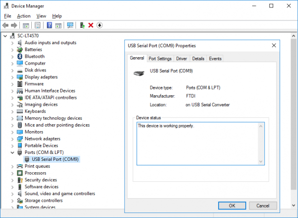
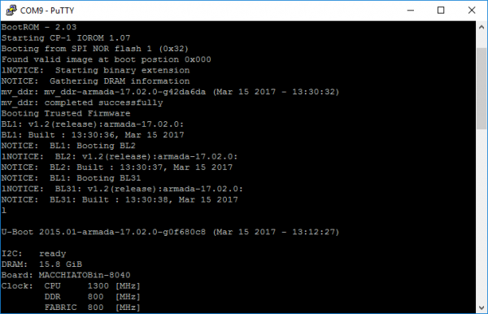

# Serial Connection

## Serial Connection – Windows

#### Overview

This page will walk you through installing drivers and software necessary for serial connection in Windows.

#### Prerequisites

1. FTDI drivers:

FTDI drivers come preinstalled on Linux systems and newer versions of the Windows. If your Windows does not support FTDI drivers, you will need to download them from [here](http://domoticx.com/pl2303-usb-to-uart-bridge-drivers-windows/). If you get stuck, you can check out our step by step [Installing FTDI drivers guide](http://wiki.macchiatobin.net/tiki-index.php?page=Installing+FTDI+drivers).

1. PuTTY:

For Windows PC you will need PuTTY, although you can use PuTTY with Linux as well. Get it [here](http://www.chiark.greenend.org.uk/~sgtatham/putty/download.html). Instructions for connecting with PuTTY are listed below.

#### Connecting with PuTTY (Windows)

To connect with PuTTY, first we must connect the laptop to the board via micro USB cable. After that, we have to make sure the board was recognized. For that we go to **Device Manager → Ports (COM & LPT)** and, after we powered on the board, we will see a new COM port which we will need to note **(COMnumber)**. In this example, the new COM port is COM9:



The next step is to run PuTTY and select **Serial** under **Connection type**. There we will input the COM port from the previous step (in our example **COM9**) and also set **Speed** to **115200**):


and you should get access to the console:



#### Serial Connection – Linux

**Overview**

This page will walk you through installing necessary serial connection software for Linux. FTDI drivers needed for Windows come preinstalled with your Linux system.

First, we need to find out the correct USB to which our serial has connected to after we have plugged in the micro USB cable. We can do this using **dmesg**:

```
~$dmesg
...
[518568.122266] usb 1-6: new full-speed USB device number 4 using xhci_hcd
[518568.257927] usb 1-6: New USB device found, idVendor=0403, idProduct=6015
[518568.257935] usb 1-6: New USB device strings: Mfr=1, Product=2, SerialNumber=3
[518568.257940] usb 1-6: Product: FT230X Basic UART
[518568.257944] usb 1-6: Manufacturer: FTDI
[518568.257947] usb 1-6: SerialNumber: DJ00HH67
[518569.328196] usbcore: registered new interface driver usbserial
[518569.328238] usbcore: registered new interface driver usbserial_generic
[518569.328268] usbserial: USB Serial support registered for generic
[518569.331071] usbcore: registered new interface driver ftdi_sio
[518569.331080] usbserial: USB Serial support registered for FTDI USB Serial Device
[518569.331096] ftdi_sio 1-6:1.0: FTDI USB Serial Device converter detected
[518569.331115] usb 1-6: Detected FT-X
[518569.331514] usb 1-6: FTDI USB Serial Device converter now attached to ttyUSB0
```

Here we can see that the serial converter connected to **USB0 (ttyUSB0)** USB number.


Here and bellow we will use **/dev/ttyUSB0** as an example. Make sure to verify and use an actual usb device.



#### Connecting with tio

```
$ sudo tio -b 115200 /dev/ttyUSB0
```

Use `Ctrl+t q` to exit tio.

#### Connecting with Minicom

```
$ sudo minicom -b 115200 -D /dev/ttyUSB0
```

Use `Ctrl+a x` to exit minicom.

## Serial Connection – MacOSX

#### Overview

This page will walk you through installing drivers and software necessary for serial connection in MacOSX.

#### Prerequisites

First, download and install the [FTDI VCP drivers](http://www.ftdichip.com/Drivers/VCP.htm)\
Once you connect the cable, the kernel should load the usbserial module. Look for the device.

```
ls -l /dev/*usbserial*
```

#### Connection

#### tio

```
tio -b 115200 /dev/tty.usbserial-DB008OZL
```

#### Screen

OS X ships with screen by default. Open a terminal and type

```
screen /dev/tty.usbserial-DB008OZL 115200
```

#### ZTerm

You can also download [ZTerm](http://www.macupdate.com/app/mac/6888/zterm-x).

```
Open Settings, Connection and set the values to 115200 8 N 1 (uncheck Local Echo).
Open File, Transfer Convert and set Binary Data.
```

## Video

[https://youtu.be/Mz5rsSQ3Uew](https://youtu.be/Mz5rsSQ3Uew)
