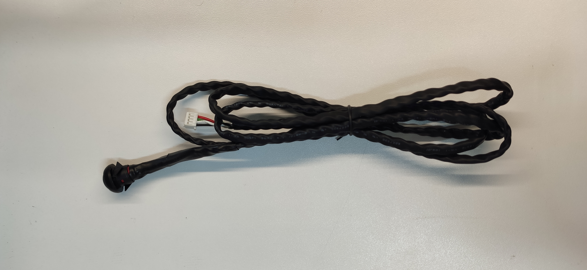

# Common Bedrock accessories

## Common Bedrock accessories

## Power

### PSU 90W

90W power supply.\
Requires AC cable C13 ("Kettle lead")


**Ordering code**: SRBD-PSU90


### US | EU | UK | AU AC Cable

1.8m AC cord for PSU (C13 "Kettle lead") with regional plug.

| **Ordering code** | **AC Plug**                  |
| ----------------- | ---------------------------- |
| SRBD-CABUS        | North America                |
| SRBD-CABEU        | Europlug                     |
| SRBD-CABUK        | UK plug                      |
| SRBD-CABAU        | Australia / New Zealand plug |

### DC Cable Phoenix connector

Pigtail DC cable for Bedrock.\
To be used with a 3rd party PSU.


**Ordering code**: SRBD-CABDC


## Mounting

### Stand for Bedrock

See [Bedrock Mounting Options - Stand](../../bedrock-pc/bedrock-mechanical-documentation/bedrock-mounting-options.md#stand)


**Ordering code**: SRBD-STAND21


### Wall mounting bracket

See [Bedrock Mounting Options - Wall Mounting](../../bedrock-pc/bedrock-mechanical-documentation/bedrock-mounting-options.md#wall-mounting)


**Ordering code**: SRBD-WALL21


### DIN Rail bracket

See [Bedrock Mounting Options - DIN Rail Mounting](../../bedrock-pc/bedrock-mechanical-documentation/bedrock-mounting-options.md#din-rail-mounting)


**Ordering code**: SRBD-DIN21


## Cable accessories

### Remote on/off

#### Remote power button

A power button on a wire for turning Bedrock on/off when Bedrock is installed in an inaccessible location.


**Ordering code**: SRBD-CABBTN


#### Harness for custom remote power button

A wire harness for soldering custom power button (optionally with LED) for turning Bedrock on/off when Bedrock is installed in an inaccessible location.


**Ordering code**: SRBD-CABNOBTN


### Console mini-USB to USB-A

Console is mini-USB connector with standard USB interface.\
The mini-USB to USB-A allows connecting to a host PC.


**Ordering code**: SRBD-CABCON


.jpg>)
