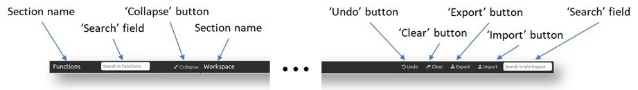
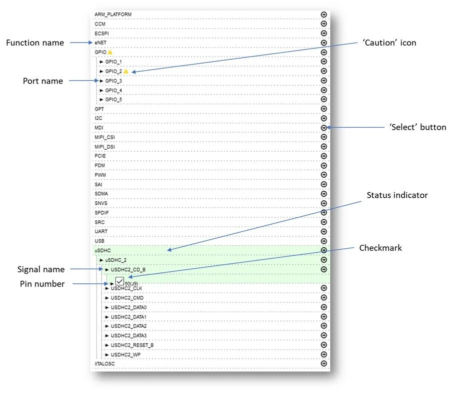
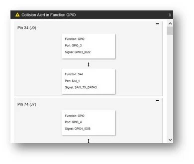
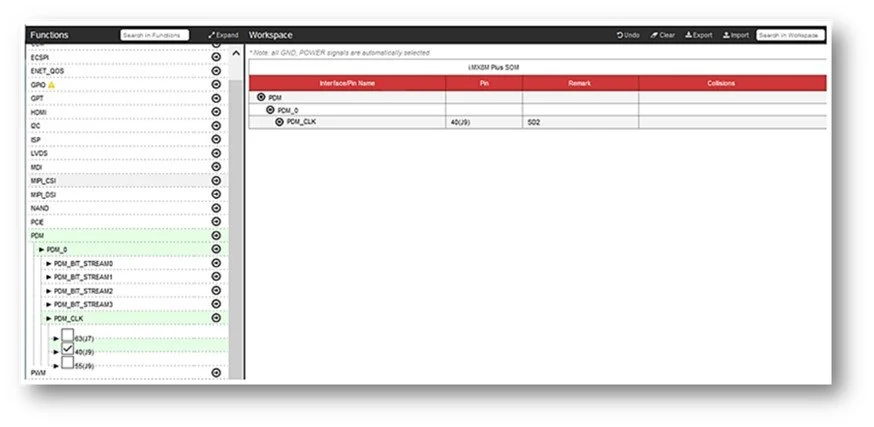
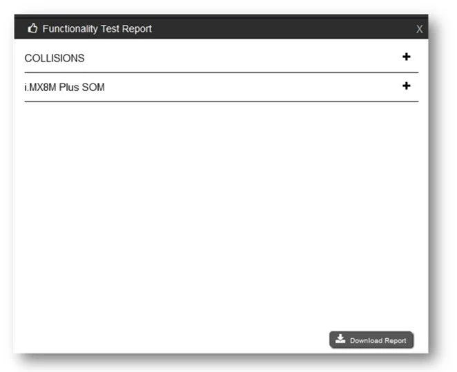
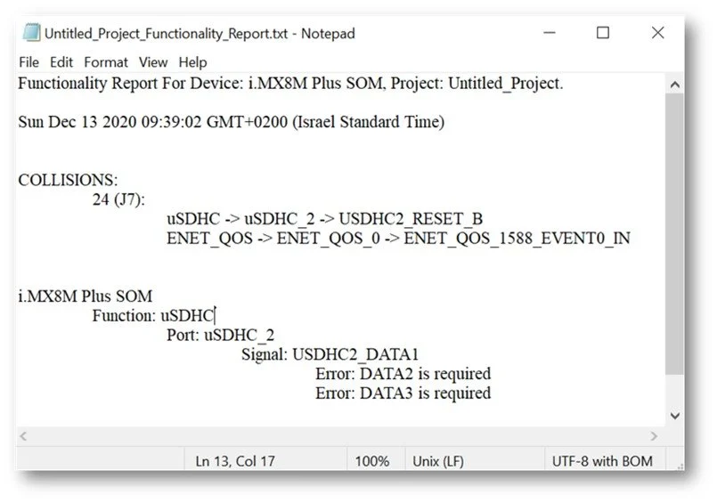
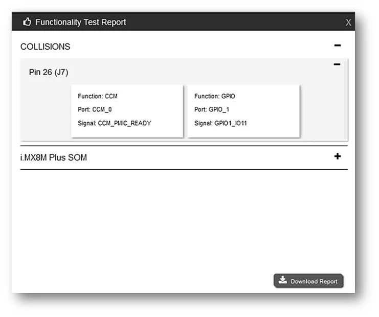
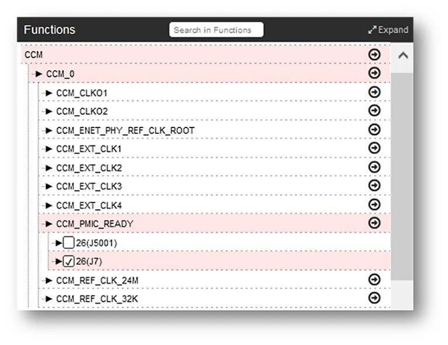

# Pinout Planner Tool Guide

## Revisions and Notes

|     |     |     |     |
| --- | --- | --- | --- |
| **Date** | **Owner** | **Revision** | **Notes** |
| 08 Jan 2019 | Alvaro Karsz | 1.0 |     |
| Table of Contents | - [Revisions and Notes](#revisions-and-notes) - [Overview](#overview) - [Features](#features) - [System Requirements](#system-requirements) - [User Interface (UI) Description](#user-interface-ui-description) - [The Title Bar](#the-title-bar) - [The Header Bar](#the-header-bar) - [The ‘Function’ Section](#the-function-section) - [The ‘Workspace’ Section](#the-workspace-section) - [The Footer Bar](#the-footer-bar) - [Getting Started](#getting-started) - [Associating Pins to Signals/Ports/Functions](#associating-pins-to-signals-ports-functions) - [Working on Compatible Modules](#working-on-compatible-modules) - [Obtaining ‘Pinout Summary’](#obtaining-pinout-summary) - [Checking Your Work](#checking-your-work) - [Fixing Collisions and Functional Errors](#fixing-collisions-and-functional-errors)   - [Fixing Collisions](#fixing-collisions) - [Fixing Functional Errors](#fixing-functional-errors) - [Saving the Current Project](#saving-the-current-project) - [Retrieving a Saves Project](#retrieving-a-saves-project) - [Tips and recommendations](#tips-and-recommendations) - [Restrictions](#restrictions) |     |     |

## Overview

SolidRun’s Pinout Planner is an innovative web tool that is intended to assist in planning the pin configuration of carrier boards designed to accommodate the CN913 COM Express Type 7, LX2160 COM Express Type 7, A388 SOM, i.MX8M Mini SOM, and i.MX8M Plus SOM modules. The Pinout Planner configures pin signals by multiplexing the electrical functions and assigning them to associated pins while highlighting collisions (e.g. dual use of specific pins), as well as functionality errors (e.g. not all signals required for a function are associated to pins).

To access the Pinout Planner, use the following link:

[https://pinout.solid-run.com/](https://pinout.solid-run.com/?_ga=2.164400383.1904869103.1630216861-211629431.1605639473)

## Features

- Web application, compatible for any modern browser.
- Operated via the HTTPS protocol which is encrypted and uses Transport Layer Security
- Simple, user-friendly, UI (User Interface) that includes “Help” option
- Automatic selection of all GND and POWER signals
- Group processing – the tool enables to select and process a complete function including all ports and signals, or a port including all signals
- Collision check – the tool alerts in case the same pin has been associated with two different signals
- Functionality errors warning – the tool indicates in case not all signals required for the implementation of a function are selected.
- The planning project can be exported and saved as CSV file on the user’s computer at any time and can be later imported for further planning
- Backup files are automatically saved in the local storage of the browser on the user’s computer
- For privacy reasons the information is not copied or exported to any external entity

## System Requirements

To operate this web application the following minimum requirements, apply:

- Using a modern web browser such as Chrome, Firefox, Safari, Microsoft Edge, etc.
- Being connected to the Internet.

## User Interface (UI) Description

The UI is based on the most contemporary web application design conventions, making it clear and easy to use, while providing great User eXperience (UX).

The UI includes four areas as shown in Figure 1:

- Title Bar
- Header Bar
- ‘Functions’ Section
- ‘Workspace’ Section
- Footer Bar

## The Title Bar

The title bar (see Figure 2) includes:

- The SolidRun logo.
- The name of the project you are currently working on.
- The name of the module you are currently using for pinout configuration.
- A menu button that enables you to select another module at any time.

## The Header Bar

The Header bar (see Figure 3) includes the names of the associated sections as well as operation buttons and ‘Search’ fields related with them as follows:

- The ‘Functions’ section:
  - ‘Search’ field – enables you to enter the name of a function/port/signal and see a filtered list related to the selected name only.
  - Expand/Collapse double purpose button – when clicking on the button while showing ‘Expand’, it changes the view in the ‘Functions’ section so that a full list of all ports, signals and pin numbers of all functions is displayed; when clicking on the button while showing ‘Collapse’, it changes the view in the ‘Functions’ section so that only a list of all functions is displayed.
- The ‘Workspace’ section:
  - ‘Undo’ button – allows you to undo your last action.
  - ‘Clear’ button – allows you to delete your entire work.

|     |     |
| --- | --- |
|     | ***Use this button very cautiously because you cannot undo a ‘Clear’ action and the local storage data will be lost.*** |

- ‘Export’ button – allows you to generate a CSV file of your project with all the selected signals including pins that were automatically configured and have it saved on your computer.
- ‘Import’ button – allows you to import an exported CSV file of a project at any time.
- ‘Search’ field – enables you to enter the name of a function/port/signal and see a filtered list related to the selected name only.

## The ‘Function’ Section

The ‘Functions’ section (see Figure 4) displays all the available functions/ports/signals of the module you are working on plus their statuses, and enables you to select the one that you want to associate them to specific pins as follows:

- Function name – displays the names of an existing function. When clicking on a function name, all its ports will be shown. When clicking again, the ports will be hidden.
- Port name – displays the names of all ports related to a specific function. When clicking on a port name, all its signals will be shown. When clicking again, the signals will be hidden.
- Signal name – displays the names of all signals related to a specific port. When clicking on a signal name, all related pins will be shown, and one will be automatically checked.
- Pin number – displays the numbers of the connectors and pins of a specific signal.
- Yellow ‘Caution’ icon – indicates that the function includes at least one pin already selected for another function; if you work on this function, you may cause a collision.

If you click on the ‘Caution’ icon, a ‘Collision Alert’ popup window with the details of the functions and signals related to the same pin will appear (see Figure 5).

- ‘Select’ button – when clicking on it, the related function/port/signal is selected, and all its relevant data is displayed in the ‘Workspace’ section (see Figure 6).
- Status indicator – the background color of a line indicates the status of the respective entity as follows:
  - No color (white): no selection made.
  - Green: selection made – no collisions.
  - Yellow: no selection made – potential collisions.
  - Red: selection made – existing collisions.
- Checkmark – indicates the pin number that will be/has been selected.

## The ‘Workspace’ Section

The ‘Workspace’ section (see Figure 6) displays all the relevant data of each selected function/port/signal in a table format and it also includes additional buttons and indications as follows:

- Note line – indicates that Power and Grounding (GND) signals are automatically selected for you.
- ‘Module name’ line – shows the name of the module that you are currently working on.
- Selection Table
  - ‘Interface/Pin Name’ column – displays the names of all interfaces and pins of the function you chose to open.
  - The ‘Pin’ column – displays the numbers of the pins.
  - The ‘Remark’ column – displays more information related to the respective pin.
  - The ‘Collisions’ column – displays for each pin whose selection causes a collision, the interface/pin names with which the collision occurs.
- ‘Expand’ button – this button will appear when your mouse hovers over a line in the ‘Interface/Pin Name’ column. When clicking on it an info popup window with the details of the signal will be displayed (see Figure 7).
- Red ‘Caution’ icon – indicates that there is collision at least with one other signal. If you click on the ‘Caution’ icon, a ‘Collision’ popup window with the details of the signals related the same pin will appear (see Figure 8).

## The Footer Bar

The footer bar (See Figure 9) includes the following buttons and cumulative statistics:

- Help button – when clicking on it, a help window with guidance will appear.
- Cumulative statistics:
  - Number of used signals (out of the total number of available signals).
  - Number of selected pins (out of the total number of pins).
  - Number of automatically selected pins (out of the total number of pins).
  - Total number of existing collisions.
- ‘Pinout Summary’ button – when clicking on it a ‘Pinout Summary’ window will be displayed, presenting the configuration of each one of the module connectors referring to the pins (see the ‘Obtaining Pinout Summary’ Chapter).
- ‘Check Yourself’ button – when clicking on it a ‘Functionality Test Report’ popup widow will appear allowing you to see all collisions/functionality errors/warnings in your work (see the ‘Checking Your Work’ Chapter).

## Getting Started

After activating the Pinout Planner, the tool window opens along with a popup window (see Figure 10), enabling you to view an online copy of this user guide or select a module to work on.

To open the online copy of this user guide:

|     |     |     |
| --- | --- | --- |
| 1. Click on the ‘Guide’ button.  An online copy of this guide will be opened in a new tab of your web browser. | \=> |  |

To select a module:

|     |     |     |
| --- | --- | --- |
| 1. Click on the ‘Select Module’ line.  A list of all available modules will be displayed. 2. Select a module from the list and click on the ‘Continue’ button. 3. Now you can start working on the selected module. | \=>  \=> |    |

## Associating Pins to Signals/Ports/Functions

The main purpose of the Pinout Planner Tool is to provide you with an easy and convenient means of associating interface signals of functions to specific pins in the connectors of the modules.

- *The actual selection actually done upon clicking on the ‘Select’ of the corresponding entity.*

To implement selections, proceed as follows:

|     |     |     |
| --- | --- | --- |
| 1. In the ‘Functions’ section, click on the name of the function you want to work on.-  \-Subordinate lines with all ports related to the function will be displayed.  - *The actual selection actually done upon clicking on the ‘Select’ of the corresponding entity.*  2\. Click on the port you want to select.  \-Subordinate lines with all signals related to the port will be displayed.  - *If you click on the ‘Select’ button of a port, all its associated signals and default pins will be selected.*  3\. Click on the signal you want to select.  \-Subordinate lines with all pins related to the signal will be displayed.  \-The pin with a checkmark next to it is the one to be selected.  4\. You may select another pin (if exists) by clicking on it.  \-The checkmark will then appear next to the pin you clicked on.  5\. Click on the ‘Select’ button of the signal.  \-The signal will be selected, the lines of the signal, port, and function will become green, and the selection details will be added to the selection table in the ‘Workspace’ section.  6\. To unselect a function/port/signal, click on the Unselect button in the line next to the corresponding name in the selection table in the ‘Workspace’ section.  \-The function/port/signal and all its subordinates will be removed from the selection table in the ‘Workspace’ section, and the selection will be void.  - *If you want to cancel an action you just carried out, you can undo it by clicking on the ‘Undo’ button in the header bar.* | \=>  \=>  \=>  \=> |        |

## Working on Compatible Modules

The Pinout Planner allows you to plan a carrier board that can be suitable for all compatible modules, thus saving on production and inventory management expenses.

***Only some of the modules offered by SolidRun have compatible modules available.***

When you select a module that has a compatible module, both will appear in the ‘Workspace’ section selection table. So when you select a signal in the module you are currently working on (‘CN913X COM Express Type 7’ for example), the table will show which signal is used with the selected pin in the compatible module (‘LX2160 COM Express Type 7’ for example) as shown in Figure 11.

In case you want to see only the module you are currently working on, click on the ‘Close’ button next to the name of the compatible module.

## Obtaining ‘Pinout Summary’

The Pinout Planner allows you to view lists with the configuration of each one of the module connectors referring to the pins (see Figure 12) and apply various filters. To see the list at any time you can click on the ‘Pinout Summary’ button in the Footer Bar (Figure 12).

The ‘Pinout Summary includes the following buttons and indications:

- ‘Connector Number’ field – displays the number of the module connector, which the pins in the associated table belong.
- Selection Summary field – displays per each connector a summary of all selected and auto-selected pins as well as existing collisions.
- Filter buttons – enable filtering the list of the related connector as follows:
  - ‘All’ button – no filter applied (default).
  - ‘Selected’ button – all pins that have been selected.
  - ‘Auto Selected’ button – all pins that have been automatically selected (GND/POWER).
  - ‘Not Selected’ button – all pins that were not selected
  - ‘Collision’ button – all selected pins with collisions.
  - ‘No Collision’ button – all selected pins without collisions.
- ‘Pin Number’ field – displays the number of the pin in the related connector.
- Status indicator field – indicates the current status of the pin as follows:
  - ‘Selected No Collision’ (green) – the pin has been selected and has no collisions.
  - ‘Not Selected’ (orange) – the pin has not been selected but can be used.
  - ‘Not Selected’ (grey) – spare pin that has not been selected and cannot be used.
  - ‘Selected Collision’ (green and red) – the pin has been selected but has collisions
- Expand/Collapse button – when clicking on it the pin line expands and displays the details of all signals that can be associated with the selected pin. Each detail line has its own Expand/Collapse button allowing to see further details related to the port etc. (see Figure 13).

## Checking Your Work

One of the most powerful and beneficial features of the Pinout Planner is the ability to get a report of all collisions, functionality errors and warnings in your work and be able to address them based on this list.

To check your work:

1. Click on the ‘Check Yourself’ button in the Footer bar.

– A ‘Functionality Test Report’ popup window will open.

–       If there are no errors in your work the ‘Functionality Test Report’ popup window will open and show a ‘No Errors!’ message.

2\. To view all existing collisions, click on the Expand/Collapse double purpose button in the ‘Collisions’ line.

\-The ‘Collisions’ line will expand, and all existing collisions will be shown.

3\. To close the view, click again on the Expand/Collapse double purpose button in the ‘Collisions’ line.  

4\. To view all existing functionality errors, click on the Expand/Collapse double purpose button in the module name line.

\-The module name line will expand, and all existing functionality errors will be shown.

5\. To close the view, click again on the Expand/Collapse double purpose button in the module name line.

6\. If you would like to get a full report in text format click on the ‘Download Report’ button.

\-A full report in text format will be created.  

## Fixing Collisions and Functional Errors

In order to design a suitable board, you should fix all collisions and functional errors in your work. The Pinout Planner highlights the existing collisions and functional errors in many ways, allowing several methods for fixing them.

#### Fixing Collisions

Collisions occur when two signals (or more) are assigned to the same pin. You can fix a collision either by removing one of the signals that causes the collision or by changing the pin that is used for one of the signals, if possible, as described in the examples below.

To fix collisions:

Option A:

1. Click on the ‘Check Yourself’ button in the Footer bar.

\-The ‘Functionality Test Report’ popup window will open.

1. Click on the Expand/Collapse double purpose button in the ‘Collisions’ line.

\-The ‘Collisions’ line will expand, and all existing collisions will be shown.

1. In the shown example Pin 24 in Connector J7 is associated with both, signal uSDHC2\_RESET\_B in the uSDHC\_2 port of the uSDHC function, and signal ENET\_QOS\_1588\_EVENT0\_IN in the ENET\_008\_0 port of function ENE\_QOS. Follow the guidance below related to the collision.
2. Go to one of the relevant function(s) and unselect the pins mentioned.

For the shown example proceed as follows:

a) In the ‘Workspace’ section selection table, scroll to the line of the signal uSDHC2\_RESET\_B under the uSDHC\_2 port of the uSDHC function.

b) Note that the line is red and there is a red ‘Caution’ icon in its ‘Collisions’ column.

c) Click on the Unselect button on the left side of the uSDHC2\_RESET\_B line, and make sure it has been deleted from the table.

d) Click on the ‘Check Yourself’ button in the Footer bar, and make sure that the ‘Functionality Test Report’ popup window opens and shows a ‘No Errors!’ message.

Option B:

1\. Click on the ‘Check Yourself’ button in the Footer bar.

\-The ‘Functionality Test Report’ popup window will open.

2\. Click on the Expand/Collapse double purpose button in the ‘Collisions’ line.

\-The ‘Collisions’ line will expand, and all existing collisions will be shown.

1. 

3\. In the shown example Pin 26 in Connector J7 is associated with both, signal CCM\_PMIC\_READY in the CCM\_0 port of the CCM function, and signal GPIO1\_IO11 in the GPIO\_1 port of function GPIO.

Follow the guidance below related to the collision.

4\. Go to one of the relevant function(s) and reassign the pin mentioned (if possible).

For the shown example proceed as follows:

a) In the ‘Workspace’ section selection table, scroll to the line of the signal CCM\_PMIC\_READY under the CCM\_0 port of the CCM function.

b) Note that the line is red and there is a red ‘Caution’ icon in its ‘Collisions’ column.

c) In the ‘Functions’ section, scroll to the line of the signal CCM\_PMIC\_READY under the CCM\_0 port of the CCM function.

d) Note that the line is red.

e) Click on the line of the Signal name.

f) The line will expand, and two Pin number options will be displayed with a checkmark next to pin 26.

g) In the ‘Workspace’ section selection table, click on the Unselect button on the left side of the CCM\_PMIC\_READY line, and make sure it has been deleted from the table.

h) In the ‘Functions’ section, click on the line of pin 26 of the J5001 connector and then click on the Select button on the right side of the CCM\_PMIC\_READY

i) Note that the CCM\_PMIC\_READY line in the ‘Functions’ section has turned green and  CCM\_PMIC\_READY  has been added to the selection table in the ‘Workspace’ section.

## Fixing Functional Errors

A functional error reflects a situation that some signals required for a specific function are missing. Hence you should select such missing signals and assign them to available pins as described in the following example.

To fix a functional error:

1. Click on the ‘Check Yourself’ button in the Footer bar.

– The ‘Functionality Test Report’ popup window will open.

2\. Click on the Expand/Collapse double purpose button in the module name line.

\-The module name line will expand, and all existing functionality errors will be shown.

3\. In the shown example the DATA2 and DATA3 pins for the uSDHC2\_DATA1 signal are missing in the uSDHC\_2 port of the uSDHC function. Follow the guidance below related to the error.

4\. Go to the relevant function(s) and select or unselect the pins mentioned. For the shown example proceed as follows:

a) Click on the uSDHC function in the ‘Functions‘ section.

b) Click on the uSDHC\_2 port

c) Click on the Select button of the uSDHC2\_DATA2, and make sure the pin appears in the ‘Workspace’ section selection table.

d) Click on the Select button of the uSDHC2\_DATA3. Make sure the pin appears in the ‘Workspace’ section selection table.

e) Click the ‘Click on the ‘Check Yourself’ button in the Footer bar, and make sure that the ‘Functionality Test Report’ popup window opens and shows a ‘No Errors!’ message.

## Saving the Current Project

The Pinout Planner Tool automatically saves your work in the local storage (in the browser directory), so that in case you refresh or close the tool the work will not be lost. This means that next time you open the tool your last work will be automatically loaded. However, if you change the module you work on and open a new module without saving your current work beforehand, the data of the previous module will be deleted from the browser storage.

To save your work at any time for future use, you must export your work as follows:

|     |     |     |
| --- | --- | --- |
| 1.Enter a name in the Project name field in the title bar and click on the icon on its left, or press ‘Enter’ on your keyboard.  – The name you entered will be displayed in the Project name field.  2\. Click on the ‘Export’ button in the Header bar.  – In case your configuration has errors/warnings, a popup window will appear listing all collisions, errors, and warnings.  3\. If you want to keep working and address all of the issues listed, click on ‘Cancel’.  4\. Click on the ‘OK’ button in case you want to save the file and continue working on it later  – A CSV file (named with the name you gave to the project) including all the signals you selected as well as all the pins automatically selected by the tool, will be generated.  – You may download the file and save it in the ‘Downloads’ folder on your computer and then move it to any other folder as needed. | \=>  \=>  \=> |      |

## Retrieving a Saves Project

The Pinout Planner allows you to retrieve a saved file and continue working on it at any time as follows:

|     |     |     |
| --- | --- | --- |
| 1. Click on the ‘Import’ button in the Header bar. 2. Select in the browser window that opens the requested folder and file and click on the ‘Open’ button.             - *Make sure you save your current work before by performing ‘Export’ before importing another project, because  when you import a project, the Workspace is cleared all  previous data will be deleted.* | \=>                \=> |    |

## Tips and recommendations

Following are some tips and recommendations intended to make your work efficient and free of operational glitches:

1. When selecting at once all ports of a function or all lines of a port there is a greater chance of collisions. Hence it is preferable to select ports and lines individually.
2. Be very careful when using the ‘Clear’ button in the Workspace section because you cannot undo a ‘Clear’ action and the local storage data will be lost.
3. Automatically selected pins can be viewed in the Pinout Summary window and in the CSV file of the project generated by the Pinout Planner Tool.
4. Before switching to a new module or importing a saved project, make sure you save your current work by performing ‘Export’, to avoid losing your work.
5. Make sure your last work has been saved by performing ‘Export’ before clearing the web browser local storage data or reinstalling your browser, to avoid losing your work.
6. Make sure you give an individual meaningful name to each of the files that you export so you can keep track of different file versions and avoid overwriting your files.
7. Be sure to check your work using the ‘Check Yourself’ function and fix all collisions and functional errors before

## Restrictions

> [!WARNING]
> **Please Note**
> The tool is currently available in Beta version

> [!INFO]
> **Please Note**
> SolidRun will in no way bear responsibility for faults that may be caused due to inaccuracy of the database or the tool.