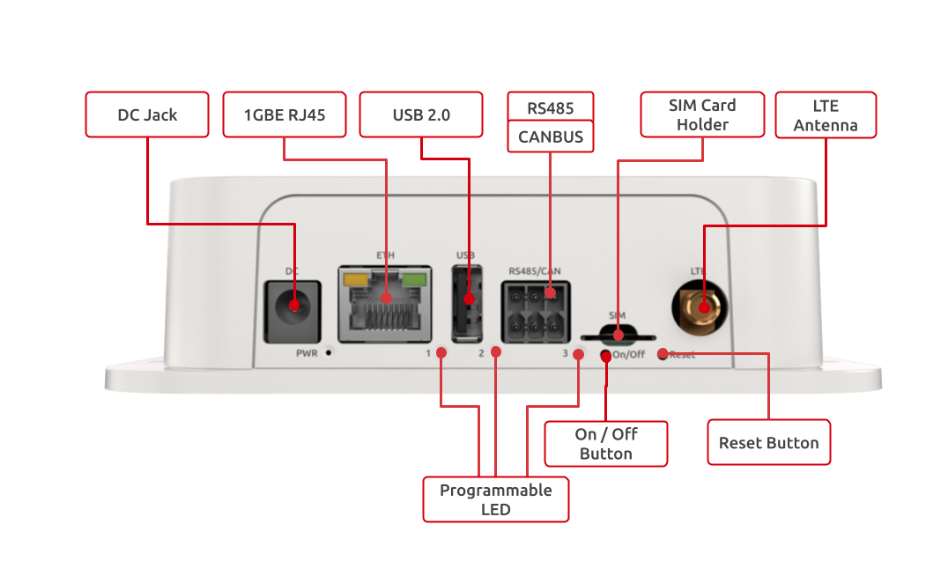
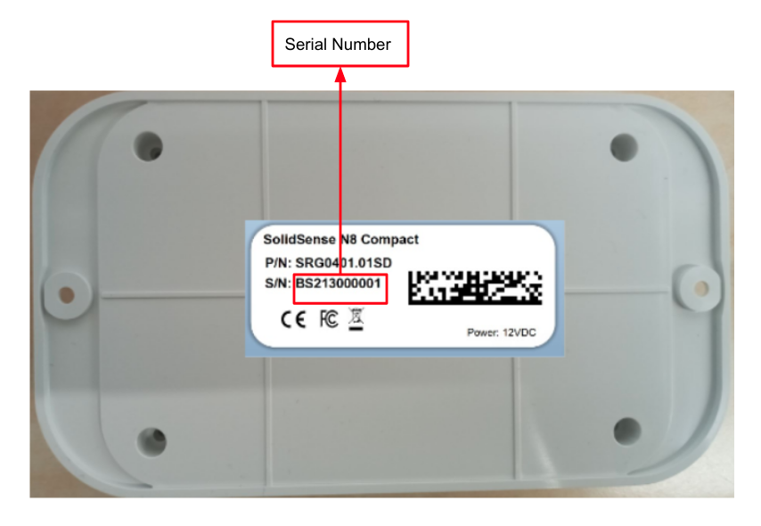
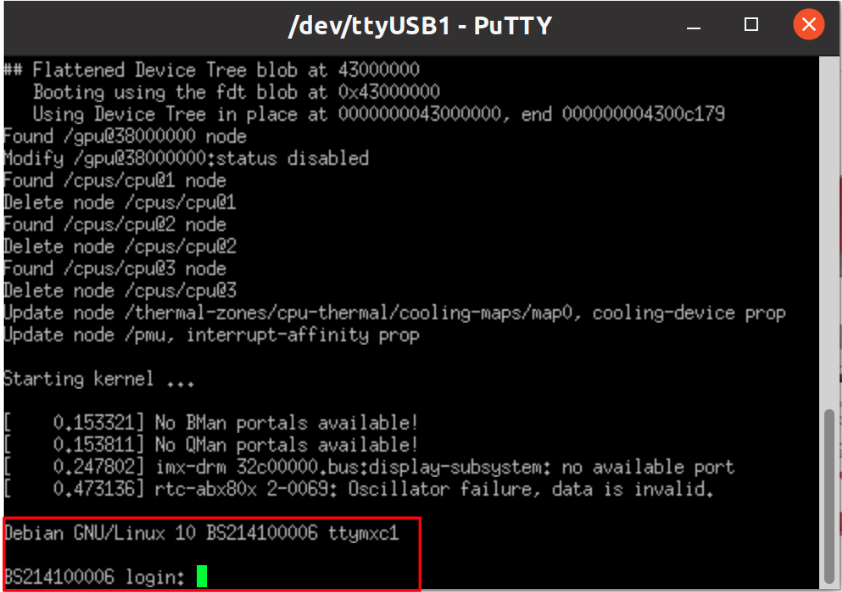

# SolidSense N8 Compact Quick Start Guide


<a id="revision-and-notes"></a>

## Revision and Notes

| **Date** | **Owner** | **Revision** | **Notes** |
| --- | --- | --- | --- |
| 19 Dec 2021 |     | 1.0 | Initial release |
| 02 Oct 2024 |     | 1.1 | Adding documentation of additional details on SKU descriptions and sink specifications. |
| Table of Contents | - [Revision and Notes](#revision-and-notes)<br>- [Introduction](#introduction)<br><br>- [Main features](#solidsensen8compactquickstartguide-mainfeatures)<br><br>  - [Hardware Setup](#hardware-setup)<br><br>    - [Product Specifications](#product-specifications)<br><br>    - [Visual features overview](#visual-features-overview)<br><br>  - [Power Connection](#power-connection)<br><br>  - [Network Configuration](#network-configuration)<br><br>  - [Sink Nina-B1 or FWM7BLZ22](#sink-nina-b1-or-fwm7blz22)<br><br>    - [Sink Pinout](#sink-pinout)<br><br>    - [Pin / Module](#pin-module)<br><br>    - [Nina-B1](#nina-b1)<br><br>    - [FWM7BLZ22](#fwm7blz22)<br><br>      - [Nina-B1 Circuit](#nina-b1-circuit)<br><br>      - [FWM7BLZ22 Circuit](#fwm7blz22-circuit)<br><br>    - [Wirepas Firmware](#wirepas-firmware)<br><br>    - [BLE Firmware](#ble-firmware)<br><br>    - [Sink Device - UART4](#sink-device-uart4)<br><br>  - [CanBus and RS485](#canbus-and-rs485)<br><br>  - [Graceful Boot Application](#graceful-boot-application)<br><br>    - [Hardware used by application](#hardware-used-by-application)<br><br>    - [How the application works](#how-the-application-works)<br><br>    - [Modifying the application](#modifying-the-application)<br><br>      - [Kernel part](#kernel-part)<br><br>      - [U-boot part](#u-boot-part)<br><br>  - [Cover Removal](#cover-removal)<br><br>  - [Hardware interfaces](#hardware-interfaces)<br><br>  - [Boot Select](#boot-select)<br><br>  - [Serial connection](#serial-connection)<br><br>  - [Booting Debian from SD card](#booting-debian-from-sd-card)<br><br>  - [List Of Supported OS](#list-of-supported-os)<br><br>  - [Build from sources](#build-from-sources)<br><br>  - [Support](#support)<br><br>  - [Related Articles](#related-articles) |     |     |

<a id="introduction"></a>

## Introduction

The following quick start guide provides background information about the [SolidSense N8 Compact.](https://www.solid-run.com/edge-gateway-solidsense/#iot-compacthttps-wwwsolid-runcom-edge-gateway-solidsense-iot-compact)

SolidSense N8 IoT Compact Edge Gateway is an enterprise Internet of Things gateway designed for servicing a local network of IoT devices with a range of solutions and business applications. SolidSense is the ultimate IoT M2M solution, with high-end connectivity options.

Based on NXP i.MX8M Nano processors, , SolidSense is a feature-rich edge platform designed to provide flexibility for developers and OEMs in implementing an almost endless range of IoT solutions.

<a id="main-features"></a>

# Main features

SoC: NXP i.MX 8M Nano Arm Cortex A53 Single core @1500MHz + Cortex M7@650MHz  
Memory: 1GB DDR4  
Storage: 8GB eMMC  
Temperature: Commercial (0C to 50C)  
OS: Linux  

<a id="hardware-setup"></a>

## Hardware Setup

<a id="product-specifications"></a>

#### Product Specifications

|     | **SolidSense N8 IoT Compact BLE**  <br>SRG0401.0**X**SY {x=1,2; Y=D,W} | **SolidSense N8 IoT Compact LTE BLE**  <br>SRG0402.0**X**SY {x=1,2; Y=D,W} | **SolidSense N8 IoT Compact Extended**  <br>SRG0403.0**X**SY {x=1,2; Y=D,W} | **SolidSense N8 IoT Compact Extended LTE**  <br>SRG0404.0**X**SY {x=1,2; Y=D,W} |
| --- | --- | --- | --- | --- |
| I/Os | 1 x USB 2.0  <br>1 x BLE 5.0 (SDR based on nRF52832 – Wirepas Compatible) | 1 x USB 2.0  <br>1 x BLE 5.0 (SDR based on nRF52832 – Wirepas Compatible) | 1 x RS485  <br>1 x CAN  <br>1 x USB 2.0 | 1 x RS485  <br>1 x CAN  <br>1 x USB 2.0 |
| Networking | 1 x Ethernet RJ45 10/100/1000  <br>1 x 802.11 a/b/g/n/ac WiFi and Bluetooth 5.0 | 1 x Ethernet RJ45 10/100/1000  <br>1 x 802.11 a/b/g/n/ac WiFi and Bluetooth 5.0  <br>1 x LTE Cat 4 Worldwide + GPS (with fallback on 3G/2G) | 1 x Ethernet RJ45 10/100/1000  <br>1 x 802.11 a/b/g/n/ac WiFi and Bluetooth 5.0 | 1 x Ethernet RJ45 10/100/1000  <br>1 x 802.11 a/b/g/n/ac WiFi and Bluetooth 5.0  <br>1 x LTE Cat 4 Worldwide + GPS (with fallback on 3G/2G) |
| Processor | NXP i.MX 8M Nano Arm Cortex A53 Single core @1500MHz + Cortex M7@650MHz | NXP i.MX 8M Nano Arm Cortex A53 Single core @1500MHz + Cortex M7@650MHz | NXP i.MX 8M Nano Arm Cortex A53 Single core @1500MHz + Cortex M7@650MHz | NXP i.MX 8M Nano Arm Cortex A53 Single core @1500MHz + Cortex M7@650MHz |
| Memory & Storage | 1GB DDR4  <br>8GB eMMC  <br>MicroSD | 1GB DDR4  <br>8GB eMMC  <br>MicroSD | 1GB DDR4  <br>8GB eMMC  <br>MicroSD | 1GB DDR4  <br>8GB eMMC  <br>MicroSD |
| Misc. | Programmable LEDs  <br>Supercap protection  <br>RTC w/ battery | Programmable LEDs  <br>Supercap protection  <br>RTC w/ battery | Programmable LEDs  <br>Supercap protection  <br>RTC w/ battery | Programmable LEDs  <br>Supercap protection  <br>RTC w/ battery |
| Development and Debug interfaces | Console port (internal) | Console port (internal) | Console port (internal) | Console port (internal) |
| Power | 9V-36V  <br>PoE sink | 9V-36V | 9V-36V  <br>PoE sink | 9V-36V |
| Expansion card I/Os ( \* ) | 1 x internal expansion header | 1 x internal expansion header | 1 x internal expansion header | 1 x internal expansion header |
| Temperature | 0°C to 50°C | 0°C to 50°C | 0°C to 50°C | 0°C to 50°C |
| Dimensions | 150 x 85 x 40mm | 150 x 85 x 40mm | 150 x 85 x 40mm | 150 x 85 x 40mm |
| Enclosure | Plastic casing with internal antennas for WiFi-Bluetooth/BLE | Plastic casing with internal antenna for WiFi-Bluetooth. One SMA port for LTE. | Plastic casing with internal antenna for WiFi-Bluetooth | Plastic casing with internal antenna for WiFi-Bluetooth. One SMA port for LTE. |

> [!INFO]
> **Please Note**
> (\*) Only accessible with case open.
> - All **SRG40X.01SD** {X: 1, 2, 5} SKUs comes with U-Blox Nina-B1 (U-Blox comes with BLE FW by default except if you order the version with SW except SD like SRG40x.01SW **will come with Wirepass FW** )
> - All **SRG40X.02SD** {X: 1, 2, 5} SKUs comes with fwm7blz22 (FWM7BLZ22 comes with BLE FW by default except if you order the version with SW except SD like SRG40x.02SW will come with Wirepass FW )
> - **SRG405.02SD** = full assembled (including all options in the list...)  
> \-> SolidSense N8 Compact - WiFi BLE-FWM LTE POE RS485 CAN ETH-ADIN

.png)

  
**Block Diagram**

The following figure describes the SolidSense N8 Compact Edge Block Diagram.


<a id="visual-features-overview"></a>

#### Visual features overview

Please see below the features overview of the front side of the product.



> [!NOTE]
> **Note**  
> The unit has two Dual-Band Antennas (for WIFI Module and U-Blox): RF ANT 2.4GHZ/5.4GHZ FLAT PATCH .

The system can be used in 4 ways:

1. Ready to go **SolidSense IoT platform** (SolidSense Out-Of-the-Box) with Eclipse Kura Framework and Wirepas/Bluetooth Low Energy MQTT gateways built-in applications. Configure the gateway via Kura and that’s it you can directly have your data forwarded to your cloud application.
2. Developing your own application or add-on on top of the platform. Simple additions can be developed via Python 3.7 using the pre-installed packages. For more sophisticated development, a Docker infrastructure is ready to host your containers.
3. Create your own SolidSense image derived from SolidSense OOB.
4. From bare metal. You can create your own Linux image starting from SolidRun BSP. The support for these developments are not covered in the SolidSense section.

> [!TIP]
> The product comes with a SolidSense built in software and ready to go.

<a id="power-connection"></a>

## Power Connection

Connect your power adaptor to the DC jack (12-36 V), and then connect the adaptor to mains supply.

> [!TIP]
> A green LED will light up at the front panel. This is an indication of your device working.  
> If it didn’t seem to be lit, then you have to press the on/off button.

<a id="network-configuration"></a>

## Network Configuration

For managing your IoT gateway, monitor the gateway status, and manage the network configuration, you can refer to [Configuring SolidSense networking with Kura](../../solidsense/solidsense-software/kura/configuring-solidsense-networking-with-kura.md) .

Please see below picture to get the serial number for SSID of the network.



<a id="sink-nina-b1-or-fwm7blz22"></a>

## Sink **Nina-B1** or **FWM7BLZ22**

This module can be programmed with either Wirepas or BLE firmware.

For all SRG40X.01SD SKUs (`X`: 1, 2, 5), the device comes with a U-Blox Nina-B1 module, which includes BLE firmware by default. If ordered with the "SW" suffix instead of "SD" (e.g., SRG40X.01SW), it will come with Wirepas firmware instead.

Similarly, all SRG40X.02SD SKUs (`X`: 1, 2, 5) are equipped with an FWM7BLZ22 module, which also includes BLE firmware by default. Ordering with the "SW" suffix (e.g., SRG40X.02SW) provides the module with Wirepas firmware instead.

<a id="sink-pinout"></a>

### **Sink Pinout**

| <a id="pin-module"></a><br><br>### **Pin / Module** | <a id="nina-b1"></a><br><br>### **Nina-B1**<br><br>SKUs SRG40X.0**1** {X: 1, 2, 5} | <a id="fwm7blz22"></a><br><br>### **FWM7BLZ22**<br><br>SKUs SRG40X.0**2** {X: 1, 2, 5} |
| --- | --- | --- |
| UART\_0\_PIN\_TX | 6   | 6   |
| UART\_0\_PIN\_RX | 5   | 8   |
| UART\_0\_PIN\_RTS | N.C | N.C |
| UART\_0\_PIN\_CTS | PD  | PD  |

<a id="nina-b1-circuit"></a>

#### **Nina-B1 Circuit**


<a id="fwm7blz22-circuit"></a>

#### **FWM7BLZ22 Circuit**


<a id="wirepas-firmware"></a>

### Wirepas Firmware

If you are using SolidSense as a Wirepas gateway you can directly configure your Wirepas gateway by referring to [Configuring and testing the Wirepas gateway software](../../solidsense/solidsense-software/wirepas/configuring-and-testing-the-wirepas-gateway-software.md) .

For flashing or re-flashing wirepas sinks, please refer to [Flashing or Re-flashing Wirepas sinks on SolidSense gateway (V0.9 and up)](../../solidsense/solidsense-software/wirepas/flashing-or-re-flashing-wirepas-sinks-on-solidsense-gateway-v09-and-up.md) .

> [!NOTE]
> When using the Solidsense software, UART4 (displayed as `/dev/ttymxc3` in Linux) should be linked to `wirepasSink1.service` for proper sink configuration on the N8 Compact.

> [!INFO]
> Wirepas is exclusively supported by our distribution partner [CTHINGS.CO | Edge IoT Solutions](https://cthings.co/)

<a id="ble-firmware"></a>

### BLE Firmware

This module supports BLE and can be programmed with BLE firmware on N8 products.  
To build and program the BLE firmware, please follow the instructions in the repository: [SolidRun BLE Firmware Guide](https://github.com/SolidRun/mynewt-sr-blehci/tree/master).  
The firmware is built on the Apache Mynewt OS, using the Apache NimBLE application to provide BLE functionality and HCI protocol support.

> [!NOTE]
> The SRG40X.0**Y**SD SKUs (`X`: 1, 2, 5; `Y`: 1, 2) come with BLE firmware pre-programmed by default.

<a id="sink-device-uart4"></a>

### Sink Device - UART4

UART4 appears as `/dev/ttymxc3` in Linux.

<a id="canbus-and-rs485"></a>

## CanBus and RS485


  
**Connector Description**


6 Position Terminal Block Plug, Female Sockets 0.138" (3.50mm) - 180° Free Hanging (In-Line) like this [connector](https://www.digikey.com/en/products/detail/phoenix-contact/1790111/2743737).

**CanBUS and RS485 Test**

For testing your CANBus and RS-485 interfaces, please refer to [SolidSense N8 Compact RS485 and CAN bus](../../solidsense/solidsense-other-articles/solidsense-n8-compact-rs485-and-can-bus.md) .

**Bluetooth**

1\. For showing all Bluetooth devices, run the following:

```
hciconfig -a
```

2\. Choose a device, and turn it on:

```
 hciconfig hci0 up
```

3\. Set up the Bluetooth name:

```
hciconfig hci0 name 'SolidRun_Ble'
```

4\. Make your Bluetooth detectable by other devices:

```
hciconfig hci0 piscan
```

5\. If you want to connect to other devices:

- Start by scanning for other Bluetooth devices:

```
hcitool scan
```

- Choose a MAC address and connect :

```
rfcomm connect 0  $MAC 10 & 
```

- You can check the communication between the devices by writing :

```
l2ping -c 4  $MAC
```

<a id="graceful-boot-application"></a>

## Graceful Boot Application

Our source code [https://github.com/SolidRun/imx8mp\_build/tree/imx8mn](https://github.com/SolidRun/imx8mp_build/tree/imx8mn)  includes a graceful boot/reboot application which prevents corruptions of the filesystem due to power loss.

<a id="hardware-used-by-application"></a>

#### Hardware used by application

- 5\[F\] Supercapacitor which can supply power to the board for ~10-15 seconds.
- Supercapacitor backup power manager IC.
- I/O expander, connected to the backup power manager IC.

**All these components are part of the board (if assembled).**

<a id="how-the-application-works"></a>

#### How the application works

The kernel polls the I/O expander, once the kernel detects that the external power is off (signal from the supercapacitor backup power manager IC), it throws "RESTART" keys.  
The keys are catched by input-event-daemon, then the daemon reboots the system.  
On boot, U-boot polls the I/O expander and won't boot until:

- An external power source is connected to the board.
- The capacitor charge is >90% (so it will last for the boot process, until the daemon will be started).

Once these requirement meet, U-boot will boot the system.

**If you are using our Kernel and U-boot, but you are not using our Buildroot, make sure you have a daemon to catch the thrown keys.**

<a id="modifying-the-application"></a>

#### Modifying the application

<a id="kernel-part"></a>

##### Kernel part

In order to remove the kernel part, remove "gpio\_keys\_polled" node from devicetree.  
The devicetree path is: `build/linux-imx/arch/arm64/boot/dts/freescale/imx8mn-compact.dts`

<a id="u-boot-part"></a>

##### U-boot part

The default configuration for the U-boot part is checking that an external power source is connected and the capacitor charge is >90%.  
This is configured in the bootcmd environment parameter: `check_power_connection 2;`.  
The argument "2" indicates that the extenral power connection and capacitor charge should be checked.  
If you just want to check the power connection, change the argument to "1" `check_power_connection 1;`.  
If you want to cancel the power check, you can delete the check\_power\_connection part from the bootcmd environment parameter.

<a id="cover-removal"></a>

## Cover Removal

For removing the enclosure , please follow the below instructions:


1. Remove 4 rubber feet (F) from screw holes in base.
2. Remove 4 Enclosure self-tapping screw (D) tightened to Top cover bosses (E).
3. Remove Top cover (C).
4. Remove Front cover (A) and Rear cover (B).

<a id="hardware-interfaces"></a>

## Hardware interfaces

Please see below the features overview of the connector side of the Compact.


Print side connector overview of the Compact.


<a id="boot-select"></a>

## Boot Select

Before powering up the board for the first time it is recommended to select the boot media. In order to configure the boot media to MicroSD, please set the S1 switch to match the first option from the following table:

|     |     |     |
| --- | --- | --- |
|     | **Switch 1** | **Switch 2** |
| **SD** | ON  | ON  |
| **eMMC** | OFF | ON  |

<a id="serial-connection"></a>

## Serial connection

Please connect the UART cable to the pins on connector J13 as shown in the above connector side picture under HW interfaces, then you can refer to [Serial Connection](../../../homepage/other-articles/serial-connection.md) for installing necessary serial connection software in Linux/Windows.  


Once you have installed the necessary serial connection software, reset your device and you should be able to see the following:



- In order to be able to log in, please insert ‘**solidsense**’ as username and ‘**aiPh2eim**’ as password.

<a id="booting-debian-from-sd-card"></a>

## Booting Debian from SD card

The following shows how to set the switches on the boot source selector:  

|     |     |     |
| --- | --- | --- |
|     | **Switch 1** | **Switch 2** |
| **SD** | ON  | ON  |

<a id="list-of-supported-os"></a>

## List Of Supported OS

| **OS** |     |
| --- | --- |
|  | [IMX8M Nano Compact - Yocto](../../../homepage/iot-industrial-product-line/nxp-imx8-based-products/imx8m-plus-mini-nano-software/solidsense-n8-compact-yocto.md) |
|  | [Buildroot](https://github.com/SolidRun/imx8mp_build/tree/imx8mn) |

<a id="build-from-sources"></a>

## Build from sources

- [i.MX8M Nano Compact ATF, U-Boot and Linux kernel](../../../homepage/iot-industrial-product-line/nxp-imx8-based-products/imx8m-plus-mini-nano-software/solidsense-n8-compact-atf-u-boot-and-linux-kernel.md)
- [IMX8M Nano Compact - Yocto](../../../homepage/iot-industrial-product-line/nxp-imx8-based-products/imx8m-plus-mini-nano-software/solidsense-n8-compact-yocto.md)
- [https://github.com/SolidRun/imx8mp\_build/tree/develop-lf-6.6.52-2.2.0-imx8mn](https://github.com/SolidRun/imx8mp_build/tree/develop-lf-6.6.52-2.2.0-imx8mn)

<a id="support"></a>

## Support

Please follow our [SolidSense Support Overview](../../solidsense/solidsense-software/other-software-articles/solidsense-support-overview.md) page.

<a id="related-articles"></a>

## Related Articles

Error rendering macro 'contentbylabel' : CQL was parsed but the search manager was unable to execute the search. Error message: com.atlassian.confluence.api.service.exceptions.scale.SSStatusCodeException: There was an illegal request passed to XP-Search Aggregator API : HTTP/1.1 403 Forbidden