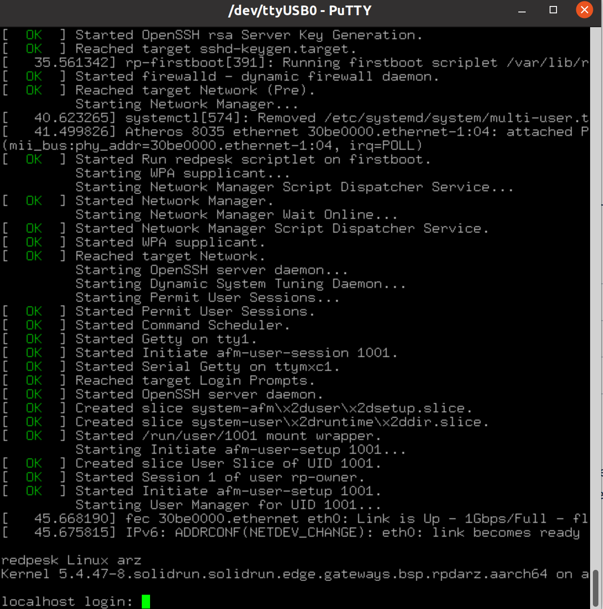

# SolidSense N8 Compact - redpesk

<a id="revision-and-notes"></a>

## Revision and Notes

| **Date** | **Owner** | **Revision** | **Notes** |
| --- | --- | --- | --- |
| 06 Mar 2022 |     | 1.0 | Initial release |
| Table of Contents | - [Revision and Notes](#revision-and-notes)<br>- [Introduction](#introduction)<br>  - [What is redpesk?](#what-is-redpesk)<br>- [redpesk Image Download](#redpesk-image-download)<br>- [Writing the image to your SD card](#writing-the-image-to-your-sd-card)<br>- [Connect to the SolidSense N8 IoT Compact](#connect-to-the-solidsense-n8-iot-compact)<br>  - [SolidSense N8 IoT Compact Block Diagram](#solidsense-n8-iot-compact-block-diagram)<br>  - [Hardware interfaces](#hardware-interfaces)<br>  - [Step-By-Step](#step-by-step) |     |     |

<a id="introduction"></a>

## Introduction

<a id="what-is-redpesk"></a>

### What is redpesk?


redpesk is a secure embedded all-in-one Linux software platform dedicated to Industrial IoT. It offers an easy-to-use pre-integrated CI/CD factory with more than 2,500 binary packages and a set of basic “ready-to-go” components that nearly every system requires.

- For more information, please visit [redpesk](https://docs.redpesk.bzh/docs/en/master/getting_started/docs/overview.html).

<a id="redpesk-image-download"></a>

## redpesk Image Download

Create a directory for downloading image:

```
mkdir ~/redpeskimage
cd ~/redpeskimage
```

Download the image by using:

```
wget -r -nd -nc --no-parent -A "redpesk*smack*" 'https://download.redpesk.bzh/redpesk-lts/arz-1.0-update/images/smack/minimal/aarch64/solidrun-edge-gateways/latest'
```

- For more images releases, please visit [redpesk images](https://docs.redpesk.bzh/docs/en/master/redpesk-os/boards/docs/boards/download-images.html).

<a id="writing-the-image-to-your-sd-card"></a>

## Writing the image to your SD card

To flash your SD card, unxz the compressed file and use dd:

```
unxz redpesk*.raw.xz
IMAGE=$(ls redpesk*.raw)
sudo dd if=$IMAGE of=/dev/sdX bs=4M status=progress
```

> [!NOTE]
> **Note:**
> Plug a micro SD into your Linux PC, the following assumes that the micro SD is added as /dev/sdX and all it’s partitions are unmounted.

<a id="connect-to-the-solidsense-n8-iot-compact"></a>

## Connect to the SolidSense N8 IoT Compact

<a id="solidsense-n8-iot-compact-block-diagram"></a>

### **SolidSense N8 IoT Compact Block Diagram**


<a id="hardware-interfaces"></a>

### Hardware interfaces


- You can visit our [guide](../solidsense-n8-compact-quick-start-guide.md) to get more information about the SolidSense N8 IoT Compact.

<a id="step-by-step"></a>

### Step-By-Step

- Plug in the SD Card into the board.
- Power on the board.
- Before powering up the board, make sure you have configured the boot media to microSD by setting the S1 switch on the boot source selector to **ON**:

|     |     |     |
| --- | --- | --- |
|     | **Switch 1** | **Switch 2** |
| **SD** | ON  | ON  |
| **eMMC** | OFF | ON  |

- Connect the USB-UART cable following the three pins beside the SD card socket


Open your serial console, restart your device and you should be able to see the following.



- In order to be able to log in , please insert “root” as a username and password.
- use `dmesg` to see the name of the USB plugged

```
[    4.514489] usb 1-6: FTDI USB Serial Device converter now attached to ttyUSB0 
```

- use picocom
```
 sudo picocom  -b 115200 /dev/ttyUSB0
```
- Getting the address of the board to be able to use a ssh connectionConnect an Ethernet cable between computer and SolidSense
```
 #on board
 ip -c a
 # on computer
 ssh root@<ip_board>
```