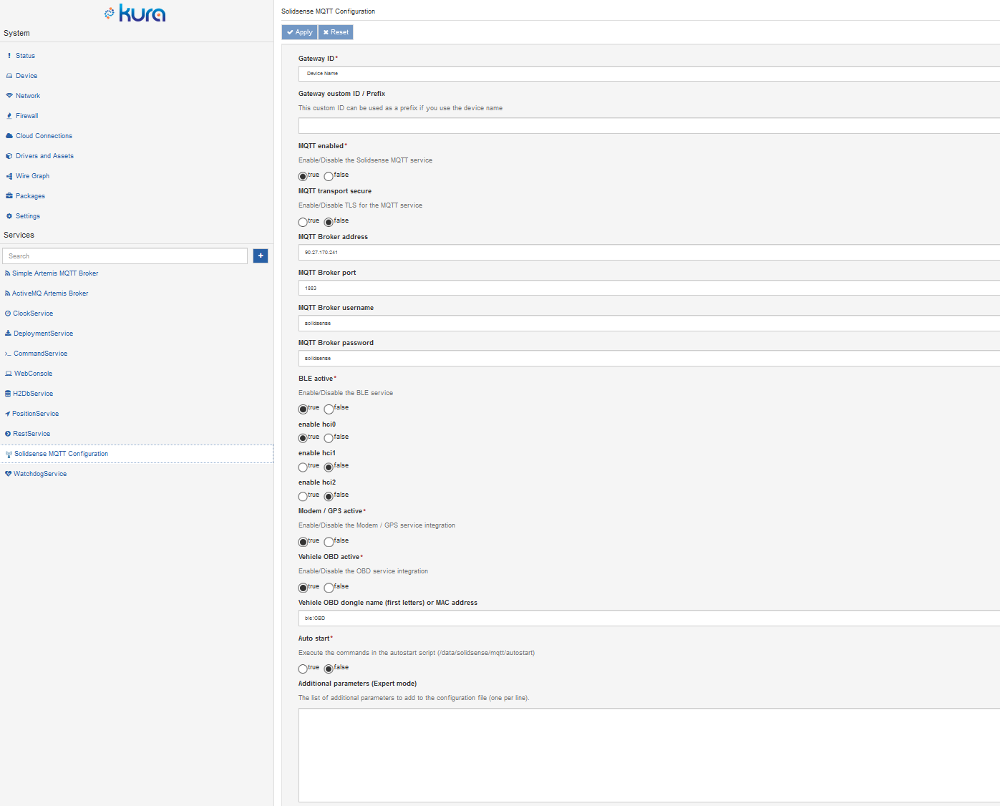

# SolidSense MQTT gateway

> \[!WARNING] The documentation for SolidSense software is not maintained by SolidRun and the information herein is not actual with the latest version of the software, please contact our partner [SolidSense Connect](https://solidsense-connect.com/) who is now developing the SolidSense software.\
> [Here](https://github.com/solidsense-connect/solidsense-connect-gateway/wiki) is the Solidsense-Connect WiKi documentation page.

## Introduction

The SolidSense gateway includes a MQTT client publishing information and data about the following subsystems:

* Bluetooth Low Energy for scan (advertisements) and GATT transactions
* GNSS
* Cellular modem
* Experimental: Vehicle On Board Diagnostic data

The SolidSense MQTT client augment and replace the BLE MQTT client that was part of the platform from the version 0.9.

## MQTT Interface definition

The MQTT interface allows to fully control the client behavior directly by sending MQTT messages to the client. Some basic configuration needs to be done via Kura and/or configuration files.

[Full documentation in PDF](https://images.solidsense.io/SolidSense/doc/SolidSense%20MQTT%20Gateway%20-%20Specifications%20-%20V2.0.0-Draft-200616.pdf)

## Configuration with Kura



The following information are to be configured

**Gateway ID**: by default this is the serial number or hostname or client ID but this can be overridden here.

**Transport enable**: true to start to gateway service, false otherwise

**MQTT transport secure**: If true TLS is setup of the communication with the broker. Proper broker configuration and if needed local certificate need to be put in place (see [Configuring and testing the Wirepas gateway software | Managing-TLS-certificates-for-a-secure-connection-towards-the-MQTT-broker](https://solidrun.atlassian.net/wiki/spaces/developer/pages/263946241/Configuring+and+testing+the+Wirepas+gateway+software#managing-tls-certificates-for-a-secure-connection-towards-the-mqtt-broker)

**MQTT broker address**

**MQTT broker port**

**MQTT credentials**

**BLE Active**: True to activate the BLE service on MQTT

**Enable hci0/hci1/hci2**: Define which Bluetooth physical interface is active

**Modem/GPS active**: True if the modem/GPS micro-service is accessible via MQTT

**Vehicle OBD active**: True if the vehicle OBD micro-service is accessible via MQTT

**Vehicle OBD dongle name**: First letters of the dongle name or its MAC address

**Auto Start**: if True the file in /data/solidsense/autostart is executed when the MQTT client starts. This file contains a list of topics with payload that are processed as if they have been recived via the broker allowing the start of publishing processes.

**Additional parameters**: These are additional execution command line options (see documentation) that are passed to the MQTT client process when starting.

## BLE Features

This software package allows to easily develop Bluetooth Low Energy (BLE 4.2) applications on top of the SolidSense gateway. It can be used either on the TI WL1831 chip (hci0) or one of the Nordic chip (nRF52832 on indoor or nRF52840 on outdoor) if they are not used by Wirepas. The Nordic are on the interfaces hc1 and hci2. Gateways delivered before February 2020 do not have a BLE stack flashed on the Nordic chip, in that case the Bluetooth stack can be flashed from the shell. See the corresponding paragraph below.

The detailed MQTT interface definition can be found in the [MQTT Interface definition document](https://images.solidsense.io/SolidSense/doc/BLE%20MQTT%20Gateway%20-%20Specifications%20-%20V1.0.4%20-%20200110.pdf).

The key features are the following:

1. Scan for surrounding BLE devices and publish advertisement packets. Several options are existing for publishing and decoding the content of there advertisements. In particular, specific beacons format like Eddystone and iBeacon are recognized and can be published with specific topics as well as Services like Temperature or battery level.
2. Configurable filters to eliminate unwanted devices
3. Full GATT client allowing detailed transactions with devices implementing GATT server capabilities.

## LED indicators

On the N6 Indoor there a 2 bi-color LED (green/red) that are used to indicate the MQTT client status.

The right LED (close to the GPS antenna port) is indicating the MQTT client state:

* LED off: MQTT client is inactive
* LED red: connecting to the broker
* LED green: connected to the broker

The left LED (close to WiFi antenna port) is indicating the communication status with the vehicle OBD system:

* LED off: no activity or between read cycles
* LED red: connecting to the OBD system
* LED green: reading data

## Troubleshooting

Unfortunately there is no interactive feedback on the configuration so it is necessary to look into the logs to find any problem. The simplest is to log via ssh and type:

```
sudo journalctl -u solidsense_mqtt -f
```

and check for errors. The most obvious and frequent ones are errors on the MQTT broker credentials.

The journalctl command can also be used through Kura or Kapua. In that case the -f option is not usable. To access to the last log entries first the simplest is to use the -r option.
