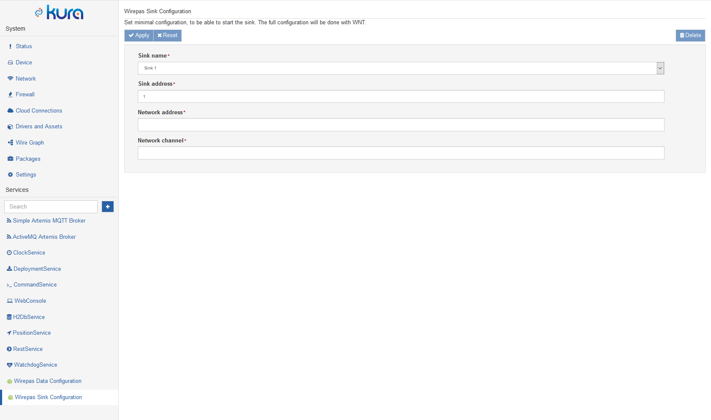
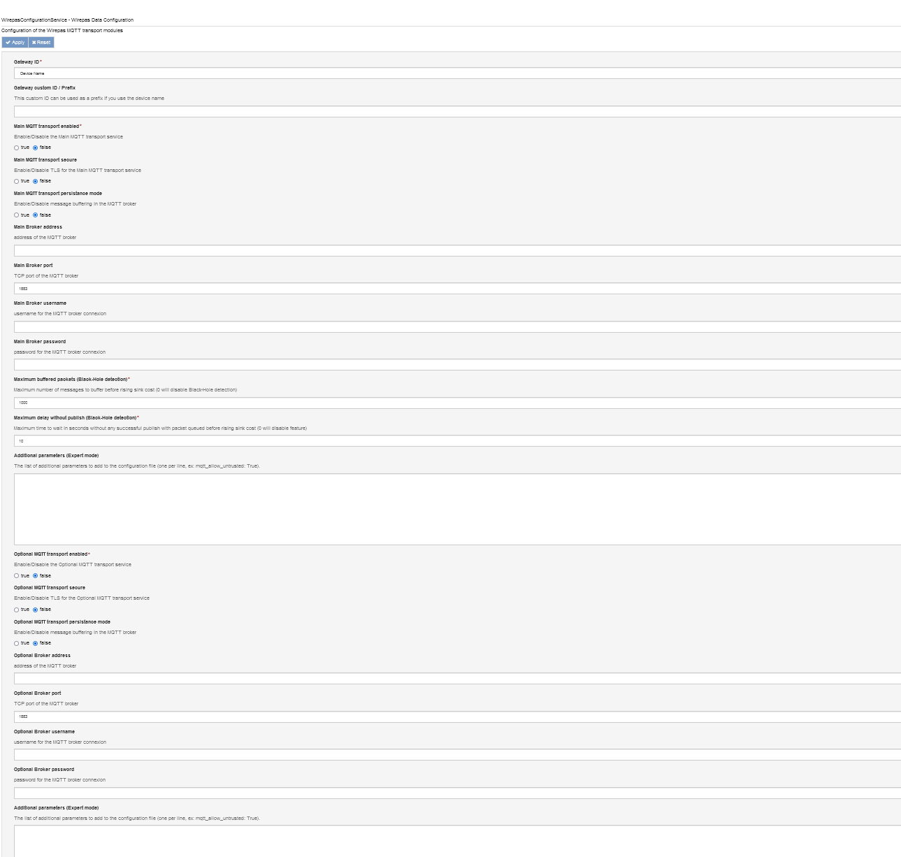

# Configuring and testing the Wirepas gateway software

> [!WARNING]
> The documentation for SolidSense software is not maintained by SolidRun and the information herein is not actual with the latest version of the software, please contact our partner [SolidSense Connect](https://solidsense-connect.com/) who is now developing the SolidSense software.
> [Here](https://github.com/solidsense-connect/solidsense-connect-gateway/wiki) is the Solidsense-Connect WiKi (documentation page)

<a id="prerequisite-and-installation"></a>

## Prerequisite and installation

From the version 0.9 on, the Wirepas gateway software is installed in the base image.From version 1.0 on (Solidsense-1.0-2020032700) and for orders with the Wirepas option, no installation step is required.

<a id="purpose-and-features"></a>

## Purpose and features

The SolidSense Wirepas service exposes the full gateway API from Wirepas compliant to the **Wirepas reference design 1.3.0**. For detailed information see the [Wirepas gateway API documentation](https://github.com/wirepas/backend-apis/blob/master/gateway_to_backend/README.md). From version 2.0 on, the gateway implements **Wirepas reference design 1.4**.

Practically that means that the gateway is directly compatible with all Wirepas cloud features, mainly the **WNT** for configuration and control of the Wirepas network and **WPE** for asset tracking features.

This is not preventing to develop additional applications on the gateway itself either by directly interfacing the sink services or by having messages routed to the local MQTT broker and writing a client (Python is preferred) that will process the payload locally.

<a id="mapping-of-wirepas-sinks-with-physical-ports"></a>

## Mapping of Wirepas sinks with physical ports

The Wirepas are connected to the CPU via UART. Here is the device mapping

| Gateway type | Sink 1 | Sink 2 |
| --- | --- | --- |
| N6 Indoor | /dev/ttymxc1 | /dev/ttymxc2 |
| N6 Outdoor | /dev/ttymxc1 | /dev/ttymxc2 |
| N6 Industrial | /dev/ttymxc1 | /dev/ttymxc2 |
| N8 Compact | /dev/ttymxc3 | N/A |

<a id="specific-installation-steps"></a>

## Specific installation steps

For gateway in version 0.9 that do not have their Wirepas sink factory flashed (Wirepas licensees) the procedure is here: [Flashing or Re-flashing Wirepas sinks on SolidSense gateway (V0.9 and up)](../wirepas/flashing-or-re-flashing-wirepas-sinks-on-solidsense-gateway-v09-and-up.md) .

If the Wirepas configuration services do not appear on the Kura interface, then the following step have to be applied:

1. Download the [Wirepas sample configuration file](https://images.solidsense.io/SolidSense/config/SolidSense-conf-custom.yml). This can be done either on your PC or directly from the gateway.
2. Copy the file in /data/solidsense/config/SolidSense-conf-custom.yml. That file can be edited first so you can directly enter your parameters. Otherwise you can always program them via Kura/Kapua
3. Restart the gateway for reconfiguration (being su) /opt/SolidSense/bin/restart –config. Warning all network parameters will fall back to factory default.

Exemple using ssh directly on the gateway connected to Internet

```
## Dowloading the file
## assuming pwd = /data/solidsense (home dir of solidsense user)
> curl -o config/SolidSense-conf-custom.yml https://images.solidsense.io/SolidSense/config/SolidSense-conf-wirepas.yml
> sudo su
su# /opt/SolidSense/bin/restart --config
```

<a id="sample-wirepas-configuration-in-yaml"></a>

#### Sample Wirepas configuration in Yaml

```
gateway:

    #  Definition of Wirepas related global variables
    #    To be modified with your actual values
    WP_TEST_ID: 10450204
    WP_TEST_CHANNEL: 10
    
    MQTT_BROKER: YOUR_MQTT_URL
    MQTT_PORT: 1883 # or 8883
    MQTT_USER: YOUR_BROKER_USER
    MQTT_PASSWORD: PASSWD
#######################################################
#                Services definition
#######################################################
services:        
#
#   Wirepas services => enable only if Wirepas is to be used
#   And if the right firmware has been flashed in the Nordic chips (sink)

- service:
    type: WirepasSink
    name: sink1
    state: active
    parameters:
        configuration: WirepasSinkConfigurationService
        plugin: WirepasConfigurationService.dp
        plugin_name: WirepasConfigurationService
        system: wirepasSink1
        port: ttymxc1       # physical port
        start: true
        
    variables:
        NETWORK_ID: $WP_TEST_ID
        NETWORK_CHANNEL: $WP_TEST_CHANNEL
        ADDRESS: $UNIQUE_ADDRESS0
    properties:
        sinkAddress: $ADDRESS
        networkChannel: $NETWORK_CHANNEL
        networkAddress: $NETWORK_ID
        sinkName: $service_name

- service:
    type: WirepasSink
    name: sink2
    state: active
    parameters:
        configuration: WirepasSinkConfigurationService
        plugin: WirepasConfigurationService.dp
        plugin_name: WirepasConfigurationService 
        system: wirepasSink2
        port: ttymxc2
        start: true
        
    variables:
        NETWORK_ID: $WP_TEST_ID
        NETWORK_CHANNEL: $WP_TEST_CHANNEL
        ADDRESS: $UNIQUE_ADDRESS1
    properties:
        sinkAddress: $ADDRESS
        networkChannel: $NETWORK_CHANNEL
        networkAddress: $NETWORK_ID
        sinkName: $service_name
        
- service:
    type: WirepasTransport
    name: wirepas-cloud
    state: interactive
    parameters:
        configuration: WirepasConfigurationService
        plugin: WirepasConfigurationService.dp
        plugin_name: WirepasConfigurationService
        system: wirepasTransport1
        prefix: transportA
        # customId:
    variables:
        ENABLE: True
        SECURE: False
        ADDRESS: $MQTT_BROKER
        PORT: $MQTT_PORT
        USER: $MQTT_USER
        PASSWORD: $MQTT_PASSWORD
    properties:
        enabled: $ENABLE
        secured: $SECURE
        address: $ADDRESS
        user: $USER
        port: $PORT
        passwd: $PASSWORD
```

<a id="configuring-the-sink-service-with-kura"></a>

## Configuring the sink service with Kura

Open the Kura web interface and go the Wirepas Sink Configuration menu



On this page you need to configure the Wirepas network parameter for each sink: The Network ID (in decimal) and channel number. After applying the changes, the wirepas sink services are updated with the new parameters. Each sink is to be configured separately and the Web interface does not record the configuration for each sink. Only the visible parameters are stored.

> [!WARNING]
> **Warning: the value displayed are the one stored in the Kura database and do not reflect the actual values in the sinks**

<a id="configuring-the-sink-service-with-kura-solidsense-v20"></a>

## Configuring the sink service with Kura SolidSense V2.0


In V2.0 major improvements have been added to the Sink Service:

- Values displayed are the actual ones
- More features can be configured
- The number of sinks displayed reflect the gateway configuration

<a id="configuring-the-wirepas-data-transport"></a>

## Configuring the Wirepas Data transport

The Wirepas transport application allows the communication between external and local applications via MQTT or gRPC protocols. By default no communication channel is configured.

Up to 3 communication channels, working simultaneously, can be configured via the Wirepas Data Configuration screen in Kura:

1. Main MQTT transport
2. Optional MQTT transport
3. Local micro service on gRPC



Each MQTT transport has the following configuration items

- Enable for operational
- Enable transport secure. communication to be performed over TLS
- transport persistence mode: if true set the MQTT Clean Session parameter to False. No message loss.
- MQTT Broker URL
- MQTT Broker username
- MQTT Broker password
- **Maximum buffered packets and maximum delay without publish: these parameters control the “black hole” mechanism. If they are non zero the “black hole” feature is enabled, meaning that when the MQTT connection is cut if one of the limit is crossed htne the sink cost is raise to maximum, so the gateway is not taking any messages from the Wirepas network**
- Expert mode is used to pass any parameter not defined with a field on the page. Syntax is YAML like,with one parameter per line.

> [!WARNING]
> **Note:** if a specific certificate is needed for TLS communication with the MQTT broker, then that certificate must be configured on the gateway. The procedure is explained [here](https://developer.solid-run.com/knowledge-base/gateway-secure-communication-and-vpn/)

After applying the changes all enabled data transport are started or restarted and the gateway should be operational.

<a id="micro-service-grpc-configuration"></a>

## Micro-service gRPC configuration

If local processing of the Wirepas data or specific transport is to be implemented, the local gRPC Wirepas server can be started. The only option is to use either a global listening address, meaning the server is visible from outside if the firewall is open on that port, or a local address, meaning that the service is only available for local processes.

Default port: 9883

Proto file and examples in /opt/SolidSense/Wirepas-Install-1.2/wirepas-gw/grpc

<a id="using-kapua-for-remote-configuration"></a>

## Using Kapua for remote configuration

All the configuration can also be done using Kapua, using the remote device configuration service that is briefly described in: [Using Eclipse Kapua to supervise and configure SolidSense gateways | Managing-devices](https://solidrun.atlassian.net/wiki/spaces/developer/pages/264142858/Using+Eclipse+Kapua+to+supervise+and+configure+SolidSense+gateways#managing-devices)

<a id="wirepas-transport-configuration-parameters"></a>

## Wirepas transport configuration parameters

Here below the list of all parameters. many of them can be configured directly via the wirepasTransport plugin in Kura, the one that are directly present can be set in the “expert mode” text field using a “Yaml” syntax (parameter: value).

The wirepas transport services are using the parameters located in /data/solidsense/wirepas

- Main MQTT (wirepasTransport1) in wirepasTransport1.service.cfg
- Secondary (wirepasTransport2) in wirepasTransport2.service.cfg

These file are directly written by the Kura configuration plugin, so any manual edit will be lost if the plugin is used.

```
Wirepas Gateway Transport service arguments

optional arguments:
  -h, --help            show this help message and exit

main:
  --version             show program's version number and exit

file_settings:
  --settings SETTINGS   A yaml file with argument parameters (see help for
                        options). (default: None)

mqtt:
  --mqtt_hostname MQTT_HOSTNAME
                        MQTT broker hostname. (default: None)
  --mqtt_username MQTT_USERNAME
                        MQTT broker username. (default: None)
  --mqtt_password MQTT_PASSWORD
                        MQTT broker password. (default: None)
  --mqtt_port MQTT_PORT
                        MQTT broker port. (default: 8883)
  --mqtt_ca_certs MQTT_CA_CERTS
                        A string path to the Certificate Authority certificate
                        files that are to be treated as trusted by this
                        client. (default: None)
  --mqtt_certfile MQTT_CERTFILE
                        Strings pointing to the PEM encoded client
                        certificate. (default: None)
  --mqtt_keyfile MQTT_KEYFILE
                        Strings pointing to the PEM encoded client private
                        keys respectively. (default: None)
  --mqtt_cert_reqs {CERT_REQUIRED,CERT_OPTIONAL,CERT_NONE}
                        Defines the certificate requirements that the client
                        imposes on the broker. (default: CERT_REQUIRED)
  --mqtt_tls_version {PROTOCOL_TLS,PROTOCOL_TLS_CLIENT,PROTOCOL_TLS_SERVER,PROTOCOL_TLSv1,PROTOCOL_TLSv1_1,PROTOCOL_TLSv1_2}
                        Specifies the version of the SSL / TLS protocol to be
                        used. (default: PROTOCOL_TLSv1_2)
  --mqtt_ciphers MQTT_CIPHERS
                        A string specifying which encryption ciphers are
                        allowable for this connection. (default: None)
  --mqtt_persist_session [MQTT_PERSIST_SESSION]
                        When True the broker will buffer session packets
                        between reconnection. (default: False)
  --mqtt_force_unsecure [MQTT_FORCE_UNSECURE]
                        When True the broker will skip the TLS handshake.
                        (default: False)
  --mqtt_allow_untrusted [MQTT_ALLOW_UNTRUSTED]
                        When true the client will skip the certificate name
                        check. (default: False)
  --mqtt_reconnect_delay MQTT_RECONNECT_DELAY
                        Delay in seconds to try to reconnect when connection
                        tobroker is lost (0 to try forever) (default: 0)

gateway:
  --gateway_id GATEWAY_ID
                        Id of the gateway. It must be unique on same broker.
                        (default: None)
  -fp [FULL_PYTHON], --full_python [FULL_PYTHON]
                        Do not use C extension for optimization. (default:
                        False)
  -gm GATEWAY_MODEL, --gateway_model GATEWAY_MODEL
                        Model name of the gateway. (default: None)
  -gv GATEWAY_VERSION, --gateway_version GATEWAY_VERSION
                        Version of the gateway. (default: None)

filtering:
  -iepf IGNORED_ENDPOINTS_FILTER, --ignored_endpoints_filter IGNORED_ENDPOINTS_FILTER
                        Destination endpoints list to ignore (not published).
                        (default: None)
  -wepf WHITENED_ENDPOINTS_FILTER, --whitened_endpoints_filter WHITENED_ENDPOINTS_FILTER
                        Destination endpoints list to whiten (no payload
                        content, only size). (default: None)

buffering:
  --buffering_max_buffered_packets BUFFERING_MAX_BUFFERED_PACKETS
                        Maximum number of messages to buffer before rising
                        sink cost (0 will disable feature) (default: 0)
  --buffering_max_delay_without_publish BUFFERING_MAX_DELAY_WITHOUT_PUBLISH
                        Maximum time to wait in seconds without any successful
                        publish with packet queued before rising sink cost (0
                        will disable feature) (default: 0)
  --buffering_minimal_sink_cost BUFFERING_MINIMAL_SINK_COST
                        Minimal sink cost for a sink on this gateway. Can be
                        used to minimize traffic on a gateway, but it will
                        reduce maximum number of hops for this gateway
                        (default: 0)
  --buffering_monitor_period BUFFERING_MONITOR_PERIOD
                        Delay in seconds between two logs of the
                        network/buffering state (0 will disable feature)
                        (default: 0)
```

<a id="checking-the-status-of-the-data-transport"></a>

## Checking the status of the data transport

The feature is available only in 2.0


<a id="testing-and-troubleshooting-the-wirepas-configuration"></a>

## Testing and troubleshooting the Wirepas configuration

<a id="sink-services"></a>

### Sink services

The sink service ensure the communication with the Wirepas software running on the Nordic chips. This a systemd service that is automatically started when configured. There are 2 services:

1. wirepasSink1 for the sink#1 (/dev/ttymxc1)
2. wirepasSink2 for the sink#2 (/dev/ttymxc2)

After the Sink(s) is (are) configured the gateway is connected to the Sink and as soon the data transport is configured the data are sent to the MQTT broker(s)

<a id="simple-check-of-sink-configuration"></a>

#### Simple check of sink configuration

From the shell (or Kura/Kapua) you can enter  
**sinkctl**

This will display the sink configuration as follows

Sink sink1 Network: 5063237 Channel: 38 Address: 3268760 Stack Started  
Sink sink2 Network: 5063237 Channel: 38 Address: 3268761 Stack Started

The **sinkctl** command can also start and stop the Wirepas stack by adding the ‘start’ or ‘stop’ option to the command:

```
# stop all the sinks
sinkctl stop
# start all sinks
sinkctl start
```

<a id="firmware-verification"></a>

#### Firmware verification

If the above commands do not give any results and in case you are unsure about the firmware flashed on the Nordic chips you can perform the following commands

```
# check sink1 firmware
sudo wp-get-fw-version /dev/ttymxc1
# check sink2 firmware
sudo wp-get-fw-version /dev/ttymxc2

Correct response with a Wirepas firmware
[SERIAL][9:19:22] D:Custom bitrate set: 125000
[SERIAL][9:19:22] D:Serial opened
[wpc_int][9:19:22] I:WPC initialized
Wirepas Firmware version: 4.0.50.0
Wirepas Network config: 176377:11259375:2

Incorrect response with no Wirepas firmware flashed
[SERIAL][9:19:22] D:Custom bitrate set: 125000
[SERIAL][9:19:22] D:Serial opened
[wpc_int][9:19:22] I:WPC initialized
Wirepas Firmware version: 4.0.50.0
Wirepas Network config: 176377:11259375:2
```

<a id="advanced-troubleshooting-with-systemd"></a>

#### Advanced troubleshooting with systemd

To check that the service is communicating correctly with the sink

```
systemctl status wirepasSink1
systemctl status wirepasSink2
```

If there is an error reported here, that means that there no communication between the sink service and the sink. This can be due to non-Wirepas software installed on the sink, wrong sink software configuration (baud rate or pinout) or hardware problem. Here a correct output:

```
solidsense@BS184300123:~$ systemctl status wirepasSink1
* wirepasSink1.service - Wirepas sink manager for sink connected to /dev/ttymxc1
   Loaded: loaded (/etc/systemd/system/wirepasSink1.service; enabled; vendor preset: enabled)
   Active: active (running) since Sun 2019-08-04 19:28:02 UTC; 18h ago
 Main PID: 940 (sinkService)
   CGroup: /system.slice/wirepasSink1.service
           `-940 /data/solidsense/wirepas/sinkService -b 125000 -p /dev/ttymxc1 -i 1

solidsense@BS184300123:~$ sudo journalctl -u wirepasSink1
-- Logs begin at Sun 2019-08-04 19:27:56 UTC, end at Thu 2019-08-08 13:37:12 UTC. --
Aug 04 19:28:02 BS184300123 systemd[1]: Started Wirepas sink manager for sink connected to /dev/ttymxc1.
```

> [!WARNING]
> **Please Note**
> The Wirepas sinks are managed by 2 linux services: wirepasSink1 wirepasSink2

If one of the Sink is not flashed with Wirepas or not used you can disable the service by using the following command:

```
sudo systemctl disable wirepasSink<n>  (n being 1 or 2)
```

Not disabling the service on a non Wirepas interface is generating a lot of errors in the logs, better to disable if the interface is not flashed or even not in use.

To enable in a later stage or if any mistake has been made:

```
sudo systemctl enable wirepasSink<n>
```

The service is started when configured using the Kura configuration service.

<a id="data-transport-services"></a>

### Data transport services

There are many more reasons to have problems with the data transport as it supports all communication parameters from the Wirepas network and towards the cloud applications.

The best way to verify that the transport service is running correctly is by looking at the logs

```
sudo journalctl -u wirepasTransport<1/2>
# for a continuous output
sudo journalctl -u wirepasTransport<1/2> -f
```

If there is no traces of packets from the Wirepas network, check the sink service configuration

For any other error, including “deadlock errors”, this is due to communication problems with the broker.

<a id="managing-tls-certificates-for-a-secure-connection-towards-the-mqtt-broker"></a>

### Managing TLS certificates for a secure connection towards the MQTT broker

In this version, the TLS certificate is not anymore hard coded and if a secure connection is to be implemented. **By default the TLS handshake shall work with the broker and no specific configuration is needed**. However, if some specific secure communication scheme have to be implemented, the corresponding certificate (.pem file) needs to be properly installed on the gateway.For that operation, it is necessary to open a ssh session on the gateway, there is for now no interactive procedure.

<a id="obtaining-the-ssl-certificate"></a>

#### Obtaining the SSL certificate

Either you have it and it is stored on the gateway for instance in $HOME directory and named mqttbroker.pem (the file name is is given as example and any valid name can be used) or you need to retrieve it directly from the broker using the following command line. For all scripts in this article it is assumed that the user is logged as the default user.

```
echo -n | openssl s_client -connect <MQTT Broker>:8883 | sed -ne '/-BEGIN CERTIFICATE-/,/-END CERTIFICATE-/p' > ~/mqttbroker.pem
```

If you have the certificate on your PC you can transfer it on the gateway by your preferred mean: scp/sftp/USB stick

<a id="adding-the-certificate-to-the-list-of-managed-certificates"></a>

#### Adding the certificate to the list of managed certificates

```
sudo cp ~/mqttbroker.pem /etc/ssl/certs
sudo cat ~/mqttbroker.pem >> /etc/ssl/certs/ca-certificates.crt
```

From that point , if a secure connection is to be setup to the broker on 8883, the TLS will be activated with the right certificate.