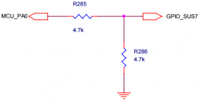

# IB8000/IB3710 STM32 Overview

## IB8000/IB3710 STM32 Overview

### Revision and Notes

| **Date**          | **Owner**                                                                                                                                                                                                                                                                                                                                                                                                                                                                                                                                                                                                                                                                                                                                                                                                                                                                                                                                                                                                                                                                                                                                             | **Revision** | **Notes**       |
| ----------------- | ----------------------------------------------------------------------------------------------------------------------------------------------------------------------------------------------------------------------------------------------------------------------------------------------------------------------------------------------------------------------------------------------------------------------------------------------------------------------------------------------------------------------------------------------------------------------------------------------------------------------------------------------------------------------------------------------------------------------------------------------------------------------------------------------------------------------------------------------------------------------------------------------------------------------------------------------------------------------------------------------------------------------------------------------------------------------------------------------------------------------------------------------------- | ------------ | --------------- |
| 18 Apr 2022       |                                                                                                                                                                                                                                                                                                                                                                                                                                                                                                                                                                                                                                                                                                                                                                                                                                                                                                                                                                                                                                                                                                                                                       | 1.0          | Initial release |
| Table of Contents | <p>- <a href="ib8000-ib3710-stm32-overview.md#revision-and-notes">Revision and Notes</a><br><br>- <a href="ib8000-ib3710-stm32-overview.md#ib8000-ib3710stm32overview-stm32-mcu">STM32 / MCU</a><br><br>- <a href="ib8000-ib3710-stm32-overview.md#hardware">Hardware</a><br><br>- <a href="ib8000-ib3710-stm32-overview.md#overview">Overview</a><br><br>- <a href="ib8000-ib3710-stm32-overview.md#stm32-schematics-on-the-microsom">STM32 Schematics on the MicroSom</a><br><br>- <a href="ib8000-ib3710-stm32-overview.md#mcu-wakeup-circuit">MCU Wakeup circuit</a><br><br>- <a href="ib8000-ib3710-stm32-overview.md#testpoints">Testpoints</a><br><br>- <a href="ib8000-ib3710-stm32-overview.md#software">Software</a><br><br>- <a href="ib8000-ib3710-stm32-overview.md#firmware-stm32">Firmware STM32</a><br><br>- <a href="ib8000-ib3710-stm32-overview.md#libreelec-kodi">LibreElec (Kodi)</a><br><br>- <a href="ib8000-ib3710-stm32-overview.md#rainshadow-rainconf">Rainshadow/RainConf</a><br><br>- <a href="ib8000-ib3710-stm32-overview.md#libcec">LibCEC</a><br><br>- <a href="ib8000-ib3710-stm32-overview.md#links">Links</a></p> |              |                 |

## STM32 / MCU

### Hardware

**Overview**


The STM32 family of 32‑bit Flash microcontrollers based on the ARM® Cortex®‑M processor is

designed to offer new degrees of freedom to MCU users. It offers a 32‑bit product range that combines very high performance, real-time capabilities, digital signal processing, and low‑power, low‑voltage operation while maintaining full integration and ease of development.

The **SR IB-E8000 and IB-N3710** got the **STM32F042K4U6** on the MicroSom.

| Documents              | Link                                                                                           |
| ---------------------- | ---------------------------------------------------------------------------------------------- |
| STM32 reference manual | [Download](https://developer.solid-run.com/wp-content/uploads/2018/10/stm32-en.dm00031936.pdf) |
| STM32 datasheet        | [Download](https://developer.solid-run.com/wp-content/uploads/2018/10/stm32.pdf)               |

The STM32F042x microcontrollers incorporate the high-performance ARM Cortex-M0 32-bit RISC core operating at a 48 MHz frequency, high-speed embedded memories (up to 32 Kbytes of Flash memory and 6 Kbytes of SRAM), and an extensive range of enhanced peripherals and I/Os. All devices offer standard communication interfaces (one I2C, two SPIs/one I2S, one HDMI CEC and two USARTs), one USB Full speed device (crystal-less), one CAN, one 12-bit ADC, four general-purpose 16-bit timers, a 32-bit timer and an advanced-control PWM timer.\
(source: datasheet)

STM32 supports HDMI CEC and other features.

**STM32 Schematics on the MicroSom**

* MCU\_BOOT0 – selects boot from USB or normal – GPIO 349
* MCU\_RESET – resest the MCU – GPIO 351
* Both signals are natively pulled up high from the processor

Code-Example for controlling the GPIOs via Linux

```
cd /sys/class/gpio
echo 349 > export
cd gpio349
echo 0 > value
echo 1 > direction
cat gpio349
```


**MCU Wakeup circuit**

The MCU got the ability to wake up the CPU from sleep mode.\
Notice that this is an example implementation on the SolidPC carrier.

Level shifts through resistors from 3.3v to 1.8v



**Testpoints**


Notice that this is an example implementation on the SolidPC carrier.\
**MCU: STM32: PA1..PA4 pins**

Testpoint TP19,TP20 and TP18 is located next to UART1 (covered when the Som is assembled)\
TP21 (left one) can be found on the opposite side of the PCB.\
Additional Testpoint-information: [SolidPC Testpoints](solidpc-testpoints.md)

#### Software

Thanks to our community developer GDA who created a working firmware for the stm32.

The firmware, libcec port, RainshadowAdapter-work is not maintained by Solid-Run.

**Firmware STM32**

The latest .bin file can be found here:

```
https://github.com/gdachs/cecbridge/raw/rainshadow/Debug/CECbridge.bin
```

**LibreElec (Kodi)**

All work concerning LibreElec can be found here:

```
https://github.com/vpeter4/LibreELEC.tv/commits/solidpc
```

The easiest way to get CEC running under Kodi is to use the latest SolidPC LibreElec image here:

```
http://vpeter.libreelec.tv/solidpc/
```

flash it to your storage and run

```
flashStm /usr/share/solidpc/CECbridge.bin
```

The flash process will take some time.

After a reboot cec functionality should work.

**Rainshadow/RainConf**

RainConf communicates directly with the STM32. (All processes need to be stopped which use LibCEC)

How to build rainconf:

**Hint: RainConf needs P8-Platform library**\
Which can be found here: [https://launchpad.net/\~yavdr/+archive/ubuntu/main](https://launchpad.net/~yavdr/+archive/ubuntu/main)

```
git clone https://github.com/gdachs/rainconf.git
cd rainconf 
mkdir build
cd build 
cmake ../src
make 
sudo make install
```

**LibCEC**

```
git clone https://github.com/gdachs/libcec.git
cd libcec
git checkout rainshadow
mkdir build
cd build
cmake -DHAVE_RAINSHADOW_API=1 ..
make  
sudo make install
```

#### Links

* [STM32 Website](http://www.st.com/content/st_com/en/products/microcontrollers/stm32-32-bit-arm-cortex-mcus.html?querycriteria=productId=SC1169)
