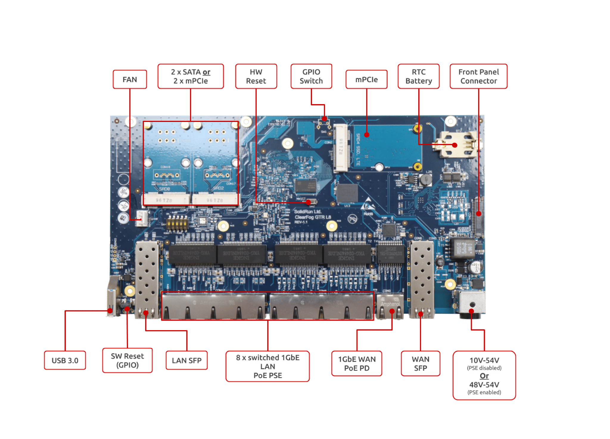
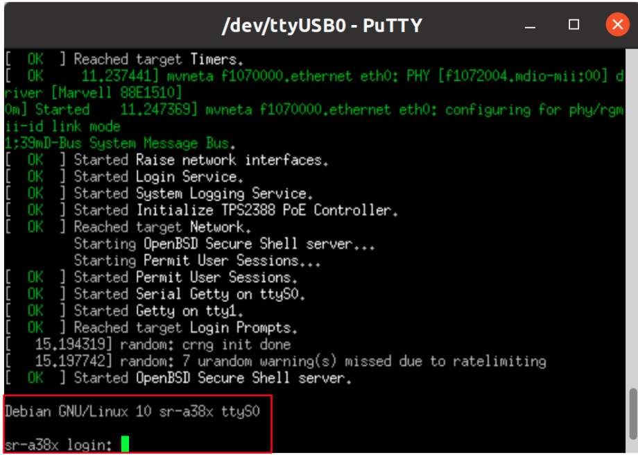

# ClearFog GTR L8 Quick Start Guide


## Revision and Notes

| **Date**          | **Owner**                                                                                                                                                                                                                                                                                                                                                                                                                                                                                                                                                                                                                                                                                                                                                                                                                                                                                                                                                                                                                                                                                                                                                                                                                                                                                                                                                                                                                                                              | **Revision** | **Notes**       |
| ----------------- | ---------------------------------------------------------------------------------------------------------------------------------------------------------------------------------------------------------------------------------------------------------------------------------------------------------------------------------------------------------------------------------------------------------------------------------------------------------------------------------------------------------------------------------------------------------------------------------------------------------------------------------------------------------------------------------------------------------------------------------------------------------------------------------------------------------------------------------------------------------------------------------------------------------------------------------------------------------------------------------------------------------------------------------------------------------------------------------------------------------------------------------------------------------------------------------------------------------------------------------------------------------------------------------------------------------------------------------------------------------------------------------------------------------------------------------------------------------------------- | ------------ | --------------- |
| 21 Oct 2021       |                                                                                                                                                                                                                                                                                                                                                                                                                                                                                                                                                                                                                                                                                                                                                                                                                                                                                                                                                                                                                                                                                                                                                                                                                                                                                                                                                                                                                                                                        | 1.0          | Initial release |
| Table of Contents | <p>- <a href="clearfog-gtr-l8-quick-start-guide.md#revision-and-notes">Revision and Notes</a><br>- <a href="clearfog-gtr-l8-quick-start-guide.md#introduction">Introduction</a><br>- <a href="clearfog-gtr-l8-quick-start-guide.md#specifications">Specifications</a><br>- <a href="clearfog-gtr-l8-quick-start-guide.md#block-diagram">Block Diagram</a><br>- <a href="clearfog-gtr-l8-quick-start-guide.md#visual-features-overview">Visual features overview</a><br>- <a href="clearfog-gtr-l8-quick-start-guide.md#software-setup">Software Setup</a><br>- <a href="clearfog-gtr-l8-quick-start-guide.md#cable-setup-and-prerequisites">Cable setup and prerequisites</a><br>- <a href="clearfog-gtr-l8-quick-start-guide.md#recommended-cables">Recommended Cables</a><br>- <a href="clearfog-gtr-l8-quick-start-guide.md#boot-select">Boot Select</a><br>- <a href="clearfog-gtr-l8-quick-start-guide.md#booting-from-an-emmc-card">Booting from an eMMC card</a><br>- <a href="clearfog-gtr-l8-quick-start-guide.md#sfp-modules">SFP Modules</a><br>- <a href="clearfog-gtr-l8-quick-start-guide.md#sim-card-slot">SIM Card Slot</a><br>- <a href="clearfog-gtr-l8-quick-start-guide.md#list-of-supported-os">List Of Supported OS</a><br>- <a href="clearfog-gtr-l8-quick-start-guide.md#build-u-boot-kernel-from-sources">Build U-Boot &#x26; kernel from sources</a><br>- <a href="clearfog-gtr-l8-quick-start-guide.md#documentation">Documentation</a></p> |              |                 |

## Introduction

The following quick start guide provides background information about the [ClearFog GTR L8](https://www.solid-run.com/arm-servers-networking-platforms/clearfog-gtr-a385/#gtr-l8) product.

The guide will give a technical overview about the product and by the end of it you should be able to boot an operating system and begin testing your application.

## Specifications

|                                  |                                                                                                                                                                |
| -------------------------------- | -------------------------------------------------------------------------------------------------------------------------------------------------------------- |
| I/Os                             | 1 x USB 3.0                                                                                                                                                    |
| Networking                       | <p>8 x 1GbE switched LAN supporting 802.3at/af/bt* (up to type 4) PSE PoE<br>1 x 1GbE WAN supporting up to 802.3bt type 4 PD PoE<br>1 x SFP (up to 2.5GbE)</p> |
| Processor                        | Marvell ARMADA based A385 Dual core Arm Cortex A9 up to 1.3 GHz                                                                                                |
| Memory & Storage                 | <p>Up to 2GB DDR3<br>8GB eMMC<br>MicroSD<br>2 x 7 pin SATA</p>                                                                                                 |
| Display                          | None                                                                                                                                                           |
| Misc.                            | <p>GPIO header<br>Indication LEDs<br>User Push Buttons</p>                                                                                                     |
| Development and Debug interfaces | Micro USB                                                                                                                                                      |
| Power                            | <p>10V – 54V when not enabling PoE PSE *<br>48V – 54V when enabling PoE PSE *</p>                                                                              |
| Expansion card I/Os              | 3 x mPCIe (1 x mPCIe supports LTE with SIM holder)                                                                                                             |
| Temperature                      | Industrial: -40°C to 85°C                                                                                                                                      |
| Dimensions                       | <p>PCBA: 238 x 130mm<br>Enclosure : 253 x 132 x 32mm</p>                                                                                                       |
| Enclosure                        | Extruded aluminum                                                                                                                                              |


(\*) 802.3bt supported only on 4 x RJ45 ports (90W each), 802.3at/af is supported on all 8 ports (30W each).



## Block Diagram

The following figure describes the **ClearFog GTR L8** Block Diagram.


## Visual features overview

Please see below the features overview of the connector side of the ClearFog GTR L8.



Print side connector overview of the ClearFog GTR L8.


## Software Setup

#### Cable setup and prerequisites

Here is what you will need to power up the board:

* Linux or Windows PC
* ClearFog GTR L8
* 48V Power Supply (ClearFog GTR L8 has wide range input of 10V-54V, it is recommended to use 48V)
* Micro USB to USB for console, the ClearFog Pro has an onboard FTDI chip.
* IP router or IP switch


The ClearFog GTR L8 has a wide range of 10V-54V input power supplies:
* 10V – 54V when not enabling PoE PSE
* 48V – 54V when enabling PoE PSE



## Recommended Cables

The following is a list of industry-standard cables, sorted by type, with the necessary compliance requirements that have been proven to work well with the ClearFog product family (ClearFog Base / Pro).

These examples are the cables which SolidRun uses for testing, and should provide enough information to source products from your preferred cable vendor.

* Ethernet cable: Monoprice 24AWG Cat6A 500MHz STP
* USB Cable: SuperSpeed USB 3.0 Type A Male to Female Extension Cable in Black
* SFP connector: GigaLite GE-GB-P1RT-E SFP module with Monoprice 24AWG Cat6A 500MHz STP cable

## Boot Select

Before powering up the board for the first time it is recommended to select the boot media. In order to configure the boot media, please refer to [ClearFog GTR Boot Select](/marvell/a38x/sbc-platform/a388-other-articles/clearfog-gtr-boot-select.md) .

## Booting from an eMMC card

The switches on the boot source selector must be set as follows:

|          |          |          |          |          |
| -------- | -------- | -------- | -------- | -------- |
| Switch 1 | Switch 2 | Switch 3 | Switch 4 | Switch 5 |
| OFF      | OFF      | ON       | ON       | ON       |

The following shows how to set the switches on the boot source selector:



The ClearFog GTR including [U-Boot](https://solid-run-images.sos-de-fra-1.exo.io/A38X/U-Boot/u-boot-clearfog-gtr-mmc.kwb) into eMMC by default. **Note:** Here can find the U-Boot Binaries - [SolidRun Images](https://images.solid-run.com/A38X/U-Boot)



Once you set the switches, you can apply the following for booting from an eMMC card.

**1. Downloading the Debian image**

```
wget https://solid-run-images.sos-de-fra-1.exo.io/A38X/Debian/sr-a38x-debian-buster-20200114.img.xz
```

* For more Debian releases, please visit [Debian Releases for Armada 38X](https://images.solid-run.com/A38X/Debian).

**2. Writing the image to the USB Disk card**

Use the following commands for writing the image to an USB Disk:

```
xz -dc sr-a38x-debian-buster-20200114.img.xz | dd of=/dev/sdX bs=4k conv=fdatasync
```

* For more information, please visit [Flashing an SD Card](/other-articles/flashing-an-sd-card.md) .


Note: Plug a USB Disk into your Linux PC, the following assumes that the USB is added as /dev/sdX and all it’s partitions are unmounted.



**3. USB Disk insertion**

Please Insert the USB Disk into your device.

**4. Power connection**

Connect your power adapter to the DC jack, and then connect the adapter to mains supply.

**5. Serial Connection**

Please insert the micro USB into your device, then you can refer to [Serial Connection](/other-articles/serial-connection.md) for installing necessary serial connection software in Linux/Windows.

Once you installed the necessary serial connection software, you should be able to see the following:



* In order to be able to log in , please insert “debian” as a username and password as follows:


## SFP Modules

For some SFP modules that work on SolidRun networking hardware platforms, please refer to [SFP Modules](/marvell/a38x/sbc-platform/a388-other-articles/sfp-modules.md) .

## SIM Card Slot

It is possible to utilize a Cellular connection by inserting a SIM card into the SIM card slot. Please observe that a GSM Cellular modem needs to be installed utilizing the mini PCIe connection in order to exploit the cellular connection.

## List Of Supported OS

| **OS**                                                  |                                                                                        |
| ------------------------------------------------------- | -------------------------------------------------------------------------------------- |
|  | [A38X Buildroot](/marvell/a38x/sbc-platform/a388-software/a388-buildroot.md) |
|  | [Yocto](/marvell/a38x/sbc-platform/a388-software/yocto-for-clearfog-platforms.md)          |
|  | [Debian](https://images.solid-run.com/A38X/Debian)                                     |
|  | [OpenWrt](/marvell/a38x/sbc-platform/a388-software/a388-openwrt.md)        |

## Build U-Boot & kernel from sources

* U-Boot Build - [A38X U-Boot](/marvell/a38x/sbc-platform/a388-software/a38x-u-boot.md)
* Kernel Build - [A38X Kernel](/marvell/a38x/sbc-platform/a388-software/a388-kernel.md)

## Documentation

* [ClearFog GTR L8 Mechanics Production Files.rar](attachments/ClearFog%20GTR%20L8%20Mechanics%20Production%20Files.rar)
* [ClearFog GTR L8 Documentation Board & Assembly Models.rar](attachments/ClearFog%20GTR%20L8%20Documentation%20Board%20&%20Assembly%20Models.rar)


Error rendering macro 'contentbylabel' : CQL was parsed but the search manager was unable to execute the search. Error message: com.atlassian.confluence.api.service.exceptions.scale.SSStatusCodeException: There was an illegal request passed to XP-Search Aggregator API : HTTP/1.1 403 Forbidden
