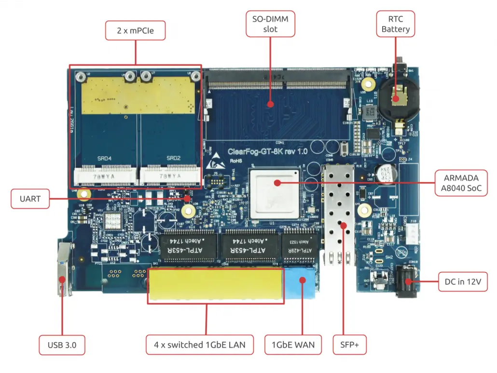

# ClearFog GT 8K Quick Start Guide


## Introduction

The following quick start guide provides background information about the [ClearFog GT 8K](https://www.solid-run.com/arm-servers-networking-platforms/macchiatobin/#gt8k).

The guide will give a technical overview about the product and by the end of it you should be able to boot an operating system and begin testing your application.

## Revision and Notes

| **Date**          | **Owner**                                                                                                                                                                                                                                                                                                                                                                                                                                                                                                                                                                                                                                                                                                                                                                                                                                                                                                                                                                                                                                                                                                                                                                                                                                                                                                                                                                                                                                                                                                                                                                                                                                                                                                                                                                                                                                                                                                                                                                       | **Revision** | **Notes**       |
| ----------------- | ------------------------------------------------------------------------------------------------------------------------------------------------------------------------------------------------------------------------------------------------------------------------------------------------------------------------------------------------------------------------------------------------------------------------------------------------------------------------------------------------------------------------------------------------------------------------------------------------------------------------------------------------------------------------------------------------------------------------------------------------------------------------------------------------------------------------------------------------------------------------------------------------------------------------------------------------------------------------------------------------------------------------------------------------------------------------------------------------------------------------------------------------------------------------------------------------------------------------------------------------------------------------------------------------------------------------------------------------------------------------------------------------------------------------------------------------------------------------------------------------------------------------------------------------------------------------------------------------------------------------------------------------------------------------------------------------------------------------------------------------------------------------------------------------------------------------------------------------------------------------------------------------------------------------------------------------------------------------------- | ------------ | --------------- |
| 28 Oct 2021       |                                                                                                                                                                                                                                                                                                                                                                                                                                                                                                                                                                                                                                                                                                                                                                                                                                                                                                                                                                                                                                                                                                                                                                                                                                                                                                                                                                                                                                                                                                                                                                                                                                                                                                                                                                                                                                                                                                                                                                                 | 1.0          | Initial release |
| Table of Contents | <p>- <a href="clearfog-gt-8k-quick-start-guide.md#introduction">Introduction</a><br>- <a href="clearfog-gt-8k-quick-start-guide.md#revision-and-notes">Revision and Notes</a><br>- <a href="clearfog-gt-8k-quick-start-guide.md#hardware-setup">Hardware Setup</a><br>- <a href="clearfog-gt-8k-quick-start-guide.md#product-specifications">Product Specifications</a><br>- <a href="clearfog-gt-8k-quick-start-guide.md#block-diagram">Block Diagram</a><br>- <a href="clearfog-gt-8k-quick-start-guide.md#whats-in-the-box">What’s in the box?</a><br>- <a href="clearfog-gt-8k-quick-start-guide.md#cable-setup-and-prerequisites">Cable setup and prerequisites</a><br>- <a href="clearfog-gt-8k-quick-start-guide.md#hw-interfaces">HW interfaces</a><br>- <a href="clearfog-gt-8k-quick-start-guide.md#software-setup">Software Setup</a><br>- <a href="clearfog-gt-8k-quick-start-guide.md#cable-setup-and-prerequisites">Cable setup and prerequisites</a><br>- <a href="clearfog-gt-8k-quick-start-guide.md#recommended-cables">Recommended Cables</a><br>- <a href="clearfog-gt-8k-quick-start-guide.md#boot-select">Boot Select</a><br>- <a href="clearfog-gt-8k-quick-start-guide.md#booting-from-an-spi-card">Booting from an SPI card</a><br>- <a href="clearfog-gt-8k-quick-start-guide.md#connecting-a-usb-to-uart-adapter-to-clearfog-gt-8k">Connecting a USB to UART adapter to ClearFog GT 8K</a><br>- <a href="clearfog-gt-8k-quick-start-guide.md#more-features">More Features</a><br>- <a href="clearfog-gt-8k-quick-start-guide.md#internet">Internet</a><br>- <a href="clearfog-gt-8k-quick-start-guide.md#build-from-source">Build From Source</a><br>- <a href="clearfog-gt-8k-quick-start-guide.md#clearfog-gt-8k-with-enclosure">ClearFog GT 8K With Enclosure</a><br>- <a href="clearfog-gt-8k-quick-start-guide.md#documentation">Documentation</a><br>- <a href="clearfog-gt-8k-quick-start-guide.md#related-articles">Related Articles</a></p> |              |                 |

## Hardware Setup

#### Product Specifications

|                  |                                                            |
| ---------------- | ---------------------------------------------------------- |
| Processor        | Marvell ARMADA A8040 quad-core Arm Cortex A72 (up to 2Ghz) |
| Memory & Storage | up to 16GB DDR4 SO-DIMM                                    |
|                  | M.2 (optional support via adapter)                         |
|                  | MicroSD                                                    |
|                  | eMMC                                                       |
| Connectivity     | 4 x 1GbE switched LAN (RJ45)                               |
|                  | 1 x 1GbE WAN (RJ45)                                        |
|                  | 3 x mPCIe (USB 2.0 + PCIe) \*                              |
|                  | 1 x USB 3.0                                                |
|                  | 1 x SFP+ (up to 10GbE)                                     |
| I/O              | GPIO header                                                |
|                  | Indication LEDs                                            |
|                  | User Push Buttons                                          |
|                  | UART header for debug                                      |
| OS Support       | Linux Kernel 4.4x, Ubuntu 16.04, Google IoT Platform       |
| Power            | 12V input DC jack                                          |
| Dimensions       | Board: 177mm x 110mm                                       |
|                  | Enclosed: 195 x 118 x 32mm                                 |
| Enclosure        | Optional ruggedized extruded aluminum (IP32) enclosure     |


**Please note** (\*) The default configuration in the release software:
* CON4 = mPCIe0 configure to be PCIe
* CON3 = mPCI1 configure to SATA (can use mpcie to m.2 adapter)
* CON2 = mPCI2 configure to be USB 3.0 (can connect an LTE modem, this slot has a SIM connection) You can change the configuration as needed



## **Block Diagram**

The following figure describes the ClearFog GT 8K Block Diagram.


## What’s in the box?

* ClearFog GT 8K
* SO-DIMM Memory (size depends on the order)
* 12V 2.5A 220/110 Power adapter EU/US version (Optional)
* 16GB Micro SD card (Optional)
* Heatsink with a fan

## Cable setup and prerequisites

Here is what you will need to power up the board:

* Linux or Windows PC
* ClearFog GT 8K
* 12V Power adapter
* USB to UART cable
* IP router or IP switch

## HW interfaces

Please see below the features overview of the connector side of the ClearFog GT 8K.



Print side connector overview of the ClearFog GT 8K.


## Software Setup

#### Cable setup and prerequisites

Here is what you will need to power up the board:

* Linux or Windows PC
* ClearFog GT 8K
* Power adapter 12V@2.5A
* USB to UART adapter for console
* IP router or IP switch

## Recommended Cables

The following is a list of industry-standard cables, sorted by type, with the necessary compliance requirements that have been proven to work well with the ClearFog product family.

These examples are the cables which SolidRun uses for testing, and should provide enough information to source products from your preferred cable vendor.

* Ethernet cable: Monoprice 24AWG Cat6A 500MHz STP
* USB Cable: SuperSpeed USB 3.0 Type A Male to Female Extension Cable in Black
* SFP connector: GigaLite GE-GB-P1RT-E SFP module with Monoprice 24AWG Cat6A 500MHz STP cable

## Boot Select

Before powering up the board for the first time it is recommended to select the boot media. In order to configure the boot media, please refer to [ClearFog GT-8K Boot Select](/marvell/a8040/sbc-platform/a8040-other-articles/clearfog-gt-8k-boot-select.md) .

## Booting from an SPI card

The switches on the boot source **SW6** selector must be set as follows:

|          |          |          |          |          |
| -------- | -------- | -------- | -------- | -------- |
| Switch 1 | Switch 2 | Switch 3 | Switch 4 | Switch 5 |
| OFF      | OFF      | ON       | OFF      | OFF      |

The following shows how to set the switches on the boot source selector:&#x20;


Once you set the switches, you can apply the following for booting from an SD card.


**Please Note:** Boot is made from SPI by default



**1. Downloading the Debian image**

Download the Debian image by running the following command on your Linux/Windows PC:

```
wget https://solid-run-images.sos-de-fra-1.exo.io/8040/Debian/sr-8040-debian-buster-20190616-cfgt-sdhc.img.xz
```

* For more Debian releases, Download a pre-built snapshot image from [SolidRun Images](https://images.solid-run.com/8040)

**2. Writing the image to the SD card**

Use the following commands for writing the image to an SD card:

```
xz -dc sr-8040-debian-buster-20190616-cfgt-sdhc.img.xz | dd of=/dev/sdX bs=4k conv=fdatasync
```

* For more information, please visit [Flashing an SD Card](/other-articles/flashing-an-sd-card.md) .


Note: Plug a micro SD into your Linux PC, the following assumes that the micro SD is added as /dev/sdX and all it’s partitions are unmounted.



**3. SD card insertion**

Please Insert the SD card into your device.

**4. Power connection**

Connect your power adaptor to the DC jack, and then connect the adaptor to mains supply.

**5. Serial Connection**

Please insert the micro USB into your device, then you can refer to [Serial Connection](/other-articles/serial-connection.md) for installing necessary serial connection software in Linux/Windows.

### Connecting a USB to UART adapter to ClearFog GT 8K

On the top side of the ClearFog GT 8K, there is a header for connecting the adapter cable (J27). The cable should be connected as seen at the picture below:



**Please Note** The pin that is closest to the mechanical hole should be connected to the ground cable (black), the middle pin should be connected to the Tx (green cable) and the 3’rd pin should be connected to the Rx (white). The red cable should not be connected!



Once you installed the necessary serial connection software, you should be able to see the following:


* In order to be able to log in, please insert “debian” as a username and password as follows:


## More Features

#### Internet

Connect an Ethernet cable to your HummingBoard Pulse (for internet access during boot-up).

* Please check your Ethernet connection.
* Use the following commands in order to keep your system up-to-date:

```
apt-get update 
apt-get upgrade 
reboot
```

## Build From Source

* You can build your own image using the script in here – [GitHub - SolidRun/clearfog-gt-8k-build](https://github.com/SolidRun/clearfog-gt-8k-build)
* U-Boot -  [GitHub - SolidRun/8040-uboot](https://github.com/SolidRun/Documentation/blob/bsp/8040/u-boot.md)

## ClearFog GT 8K With Enclosure


## Documentation

* [ClearFog-GT-8K-rev-1_1-Simplified-Schematics.pdf](attachments/ClearFog-GT-8K-rev-1_1-Simplified-Schematics.pdf)
* [ClearFog GT 8K Full Board Assy_Rev.1.rar](attachments/ClearFog%20GT%208K%20Full%20Board%20Assy_Rev.1.rar)


## Related Articles

Error rendering macro 'contentbylabel' : CQL was parsed but the search manager was unable to execute the search. Error message: com.atlassian.confluence.api.service.exceptions.scale.SSStatusCodeException: There was an illegal request passed to XP-Search Aggregator API : HTTP/1.1 403 Forbidden
