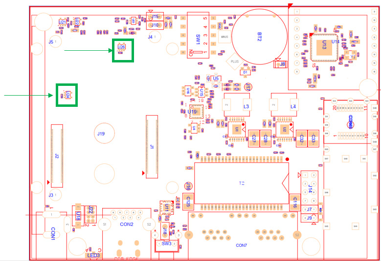
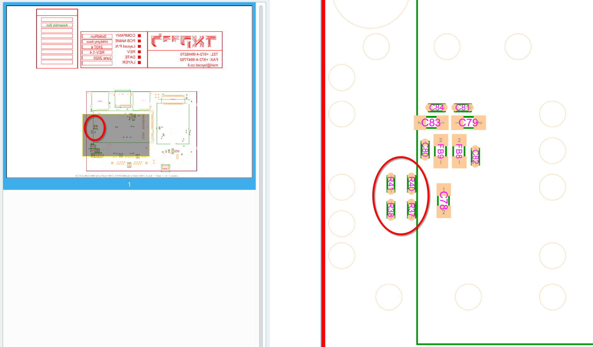

# Upgrading Clearfog Base to support CN9130 SOM

This guide is meant to explain how to upgrade the the ClearFog Base to support both CN9130 SOM and A388 SOM.

## Removal of conflicting parts

Remove the components from table below:

|   |        |     |        |              |
| - | ------ | --- | ------ | ------------ |
| # | RefDes | Qty | Action | Comments     |
| 1 | R153   | 1   | Remove | RES 740ohm   |
| 2 | U24    | 1   | Remove | 74LVC1G125GW |
| 3 | U26    | 1   | Remove | 74LVC1G125GW |

The components locations are marked green in the pictures below:

### Components side

### Print Side

### Impact

The changes outlined partially impact functionality of the M.2 connector:

1. pin 6 (FULL\_CARD\_POWER\_OFF#) is left floating
2. pin 67 (RESET#) is left floating

If an M.2 module is missing internal pull-ups, or has internal pull-down, it might permanently stay powered off or in reset.

As a workaround the IOs originally controlling the operational amplifiers U24 / U26 can be connected directly to M.2 connector using short wire, as shown below:

## Workaround for floating M.2 control signals

### FULL\_CARD\_POWER\_OFF

Some LTE modules were found to have integrated pull-down for FULL\_CARD\_POWER\_OFF, therefore the following workaround is recommended:

### RESET

RESET is specified as a 1.8V signal for M.2, digital IO has 3.3V logic level.\
Therefore no workaround is recommended.

If strictly required, operation may be safe in open-drain configuration as long as software behaviour is validated first.

## SFP Rate-Select (RS0/RS1)

**Note: Clearfog Base revision 1.4.4 and later already include these changes.**

Dis-/Assemble the components from table below:

|   |          |        |              |
| - | -------- | ------ | ------------ |
| # | RefDes   | Action | Comments     |
| 1 | R40, R41 | Remove | resistor 0Ω  |
| 2 | R37, R38 | Add    | resistor 1kΩ |

The components locations are marked red in the picture below

### Impact

R37/R38 enable high-speed mode (10Gbps) for TX and RX on SFP modules.\
Without this change CN9130 SoM SFP port will be limited to sgmii (2.5Gbps and lower) speeds even though the cpu side supports up to 10Gbps.

## SoC Clocking Bootstrap

**Note: Clearfog Base revision 1.4.8 and later already include these changes.**

Dis-/Assemble the components from table below:

|   |        |        |               |
| - | ------ | ------ | ------------- |
| # | RefDes | Action | Comments      |
| 1 | R153   | Add    | resistor 470Ω |

The components locations are marked red in the picture below:

### Impact

R153 pulls CP\_MPP\[15] high during reset, which makes possible (but does not activate by itself) 2.2GHz cpu speed.
