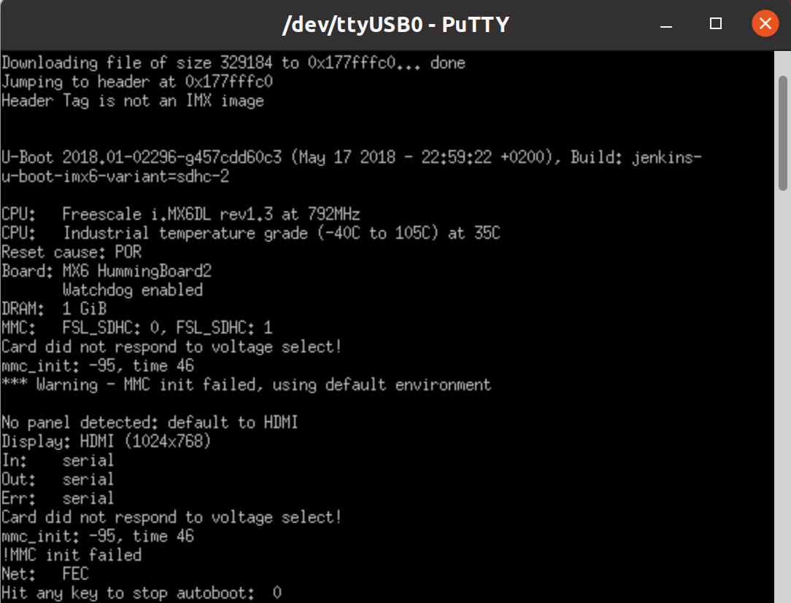

# Boot from USB OTG - i.MX6

## Revisions and Notes

| **Date**          | **Owner**                                                                                                                                                                                                                                                                                                                       | **Revision** | **Notes**       |
| ----------------- | ------------------------------------------------------------------------------------------------------------------------------------------------------------------------------------------------------------------------------------------------------------------------------------------------------------------------------- | ------------ | --------------- |
| 23 Feb 2022       |                                                                                                                                                                                                                                                                                                                                 | 1.0          | Initial release |
| Table Of Contents | <p>- <a href="boot-from-usb-otg-imx6.md#revisions-and-notes">Revisions and Notes</a><br>- <a href="boot-from-usb-otg-imx6.md#introduction">Introduction</a><br>- <a href="boot-from-usb-otg-imx6.md#step-by-step">Step-by-step</a><br>- <a href="boot-from-usb-otg-imx6.md#identify-the-otg-port">Identify the OTG port</a></p> |              |                 |

## Introduction

The following documentation provides a quick guide to boot from USB OTG port.

## Step-by-step

1\. Clone a repository to install and build **imx\_usb\_loader** application by run the follwoing:

```
git clone https://github.com/boundarydevices/imx_usb_loader.git
cd imx_usb_loader
make  
```

* **imx\_usb\_loader :** This application implements the Serial Download Protocol that the i.MX6 Boot-ROM uses to communicate. It is available on [github account of boundarydevices](https://github.com/boundarydevices/imx_usb_loader).
* The final binary is called **imx\_usb** and can be executed in place.

2\. Install SPL & U-Boot binaries:

```
wget https://solid-run-images.sos-de-fra-1.exo.io/IMX6/U-Boot/v2018.01/spl-imx6-sdhc.bin
wget https://solid-run-images.sos-de-fra-1.exo.io/IMX6/U-Boot/v2018.01/u-boot-imx6-sdhc.img
```

* You can Install U-Boot & SPL binaries from [SolidRun Images](https://images.solid-run.com/IMX6/U-Boot/) site.

3\. Serial connection

Please see our pages [Cubox-i](/nxp/imx6/sbc-platform/cubox-i-quick-start-guide.md#booting-from-an-sd-card), [HummingBoard Edge](/nxp/imx6/sbc-platform/hummingboard-imx6-sbc-quick-start-guide/hummingboard-edge-quick-start-guide.md#booting-from-an-sd-card) under serial connection section.

4\. Connect your Male to Male USB-A cable to the OTG port on your device.


**Identify the OTG port**
To quote our developer Jon: “it is the top port next to the Ethernet jack” More formally it is the top port on the U5 header. This holds true of all our i.MX6 based boards.



* Make sure you can detect the USB = NXP Semiconductors in the usb devices list with the exact same vendor ID as shown in the following example:


5\. Run the script imx\_usb exec with the SPL to load SPL:

```
sudo ./imx_usb spl-imx6-sdhc.bin
```

**On success, SPL should announce itself on the serial console:**


6\. Run the script imx\_usb exec with the U-Boot to load U-Boot :

```
sudo ./imx_usb u-boot-imx6-sdhc.img
```

**On success, U-Boot should announce itself on the serial console:**




**Success Indicator for Cubox-i**\
The Cubox-i has an LED that is off by default and turned on by u-boot. So if the LED turns red, U-Boot was loaded successfully.



At this point U-Boot has been loaded to RAM and is running.
