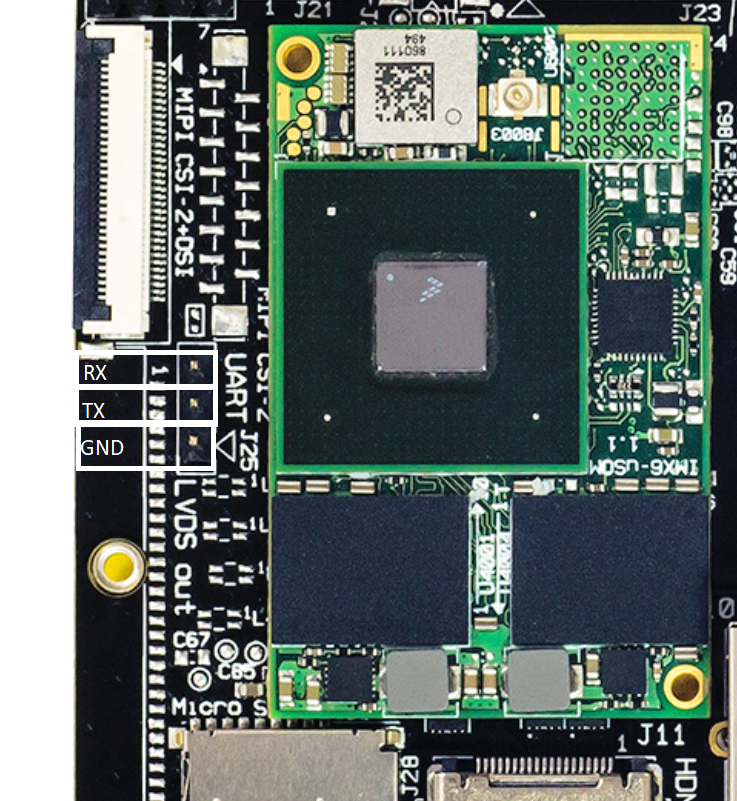

# HummingBoard Gate/Edge UART console

#### J25 Connector

Serial console for the HummingBoard Gate/Edge can be found on connector J25 with GND,TX,RX pins as described in the below picture.

Please reference the board schematics for more information by clicking [here](../hummingboard-imx6-sbc-quick-start-guide/attachments/HummingBoard2%20Schematics.pdf). In order to get serial console you will need a USB to UART (3.3V) , more information can found at [Serial-Console USB->UART](/nxp/imx6/sbc-platform/imx6-other-articles/serial-console-usb-uart.md) .
