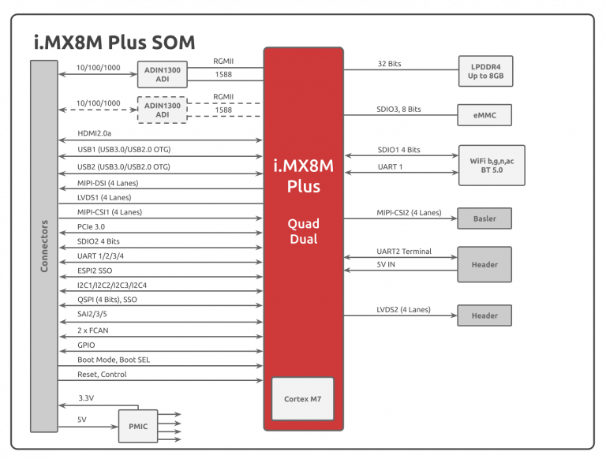
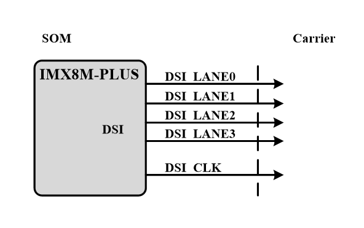
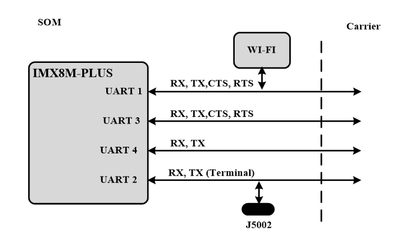
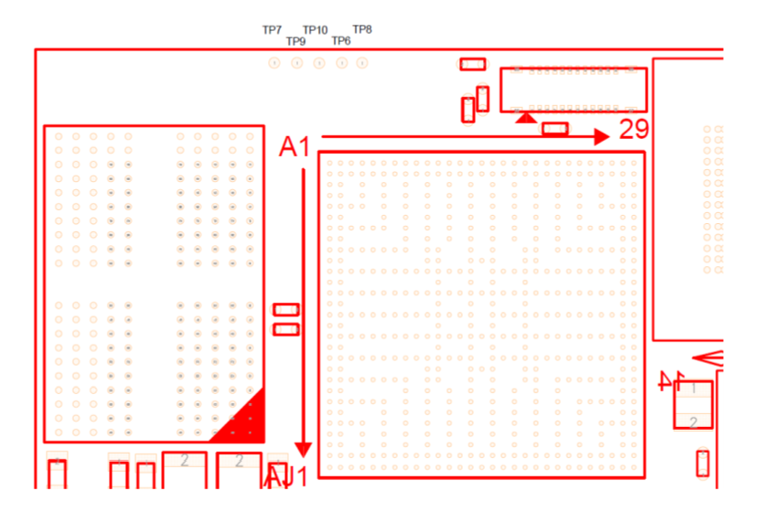

# i.MX8M Plus SOM Hardware User Manual

## Revisions and Notes

|                   |                                                                                                                                                                                                                                                                                                                                                                                                                                                                                                                                                                                                                                                                                                                                                                                                                                                                                                                                                                                                                                                                                                                                                                                                                                                                                                                                                                                                                                                                                                                                                                                                                                                                                                                                                                                                                                                                                                                                                                                                                                                                                                                                                                                                                                                                                                                                                                                                                                                                                                                                                                                                                                                                                                                                                                                                                                                                                                                                                                                                                                                                                                                                                                                                                                                                                                                                                                                                                                                                                                                                                                                                                                                                                                                                                                                                                                                                                                                                                                                                                                                                                                                                                                                                                                                                                                                                                                                                                                                                                                                                                                                                   |              |                                   |
| ----------------- | ------------------------------------------------------------------------------------------------------------------------------------------------------------------------------------------------------------------------------------------------------------------------------------------------------------------------------------------------------------------------------------------------------------------------------------------------------------------------------------------------------------------------------------------------------------------------------------------------------------------------------------------------------------------------------------------------------------------------------------------------------------------------------------------------------------------------------------------------------------------------------------------------------------------------------------------------------------------------------------------------------------------------------------------------------------------------------------------------------------------------------------------------------------------------------------------------------------------------------------------------------------------------------------------------------------------------------------------------------------------------------------------------------------------------------------------------------------------------------------------------------------------------------------------------------------------------------------------------------------------------------------------------------------------------------------------------------------------------------------------------------------------------------------------------------------------------------------------------------------------------------------------------------------------------------------------------------------------------------------------------------------------------------------------------------------------------------------------------------------------------------------------------------------------------------------------------------------------------------------------------------------------------------------------------------------------------------------------------------------------------------------------------------------------------------------------------------------------------------------------------------------------------------------------------------------------------------------------------------------------------------------------------------------------------------------------------------------------------------------------------------------------------------------------------------------------------------------------------------------------------------------------------------------------------------------------------------------------------------------------------------------------------------------------------------------------------------------------------------------------------------------------------------------------------------------------------------------------------------------------------------------------------------------------------------------------------------------------------------------------------------------------------------------------------------------------------------------------------------------------------------------------------------------------------------------------------------------------------------------------------------------------------------------------------------------------------------------------------------------------------------------------------------------------------------------------------------------------------------------------------------------------------------------------------------------------------------------------------------------------------------------------------------------------------------------------------------------------------------------------------------------------------------------------------------------------------------------------------------------------------------------------------------------------------------------------------------------------------------------------------------------------------------------------------------------------------------------------------------------------------------------------------------------------------------------------------------------------------- | ------------ | --------------------------------- |
| **Date**          | **Owner**                                                                                                                                                                                                                                                                                                                                                                                                                                                                                                                                                                                                                                                                                                                                                                                                                                                                                                                                                                                                                                                                                                                                                                                                                                                                                                                                                                                                                                                                                                                                                                                                                                                                                                                                                                                                                                                                                                                                                                                                                                                                                                                                                                                                                                                                                                                                                                                                                                                                                                                                                                                                                                                                                                                                                                                                                                                                                                                                                                                                                                                                                                                                                                                                                                                                                                                                                                                                                                                                                                                                                                                                                                                                                                                                                                                                                                                                                                                                                                                                                                                                                                                                                                                                                                                                                                                                                                                                                                                                                                                                                                                         | **Revision** | **Notes**                         |
| 08 Jan 2019       | Noam Weidenfeld                                                                                                                                                                                                                                                                                                                                                                                                                                                                                                                                                                                                                                                                                                                                                                                                                                                                                                                                                                                                                                                                                                                                                                                                                                                                                                                                                                                                                                                                                                                                                                                                                                                                                                                                                                                                                                                                                                                                                                                                                                                                                                                                                                                                                                                                                                                                                                                                                                                                                                                                                                                                                                                                                                                                                                                                                                                                                                                                                                                                                                                                                                                                                                                                                                                                                                                                                                                                                                                                                                                                                                                                                                                                                                                                                                                                                                                                                                                                                                                                                                                                                                                                                                                                                                                                                                                                                                                                                                                                                                                                                                                   | 1.0          |                                   |
| 12 Jun 2023       | Noam Weidenfeld                                                                                                                                                                                                                                                                                                                                                                                                                                                                                                                                                                                                                                                                                                                                                                                                                                                                                                                                                                                                                                                                                                                                                                                                                                                                                                                                                                                                                                                                                                                                                                                                                                                                                                                                                                                                                                                                                                                                                                                                                                                                                                                                                                                                                                                                                                                                                                                                                                                                                                                                                                                                                                                                                                                                                                                                                                                                                                                                                                                                                                                                                                                                                                                                                                                                                                                                                                                                                                                                                                                                                                                                                                                                                                                                                                                                                                                                                                                                                                                                                                                                                                                                                                                                                                                                                                                                                                                                                                                                                                                                                                                   | 1.1          |                                   |
| 02 Nov 2023       | Shahar Fridman                                                                                                                                                                                                                                                                                                                                                                                                                                                                                                                                                                                                                                                                                                                                                                                                                                                                                                                                                                                                                                                                                                                                                                                                                                                                                                                                                                                                                                                                                                                                                                                                                                                                                                                                                                                                                                                                                                                                                                                                                                                                                                                                                                                                                                                                                                                                                                                                                                                                                                                                                                                                                                                                                                                                                                                                                                                                                                                                                                                                                                                                                                                                                                                                                                                                                                                                                                                                                                                                                                                                                                                                                                                                                                                                                                                                                                                                                                                                                                                                                                                                                                                                                                                                                                                                                                                                                                                                                                                                                                                                                                                    | 1.2          | Add Power Consumption Measurement |
| Table of Contents | 
- <a href="imx8m-plus-som-hardware-user-manual.md#revisions-and-notes">Revisions and Notes</a> - <a href="imx8m-plus-som-hardware-user-manual.md#introduction">Introduction</a> - <a href="imx8m-plus-som-hardware-user-manual.md#highlighted-features">Highlighted Features</a> - <a href="imx8m-plus-som-hardware-user-manual.md#supporting-products">Supporting Products</a> - <a href="imx8m-plus-som-hardware-user-manual.md#description">Description</a> - <a href="imx8m-plus-som-hardware-user-manual.md#block-diagram">Block Diagram</a> - <a href="imx8m-plus-som-hardware-user-manual.md#features-summary">Features Summary</a> - <a href="imx8m-plus-som-hardware-user-manual.md#core-system-components">Core System Components</a> - <a href="imx8m-plus-som-hardware-user-manual.md#imx8m-plus-soc-family">i.MX8M PLUS SoC Family</a> - <a href="imx8m-plus-som-hardware-user-manual.md#memory">Memory</a> - <a href="imx8m-plus-som-hardware-user-manual.md#lpddr4">LPDDR4</a> - <a href="imx8m-plus-som-hardware-user-manual.md#emmc-nand-flash">eMMC NAND Flash</a> - <a href="imx8m-plus-som-hardware-user-manual.md#quad-serial-nor-flash-som">Quad Serial NOR Flash (SOM)</a> - <a href="imx8m-plus-som-hardware-user-manual.md#eeprom-som">EEPROM (SOM)</a> - <a href="imx8m-plus-som-hardware-user-manual.md#micro-sd-carrier">Micro-SD (Carrier)</a> - <a href="imx8m-plus-som-hardware-user-manual.md#serial-nor-flash-carrier">Serial NOR Flash (Carrier)</a> - <a href="imx8m-plus-som-hardware-user-manual.md#10-100-1000-mbps-ethernet-phy">10/100/1000 MBPS ETHERNET PHY</a> - <a href="imx8m-plus-som-hardware-user-manual.md#wi-fi-11ac-b-g-n-bt-50-ble">WI-FI (11AC/B/G/N) BT (5.0 BLE)</a> - <a href="imx8m-plus-som-hardware-user-manual.md#mipi-csi">MIPI-CSI</a> - <a href="imx8m-plus-som-hardware-user-manual.md#lvds-interface">LVDS Interface</a> - <a href="imx8m-plus-som-hardware-user-manual.md#external-interfaces">External Interfaces</a> - <a href="imx8m-plus-som-hardware-user-manual.md#general">General</a> - <a href="imx8m-plus-som-hardware-user-manual.md#pcie">PCIe</a> - <a href="imx8m-plus-som-hardware-user-manual.md#usb-30">USB 3.0</a> - <a href="imx8m-plus-som-hardware-user-manual.md#mipi-csi">MIPI CSI</a> - <a href="imx8m-plus-som-hardware-user-manual.md#mipi-dsi">MIPI DSI</a> - <a href="imx8m-plus-som-hardware-user-manual.md#audio">Audio</a> - <a href="imx8m-plus-som-hardware-user-manual.md#hdmi">HDMI</a> - <a href="imx8m-plus-som-hardware-user-manual.md#uart">UART</a> - <a href="imx8m-plus-som-hardware-user-manual.md#espi">eSPI</a> - <a href="imx8m-plus-som-hardware-user-manual.md#i2c">I2C</a> - <a href="imx8m-plus-som-hardware-user-manual.md#usd">uSD</a> - <a href="imx8m-plus-som-hardware-user-manual.md#b2b-connectors-signal-description">B2B Connector’s Signal Description</a> - <a href="imx8m-plus-som-hardware-user-manual.md#j5001">J5001</a> - <a href="imx8m-plus-som-hardware-user-manual.md#j7">J7</a> - <a href="imx8m-plus-som-hardware-user-manual.md#power-and-reset">Power and Reset</a> - <a href="imx8m-plus-som-hardware-user-manual.md#power-architecture">Power Architecture</a> - <a href="imx8m-plus-som-hardware-user-manual.md#power-consumption">Power Consumption</a> - <a href="imx8m-plus-som-hardware-user-manual.md#reset">Reset</a> - <a href="imx8m-plus-som-hardware-user-manual.md#integration-manual">Integration Manual</a> - <a href="imx8m-plus-som-hardware-user-manual.md#power-up-sequence">Power-Up Sequence</a> - <a href="imx8m-plus-som-hardware-user-manual.md#booting-options">Booting Options</a> - <a href="imx8m-plus-som-hardware-user-manual.md#fuses-booting">Fuses Booting</a> - <a href="imx8m-plus-som-hardware-user-manual.md#booting-from-resistors-setting">Booting from Resistors setting</a> - <a href="imx8m-plus-som-hardware-user-manual.md#i2c-interfaces">I2C Interfaces</a> - <a href="imx8m-plus-som-hardware-user-manual.md#gpio-interfaces">GPIO Interfaces</a> - <a href="imx8m-plus-som-hardware-user-manual.md#som-debugging-capability">SOM Debugging Capability</a> - <a href="imx8m-plus-som-hardware-user-manual.md#mechanical-description">Mechanical Description</a> - <a href="imx8m-plus-som-hardware-user-manual.md#documentation">Documentation</a> - <a href="imx8m-plus-som-hardware-user-manual.md#related-articles">Related Articles</a>
 |              |                                   |


**Disclaimer** No warranty of accuracy is given concerning the contents of the information contained in this publication. To the extent permitted by law no liability (including liability to any person by reason of negligence) will be accepted by SolidRun Ltd., its subsidiaries or employees for any direct or indirect loss or damage caused by omissions from or inaccuracies in this document. SolidRun Ltd. reserves the right to change details in this publication without prior notice. Product and company names herein may be the trademarks of their respective owners.


## Introduction

This User Manual relates to the [SolidRun i.MX8M-PLUS series](https://www.solid-run.com/embedded-industrial-iot/nxp-i-mx8-family/imx8m-plus-som/) , which includes;

* Dual ARM A53 (1.8GHz)
* Quad ARM A53 (1.8GHz)

SolidRun’s SR-SOM- i.MX8M family is a high-performance microsystem on module (S.O.M.) based on the highly integrated NXP i.MX8M family of products including the i.MX8M, i.MX8M-Mini and i.MX8M-Plus.

#### Highlighted Features

* Ultra-small footprint SOM (47x30mm) including three board-to-board connectors (250 total pins number).
* NXP i.MX8M-PLUS SoC (supports dual, quad lite and quad versions)
  * Up to quad Cortex A53 and up to 1.8GHz
  * Cortex-M7 subsystem processor supports real time tasks.
  * Neural Processing Unit (NPU) operating at up to 2.3 TOPS.
  * Dual Image Signal Processors and two camera inputs for an effective Vision System.
  * Video encode (including h.265) and decode, 3D/2D graphic acceleration, and multiple audio and voice functionalities.
  * Robust control networks supported by dual CAN FD and dual Gigabit Ethernet with Time-Sensitive Networking (TSN).
  * High industrial reliability with DRAM inline ECC and ECC on on-chip RAM.
* LPDDR4 memory in x32 configurations supports up to 8GB and up to 4.0GT/s
* Two Gigabit Ethernet interfaces based on Analog Device’s ADIN1300 chip.
* Wi-Fi (802.11a/b/g/n/ac) + BT (5.0) Murata’s certified module (Cypress chipset)
* On board MIPI-CSI interface supporting Basler’s camera’s modules.
* On board LVDS connector supporting LCD and touch screen.
* On board power and terminal interfaces supporting standalone operation.
* Power management devices

#### Supporting Products

The following products are provided from SolidRun both as production level platforms and as reference examples on how to incorporate the SOM in different levels of integration:

* [HummingBoard Pulse & i.MX8M Plus SOM Quick Start Guide](hummingboard-imx8-sbc-quick-start-guide/hummingboard-pulse-imx8m-plus-som-quick-start-guide.md)
* [HummingBoard Mate & i.MX8M Plus SOM Quick Start Guide](hummingboard-imx8-sbc-quick-start-guide/hummingboard-mate-imx8m-plus-som-quick-start-guide.md)

## Description

#### Block Diagram

The following figure describes the i.MX8M-PLUS Blocks Diagram.

#### Features Summary

Following are the features summary of the SOM. Notice that some of the features are pinout multiplexed (please refer to the pin mux table below and the NXP i.MX8M-PLUS data sheets):

* NXP i.MX8M PLUS series SoC (Dual/Quad Lite/Quad ARM® Cortex™ A53 Processor, up to 1.8 GHz)
* Cortex-M7 (800MHz) subsystem processor.
* Up to 8GByte LPDDR4 memory and up to 4.0GT/s
* Eight bits eMMC 5.1 memory.
* I2C EEPROM.
* HDMI 2.0a, 720 x 480p60, 1280 x 720p60, 1920 x 1080p60, 1920 x 1080p120 and 3840 x 2160p30
* 4-lanes MIPI-DSI interface
* Two 4-Lanes LVDS interfaces (One of the interfaces support on-SOM connector for an LCD and touch screen)
* Two 4-lanes MIPI CSI-2 (One of the interfaces is connected to an FPC connector supporting Basler’s MIPI cameras)
* Two 10/100/1000 Mbps Ethernet PHY supporting 1588 standard
* One Gigabit Ethernet controller with support for TSN
* Wi-Fi (802.11a/b/g/n/ac) + BT (5.0) Murata’s certified module
* Two USB 3.0 Host and Device
* Single PCIe Gen 3 interfaces
* Four bits SD interface
* Single eSPI interface.
* Single QSPI interface supporting up to 4 data bits
* Up to three Synchronous Audio Interfaces.
* Up to four Serial interfaces.
* Up to 2 CAN-FD.
* Power:
  * A single 5.0V input using B-t-B connector
  * A single 5.0V input using an On-SOM connector (Standalone operation)
  * 3V output to support carrier’s digital interfaces&#x20;

## Core System Components

#### i.MX8M PLUS SoC Family

The i.MX 8M Plus family focuses on machine learning and vision, advanced multimedia, and industrial IoT with high reliability. It is built to meet the needs of Smart Home, Building, City and Industry 4.0 applications. The following figures show the functional modules in the i.MX 8M Plus processor system.

The following figures describes the i.MX8M-PLUS supported modules

#### Memory

The i.MX8M-PLUS SOM supports varieties of memory interfaces for booting and data storage. The following figure describes the IMX-8 SOM memory interfaces.

#### **LPDDR4**

* Up to 8GB memory space.
* 32 Bits data bus.
* Up to 4000 MT/s.
* Supports D1, D2 and D4 die chips (Two CS).
* Support various low power modes, clock and power gated operation.
* Support Self-Refresh mode.

#### **eMMC NAND Flash**

* Up to 64GB memory space.
* 8 Bits data bus.
* Support MMC standard, up to version 5.1.
* Up to 416 Mbps of data transfer for MMC cards using 8 parallel data lines in SDR mode.
* Up to 3200 Mbps of data transfer for MMC cards using 8 parallel data lines in DDR mode.
* uSDHC-3.
* Can be used as BOOT NVM \*

#### **Quad Serial NOR Flash (SOM)**

* Each channel can be configured as 1/2/4-bit operation.
* Support both SDR mode and DDR mode
* No reset
* QSPIA/nSS0.
* Can be used as BOOT NVM \*

#### **EEPROM (SOM)**

* 1Kb EEPROM
* ON-Semi’s CAT24AA01TDI or compatible
* I2C1
* Address 0X50 (7 bits format)
* Stores SOM’s configurations.

#### **Micro-SD (Carrier)**

* Optional on Carrier board
* IMX-8 uSDHC-1.
* Implements 4 data bits.
* Support SD/SDIO standard, up to version 3.0.
* Up to 400 Mbps of data transfer in SDR mode and up to 800 Mbps of data transfer in DDR mode using 4 parallel data lines.
* Can be used as BOOT NVM \*

#### **Serial NOR Flash (Carrier)**

* Optional on Carrier board
* 1 bits data bus.
* eSPI2/nSS0
* Can be used as BOOT NVM \*

**Please Note**

(\*) All boot configuration signals are available on the SOM connector.

#### 10/100/1000 MBPS ETHERNET PHY

The SOM supports two Giga Ethernet interfaces. Both interfaces are connected to Analog Device’s ADIN1300 PHY.


Please note that default SOM configuration includes only 1 PHY. For 2nd PHY option please contact us for details.


*  RGMII interface.
* 3 Ethernet interfaces for 1000BASE-T, 100BASE-TX, and10BASE-T.
* Analog Device’s ADIN1300 PHY.
* One Gigabit Ethernet controller with support for Energy Efficient Ethernet (EEE), Ethernet AVB, and IEEE 1588
* One Gigabit Ethernet controller with support for TSN in addition to EEE, Ethernet AVB, and IEEE 1588.

#### WI-FI (11AC/B/G/N) BT (5.0 BLE)

The following figure describes the WI-FI and BT support in the i.MX8M-Plus SOM.

The WI-FI & BT module is Murata’s 1MW module Based on Cypress CYW43455. hip. The WI-FI main features are:

* Operate at ISM frequency Band (2.4/ 5 GHz)
* IEEE Standards Support 802.11ac, 802.11a, 802.11b, 802.11g and 802.11n
* WI-FI over SDIO-1 interface
* BT 5.0 BR/EDR/LE
* BT over UART-1 Interface
* Global certification.

#### MIPI-CSI

The i.MX8M-PLUS SOM supports a 4-Lanes MIPI CSI-2 interface. A 28 pins FPC connector on the SOM board enables a direct connection to Basler’s MIPI cameras. The following figure describes the interface signals.

* CSI channel 2.
* Implements all three CSI-2 MIPI layers.
* Scalable data lane support, 1 to 4 Data Lanes.
* When one camera is used, support up to 12MP@30fps or 4kp45.
* When two cameras are used, each supports up to 1080p80.
* Virtual Channel support.


**Please note** To connect CSI channel 2 to the ISP core, both ISPs need to be activated.


#### LVDS Interface

The i.MX8M-PLUS SOM supports a 4-Lanes LVDS interface. A 24 pins connector on the SOM board enables connection to a touch screen LCD. The following figure describes the interface signals.

* LVDS channel 2.
* LVDS Tx display and Pixel Mapper.
* Up to 80MHz pixel clock and LVDS clock implying up to 560Mbps LVDS data rate (4 Lanes).
* supports resolutions up to approximately 1366x768p60.

## External Interfaces

#### General

The SOM incorporates three Hirose DF40 board-to-board headers.

The selection of the Hirose DF40 is due to the following criteria:

* Miniature (0.4m pitch)
* Highly reliable manufacturer
* Availability (worldwide distribution channels)
* Excellent signal integrity (supports 6Gbps)
  * Please contact Hirose or SolidRun for reliability and test result data.
* Mating height of between 1.5mm to 4.0mm (1.5mm to 3.0mm if using 70-pin Board-to-Board header). SR-SOM-MX8M-PLUS headers are fixed, the final mating height is determined by carrier implementation

#### PCIe

The i.MX8M-PLUS SOM supports a single PCIe interfaces. The following figure describes the PCIe interfaces.

The PCIe main features are:

* On board coupling capacitors for TX and CLK.
* The i.MX8M-PLUS generates the PCIe clock.
* PCI Express Base Specification 4.0 compliance.
* 2.5Gb/s, 5.0Gb/s, and 8.0Gb/s Serializer/Deserializer.
* PHY Interface for the PCI Express Architecture, Version 4.2 compliance.
* Supports Spread Spectrum Clocking in Transmitter and Receiver.
* Receiver Detection.

**Please note**

The PCIe clock is generated in the i.MX8M-PLUS, check the datasheet if the jitter characteristics meet the application requirements. 

#### USB 3.0

The i.MX8M-PLUS supports two USB 3.0 interfaces. The following figure describes the USB interfaces.

The USB main features are:

* USB1 and USB2 are directly connected to the connectors (No HUB).
* Complies with USB specification rev 3.0 (xHCI compatible).
* USB dual-role operation and can be configured as host or device.
* Super-speed (5 Gbit/s), high-speed (480 Mbit/s), full-speed (12 Mbit/s), and low speed (1.5 Mbit/s) operations.
* Supports four programmable, bidirectional USB endpoints.
* The USB 3.0 module operates in following modes:
  * Host Mode: SS/HS/FS/LS
  * Device Mode: SS/HS/FS
* Power control signal are not part of the USB module, any available GPIO can be used.


**Please note** The voltage on VBUS is limited to 3.3V.



**Please note** There are no decupling capacitors on the SOM.


#### MIPI CSI

The following figure describes the CSI interface.

* CSI channel 1.
* Implements all three CSI-2 MIPI layers.
* Scalable data lane support, 1 to 4 Data Lanes.
* When one camera is used, support up to 12MP@30fps or 4kp45.
* When two cameras are used, each supports up to 1080p80.
* Virtual Channel support
* ISP support

#### MIPI DSI

The following figure described the DSI interface.

The DSI main features are:

* MIPI DSI Standard Specification V1.01r11.
* Maximum resolution ranges up to WQHD (1920x1080p60, 24bpp).
* Supports 1, 2, 3, or 4 data lanes.
* Complies with Protocol-to-PHY Interface (PPI) in 1.0Gbps / 1.5Gbps MIPI DPHY.
* Virtual Channel support.

#### Audio

The i.MX8M-PLUS SOM supports up to three Audio channels, SAI2, SAI3 and SAI5. It also supports an SPDIF interface. The following figure describes the audio interface.

The Audio main features are:

* SAI2 and SAI3 supports RX and TX
* SAI5 supports two RX channels
* SPDIF input and output, including a raw capture input mode.
* HiFi4 Audio DSP, operating up to 800 MHz
* Supporting I2S, AC97, TDM, codec/DSP, and DSD interfaces.
* All ports support 49.152 MHz BCLK.
* 8-channel PDM mic input.


**Please note** SAI1 signals are not directly output to the B-t-B connector. It can be used as an ALT function using other signals.


#### HDMI

The i.MX8M-PLUS supports HDMI interface. The following figure describes the HDMI interface.

The HDMI main features are:

* On board Level translation for DDC channel and HDP signal.
* HDMI 2.0a Tx supporting one display.
* Resolutions of: 720 x 480p60, 1280 x 720p60, 1920 x 1080p60, 1920 x 1080p120,3840 x 2160p30.
* 32-channel audio output support.

#### UART

The i.MX8M-PLUS SOM can support up to 4 UART interfaces. The following figure describes the UART interfaces.

The UART interfaces main features are:

* UART 1 is connected directly to the WI-FI/BT Modem to support the BT. It is available on the SOM B-t-B connector as an ALT function of SAI2.
* UART 2 supports TX, RX and is used as terminal interface of the i.MX8M-PLUS. It is also available on J5002 when the SOM is operating in a standalone mode.
* UART 3 Supports TX, RX, CTS and RTS.
* UART 4 support TX and RX.
* High-speed TIA/EIA-232-F compatible, up to Mbit/s.
* 9-bit or Multidrop mode (RS-485) support (automatic slave address detection).
* RS-485 driver direction control via CTS\_B signal.
* Auto baud rate detection (up to 115.2 Kbit/s).
* DCE/DTE capability.


**Please note** UART interfaces are available as ALT functional signals of other signals.


#### eSPI

The i.MX8M-PLUS SOM supports an eSPI interface. The following figure describes the eSPI interface.

* IMX-8’s eSPI channel 2.
* Single chip select nSS0.
* Master/Slave configurable.


**Please note** eSPI channel 1 is not available as default configuration. The signals supporting channel 1 are available as GPIO.


#### I2C

The i.MX8M-PLUS supports up to four I2c Interfaces. The following figure describes the I2C interfaces.

The I2C main features are:

* I2C-1 is used only on the SOM. It is connected to the SOM EEPROM and PMIC connector.
* I2C-2 and I2C-3 are available on the connector by default.
* I2C-4 is connected to the On-SOM FPC connector supporting Basler’s camera.
* Multimaster operation.
* In Standard mode, I2C supports the data transfer rates up to 100 kbits/s.
* In Fast mode, data transfer rates up to 400 kbits/s can be achieved.


**Please note** I2C interfaces are available as ALT functional signals of other signals.


#### uSD

The uSD supports the following features:

* IMX-8 uSDHC-1.
* Implements 4 data bits.
* Support SD/SDIO standard, up to version 3.0.
* Up to 400 Mbps of data transfer in SDR mode and up to 800 Mbps of data transfer in DDR mode using 4 parallel data lines.
* 8V or 3.3V support integrated support.
* Integrated power switch on SOM.

## B2B Connector’s Signal Description

#### J5001

|         |                           |          |                                             |     |   |         |                           |     |                                                      |     |
| ------- | ------------------------- | -------- | ------------------------------------------- | --- | - | ------- | ------------------------- | --- | ---------------------------------------------------- | --- |
| **PIN** | **HBP 2.5**               |          | **i.MX8M-PLUS 1.1**                         |     |   | **PIN** | **HBP 2.5**               |     | **i.MX8M-PLUS 1.1**                                  |     |
| 1       | TP4                       | 1V8      | NC                                          |     |   | 2       | NC                        |     | NC                                                   |     |
| 3       | DIP-SWITCH                | 1V8/ 3V3 | BOOT\_MODE0                                 | 1V8 |   | 4       | DSI-CON (J19) or DSI-HDMI |     | DSI\_DN3                                             |     |
| 5       | DIP-SWITCH                | 1V8/ 3V3 | BOOT\_MODE1                                 | 1V8 |   | 6       | DSI-CON (J19) or DSI-HDMI |     | DSI\_DP3                                             |     |
| 7       | GND                       |          | GND                                         |     |   | 8       | GND                       |     | GND                                                  |     |
| 9       | DSI-CON (J19) or DSI-HDMI |          | DSI\_CKP                                    |     |   | 10      | GND                       |     | GND                                                  |     |
| 11      | DSI-CON (J19) or DSI-HDMI |          | DSI\_CKN                                    |     |   | 12      | DSI-CON (J19) or DSI-HDMI |     | DSI\_DN0                                             |     |
| 13      | GND                       |          | GND                                         |     |   | 14      | DSI-CON (J19) or DSI-HDMI |     | DSI\_DP0                                             |     |
| 15      | DSI-CON (J19) or DSI-HDMI |          | DSI\_DN2                                    |     |   | 16      | GND                       |     | GND                                                  |     |
| 17      | DSI-CON (J19) or DSI-HDMI |          | DSI\_DP2                                    |     |   | 18      | Mini-PCIe (J20, optional) |     | LVDS0\_CLK\_P                                        |     |
| 19      | GND                       |          | GND                                         |     |   | 20      | Mini-PCIe (J20, optional) |     | LVDS0\_CLK\_N                                        |     |
| 21      | DSI-CON (J19) or DSI-HDMI |          | DSI\_DN1                                    |     |   | 22      | GND                       |     | GND                                                  |     |
| 23      | DSI-CON (J19) or DSI-HDMI |          | DSI\_DP1                                    |     |   | 24      | M.2\_W\_DIS#              | 1V8 | M.2\_W\_DIS#, [GPIO1.IO](http://gpio1.io)\[13]       | 3V3 |
| 25      | GND                       |          | GND                                         |     |   | 26      | Mini-PCIe\_W\_DIS#        | 3V3 | Mini-PCIe\_W\_DIS#, [GPIO1.IO](http://gpio1.io)\[05] | 3V3 |
| 27      | M.2\_WAKW\_ON\_LAN (PCIe) | NA       | M.2\_WAKW\_ON\_LAN,GPIO1.IO\[12]            | 3V3 |   | 28      | USB1\_PWR\_EN             | 3V3 | USB1\_PWR\_EN, GPIO1.IO\[15]                         | 3V3 |
| 29      | MIKROBUS (J10-4)          | NA       | UART3\_TXD, GPIO5.IO\[7]                    | 3V3 |   | 30      | GND                       |     | GND                                                  |     |
| 31      | MIKROBUS (J10-3)          | NA       | UART3\_RXD, GPIO5.IO\[6]                    | 3V3 |   | 32      | Mini-PCIe (J20, optional) |     | LVDS0\_TX2\_N                                        |     |
| 33      | GND                       |          | GND                                         |     |   | 34      | Mini-PCIe (J20, optional) |     | LVDS0\_TX2\_P                                        |     |
| 35      | NC                        |          | NC                                          |     |   | 36      | GND                       |     | GND                                                  |     |
| 37      | MIKROBUS (J10-1)          | NA       | UART3\_CTS, GPIO5.IO\[8]                    | 3V3 |   | 38      | Mini-PCIe (J20, optional) |     | LVDS0\_TX3\_N                                        |     |
| 39      | MIKROBUS (J10-2)          | NA       | UART3\_RTS, [GPIO5.IO](http://gpio5.io)\[9] | 3V3 |   | 40      | Mini-PCIe (J20, optional) |     | LVDS0\_TX3\_P                                        |     |
| 41      | HEADER, DIP-SW            | 3V3      | SAI2\_TXC, GPIO4.IO\[25]                    | 3V3 |   | 42      | GND                       |     | GND                                                  |     |
| 43      | DSI\_TS\_nINT (DSI-HDMI)  | 3V3      | SAI2\_MCLK, GPIO4.IO\[27]                   | 3V3 |   | 44      | LED (D34)                 | 3V3 | SAI2\_RXC, GPIO4.IO\[22] (UART1\_RX)                 | 3V3 |
| 45      | NC                        |          | SAI2\_TXD, GPIO4.IO\[26]                    | 3V3 |   | 46      | LED (D33)                 | 3V3 | SAI2\_RXFS, GPIO4.IO\[21] (UART1\_TX)                | 3V3 |
| 47      | GND                       |          | GND                                         |     |   | 48      | LED (D32)                 | 3V3 | SAI2\_RXD, GPIO4.IO\[23] (UART1\_CTS)                | 3V3 |
| 49      | NC                        |          | LVDS0\_TX1\_N                               |     |   | 50      | LED (D31)                 | 3V3 | SAI2\_TXFS, GPIO4.IO\[24] (UART1\_RTS)               | 3V3 |
| 51      | HEADER, DIP-SW            | 3V3      | LVDS0\_TX1\_P                               |     |   | 52      | GND                       |     | GND                                                  |     |
| 53      | WIFI\_DP (HUB to i.MX8M)  | NA       | LVDS0\_TX0\_N                               |     |   | 54      | CSI-CON(CON7)             |     | CSI\_DN0                                             |     |
| 55      | WIFI\_DN (HUB to i.MX8M)  | NA       | LVDS0\_TX0\_P                               |     |   | 56      | CSI-CON(CON7)             |     | CSI\_DP0                                             |     |
| 57      | GND                       |          | GND                                         |     |   | 58      | GND                       |     | GND                                                  |     |
| 59      | CSI-CON(CON7)             |          | CSI\_CKP                                    |     |   | 60      | CSI-CON(CON7)             |     | CSI\_DP2                                             |     |
| 61      | CSI-CON(CON7)             |          | CSI\_CKN                                    |     |   | 62      | CSI-CON(CON7)             |     | CSI\_DN2                                             |     |
| 63      | GND                       |          | GND                                         |     |   | 64      | GND                       |     | GND                                                  |     |
| 65      | CSI-CON(CON7)             |          | CSI\_DP3                                    |     |   | 66      | CSI-CON(CON7)             |     | CSI\_DP1                                             |     |
| 67      | CSI-CON(CON7)             |          | CSI\_DN3                                    |     |   | 68      | CSI-CON(CON7)             |     | CSI\_DN1                                             |     |
| 69      | GND                       |          | GND                                         |     |   | 70      | GND                       |     | GND                                                  |     |

#### J7

|         |                      |     |                            |     |   |         |                           |     |                                      |     |
| ------- | -------------------- | --- | -------------------------- | --- | - | ------- | ------------------------- | --- | ------------------------------------ | --- |
| **PIN** | **HBP 2.5**          |     | **i.MX8M-PLUS 1.0**        |     |   | **PIN** | **HBP 2.5**               |     | **i.MX8M-PLUS 1.0**                  |     |
| 1       | ETH\_NIC (Intel, U6) |     | PCIEC\_CLKN                |     |   | 2       | ETH\_NIC (Intel, U6)      |     | PCIE\_RXN                            |     |
| 3       | ETH\_NIC (Intel, U6) |     | PCIEC\_CLKP                |     |   | 4       | ETH\_NIC (Intel, U6)      |     | PCIE\_RXP                            |     |
| 5       | GND                  |     | GND                        |     |   | 6       | GND                       |     | GND                                  |     |
| 7       | ETH\_NIC (Intel, U6) |     | PCIEC\_TXN                 |     |   | 8       | HEADER (CON4)             | NA  | NC                                   |     |
| 9       | ETH\_NIC (Intel, U6) |     | PCIEC\_TXP                 |     |   | 10      | mPCIe (J20)               | 3V3 | Mini-PCIe\_PREST#, GPIO1.IO\[01]     | 3V3 |
| 11      | GND                  |     | GND                        |     |   | 12      | HEADER (CON4)             | NA  | SPDIF\_RX, GPIO5.IO\[4]              | 3V3 |
| 13      | M.2\_RESET#          | 1V8 | M.2\_RESET#, GPIO1.IO\[06] | 3V3 |   | 14      | POE\_AT\_DET              | 3V3 | POE\_AT\_DET, GPIO1.IO\[09]          | 3V3 |
| 15      | RTC\_CLKO (RTC Int.) | 3V3 | NC                         |     |   | 16      | DSI-CON (J19) or DSI-HDMI | NA  | SPDIF\_TX, GPIO5.IO\[3]              | 3V3 |
| 17      | GND                  |     | GND                        |     |   | 18      | M.2\_PCIe\_3V3\_EN        | 3V3 | M.2\_PCIe\_3V3\_EN, GPIO1.IO\[10]    | 3V3 |
| 19      | HDMI CON (J1)        |     | HDMI\_TXP2                 |     |   | 20      | HEADER (CON4)             | NA  | SPDIF\_EXT\_CLK, GPIO5.IO\[5]        | 3V3 |
| 21      | HDMI CON (J1)        |     | HDMI\_TXN2                 |     |   | 22      | HEADER (CON4)             | NA  | NC                                   |     |
| 23      | GND                  |     | GND                        |     |   | 24      | HEADER (CON4)             | NA  | DSI\_EN, GPIO1.IO\[08]               | 3V3 |
| 25      | HDMI CON (J1)        |     | HDMI\_TXP1                 |     |   | 26      | USB-HUB\_RST#             | 3V3 | USB-HUB\_RST#, GPIO1.IO\[11]         | 3V3 |
| 27      | HDMI CON (J1)        |     | HDMI\_TXN1                 |     |   | 28      | HEADER (CON4)             | NA  | QSPIA\_DATA0, GPIO3.IO\[6]           | 1V8 |
| 29      | GND                  |     | GND                        |     |   | 30      | HEADER (CON4)             | NA  | QSPIA\_DATA1, GPIO3.IO\[7]           | 1V8 |
| 31      | HDMI CON (J1)        |     | HDMI\_TXP0                 |     |   | 32      | TP6                       |     | QSPIA\_DATA2, GPIO3.IO\[8]           | 1V8 |
| 33      | HDMI CON (J1)        |     | HDMI\_TXN0                 |     |   | 34      | NC                        |     | QSPIA\_DATA3, GPIO3.IO\[9]           | 1V8 |
| 35      | GND                  |     | GND                        |     |   | 36      | HEADER (CON4)             | NA  | QSPIA\_NSS0, GPIO3.IO\[1]            | 1V8 |
| 37      | HDMI CON (J1)        |     | HDMI\_CLKP                 |     |   | 38      | CSI-CON(CON7)             | NA  | UART4\_TXD, GPIO5.IO\[29]            | 1V8 |
| 39      | HDMI CON (J1)        |     | HDMI\_CLKN                 |     |   | 40      | NC                        |     | QSPIA\_SCLK, GPIO3.IO\[0]            | 1V8 |
| 41      | GND                  |     | GND                        |     |   | 42      | GND                       |     | GND                                  |     |
| 43      | HDMI CON (J1)        | 3V3 | HDMI\_CEC                  | 3V3 |   | 44      | LED (D30)                 | 3V3 | UART4\_RXD, GPIO5.IO\[28]            | 1V8 |
| 45      | HDMI CON (J1)        | 5V  | HDMI\_DDC\_SCL             | 5V  |   | 46      | HEADER (CON4)             | NA  | MB-RST, GPIO1.IO\[0]                 | 3V3 |
| 47      | HDMI CON (J1)        | 5V  | HDMI\_DDC\_SDA             | 5V  |   | 48      | GND                       |     | GND                                  |     |
| 49      | HDMI CON (J1)        | 5V  | HDMI\_HPD                  | 5V  |   | 50      | HEADER (CON4)             | NA  | USB2\_ID                             | 3V3 |
| 51      | AUDIO CODEC          | 3V3 | SAI3\_TXC,GPIO5.IO\[0]     | 3V3 |   | 52      | TERMINAL\_TX              | 3V3 | UART2\_TXD (Terminal), GPIO5.IO\[25] | 3V3 |
| 53      | AUDIO CODEC          | 3V3 | SAI3\_TXD, GPIO5.IO\[1]    | 3V3 |   | 54      | TERMINAL\_RX              | 3V3 | UART2\_RXD (Terminal), GPIO5.IO\[24] | 3V3 |
| 55      | AUDIO CODEC          | 3V3 | SAI3\_TXFS, GPIO4.IO\[31]  | 3V3 |   | 56      | NC                        |     | USB1\_ID                             | 3V3 |
| 57      | AUDIO CODEC          | 3V3 | SAI3\_RXD, GPIO4.IO\[30]   | 3V3 |   | 58      | GND                       |     | GND                                  |     |
| 59      | AUDIO CODEC          | 3V3 | SAI3\_MCLK, GPIO5.IO\[2]   | 3V3 |   | 60      | USB-HUB                   |     | USB2\_RXP                            |     |
| 61      | GND                  |     | GND                        |     |   | 62      | USB-HUB                   |     | USB2\_RXN                            |     |
| 63      | HEADER (CON4)        | NA  | SAI3\_RXC, GPIO4.IO\[29]   | 3V3 |   | 64      | GND                       |     | GND                                  |     |
| 65      | RESET-B              | 1V8 | SYS\_nRST                  |     |   | 66      | USB-HUB                   |     | USB2\_TXN                            |     |
| 67      | HEADER (CON4)        | NA  | ETH1\_TRX3\_P (Second ETH) |     |   | 68      | USB-HUB                   |     | USB2\_TXP                            |     |
| 69      | HEADER (CON4)        | NA  | ETH1\_TRX3\_N (Second ETH) |     |   | 70      | GND                       |     | GND                                  |     |
| 71      | HEADER (CON4)        | NA  | ETH1\_TRX2\_P (Second ETH) |     |   | 72      | HEADER (CON4)             | NA  | ETH1\_TRX1\_P (Second ETH)           |     |
| 73      | MICRO-SD             | NA  | ETH1\_TRX2\_N (Second ETH) |     |   | 74      | HEADER (CON4)             | NA  | ETH1\_TRX1\_N (Second ETH)           |     |
| 75      | GND                  |     | GND                        |     |   | 76      | GND                       |     | GND                                  |     |
| 77      | HDMI CON (J1)        |     | EARC\_N\_HPD               |     |   | 78      | HEADER (CON4)             | NA  | ETH1\_TRX0\_P (Second ETH)           |     |
| 79      | HDMI CON (J1)        |     | EARC\_P\_UTIL              |     |   | 80      | HEADER (CON4)             | NA  | ETH1\_TRX0\_N (Second ETH)           |     |

&#x20;J9

|         |                                                    |     |                                       |     |   |         |                              |     |                                              |     |
| ------- | -------------------------------------------------- | --- | ------------------------------------- | --- | - | ------- | ---------------------------- | --- | -------------------------------------------- | --- |
| **PIN** | **HBP 2.5**                                        |     | **i.MX8M-PLUS 1.0**                   |     |   | **PIN** | **HBP 2.5**                  |     | **i.MX8M-PLUS 1.0**                          |     |
| 1       | ETH-POE                                            |     | MDI\_TRXN3                            |     |   | 2       | GND                          |     | GND                                          |     |
| 3       | ETH-POE                                            |     | MDI\_TRXP3                            |     |   | 4       | USB-TYPE-A                   |     | USB1\_TXP                                    |     |
| 5       | GND                                                |     | GND                                   |     |   | 6       | USB-TYPE-A                   |     | USB1\_TXN                                    |     |
| 7       | ETH-POE                                            |     | MDI\_TRXN2                            |     |   | 8       | GND                          |     | GND                                          |     |
| 9       | ETH-POE                                            |     | MDI\_TRXP2                            |     |   | 10      | USB-TYPE-A                   |     | USB1\_RXP                                    |     |
| 11      | GND                                                |     | GND                                   |     |   | 12      | USB-TYPE-A                   |     | USB1\_RXN                                    |     |
| 13      | ETH-POE                                            |     | MDI\_TRXN1                            |     |   | 14      | GND                          |     |                                              |     |
| 15      | ETH-POE                                            |     | MDI\_TRXP1                            |     |   | 16      | USB-TYPE-A                   |     | USB1\_DP                                     |     |
| 17      | GND                                                |     | GND                                   |     |   | 18      | USB-TYPE-A                   |     | USB1\_DN                                     |     |
| 19      | ETH-POE                                            |     | MDI\_TRXN0                            |     |   | 20      | GND                          |     | GND                                          |     |
| 21      | ETH-POE                                            |     | MDI\_TRXP0                            |     |   | 22      | USB-HUB                      |     | USB2\_DP                                     |     |
| 23      | GND                                                |     | GND                                   |     |   | 24      | USB-HUB                      |     | USB2\_DN                                     |     |
| 25      | ETH-LED                                            |     | LED\_0/PHY\_CFG0                      |     |   | 26      | GND                          |     | GND                                          |     |
| 27      | ETH-LED                                            |     | LED1\_0/PHY\_CFG0                     |     |   | 28      | M.2\_GPS\_EN#                | NA  | M.2\_GPS\_EN#, GPIO1.IO\[07]                 | 3V3 |
| 29      | HEADER (CON4)                                      |     | NC                                    |     |   | 30      | J9-59 (BT\_FW\_FLASH, J9-59) | NA  | NC                                           |     |
| 31      | MIPI-DSI, ETH-NIC, DSI-CON, CSI-CON, RTC, MIKROBUS | 3V3 | I2C3\_SCL                             | 3V3 |   | 32      | MIKROBUS (J8-3)              | NA  | ECSPI2\_SS0, GPIO5.IO\[13]                   | 3V3 |
| 33      | MIPI-DSI, ETH-NIC, DSI-CON, CSI-CON, RTC, MIKROBUS | 3V3 | I2C3\_SDA                             | 3V3 |   | 34      | CSI-CON  (J19) or DSI-HDMI   | 3V3 | NC                                           |     |
| 35      | GND                                                |     | GND                                   |     |   | 36      | GND                          |     | GND                                          |     |
| 37      | USB\_HUB\_CH1\_PWR\_EN                             | 3V3 | USB\_HUB\_CH1\_PWR\_EN, GPIO1.IO\[14] | 3V3 |   | 38      | MICRO-SD                     | SD2 | SD2\_CLK, GPIO2.IO\[13]                      | SD2 |
| 39      | J9-55 (BT\_FW\_FLASH, J9-55)                       | NA  | NC                                    |     |   | 40      | MICRO-SD                     | SD2 | SD2\_CMD, GPIO2.IO\[14]                      | SD2 |
| 41      | ETH-NIC RST# (Intel, U6)                           | 3V3 | SAI3\_RXFS, GPIO4.IO\[28]             | 3V3 |   | 42      | MICRO-SD                     | SD2 | SD2\_DATA0, GPIO2.IO\[15]                    | SD2 |
| 43      | USB1\_VBUS                                         | 5V  | USB1\_VBUS\_5V                        | 5V  |   | 44      | MICRO-SD                     | SD2 | SD2\_DATA1, GPIO2.IO\[16]                    | SD2 |
| 45      | MIKROBUS (J8-5)                                    | NA  | ECSPI2\_MISO, GPIO5.IO\[12]           | 3V3 |   | 46      | MICRO-SD                     | SD2 | SD2\_DATA2, GPIO2.IO\[17]                    | SD2 |
| 47      | MIKROBUS (J8-6)                                    | NA  | ECSPI2\_MOSI,GPIO5.IO\[11]            | 3V3 |   | 48      | MICRO-SD                     | SD2 | SD2\_DATA3, GPIO2.IO\[18]                    | SD2 |
| 49      | MIKROBUS (J8-4)                                    | NA  | ECSPI2\_SCLK, GPIO5.IO\[10]           | 3V3 |   | 50      | MICRO-SD                     | SD2 | SD2\_NCD, GPIO2.IO\[12]                      | SD2 |
| 51      | AUD\_CODEC, USB-TYPEC, USB-HUB                     | 3V3 | I2C2\_SDA                             | 3V3 |   | 52      | USB-HUB                      | 3V3 | USB2\_VBUS\_3V3                              | 3V3 |
| 53      | AUD\_CODEC, USB-TYPEC, USB-HUB                     | 3V3 | I2C2\_SCL                             | 3V3 |   | 54      | HEADER, DIP-SW               | 3V3 | SAI5\_MCLK, [GPIO3.IO](http://gpio3.io)\[25] | 3V3 |
| 55      | BT-FW\_FLASH (J9-39)                               | NA  | SAI5\_RXC, GPIO3.IO\[20]              | 3V3 |   | 56      | NC                           |     | SAI5\_RXD3, GPIO3.IO\[24]                    | 3V3 |
| 57      | HEADER (CON4)                                      | NA  | SAI5\_RXD2, GPIO3.IO\[23]             | 3V3 |   | 58      | NC                           |     | NC                                           |     |
| 59      | BT-FW\_FLASH (J9-30)                               | NA  | NC                                    |     |   | 60      | NC                           |     | WDOG\_B, GPIO1.IO\[02]                       | 3V3 |
| 61      | MICRO-SD                                           |     | NC                                    |     |   | 62      | PUSH-B                       |     | ONOFF                                        |     |
| 63      | 3V3\_IN                                            |     | 3V3\_OUT                              |     |   | 64      | HEADER, DIP-SW               | 3V3 | NC                                           |     |
| 65      | 3V3\_IN                                            |     | 3V3\_OUT                              |     |   | 66      | NC                           |     | VSD\_3V3 (uSD power for next HBP)            |     |
| 67      | 3V3\_IN                                            |     | 3V3\_OUT                              |     |   | 68      | MICRO-SD                     | NA  | SD2\_RESET\_B, GPIO2.IO\[19]                 | SD2 |
| 69      | 3V3\_IN                                            |     | 3V3\_OUT                              |     |   | 70      | GND                          |     | GND                                          |     |
| 71      | VIN\_5V0                                           |     | VIN\_5V0                              |     |   | 72      | GND                          |     | GND                                          |     |
| 73      | VIN\_5V0                                           |     | VIN\_5V0                              |     |   | 74      | GND                          |     | GND                                          |     |
| 75      | VIN\_5V0                                           |     | VIN\_5V0                              |     |   | 76      | GND                          |     | GND                                          |     |
| 77      | VIN\_5V0                                           |     | VIN\_5V0                              |     |   | 78      | GND                          |     | GND                                          |     |
| 79      | VIN\_5V0                                           |     | VIN\_5V0                              |     |   | 80      | GND                          |     | GND                                          |     |

## Power and Reset

#### Power Architecture

The i.MX8M-PLUS power is a single 5V source. It uses NXP’s PMIC to source all the SOM’s power rails. The following figure describes the i.MX8M-PLUS power architecture.

The power architecture main features are:

* Single 5V power source.
* NXP’s PCA9450 sources the i.MX8M-PLUS power rails.
* 3V output up to 1A (Need to calculate system and SOM power).
* The power-up sequence is supported by the PMIC configuration.

#### Power Consumption

i.MX8M Plus SOM Power Table:

| **Mode**                                                                            | **Voltage** | **Current** | **Power** |
| ----------------------------------------------------------------------------------- | ----------- | ----------- | --------- |
| Idle, Linux up                                                                      | 5V          | 324mA       | 1.62W     |
| Linux up, wifi connected to 2.4GHz and sending packets by iperf3                    | 5V          | 480mA       | 2.4W      |
| Linux up, wifi connected to 5GHz and sending packets by iperf3                      | 5V          | 576mA       | 2.88W     |
| Linux up, scanning for bluetooth device                                             | 5V          | 336mA       | 1.68W     |
| Linux up, GPU stress by glmark2                                                     | 5V          | 660mA       | 3.3W      |
| Linux up, CPU stress to maximum                                                     | 5V          | 660mA       | 3.3W      |
| All utilities are active in the same time (Wifi, GPU stress, CPU stress, Bluetooth) | 5V          | 924mA       | 4.62W     |

i.MX8M Plus Hailo kit Power Table:

| **Mode**                                                                            | **Voltage** | **Current** | **Power** |
| ----------------------------------------------------------------------------------- | ----------- | ----------- | --------- |
| Idle, Linux up                                                                      | 12V         | 270mA       | 3.24W     |
| Linux up, wifi connected to 2.4GHz and sending packets by iperf3                    | 12V         | 327mA       | 3.924W    |
| Linux up, wifi connected to 5GHz and sending packets by iperf3                      | 12V         | 353mA       | 4.236W    |
| Linux up, scanning for bluetooth device                                             | 12V         | 275mA       | 3.3W      |
| Linux up, GPU stress by glmark2                                                     | 12V         | 400mA       | 4.8W      |
| Linux up, CPU stress to maximum                                                     | 12V         | 411mA       | 4.932W    |
| Linux up, Hailo kit camera output by HDMI to screen                                 | 12          | 570mA       | 6.84W     |
| All utilities are active in the same time (Wifi, GPU stress, CPU stress, Bluetooth) | 12V         | 550mA       | 6.6W      |

#### Reset

The i.MX8M-PLUS POR signal is activated by the PMIC output. The following figure describes the reset architecture.

A reset can be triggered by an external reset signal (Switch) or the internal Watch-Dog. An ON/OFF switch is connected to the i.MX8M-PLUS and can change it into low power mode.


**Please note** Resetting the SOM also turn the power rails off including the 3.3V out.



**Please note** Pressing the reset switch trigger a reset pulse in the PMIC


## Integration Manual

#### Power-Up Sequence

The i.MX8M-PLUS is sourced by a single 5V input. All power sequences are supported by the PMIC.

When using the SOM 3.3V output there is no need to consider its power sequence. If an external power source is used for the 3.3V, it needs to be powered according to the power sequence rules. (See i.MX8M-PLUS datasheet for details).

#### Booting Options

#### Fuses Booting

The i.MX8M-PLUS can boot from its internal fuses map. Booting from the fuses is enabled when the BOOT\_MODE \[3..0] is set to “0000”.

#### Booting from Resistors setting

The i.MX8M-PLUS can boot from different NVM according to an external’s resistors setting. The boot configuration is set by the four configuration signals, below is a table describing the configuration modes.

**Notes:**

* NAND booting is not an option on the i.MX8M-PLUS.
* SPI NOR is an option on the carrier board (Not on the SOM).
* QSPI NOR is an option on the carrier board (Not on the SOM).

#### I2C Interfaces

The i.MX8M-PLUS SOM uses I2C1 and I2C4 interfaces for its internal configurations.

#### GPIO Interfaces

The i.MX8M-PLUS uses some GPIO signals for its internal controls. The following table describes the GPIO allocation.

|                |               |                               |              |
| -------------- | ------------- | ----------------------------- | ------------ |
| **Signal**     | **I/O**       | **Description**               | **Remarks**  |
| ENET\_nRST     | GPIO4.IO\[19] | Reset the Ethernet            | Active Low   |
| ENET\_nINT     | GPIO4.IO\[18] | Ethernet interrupt            | Active Low   |
| ENET1\_nRST    | GPIO4.IO\[02] | Reset the Ethernet            | Active High  |
| ENET1\_nINT    | GPIO4.IO\[03] | Ethernet interrupt            | Active Low   |
| WL\_WAKE\_HOST | GPIO2.IO\[09] | Wake Host on LAN              | Active Low   |
| WL\_REG\_ON    | GPIO2.IO\[11] | Enable the WLAN               | Active High  |
| BT\_REG\_ON    | GPIO2.IO\[06] | Enable the BT                 | Active High  |
| BT\_WAKE\_HOST | GPIO2.IO\[10] | Bluetooth HOST\_WAK           | Active High  |
| BT\_WAKE\_DEV  | GPIO2.IO\[07] | Bluetooth DEV\_WAKE           | Active High  |
| WDOG\_B        | GPIO1.IO\[02] | Watchdog Out                  | Active Low   |
| PMIC\_nINT     | GPIO1.IO\[03] | PMIC Interrupt                | Active Low   |
| SD2\_VSEL      | GPIO1.IO\[04] | uSD power select 3.3V or 1.8V | Internal use |

## SOM Debugging Capability

The i.MX8M-PLUS SOM supports two main debugging interfaces:

* UART interface
* JTAG interface

The UART interface is a null modem interface that is internally pulled up and support using UART2 TX/RX signals.

UART2 signals are available:

* B-t-B connector for carrier support
* On SOM connector (J5002) for standalone support.

The UART interface is optional to use and mentioned here since most of the software infrastructure used in HummingBoard Pulse uses those two signals for debugging.

JTAG interface is on the i.MX8M-PLUS SOM and is exposed as test pins on the print side. Following is a snapshot of the test points and their connectivity traces:

TP-10 -> JTAG\_MOD.  TP-6 -> JTAG\_TDI. TP-7 -> JTAG\_TMS.

TP-8 -> JTAG\_TCK. TP-9 -> JTAG\_TDO.

## Mechanical Description

Following is a diagram of the TOP VIEW of the SR-SOM-MX8M-PLUS.

**Note the following details:**

* The carrier board must use the same footprint as in the above mechanical footprint.\
  Since this is a TOP VIEW of the print side of the SR-SOM-MX8, the diagram above describes the dimensions and placement of the board-to-board headers, mechanical holes and boundaries of the SR-SOM-MX8, as-is.
* J5002 (J9 on i.MX8M-PLUS) is the main board-to-board header (bottom side in the diagram).
* J8004 (J7 on i.MX8M-PLUS)is the second board-to-board header (upper side in the diagram).
* J5001 is the third board-to-board header (right side in the diagram).
* In case 1.5mm mating height was chosen, then the SR-SOM-MX8 requirement would be that all area beneath it on the carrier will be dedicated ONLY for the board-to-board connectivity; no other components are allowed.\
  In case higher mating is chosen, then 1.5mm should be reserved for the SR-SOM-MX8. For instance, if 3.5mm mating height is chosen, then 1.5mm is dedicated to the SR-SOM-MX8 print side components and the remaining 2mm for the carrier components underneath the SR-SOM-MX8.

Refer to SolidRun HummingBoard design and layout, where there are examples of the main and second 80 pin header board-to-board usage.

## Documentation

{% file src="../sbc-platform/attachments/SOM%20IMX8M-Plus-rev1.2%20Mechanical.rar" %}
{% file src="../sbc-platform/attachments/i.MX8M%20Plus%20SOM%20Simplified%20Schematics%20Rev%201.1.pdf" %}
{% file src="../sbc-platform/attachments/Reliability%20prediction%20for%20MX8M%20Plus%20V1.pdf" %}
{% file src="../sbc-platform/attachments/i.MX8M%20Plus%20SOM%20Simplified%20Schematics%20Rev%201.2.pdf" %}

[Buy a Sample Now](https://shop.solid-run.com/?filter_som-com-family=nxp-i-mx8m-plus&_ga=2.77455388.884515332.1641198699-2012112798.1622706355)

## Related Articles

Error rendering macro 'contentbylabel' : CQL was parsed but the search manager was unable to execute the search. Error message: com.atlassian.confluence.api.service.exceptions.scale.SSStatusCodeException: There was an illegal request passed to XP-Search Aggregator API : HTTP/1.1 403 Forbidden
