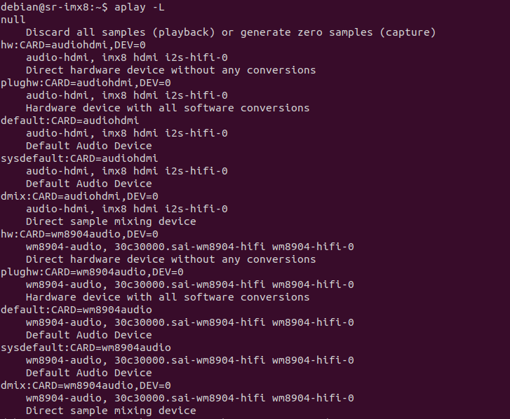

# HummingBoard Pro & i.MX8M Plus SOM Quick Start Guide


## Introduction

The following quick start guide provides background information about the [HummingBoard Pro](https://www.solid-run.com/embedded-industrial-iot/nxp-i-mx8-family/hummingboard-m/#pulse).

The guide will give a technical overview about the product and by the end of it you should be able to boot an operating system and begin testing your application.

## Revision and Notes

| **Date**          | **Owner**                                                                                                                                                                                                                                                                                                                                                                                                                                                                                                                                                                                                                                                                                                                                                                                                                                                                                                                                                                                                                                                                                                                                                                                                                                                                                                                                                                                                                                                                                                                                                                                                                                                                                                                                                                                                                                                                                                                                                                                                                                                                                                                                                                                                                                                                                                                                                                                                                                                                                                                                                                                                                                                                                                                                                                                                                                                                                                                                                                                       | **Revision** | **Notes**                                                         |
| ----------------- | ----------------------------------------------------------------------------------------------------------------------------------------------------------------------------------------------------------------------------------------------------------------------------------------------------------------------------------------------------------------------------------------------------------------------------------------------------------------------------------------------------------------------------------------------------------------------------------------------------------------------------------------------------------------------------------------------------------------------------------------------------------------------------------------------------------------------------------------------------------------------------------------------------------------------------------------------------------------------------------------------------------------------------------------------------------------------------------------------------------------------------------------------------------------------------------------------------------------------------------------------------------------------------------------------------------------------------------------------------------------------------------------------------------------------------------------------------------------------------------------------------------------------------------------------------------------------------------------------------------------------------------------------------------------------------------------------------------------------------------------------------------------------------------------------------------------------------------------------------------------------------------------------------------------------------------------------------------------------------------------------------------------------------------------------------------------------------------------------------------------------------------------------------------------------------------------------------------------------------------------------------------------------------------------------------------------------------------------------------------------------------------------------------------------------------------------------------------------------------------------------------------------------------------------------------------------------------------------------------------------------------------------------------------------------------------------------------------------------------------------------------------------------------------------------------------------------------------------------------------------------------------------------------------------------------------------------------------------------------------------------- | ------------ | ----------------------------------------------------------------- |
| 21 Jan 2024       | Yazan Shhady                                                                                                                                                                                                                                                                                                                                                                                                                                                                                                                                                                                                                                                                                                                                                                                                                                                                                                                                                                                                                                                                                                                                                                                                                                                                                                                                                                                                                                                                                                                                                                                                                                                                                                                                                                                                                                                                                                                                                                                                                                                                                                                                                                                                                                                                                                                                                                                                                                                                                                                                                                                                                                                                                                                                                                                                                                                                                                                                                                                    | 1.0          | Initial release                                                   |
| 22 Dec 2024       | Yazan Shhady                                                                                                                                                                                                                                                                                                                                                                                                                                                                                                                                                                                                                                                                                                                                                                                                                                                                                                                                                                                                                                                                                                                                                                                                                                                                                                                                                                                                                                                                                                                                                                                                                                                                                                                                                                                                                                                                                                                                                                                                                                                                                                                                                                                                                                                                                                                                                                                                                                                                                                                                                                                                                                                                                                                                                                                                                                                                                                                                                                                    | 1.1          | Add instructions for programming the eMMC.                        |
| 31 Dec 2024       | Yazan Shhady                                                                                                                                                                                                                                                                                                                                                                                                                                                                                                                                                                                                                                                                                                                                                                                                                                                                                                                                                                                                                                                                                                                                                                                                                                                                                                                                                                                                                                                                                                                                                                                                                                                                                                                                                                                                                                                                                                                                                                                                                                                                                                                                                                                                                                                                                                                                                                                                                                                                                                                                                                                                                                                                                                                                                                                                                                                                                                                                                                                    | 1.2          | Provide more detailed instructions for programming MAC addresses. |
| 27 Jul 2025       | Josua Mayer                                                                                                                                                                                                                                                                                                                                                                                                                                                                                                                                                                                                                                                                                                                                                                                                                                                                                                                                                                                                                                                                                                                                                                                                                                                                                                                                                                                                                                                                                                                                                                                                                                                                                                                                                                                                                                                                                                                                                                                                                                                                                                                                                                                                                                                                                                                                                                                                                                                                                                                                                                                                                                                                                                                                                                                                                                                                                                                                                                                     | 1.3          | Fix microsd boot-select setting                                   |
| 11 Dec 2025       | Yazan Shhady                                                                                                                                                                                                                                                                                                                                                                                                                                                                                                                                                                                                                                                                                                                                                                                                                                                                                                                                                                                                                                                                                                                                                                                                                                                                                                                                                                                                                                                                                                                                                                                                                                                                                                                                                                                                                                                                                                                                                                                                                                                                                                                                                                                                                                                                                                                                                                                                                                                                                                                                                                                                                                                                                                                                                                                                                                                                                                                                                                                    | 1.4          | Correct DC input voltage range to 7V–18V                          |
| Table of Contents | <p>- <a href="hummingboard-pro-imx8m-plus-som-quick-start-guide.md#introduction">Introduction</a><br>- <a href="hummingboard-pro-imx8m-plus-som-quick-start-guide.md#revision-and-notes">Revision and Notes</a><br>- <a href="hummingboard-pro-imx8m-plus-som-quick-start-guide.md#hardware-setup">Hardware Setup</a><br>- <a href="hummingboard-pro-imx8m-plus-som-quick-start-guide.md#product-specifications">Product specifications</a><br>- <a href="hummingboard-pro-imx8m-plus-som-quick-start-guide.md#hummingboard-pro">HummingBoard Pro</a><br>- <a href="hummingboard-pro-imx8m-plus-som-quick-start-guide.md#block-diagram">Block Diagram</a><br>- <a href="hummingboard-pro-imx8m-plus-som-quick-start-guide.md#visual-features-overview">Visual features overview</a><br>- <a href="hummingboard-pro-imx8m-plus-som-quick-start-guide.md#software-setup">Software Setup</a><br>- <a href="hummingboard-pro-imx8m-plus-som-quick-start-guide.md#cable-setup-and-prerequisites">Cable setup and prerequisites</a><br>- <a href="hummingboard-pro-imx8m-plus-som-quick-start-guide.md#boot-select">Boot Select</a><br>- <a href="hummingboard-pro-imx8m-plus-som-quick-start-guide.md#booting-from-sd-card">Booting from SD card</a><br>- <a href="hummingboard-pro-imx8m-plus-som-quick-start-guide.md#programming-emmc">Programming eMMC</a><br>- <a href="hummingboard-pro-imx8m-plus-som-quick-start-guide.md#final-stages">Final stages</a><br>- <a href="hummingboard-pro-imx8m-plus-som-quick-start-guide.md#more-features">More Features</a><br>- <a href="hummingboard-pro-imx8m-plus-som-quick-start-guide.md#internet">Internet</a><br>- <a href="hummingboard-pro-imx8m-plus-som-quick-start-guide.md#wifi">WiFi</a><br>- <a href="hummingboard-pro-imx8m-plus-som-quick-start-guide.md#bluetooth">Bluetooth</a><br>- <a href="hummingboard-pro-imx8m-plus-som-quick-start-guide.md#gpio-pins-control">GPIO Pins Control</a><br>- <a href="hummingboard-pro-imx8m-plus-som-quick-start-guide.md#cellular-modem">Cellular Modem</a><br>- <a href="hummingboard-pro-imx8m-plus-som-quick-start-guide.md#spi">SPI</a><br>- <a href="hummingboard-pro-imx8m-plus-som-quick-start-guide.md#audio">Audio</a><br>- <a href="hummingboard-pro-imx8m-plus-som-quick-start-guide.md#basler-camera">Basler Camera</a><br>- <a href="hummingboard-pro-imx8m-plus-som-quick-start-guide.md#tlv-eeprom-support">TLV EEPROM Support</a><br>- <a href="hummingboard-pro-imx8m-plus-som-quick-start-guide.md#mac-address">MAC Address</a><br>- <a href="hummingboard-pro-imx8m-plus-som-quick-start-guide.md#list-of-supported-os">List Of Supported OS</a><br>- <a href="hummingboard-pro-imx8m-plus-som-quick-start-guide.md#build-from-source">Build from source</a><br>- <a href="hummingboard-pro-imx8m-plus-som-quick-start-guide.md#documentation">Documentation</a><br>- <a href="hummingboard-pro-imx8m-plus-som-quick-start-guide.md#related-articles">Related Articles</a></p> |              |                                                                   |

## Hardware Setup

#### Product specifications

| **Model**        | <p><br><br>#### HummingBoard Pro</p>                                                                                                             |
| ---------------- | ------------------------------------------------------------------------------------------------------------------------------------------------ |
| SOM Model        | NXP i.MX8M Plus Dual / Quad core Arm Cortex A53 up to 1.8GHz (with Arm M7 GPP)                                                                   |
| Memory & Storage | <p>Up to 4GB LPDDR4<br>eMMC<br>MicroSD</p>                                                                                                       |
| Network          | <p>2 x Ethernet RJ45 10/100/1000<br>1 x 802.11 a/b/g/n/ac WiFi and Bluetooth (2.4/5 GHz)</p>                                                     |
| Connectivity     | <p>2 x USB 3.0<br>Mini PCIe<br>M.2<br>SIM card slot</p>                                                                                          |
| Media            | <p>HDMI 2.0 out<br>MIPI-DSI<br>2 x MIPI-CSI<br>Digital audio (Riser interface FPC connector)<br><br>Onboard audio codec</p>                      |
| I/O              | <p>1 x Reset button<br>1 x Configurable push button<br>MikroBus click interface<br>3 x LED indicators<br>RTC</p>                                 |
| OS Support       | Linux                                                                                                                                            |
| Environment      | <p>Commercial: 0°C to 70°C<br>Industrial: -40°C to 85°C</p>                                                                                      |
| Dimensions       | <p>PCBA: 100 x 70mm<br>Enclosure : 120 x 80 x 30mm</p>                                                                                           |
| Power            | <p>7V – 18V wide range<br>PoE sink support 802.3af Class 0</p>                                                                                   |
| Enclosure        | Optional extruded aluminum (IP32) enclosure                                                                                                      |
|                  | [Buy Now](https://shop.solid-run.com/?s=%22HummingBoard+Pulse%22\&post_type=product&_ga=2.156269240.2016484779.1641802897-2012112798.1622706355) |


Supported with i.MX8M-PLUS SOM. For more detailed information about our SOM-i.MX8M series please visit this user manual : [i.MX8M Plus SOM Hardware User Manual](/nxp/imx8/com-som/imx8m-plus-som-hardware-user-manual.md) .



#### Block Diagram

The following figure describes the i.MX8M Pro Block Diagram.

.png>)

#### Visual features overview

Please see below the features overview of the connector side of the HummingBoard Pro.


Print side connector overview of the HummingBoard Pro.

-20221207-195811.png>)

## Software Setup

#### Cable setup and prerequisites

Here is what you will need to power up and use the board:

* Linux or Windows PC
* HummingBoard Pulse with SOM
* 12V Power adapter (HummingBoard Pulse has wide range input of 7V-28V), alternatively you can use a PoE injector to power on the device.
* Micro USB to USB for console, the HummingBoard Pulse has an onboard FTDI chip.
* IP router or IP switch

## Boot Select

Before powering up the board for the first time it is recommended to select the boot media. On first use microSD is recommended source, configure dip switch S3 as follows:

| **Function/Switch** | **1** | **2** | **3** | **4** | **5** | **6** |
| ------------------- | ----- | ----- | ----- | ----- | ----- | ----- |
| microSD             | ON    | ON    | X     | X     | X     | X     |

“X” means don’t care, leave as is.

For additional options, please refer to [i.MX8M Series HummingBoard Boot Select](/nxp/imx8/sbc-platform/imx8m-other-articles/hummingboard-pulse-ripple-mate-and-pro-boot-select.md) page.

## Booting from SD card

The following shows how to set the switches on the boot source selector:



Note: The black rectangle represents the switch position.



Once you set the switches, you can apply the following for booting from an SD card.

**1. Downloading the Debian image**

Download the Debian image by running the following command on your Linux/Windows PC:

```
wget https://solid-run-images.sos-de-fra-1.exo.io/IMX8/imx8mp_build/lf-6.6.52-2.2.0/2025-07-02_cffbac8/debian-bootimg-cffbac8.img.xz
```

* For more Debian releases, please visit [Debian Release for i.MX8](https://images.solid-run.com/IMX8/imx8mp_build).

**2. Writing the image to the SD card**

Use the following commands for writing the image to an SD card:

```
xz -dc debian-bootimg-cffbac8.img.xz | sudo dd of=/dev/sdX bs=4k conv=fdatasync status=progress
```

* For more information, please visit [Flashing an SD Card](/other-articles/flashing-an-sd-card.md) .


Note: Plug a micro SD into your Linux PC, the following assumes that the micro SD is added as /dev/sdX and all it’s partitions are unmounted.



**3. SD card insertion**

Please Insert the SD card into your device.

**4. Power connection**

Connect your power adaptor to the DC jack, and then connect the adaptor to mains supply.

**5. Serial Connection**

Please insert the micro USB into your device, then you can refer to [Serial Connection](/other-articles/serial-connection.md) for installing necessary serial connection software in Linux/Windows.

Once you installed the necessary serial connection software, you should be able to see the following:

.png>)

* In order to be able to log in , please insert “root” as a username and password as follows:

.png>)

## Programming eMMC

Boot Linux from uSD and follow the Instructions bellow to Program the eMMC

1. **Programming the Bootloader on eMMC Boot Partition:**

```
# Download the bootloader binary (u-boot-mmc:2:1.bin) from https://images.solid-run.com/IMX8/imx8mp_build:
wget http://solid-run-images.sos-de-fra-1.exo.io/IMX8/imx8mp_build/build_date_20241210-rev_ddc90d8/u-boot-mmc:2:1-ddc90d8.bin
# Disable write protection:
echo 0 > /sys/class/block/mmcblk2boot0/force_ro
# Write the bootloader to the boot partition:
dd if=u-boot-mmc:2:1-ddc90d8.bin of=/dev/mmcblk2boot0 conv=sync
# Re-enable write protection:
echo 1 > /sys/class/block/mmcblk2boot0/force_ro
# Enable the eMMC boot partition:
mmc bootpart enable 1 1 /dev/mmcblk2
```

2. **Programming the Debian Image on the eMMC Main Partition:**

```
# Download the Debian Image from https://images.solid-run.com/IMX8/imx8mp_build:
wget http://solid-run-images.sos-de-fra-1.exo.io/IMX8/imx8mp_build/build_date_20241210-rev_ddc90d8/imx8mp-sdhc-debian-ddc90d8.img.xz
# Write the Yocto image to the eMMC main partition:
xz -dc imx8mp-sdhc-debian-ddc90d8.img.xz | dd of=/dev/mmcblk2 bs=4k conv=fdatasync
```

3. Set the boot select to boot from eMMC as documented [here](/nxp/imx8/sbc-platform/imx8m-other-articles/hummingboard-pulse-ripple-mate-and-pro-boot-select.md) and do reset to boot from eMMC.

### **Final stages**

The following stages need to be done in order to finalise the imaging:

1. Run `fdisk /dev/mmcblk1` if using SD and `fdisk /dev/mmcblk2`if using eMMC.
2. Recreate the rootfs partition (mostly the second partition) by deleting it and then creating a new partition that starts at the next sector after the first one and extends to the end of the drive (or less depending on your needs).
3. Write the new partition, when prompt about ‘Do you want to remove the signature?’ then answer with Yes.
4. Run `resize2fs /dev/mmcblk1p2` if using SD Card and `resize2fs /dev/mmcblk2p2`if using eMMC.
5. In this stage the root partition should be big enough to start populating it; but first update the RTC clock.
6. Connect the RJ45 to your network with internet access (and DHCP server); and then run `dhclient`.
7. Update the RTC clock by running `ntpdate pool.ntp.org` and then `hwclock -w`.
8. Run apt-update commands below and then populate the root filesystem as you wish.

```
apt-get update && apt-get upgrade -y
```

Here is an example of the same process in the HB-IIOT device until step 4 (include):


In the end you should see with “lsblk” that the partition size is in the required size.

## More Features

#### Internet

Connect an Ethernet cable to your HummingBoard Pulse (for internet access during boot-up).\
Models HummingBoard with WiFi, can be connected via [WiFi](../cubox-m-quick-start-guide.md#wifi) or wired Ethernet.

* Please check you Ethernet connection.
* Update Debian Repository Sources:
  * Open the sources.list file to edit your system's repository configuration:

```
sudo nano /etc/apt/sources.list
```

* Update the repository lines in the file with the following entries:

```
deb https://deb.debian.org/debian bookworm main contrib non-free non-free-firmware
deb-src https://deb.debian.org/debian bookworm main contrib non-free non-free-firmware 
```

* Use the following commands in order to keep your system up-to-date:

```
sudo apt-get update 
sudo apt-get upgrade -y
reboot
```

* For more detailed information, please refer to [i.MX8M Debian](https://github.com/SolidRun/documentation/blob/bsp/imx8/debian-11_sr8.md) .

**WiFi**

* You can connect to WiFi using any application, such as : [connmanctl](https://manpages.debian.org/testing/connman/connmanctl.1.en.html) or [wpa\_spplicant](https://wiki.archlinux.org/title/wpa_supplicant).

An example for connecting to WiFi using wpa\_supplicant:

1\. To bring a WiFi interface up, run the following :

```
ifconfig wlan0 up 
```


To discover your wireless network interface name, see [Network Interfaces](https://wiki.archlinux.org/title/Network_configuration#network_interfaces).



2\. Install the wpa\_supplicant package:

```
apt-get install wpasupplicant 
```

3\. Edit network interfaces file :

At the bottom of the file, add the following lines to allow wlan as a network connection:

```
cat <<EOF > /etc/network/interfaces.d/wlan0
allow-hotplug wlan0
iface wlan0 inet dhcp
wpa-conf /etc/wpa_supplicant/wpa_supplicant.conf
iface default inet dhcp

EOF
```

4\. Create a configuration file with the relevant ssid:

```
cat <<EOF > /etc/wpa_supplicant/wpa_supplicant.conf
ctrl_interface=/run/wpa_supplicant
update_config=1

network={
    ssid="MYSSID"
    psk="passphrase" 
}

EOF
```


Check your personal ssids by running : ‘iw dev wlan0 scan’



5\. Make sure it works:

Restart your device and it should connect to the wireless network. If it doesn't, repeat above steps or get help from an adult.

* For more information about using wpa\_supplicant , you can refer to [wpa\_supplicant](https://www.linuxbabe.com/command-line/ubuntu-server-16-04-wifi-wpa-supplicant) or [wpa\_supplicant](https://blog.nelhage.com/2008/08/using-wpa_supplicant-on-debianubuntu/).

#### Bluetooth

1\. For showing all Bluetooth devices, run the following:

```
apt-get install bluez
hciconfig -a
```

2\. Choose a device, and turn it on:

```
 hciconfig hci0 up
```

3\. Set up the Bluetooth name:

```
hciconfig hci0 name 'SolidRun_Ble'
```

4\. Make your Bluetooth detectable by other devices:

```
hciconfig hci0 piscan
```

5\. If you want to connect to other devices:

* Start by scanning for other Bluetooth devices:

```
hcitool scan
```

* Choose a MAC address and connect :

```
rfcomm connect 0  $MAC 10 & 
```

* You can check the communication between the devices by writing :

```
l2ping -c 4  $MAC
```

#### GPIO Pins Control

In order to be able to control the GPIO pins, please refer to [GPIO Pins Control - HummingBoard Pulse/Mate & i.MX8M Plus SOM](/nxp/imx8/sbc-platform/imx8m-other-articles/gpio-pins-control-hummingboard-pulse-mate-imx8m-plus-som.md)

**Please Note**


* mPCIe interface **doesn't** support **PCIe** interface - it supports USB 3.0 only.
* M.2 interface supports PCIe and USB 3.0 interfaces



#### Cellular Modem

The cellular modem is a more fully featured extension of which contains a cellular module with additional hardware interfaces and a SIM card slot.

You can connect your cellular modem to the mPCIe, and insert a SIM card.

* For some cellular modules to be connected, please refer to [Cellular Modules](/nxp/imx6/sbc-platform/imx6-other-articles/cellular-modules.md) .

#### SPI

For testing you serial peripheral interface - SPI, please see this documentation [SPI from Linux with spidev](/nxp/imx8/sbc-platform/imx8m-other-articles/spi-from-linux-with-spidev.md).

#### Audio

First, you need to check that the required device is the default one by run:

```
$ aplay -L
```

If the sysdefault:CARD doesn’t set to wm8904 like this example



Then you can play sound with choosing the device who set to wm8904 and generate audio, in the above situation the device is hw:CARD=wm8904audio so the test will work as this:

```
$ speaker-test -D hw:CARD=wm8904audio -t sine -c 2 -f 1000 -l 5
```

* NOTE: the “ -c “ flag used to set the number of the channels that you have in your audio output device, in my example I have 2 channels.

If the sysdefault:CARD=wm8904 you can test with this command:

```
$ speaker-test -t sine -f 1000 -l 5  
```

**GUI On Debian**

There is an option with the **Debian** image, up to the user, to work with a GUI like Weston, GNOME and etc.\
For applying this option do the following steps:

First, connect your device to a screen using the working output (HDMI / uHDMI).

For working with **Weston** GUI:

1. Install the Weston package.

```
$ sudo apt install weston
```

2. Make a directory for the output of the Weston GUI.

```
$ mkdir /your/directory/location
```

3. Give permissions to this directory.

```
 $ chmod 0700 /your/directory/location
```

4. Set the XDG\_RUNTIME\_DIR env param to your directory.

```
$ export XDG_RUNTIME_DIR=/your/directory/location
```

5. Run Weston.

* &#x20;Connect your HDMI cable and you should be able to see the following :.jpg>)


By default one application is available, the terminal emulator, at the upper left corner.



* Start weston FROM A PHYSICAL TERMINAL (from the above terminal, not remote or serial session):

```
  weston
```

This will bring up the following:

.jpg>)

For working with **GNOME** GUI on top of Xorg:

1. Install Xorg.

```
$ sudo apt install xorg
```

2. Install your desired gnome.

```
$ sudo apt install gnome-session
```

NOTE: ‘gnome-session’ is an example of gnome that we can work with, you can replace the ‘session' with another GNOME extention. 3. Start your GNOME GUI.

```
$ sudo systemctl start gdm
```

* For logging in you need a user on your device to log into it. You can create one before step 3 by this command (replace the ‘username’ with name that you want) :

```
$ sudo adduser username
```

* You can jump between GUIs that you install (like gnome-session) by the setting button that locates in the down right corner of the home screen.


For more applications, you can refer to [GUI Support](https://github.com/SolidRun/documentation/blob/bsp/imx6/debian-11_sr1.md#wayland) to install X11, OpenGL-ES, GStreamer, or you can follow this page [Gnome](https://linuxhint.com/install_gnome_debian_10_minimal_server/) for installing Gnome desktop



#### Basler Camera

For getting started with the Camera Module on your board, please see this documentation [Basler Camera Quick Start Guide](/nxp/imx8/sbc-platform/hummingboard-imx8-sbc-quick-start-guide/hummingboard-pulse-imx8m-plus-som-quick-start-guide/hummingboard-pulse-ripple-pro-imx8m-plus-basler-camera-quick-start-guide.md).

## TLV EEPROM Support

Starting from April 01. 2022, the EEPROMs on Carriers, i.MX8M Plus SoMs are being programmed with identifying information such as the product name and SKUs to allow for programmatic identification of hardware. Check our [iMXMP EEPROM documentation](/nxp/imx8/sbc-platform/imx8m-other-articles/imx8mp-eeprom-programming-tlv.md) for additional information.

## MAC Address

There are two options for storing MAC addresses on the i.MX8MP platform:

1. **Store the MAC address in OTP eFuses**

* This is a **non-reversible action**, as the eFuse is permanently programmed.

2. **Store the MAC address in EEPROM using TLV format** (Recommended)

* This method allows flexibility and is the preferred approach.
* [Guidelines](../imx8m-other-articles/imx8mp-eeprom-programming-tlv.md#progammring-mac-address) for Programming a MAC Address in TLV Format

**Default Configuration**

* By default, the MAC address is stored in the SOM's TLV EEPROM.
* All SOMs are pre-flashed with SolidRun's default MAC address range in the TLV EEPROM.

**Custom MAC Address Option**

* There is an option to provide a custom MAC address range.
* SolidRun can program the custom MAC addresses into the TLV EEPROM upon request.

## List Of Supported OS

| **OS**                                                           |                                                                                    |
| ---------------------------------------------------------------- | ---------------------------------------------------------------------------------- |
| .png>) | [Debian](https://github.com/SolidRun/documentation/blob/bsp/imx8/debian-11_sr8.md) |
| .png>) | [Yocto](https://github.com/SolidRun/meta-solidrun-arm-imx8/tree/zeus-imx8mp)       |
| .png>) | [Buildroot](https://github.com/SolidRun/imx8mp_build)                              |

## Build from source

* [i.MX8M Software](/nxp/imx8/sbc-platform/imx8m-plus-mini-nano-software.md)

## Documentation

{% file src="attachments/HummingBoard%20Pulse%20Pin%20MUX.xlsx" %}
{% file src="attachments/HummingBoard%20iMX8%20Gerbers.zip" %}
{% file src="attachments/HummingBoard%20iMX8%20PCB.zip" %}
{% file src="attachments/HummingBoard%20Puls-REV.2.5-pcb.zip" %}
{% file src="attachments/HummingBoard%20iMX8%20Mechanical%20Drawings.zip" %}
{% file src="attachments/HummingBoard%20iMX8%20Schematics.zip" %}





* Drag and drop to upload or \[browse for files]&#x20;

Upload file

File description


[Buy a Sample Now](https://shop.solid-run.com/?s=%22HummingBoard+Pulse%22\&post_type=product&_ga=2.156269240.2016484779.1641802897-2012112798.1622706355)

## Related Articles

Error rendering macro 'contentbylabel' : CQL was parsed but the search manager was unable to execute the search. Error message: com.atlassian.confluence.api.service.exceptions.scale.SSStatusCodeException: There was an illegal request passed to XP-Search Aggregator API : HTTP/1.1 403 Forbidden
